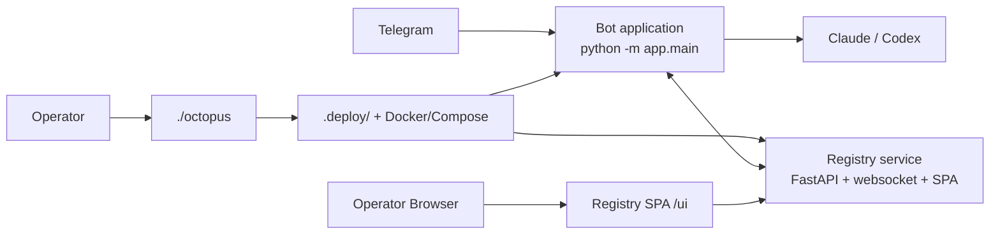
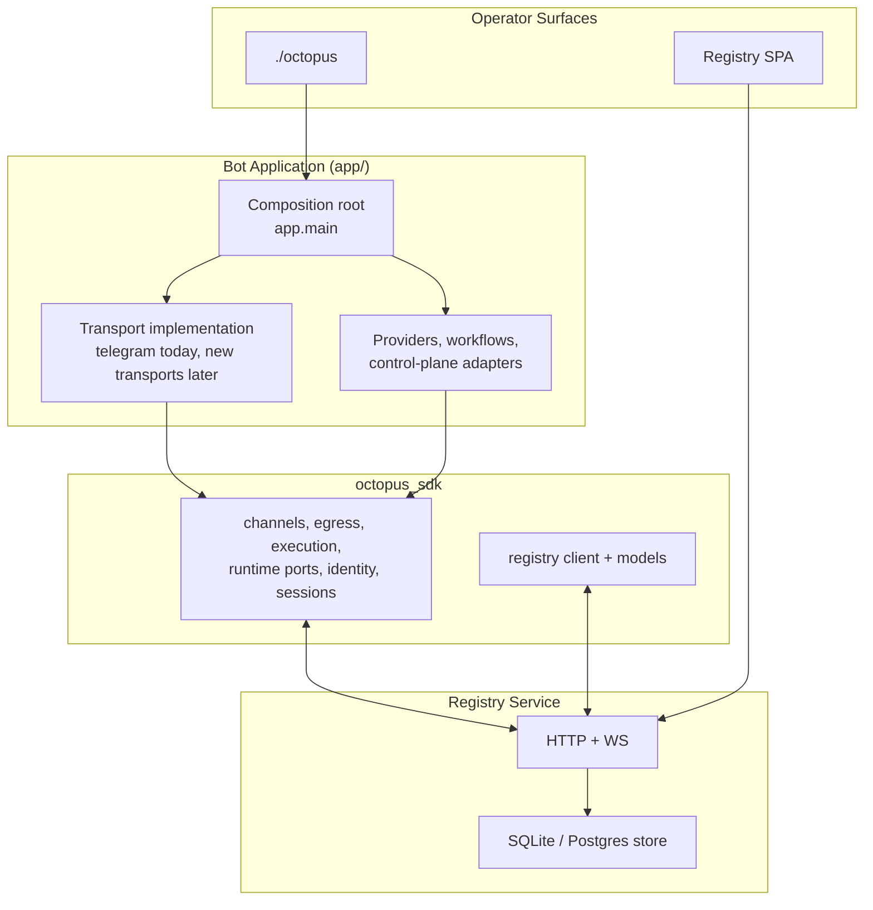
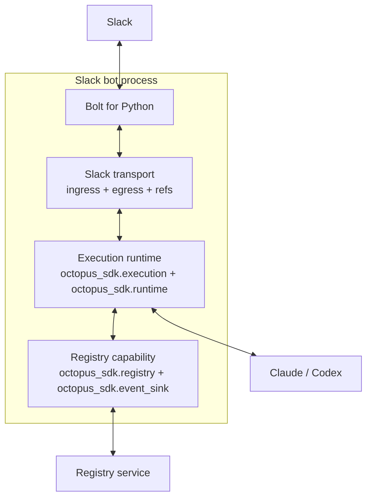
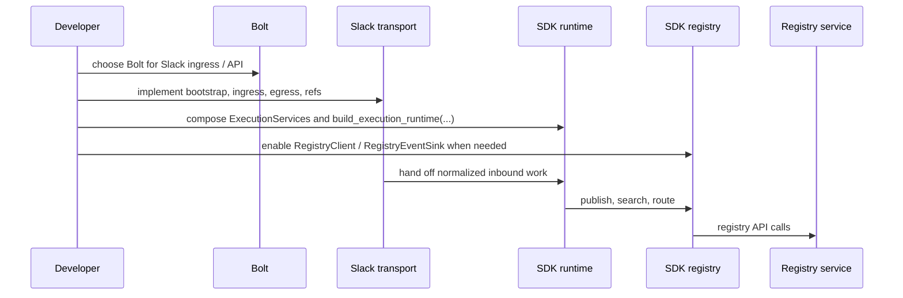
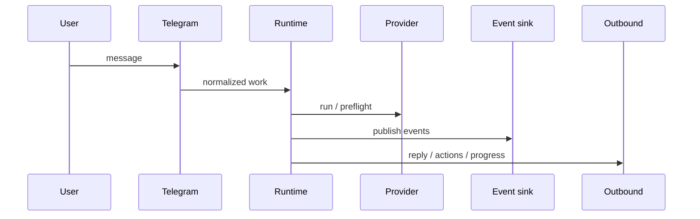
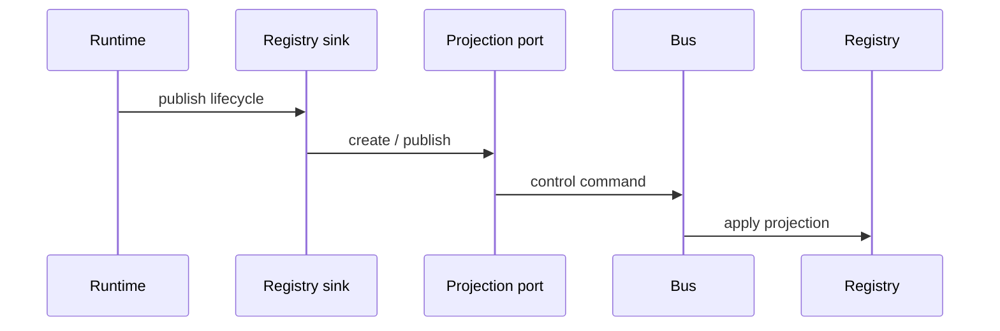
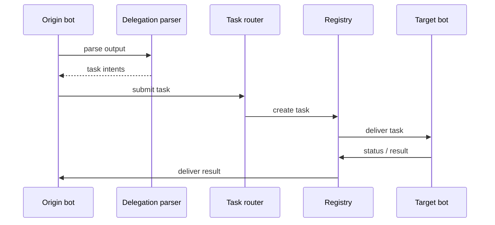

# Architecture

This document describes the current system shape in code: the deployment CLI,
the application/runtime, the registry service and SPA, and the shared SDK that
binds them together.

## System Map

Octopus is four cooperating systems:

| System | Owns |
|---|---|
| `./octopus` | local deployment state, lifecycle, provider auth, workspaces, local registry operations |
| Bot application | runtime composition, channels, providers, registry runtime loops, workflows, control-plane adapters |
| Registry service | agent/resource APIs, websocket realtime API, operator SPA, registry persistence/query model |
| `octopus_sdk/` | shared contracts, wire models, runtime orchestration, and protocol-based composition seams |

### Layering

## Deployment And Process Model

`./octopus` is a thin shell entrypoint that delegates to the Python CLI in
`app/octopus_cli/`. It owns local deployment state under `.deploy/` and
manages containers, workspaces, provider auth, registry lifecycle, and bot
connectivity.

Important state boundaries:

| Location | Owner | Purpose |
|---|---|---|
| `.deploy/bots/<slug>/.env` | CLI/operator | deployment-time bot config |
| `.deploy/registry/.env` | CLI/operator | local registry deployment config |
| `BOT_DATA_DIR/agent/bot_identity.json` | runtime | stable local bot identity |
| `BOT_DATA_DIR/agent/registries/<registry_id>.json` | runtime | live per-registry connection state |

The bot runtime supports multiple registries in config, but the current CLI is
local-registry-first: local registry lifecycle and connect/disconnect are
first-class, while remote registry records are supported by runtime/config
without the same interactive CLI coverage.

### Process Axes

The application runs under three main axes:

| Config | Values | Effect |
|---|---|---|
| `BOT_AGENT_MODE` | `standalone`, `registry` | whether registry runtime/registry-connected flows participate |
| `BOT_RUNTIME_MODE` | `local`, `shared` | single-process runtime vs split shared runtime |
| `BOT_PROCESS_ROLE` | `all`, `webhook`, `worker` | which responsibilities this process owns |

`app/main.py` is still the composition root for the runnable application in
this repo. The SDK lets a transport compose runtime behavior without importing
`app.main`, but this repo's production bot is still assembled there.

## SDK Surface

`octopus_sdk/` is the shared import surface for contracts and reusable runtime
logic. Import direction is one-way:

- `app/` may import `octopus_sdk/`
- `octopus_sdk/` must not import `app/`

### Registry Contracts

| Module | Owns |
|---|---|
| `octopus_sdk.registry.client` | async registry HTTP client |
| `octopus_sdk.registry.models` | agent enrollment, discovery, conversation create, routed-task, and timeline wire models |
| `octopus_sdk.events` | stored conversation event contracts and metadata schemas |
| `octopus_sdk.realtime` | websocket envelopes, collection invalidation topics, and progress payloads |

The registry server and bot runtime both consume these contracts. The registry
server does not define its own private wire types for these surfaces.

### Channel And Transport Contracts

| Module | Owns |
|---|---|
| `octopus_sdk.channels` | `ChannelDescriptor`, `Channel`, `ChannelBootstrap`, `ChannelIngress` |
| `octopus_sdk.egress` | `ConversationEgress`, `ChannelEgress`, `EditableHandle`, `ChannelCapabilities` |
| `octopus_sdk.identity` | actor/conversation key parsing, Telegram ref helpers, stable bot identity helpers |

Channels own ref formats and egress behavior. Current ref families are:

| Ref kind | Format |
|---|---|
| Telegram conversation | `telegram:<bot_id>:<chat_id>` |
| Registry conversation | `registry:<registry_id>:conversation:<conversation_id>` |
| Registry task | `registry:<registry_id>:task:<routed_task_id>` |

Unknown or malformed refs fail fast.

### Execution And Runtime Composition

| Module | Owns |
|---|---|
| `octopus_sdk.execution` | `TransportIdentity`, `ExecutionRuntime`, `execute_request`, `dispatch_message_request`, approval helpers |
| `octopus_sdk.runtime` | protocol-based runtime collaborator ports and `ExecutionServices` bundle |
| `octopus_sdk.runtime_dispatch` | provider-call dispatch plumbing, progress/typing/heartbeat lifecycle |
| `octopus_sdk.execution_context` | authoritative resolved execution context and context hashing |
| `octopus_sdk.execution_events` | `ExecutionEventSink` protocol |
| `octopus_sdk.event_sink` | `RegistryEventSink`, `NoOpEventSink` |
| `octopus_sdk.delegation` | `DelegationIntentParser`, `XmlTagDelegationParser` |
| `octopus_sdk.providers` | provider protocol and execution result/tool models |

The runtime surface is protocol-based, not builder-based. `octopus_sdk.runtime`
defines collaborator ports such as:

- `ProviderGuidancePort`
- `SkillActivationPort`
- `RuntimeSkillSetupPort`
- `SessionRuntimePort`
- `ArtifactStorePort`

These are bundled into `ExecutionServices`, and
`build_execution_runtime(...)` assembles a typed `ExecutionRuntime`. Concrete
applications and channel implementations provide the adapters and callbacks.

### Config, Sessions, And Control-Plane Ports

| Module | Owns |
|---|---|
| `octopus_sdk.config` | channel-neutral config base and registry publish policy |
| `octopus_sdk.sessions` | typed session state, pending approval/retry/delegation models, project bindings |
| `octopus_sdk.conversation_projection` | conversation projection port |
| `octopus_sdk.task_routing` | routed-task submission/status/result port |
| `octopus_sdk.agent_directory` | agent discovery/directory port |
| `octopus_sdk.health_publication` | runtime health publication port |

The SDK owns these interfaces and models. Bus-backed, no-op, HTTP-backed, or
transport-specific implementations live in the application layer.

### Example: Adding A Slack Transport

Slack is not implemented in this repo today, but the current SDK is structured
so a new transport can be added without importing `app.main`.

A realistic Slack implementation would use [Bolt for Python](https://docs.slack.dev/tools/bolt-python/)
as the Slack-facing library. Slack documents Bolt as its Python framework for
building Slack apps, supports framework adapters for production HTTP handling,
and also supports [Socket Mode](https://docs.slack.dev/tools/bolt-python/concepts/socket-mode)
when Slack should deliver events over a websocket instead of an inbound HTTP
endpoint.

The resulting runtime shape would look like this:

The transport split would look like this:

- Slack/Bolt owns Slack auth, event delivery, signatures or Socket Mode, and Slack API calls
- `octopus_sdk.channels` owns the channel contract: ingress, descriptor, and egress shape
- `octopus_sdk.execution` owns request orchestration once the inbound Slack event is normalized
- `octopus_sdk.event_sink` provides registry publication through `RegistryEventSink` when registry mode is enabled

In practice a Slack transport would:

1. implement `ChannelBootstrap` / `ChannelIngress` around Bolt listeners
2. implement `ChannelEgress` using Slack message APIs such as post/update and file send
3. define a stable Slack ref family and build `TransportIdentity` from Slack conversation, thread, and actor ids
4. supply runtime collaborator implementations for `ExecutionServices`
5. call `build_execution_runtime(...)`, then `execute_request(...)` for normalized inbound work

The development/composition process would look like this:

That keeps Slack-specific code in `app/channels/slack/` while reusing the SDK
for execution, delegation, approvals, event publication, session state, and
registry connectivity.

## Application Systems

The repo's runnable application lives under `app/` and composes the SDK with
concrete implementations.

### Composition Root

`app/main.py` performs the current startup sequence:

1. load config
2. construct provider
3. choose runtime backend
4. initialize content and credential stores
5. create control-plane bus and authority directory
6. build shared bot services
7. register channels
8. build worker/runtime bundles
9. start ingress, worker, registry runtime, and control-plane components for the selected mode

### Main Subsystems

| Subsystem | Package | Owns |
|---|---|---|
| Telegram transport | `app/channels/telegram` | Telegram ingress, presenters, runtime adapters, progress/timeline callbacks, Telegram-specific execution wiring |
| Registry channels/service | `app/channels/registry` | registry HTTP routes, websocket manager, SPA egress, registry conversation/task channel implementations |
| Agent runtime | `app/agents` | registry enrollment/state loops, delivery handling, registry runtime integration, delegation runtime bridging |
| Runtime composition | `app/runtime` | shared service composition, session/context resolution, dispatcher, admission, runtime health |
| Providers | `app/providers` | Codex and Claude implementations over the SDK provider protocol |
| Workflows | `app/workflows` | approvals, recovery, guidance, runtime skills, conversation/settings workflows |
| Control plane | `app/control_plane` | bus, adapters, processor runner, authority directory |
| Registry persistence | `app/registry_service` | agent/event/task/approval/guidance/query stores |

### Telegram As An SDK Consumer

Telegram execution wiring in `app/channels/telegram/execution.py` is the best
example of how the current architecture composes:

- Telegram supplies channel-specific callbacks and adapters
- app-side services implement the runtime collaborator ports
- `ExecutionServices` is assembled from those implementations
- `build_execution_runtime(...)` returns the `ExecutionRuntime`
- `octopus_sdk.execution.execute_request(...)` owns the channel-neutral orchestration

This is the current runtime composition model. There is no `BotRuntimeBuilder`
in the codebase.

### Registry Channels As SDK Consumers

Registry conversation/task channels in `app/channels/registry/channel.py` also
consume SDK channel contracts and control-plane ports. They build
registry-scoped egress and route projection/routing/health through bus-backed
services from `app/runtime/services.py`.

## Registry Service And Operator UI

The registry service spans:

- `app/channels/registry/`
- `app/registry_service/`
- `ui/`

### API Surfaces

| Surface | Purpose |
|---|---|
| Agent API | enroll/register/heartbeat/delivery/search/task flows for bots and processor/runtime code |
| Resource API | `/v1/summary`, `/v1/agents`, `/v1/conversations`, `/v1/tasks`, `/v1/approvals`, `/v1/capabilities`, `/v1/usage`, skill catalog, guidance |
| Realtime API | `WS /v1/ws` for typed `event`, `heartbeat`, `progress`, and `invalidate` envelopes |
| Operator SPA | browser UI under `/ui` |

Important current behavior:

- list endpoints use cursor/limit/has_more pagination
- agent list supports server-side `q` and `state`
- conversation list supports server-side `q` and `status`
- task list supports server-side `status`
- usage is derived from provider response events

### Realtime Model

The websocket manager in `app/channels/registry/ws.py` uses typed SDK
envelopes from `octopus_sdk.realtime` and pushes explicit topics, not wildcard
subscriptions.

Current topic families:

- `conversation:<id>`
- `agent:<id>`
- collection topics such as `summary`, `agents`, `conversations`, `tasks`, `approvals`, `usage`

Current realtime envelope types:

- `event`
- `heartbeat`
- `progress`
- `invalidate`

The SPA is a vanilla JS application in `ui/` and subscribes to explicit topics
through `ui/js/ws.js`. Dashboard and list refreshes are driven by invalidation
topics; conversation detail also renders progress updates.

## Main Interaction Flows

### Telegram Request Execution

### Registry Projection

### Delegation And Routed Tasks

Parent conversations also receive mirrored `task.status` events so delegated
work is visible in the registry UI.

## Identity And Persistence

### Stable And Live Identity

Stable local bot identity is stored at:

- `BOT_DATA_DIR/agent/bot_identity.json`

Per-registry runtime connection state is stored at:

- `BOT_DATA_DIR/agent/registries/<registry_id>.json`

Important rule:

- `BotConfig.registry_agent_ids` is a startup read model
- live per-registry identity comes from runtime registry state in `app/agents/state.py`
- projection and delegation paths must use the live runtime state, not the startup snapshot

### Actor And Conversation Identity

`actor_key` and conversation keys are the shared identity vocabulary across
channels. Key helpers live in `octopus_sdk.identity`, including:

- `telegram_actor_key(...)`
- `parse_actor_key(...)`
- `parse_conversation_key(...)`
- `conversation_key_for_ref(...)`
- `delegation_session_key(...)`
- stable bot identity helpers such as `bot_identity(...)` and `telegram_conversation_ref(...)`

### Persistence Seams

| Seam | Backends | Owns |
|---|---|---|
| local agent state | JSON files | stable bot identity and per-registry connection state |
| session storage | SQLite / Postgres | session, approval, retry, and delegation state |
| work queue / transport | SQLite / Postgres | queued work, claims, recovery, usage |
| control-plane bus | SQLite / Postgres | commands, replies, leases |
| content store | SQLite / Postgres | built-in/runtime content and guidance |
| credential store | SQLite / Postgres | encrypted skill credentials |
| registry store | SQLite / Postgres | agents, conversations, deliveries, events, routed tasks, approvals, skills, guidance |

Current defaults:

- bot runtime uses SQLite by default and Postgres when `BOT_DATABASE_URL` is set
- registry uses SQLite by default and Postgres when `REGISTRY_DATABASE_URL` is set
- SQLite and Postgres are kept aligned by shared tests and contract coverage

## Architecture Rules

1. `./octopus` owns `.deploy/`; runtime-owned identity/state lives under `BOT_DATA_DIR/agent/`.
2. `octopus_sdk` is the shared contract/runtime layer; it must not import `app/`.
3. `app/main.py` is the application composition root for this repo's runnable bot.
4. Channels own ref formats, ingress, and egress behavior.
5. `octopus_sdk.execution` owns channel-neutral execution orchestration; transport implementations supply adapters and callbacks.
6. `octopus_sdk.runtime` is protocol-based composition, not a builder API.
7. Projection, routing, discovery, and health publication go through SDK ports.
8. Stored registry events use contracts from `octopus_sdk.events`.
9. Websocket realtime uses contracts from `octopus_sdk.realtime` and explicit topic subscriptions.
10. Live per-registry agent identity comes from runtime registry state, not from the startup-only `BotConfig.registry_agent_ids` snapshot.
11. SQLite and Postgres backends must remain behaviorally aligned.
