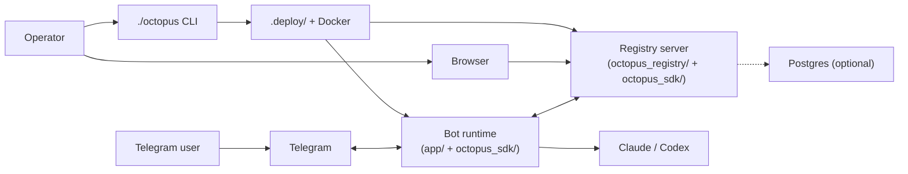
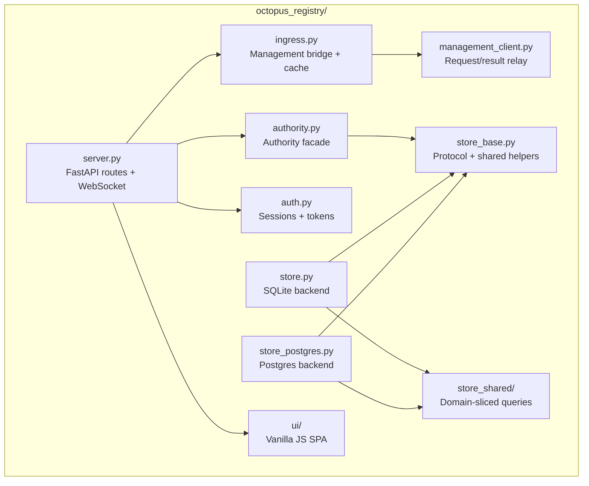
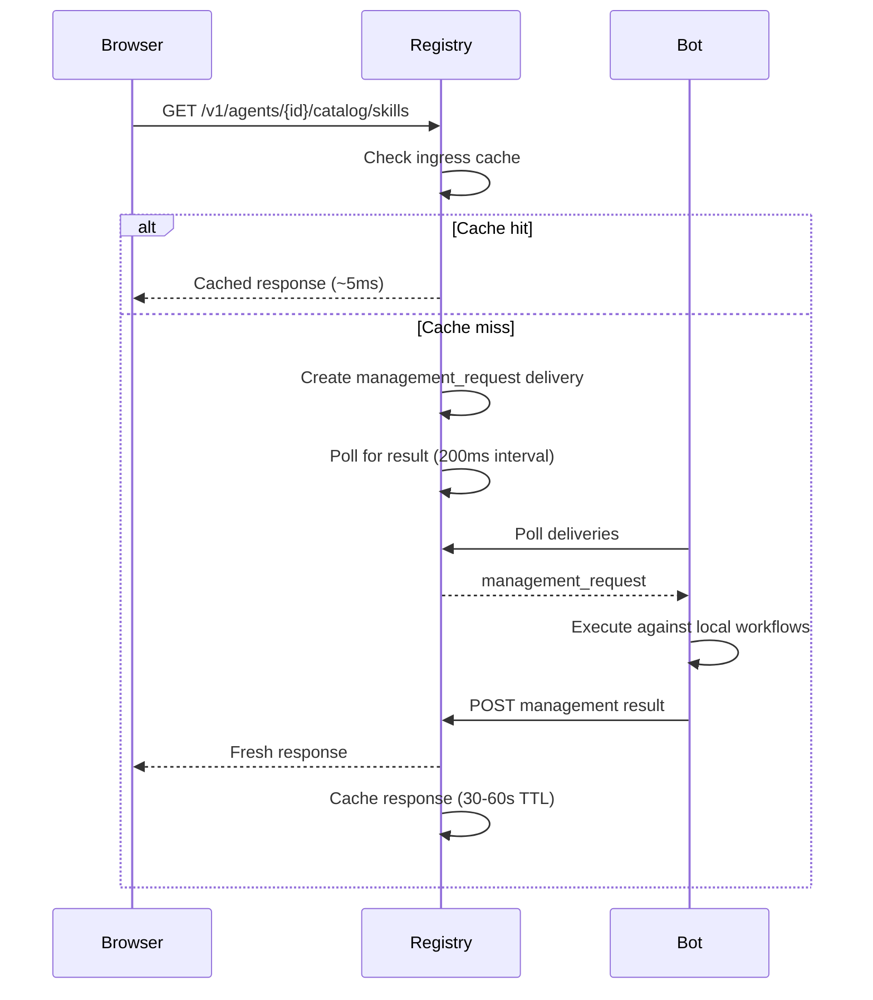
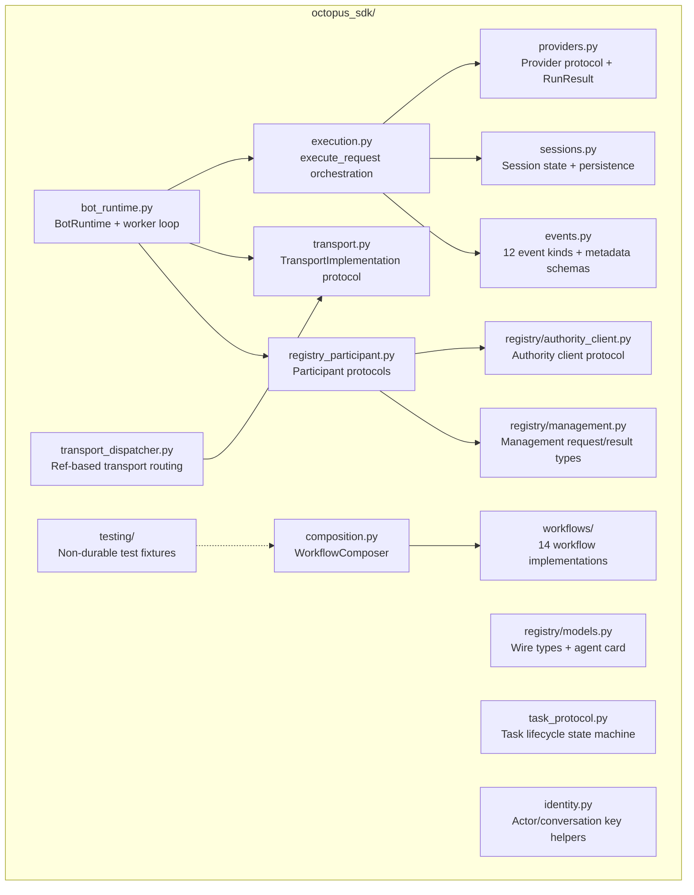
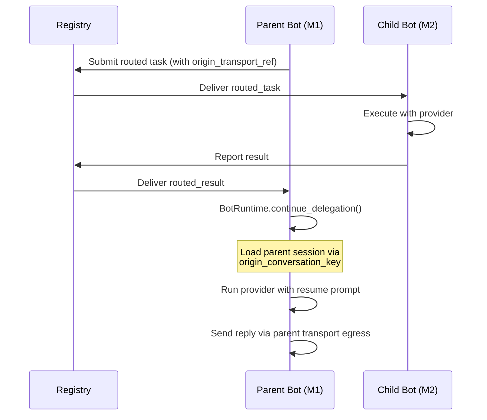
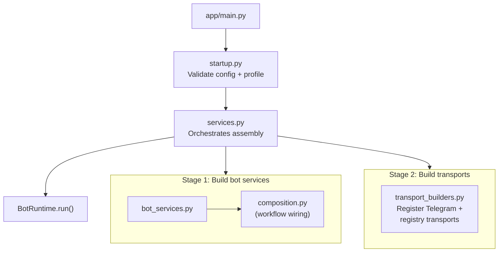
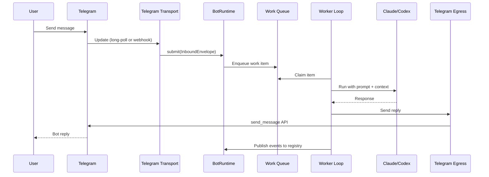
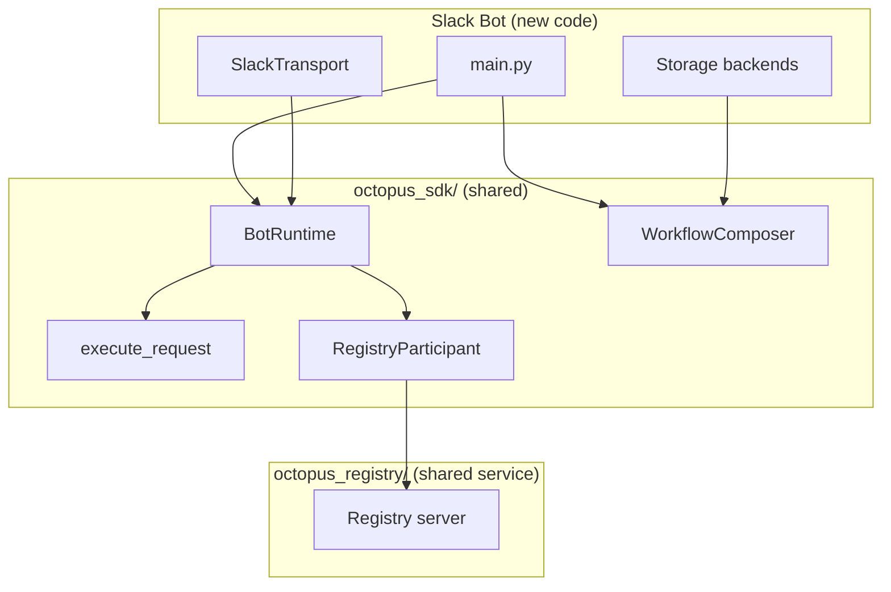

# Architecture

Octopus is a multi-agent bot platform. Operators deploy bot runtimes that
connect to a shared registry. The registry is the management plane — it
handles enrollment, status, task routing, skill/guidance management, and
an operator dashboard. Bots handle user conversations, provider execution,
and delegation. The SDK defines the contracts between them.

Three packages, three clean boundaries:

| Package | Owns | Deploys as |
|---------|------|-----------|
| `octopus_registry/` | Management plane — API, store, UI, realtime | Registry service container |
| `octopus_sdk/` | Shared contracts, orchestration, workflow logic | Shared dependency (not deployed alone) |
| `app/` | Telegram bot runtime, providers, CLI, storage backends | Bot container(s) |

Import direction is one-way: `app/` → `octopus_sdk/`; `octopus_registry/` → `octopus_sdk/`.
Neither `app/` nor `octopus_registry/` imports the other. The SDK imports neither.



`octopus_sdk/` is a shared library embedded in both Bot and Registry at
build time. It is not a separately deployed system.

---

## 1. Registry

This section describes the registry as a standalone deployable management
plane. It runs independently of any bot. When bots connect, it manages them.

### What the registry owns

- Agent enrollment, heartbeat, connectivity state, deregistration
- Conversation storage, event timeline, message/action APIs
- Routed task lifecycle (create, status, result, recipient projection)
- Skill catalog and provider guidance management (via management protocol)
- Operator dashboard and SPA
- WebSocket realtime (events, invalidations, progress)
- Authentication (agent tokens, operator sessions)

### Internal structure



### API surfaces

| Surface | Auth | Description |
|---------|------|-------------|
| Agent API | Agent token | Enroll, register, heartbeat, poll, ack, deregister |
| Resource API | Agent or operator | Agents, conversations, tasks, events, usage, summary |
| Management bridge | Operator session | Agent-scoped skill/guidance operations via management protocol |
| Realtime API | Operator session | WebSocket — events, heartbeats, progress, invalidations |
| Operator SPA | Session cookie | Dashboard, conversations, agents, tasks, approvals, skills, guidance, usage |

All management endpoints are agent-scoped: `/v1/agents/{agent_id}/catalog/skills`,
`/v1/agents/{agent_id}/guidance/{provider}`, etc. No global management endpoints
that assume a single connected bot.

### Management protocol

When the operator manages a bot's skills or guidance from the UI, the request
crosses the registry connection through a typed protocol:



Management responses are cached server-side in `ingress.py` with TTL and
in-flight deduplication. Mutations (install, publish, archive) invalidate
the cache. Client-side stale-while-revalidate provides instant revisits.

### Realtime model

WebSocket topics:
- `conversation:{id}` — conversation events and progress
- `agent:{id}` — agent heartbeat and status
- Collection topics: `agents`, `conversations`, `tasks`, `approvals`, `summary`, `usage`

Four envelope types (defined in `octopus_sdk/realtime.py`):
`RealtimeEventEnvelope`, `RealtimeHeartbeatEnvelope`,
`RealtimeProgressEnvelope`, `RealtimeInvalidationEnvelope`.

SPA components subscribe to explicit topics (not wildcards). Updates use
`UI.memoizedRender` with morphdom — signatures use rendered values (e.g.,
`UI.relativeTime()`) not raw timestamps, so heartbeat-driven refreshes
only rebuild rows when the visible text actually changes.

### Store architecture

The registry store supports SQLite (default) and Postgres (via env vars).
`store_base.py` defines the protocol and ~36 shared helper functions.
`store_shared/` contains domain-sliced query logic. `store.py` and
`store_postgres.py` provide backend-specific SQL and connection handling.

Both backends support the same operations: agent lifecycle, conversations,
events, routed tasks (with recipient-side projection), deliveries,
management requests, skills, guidance, and usage rollups.

---

## 2. Bot SDK

This section describes the SDK as the shared contract and orchestration
layer. It defines what a bot IS, not how any specific bot works.

### What the SDK owns

- Transport contracts (how bots connect to messaging platforms)
- Runtime orchestration (`BotRuntime` — admission, dispatch, worker loop)
- Execution engine (`execute_request` — provider invocation, delegation, finalization)
- Registry participant contracts (enrollment, mirroring, coordination)
- Workflow composition (`WorkflowComposer` with builder pattern)
- Event taxonomy (12 typed event kinds with validated metadata)
- Task protocol (lifecycle state machine, transition validation)
- Delegation continuation (SDK-owned parent resume, not synthetic message re-entry)
- Identity helpers (actor keys, conversation keys, transport refs)
- Testing fence (`octopus_sdk/testing/` — non-durable, non-production)

### Package structure (import direction)

Arrows show import direction: A → B means A imports from B.



Note: `BotRuntime` does NOT import `composition.py`. The `WorkflowComposer`
builds a `WorkflowComposition` object that is injected into `BotRuntime` at
construction time by the application layer.

### Transport contract

Every messaging platform implements `TransportImplementation`:

```python
class TransportImplementation(Protocol):
    @property
    def descriptor(self) -> TransportDescriptor: ...
    @property
    def identity(self) -> TransportIdentityResolver: ...
    async def start(self, *, runtime, stop_event) -> None: ...
    async def stop(self) -> None: ...
    def can_build_egress(self, *, conversation_ref, config, **kw) -> bool: ...
    def build_egress(self, *, conversation_ref, config, **kw) -> TransportEgress: ...
    def worker_egress_kwargs(self, *, conversation_ref) -> dict: ...
```

The runtime calls `transport.start()` to begin receiving messages. The
transport calls `runtime.submit(envelope)` when work arrives. The runtime
dispatches through `BotRuntime._run_worker_loop()` to SDK-owned workflows.

### Workflow composition

`WorkflowComposer` assembles 14 workflow implementations from injected ports:

```python
workflows = (
    WorkflowComposer()
    .with_messages(my_message_templates)
    .with_sessions(my_session_store)
    .with_config(my_config)
    .with_work_queue(my_work_queue)
    .with_credential_service(my_credential_svc)
    .with_catalog_service(my_catalog_svc)
    .with_content_store(my_content_store)
    .build()  # production — rejects test implementations
)
```

Required ports fail at `.build()` time. Optional ports default to loud
`NotConfiguredError` on any method call. `.build()` rejects
`octopus_sdk.testing.*` implementations. `.build_for_testing()` accepts
them and marks the composition test-only. `BotRuntime` refuses to start
with a test-only composition unless explicitly overridden.

### Delegation continuation

When a child bot completes delegated work, the parent bot resumes through
an SDK-owned continuation path — NOT through synthetic inbound message
re-entry:



The continuation resolves the parent transport directly from the dispatcher.
No `InboundMessage` fabrication, no `admit_message`, no access control bypass.
`PendingDelegation.origin_conversation_key` and
`RoutedTaskRequest.origin_transport_ref` carry the transport identity
explicitly through the round-trip.

### Event taxonomy

12 typed event kinds with Pydantic-validated metadata:

| Kind | Metadata schema |
|------|----------------|
| `message.user` | `MessageMetadata` |
| `message.bot` | `MessageMetadata` |
| `provider.request` | `ProviderRequestMetadata` |
| `provider.response` | `ProviderResponseMetadata` |
| `tool.execution` | `ToolExecutionMetadata` |
| `approval.requested` | `ApprovalRequestedMetadata` |
| `approval.decided` | `ApprovalMetadata` |
| `delegation.proposed` | `DelegationMetadata` |
| `delegation.submitted` | `DelegationMetadata` |
| `delegation.completed` | `DelegationMetadata` |
| `task.status` | `TaskStatusMetadata` |
| `error` | `ErrorMetadata` |

All metadata models use `extra="forbid"` — unknown fields are rejected.

### Task protocol

Routed tasks follow a formal lifecycle enforced by `python-statemachine`:

```
queued → leased → running → completed / failed / cancelled / timed_out
```

Transitions require `transition_id` (idempotent) and `actor_role`
(authorized). The store validates every transition against the state
machine before persisting.

---

## 3. Bot Implementation

This section describes the shipped Telegram bot built on the SDK.

### What `app/` owns

- Telegram transport (`app/channels/telegram/`)
- Registry bot-side transport (`app/channels/registry/`)
- Claude and Codex provider implementations (`app/providers/`)
- SQLite and Postgres storage backends for sessions, work queue, content, credentials
- Runtime composition and startup (`app/runtime/`)
- Control plane bus and adapters (`app/control_plane/`)
- Telegram-specific workflows (`app/workflows/`)
- Deployment CLI (`app/octopus_cli/`)
- Configuration and env var parsing (`app/config.py`)

### Composition root

The orchestrator is `app/runtime/services.py`. It builds the runtime in
three stages:



1. `services.py` calls `bot_services.py` which internally uses
   `composition.py` to wire the `WorkflowComposer` with app-side port
   implementations (SQLite session store, content store, credential
   service, etc.)
2. `services.py` calls `transport_builders.py` to register Telegram
   and registry transports with the dispatcher
3. `services.py` constructs `BotRuntime` with the assembled services
   and transports, then calls `runtime.run()`

`composition.py` is a thin wrapper over `WorkflowComposer`. It does not
own business logic. It is used inside `bot_services.py`, not as a
system-wide composition root.

### Telegram request flow



### Process configuration

| Axis | Values | Controls |
|------|--------|----------|
| `BOT_AGENT_MODE` | `standalone`, `registry` | Whether the bot connects to a registry |
| `BOT_PROCESS_ROLE` | `all`, `webhook`, `worker` | Which responsibilities this process handles |

The shipped Telegram bot requires `registry` mode with full participant
coverage. `standalone` mode is supported by the SDK but not by the
shipped Telegram implementation.

### Providers

| Provider | Implementation | Notes |
|----------|---------------|-------|
| Claude | `app/providers/claude.py` | Claude Code CLI, streaming JSON |
| Codex | `app/providers/codex.py` | Codex CLI, workspace routing |

Both implement the SDK `Provider` protocol with deterministic `session_id`
via `uuid5(conversation_key)`.

---

## 4. Extending Octopus

This section shows how to add a new transport (e.g., Slack) using only the SDK.

### What a Slack developer writes

1. **SlackTransport** implementing `TransportImplementation` (~500-1,000 lines)
   - Ingress: receive Slack events via Bolt, normalize to `InboundEnvelope`
   - Egress: send messages via Slack Web API
   - Identity: map channel_id/user_id to conversation_key/actor_key

2. **Storage backends** implementing SDK ports
   - `WorkQueuePort` — Redis, Postgres, or SQLite
   - `SessionRuntimePort` — any durable store
   - Optional: `ContentStorePort`, `CredentialServicePort`

3. **main.py** (~50 lines) — compose and run



### What the Slack developer does NOT write

- Workflow logic (approvals, delegation, skills, recovery) — SDK-owned
- Event taxonomy and validation — SDK-owned
- Task protocol and lifecycle — SDK-owned
- Registry connectivity and management protocol — SDK-owned
- Provider execution orchestration — SDK-owned

### Implementation steps

1. Add `octopus_sdk/` to the Python path (local dependency — not yet
   published as a distributable package)
2. Implement `SlackTransport(TransportImplementation)`
3. Implement storage backends for required ports
4. Compose with `WorkflowComposer().with_messages(...).with_sessions(...).build()`
5. Create `BotRuntime(transport=slack, workflows=composed, ...)`
6. Call `runtime.run()`

The bot connects to the same registry as Telegram bots. The registry
manages it through the same management protocol. The operator sees it
in the same dashboard.

---

## 5. Cross-Cutting Concerns

### Identity and refs

| Helper | Input | Output | Example |
|--------|-------|--------|---------|
| `telegram_actor_key(user_id)` | Telegram user ID | `tg:<id>` | `tg:8698216169` |
| `parse_actor_key(raw)` | Any raw ID | Normalized actor key | `tg:8698216169` |
| `telegram_conversation_key(chat_id)` | Telegram chat ID | `tg:<chat_id>` | `tg:12345` |
| `parse_conversation_key(raw)` | Any raw ref | Normalized key | `tg:12345` |
| `normalize_conversation_id(raw)` | Registry-qualified ref | Bare conversation ID | `abc123` |
| `delegation_session_key(origin, parent)` | Agent + conversation | Shared session key | `delegation:m1:abc` |

Ref families: `telegram:<bot_id>:<chat_id>`, `registry:<id>:conversation:<cid>`,
`registry:<id>:task:<tid>`.

Actor identity uses `actor_key` everywhere — not `user_id`, not
`request_user_id`, not bare integers.

### Persistence seams

| Seam | Default | Postgres option | Notes |
|------|---------|-----------------|-------|
| Session storage | SQLite | `BOT_DATABASE_URL` | Per-conversation provider state |
| Work queue | SQLite | `BOT_DATABASE_URL` | Durable admission + claim |
| Content store | SQLite | `BOT_CONTENT_DATABASE_URL` | Skill files + guidance |
| Credential store | SQLite | `BOT_DATABASE_URL` | Per-user API keys |
| Control plane bus | SQLite | `BOT_DATABASE_URL` | Command store + retry |
| Registry store | SQLite | `REGISTRY_DATABASE_URL` | Agent/conversation/task data |

### Approval and delegation

Two coordination lanes:
- **Content lane:** human text → provider → response
- **Coordination lane:** structured task intents, approvals, status updates

Delegation uses typed SDK contracts, not provider-generated XML. The
`<delegation>` XML parser was removed. Provider `RunResult.coordination_intent`
carries structured delegation intent. Direct assignment from the UI uses
`CoordinationActionEnvelope` through the conversation action API.

### Architecture rules

1. `app/` imports `octopus_sdk/`. SDK imports neither `app/` nor `octopus_registry/`.
2. `octopus_registry/` imports `octopus_sdk/`. Never `app/`.
3. `app/` never imports `octopus_registry/`.
4. Assembly is orchestrated by `app/runtime/services.py`. Workflow wiring
   uses `app/runtime/composition.py` (thin wrapper over `WorkflowComposer`,
   no business logic).
5. Execution orchestration is SDK-owned in `octopus_sdk/execution.py`.
6. Transport implementations own ingress/egress only. Workflow dispatch is SDK-native.
7. Coordination uses typed SDK/registry contracts, not provider text conventions.
8. All workflow ports are SDK Protocols. Implementations are constructor-injected.
9. Task lifecycle is enforced by `python-statemachine` with `transition_id` idempotency.
10. Event metadata uses `extra="forbid"`. Unknown fields are rejected.
11. Realtime topics are explicit. No wildcard subscriptions.
12. Live registry identity comes from runtime state, not startup config snapshots.
13. SQLite and Postgres backends pass identical contract tests.
