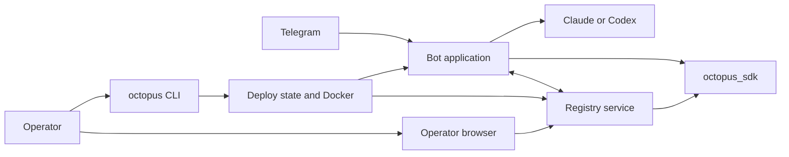
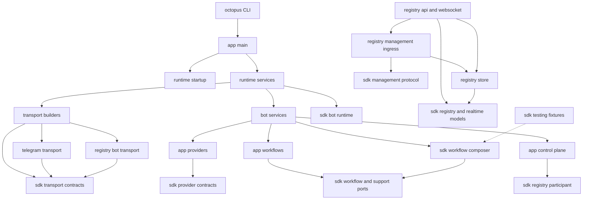
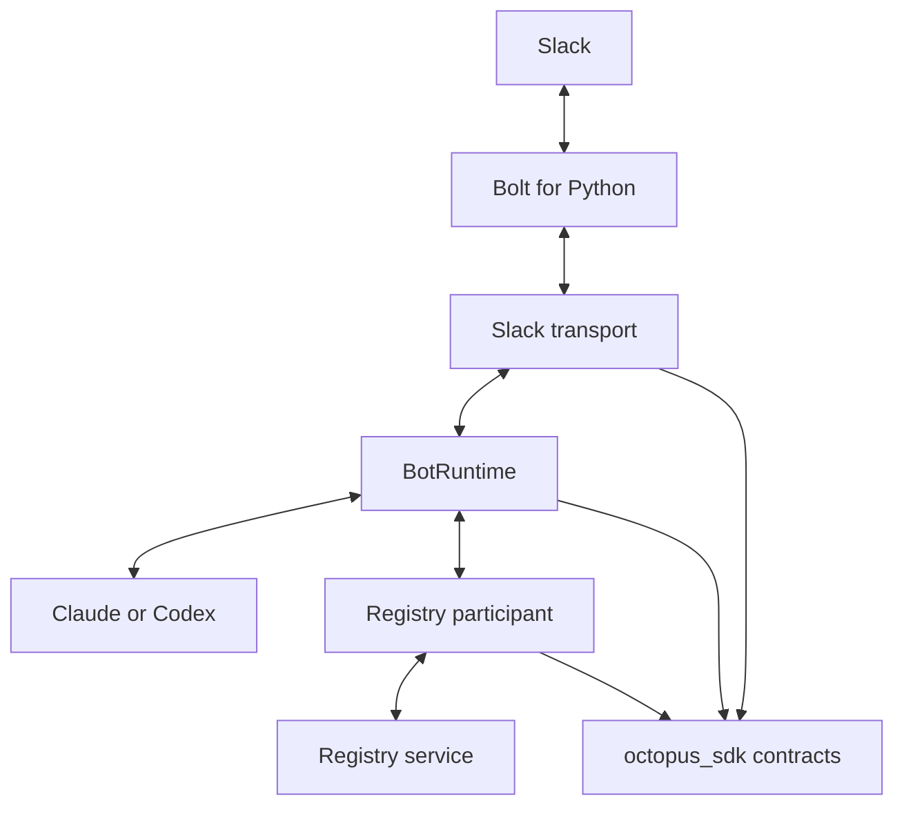
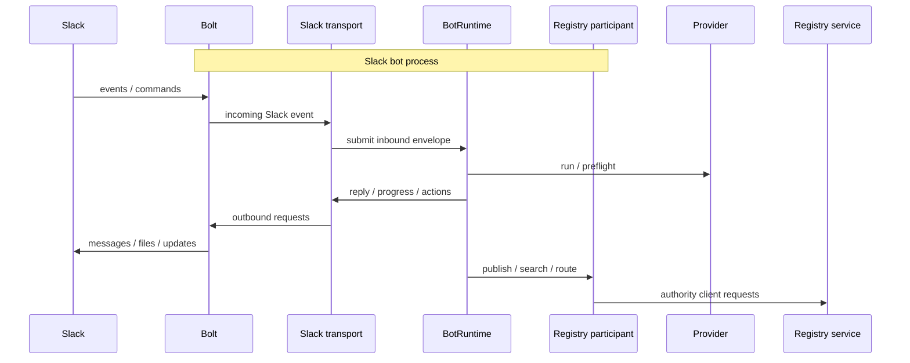
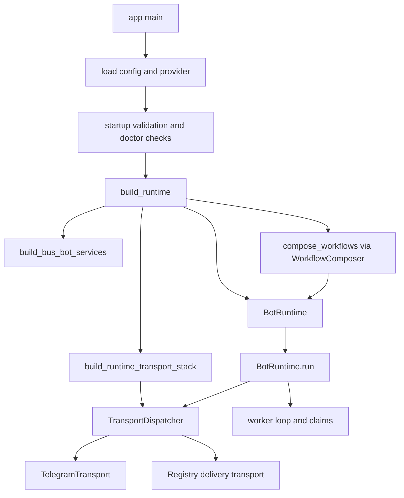
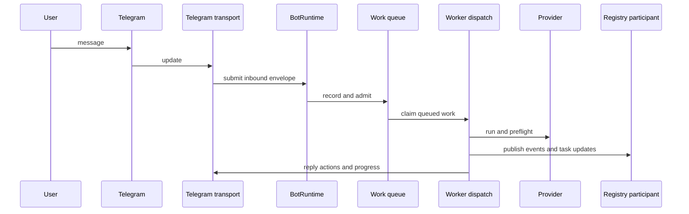
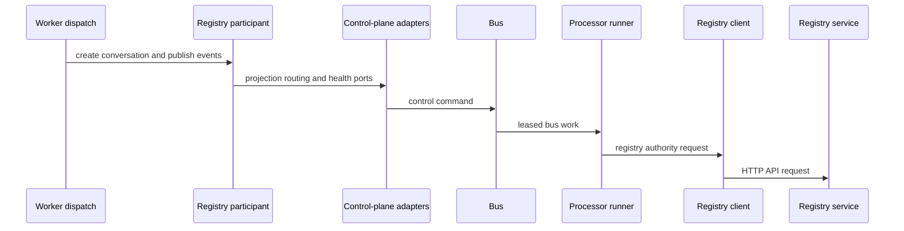
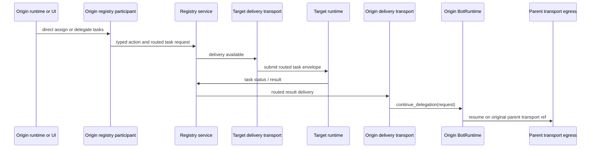

# Architecture

This document describes the current system shape in code: the deployment CLI,
the application/runtime, the registry service and SPA, and the shared SDK that
binds them together.

The SDK-4 shape is now explicit:

- `app/` is the shipped Telegram bot runtime and deployment CLI
- `octopus_registry/` is the standalone management plane
- `octopus_sdk/` is the shared runtime, workflow, transport, participant,
  management, and authority layer
- `octopus_sdk/testing/` is fenced test-only support for SDK wiring tests

## System Map

Octopus is four cooperating systems:

| System | Owns |
|---|---|
| `./octopus` | local deployment state, lifecycle, provider auth, workspaces, local registry operations |
| Bot application | runtime composition, channels, providers, registry runtime loops, workflows, control-plane adapters |
| Registry service | agent/resource APIs, websocket realtime API, operator SPA, registry persistence/query model |
| `octopus_sdk/` | shared contracts, wire models, runtime orchestration, and protocol-based composition seams |

### Layering

The system map above shows running systems. The layering view below is narrower:
it shows code ownership boundaries and the main dependency direction between
`app/`, `octopus_sdk/`, and the registry service.

## Deployment And Process Model

`./octopus` is a thin shell entrypoint that delegates to the Python CLI in
`app/octopus_cli/`. It owns local deployment state under `.deploy/` and
manages containers, workspaces, provider auth, registry lifecycle, and bot
connectivity.

Important state boundaries:

| Location | Owner | Purpose |
|---|---|---|
| `.deploy/bots/<slug>/.env` | CLI/operator | deployment-time bot config |
| `.deploy/registry/.env` | CLI/operator | local registry deployment config |
| `BOT_DATA_DIR/agent/bot_identity.json` | runtime | stable local bot identity |
| `BOT_DATA_DIR/agent/registries/<registry_id>.json` | runtime | live per-registry connection state |

For local operations against a persistent `~/octopus` checkout, the repo also
ships two helper scripts under `scripts/ops/`:

- `backup_octopus_deploy.sh` copies `~/octopus/.deploy` into a timestamped
  backup directory
- `refresh_octopus_with_backup.sh` wraps the live refresh flow:
  backup `.deploy`, `git pull --ff-only`, run `./octopus clean`, restore the
  saved `.deploy`, start the registry/bots again, reconnect them, and verify
  registry health plus image freshness

These helpers are intentionally deployment-state tools; they do not replace the
`./octopus` CLI itself.

The bot runtime supports multiple registries in config, but the current CLI is
local-registry-first: local registry lifecycle and connect/disconnect are
first-class, while remote registry records are supported by runtime/config
without the same interactive CLI coverage.

### Process Axes

The application runs under three main axes:

| Config | Values | Effect |
|---|---|---|
| `BOT_AGENT_MODE` | `standalone`, `registry` | whether registry runtime/registry-connected flows participate |
| `BOT_RUNTIME_MODE` | `local`, `shared` | single-process runtime vs split shared runtime |
| `BOT_PROCESS_ROLE` | `all`, `webhook`, `worker` | which responsibilities this process owns |

The SDK still models both standalone and registry-connected runtimes, but the
shipped Telegram implementation in this repo is stricter:

- Telegram runs in `BOT_AGENT_MODE=registry`
- startup requires configured registry connections
- those connections must collectively provide full participant coverage across
  `channel` and `coordination`

`app/main.py` is now a thin runnable entrypoint. The current runtime handoff is
split by responsibility:

- `app/runtime/startup.py`
  - startup validation
  - provider/database checks
  - doctor/provider-health modes
  - guarded runtime launch
- `app/runtime/services.py`
  - service graph composition
  - registry participant composition
  - `BotRuntime` construction
- `app/runtime/composition.py`
  - app-side port wiring for the SDK-owned `WorkflowComposer`
- `app/runtime/transport_builders.py`
  - Telegram transport registration
  - registry channel registration
  - registry delivery transport registration
- `octopus_registry/main.py`
  - standalone registry server entrypoint

The registry server and bot runtime are separate deployable processes. The bot
does not expose its own management HTTP API; the registry is the management
plane and talks to connected bots over the SDK management protocol.

## SDK Surface

`octopus_sdk/` is the shared import surface for contracts and reusable runtime
logic. Import direction is one-way:

- `app/` may import `octopus_sdk/`
- `octopus_sdk/` must not import `app/`

### Registry Contracts

| Module | Owns |
|---|---|
| `octopus_sdk.registry.client` | async registry HTTP client |
| `octopus_sdk.registry.management` | typed registry-management request/response protocol between the registry server and connected bots |
| `octopus_sdk.registry.models` | agent enrollment, discovery, conversation create, routed-task, and timeline wire models |
| `octopus_sdk.events` | stored conversation event contracts and metadata schemas |
| `octopus_sdk.realtime` | websocket envelopes, collection invalidation topics, and progress payloads |

The registry server and bot runtime both consume these contracts. The registry
server does not define its own private wire types for these surfaces.

### Unified Transport, Runtime, Participant, And Authority Contracts

| Module | Owns |
|---|---|
| `octopus_sdk.transport` | unified bot-side transport contract: `TransportDescriptor`, `TransportImplementation`, `TransportEgress`, `BotRuntimeHandle`, and delegation continuation |
| `octopus_sdk.inbound_types` | canonical inbound event and `InboundEnvelope` taxonomy for normalized inbound work, including serialized `admission_class` |
| `octopus_sdk.bot_runtime` | provider-dispatch runtime collaborators and typed runtime support ports |
| `octopus_sdk.identity` | actor/conversation key parsing, Telegram ref helpers, stable bot identity helpers |
| `octopus_sdk.registry_participant` | bot-side registry participation: enrollment, discovery, mirroring, coordination, and health |
| `octopus_sdk.registry.authority_client` | bot-to-registry authority client contract |
| `octopus_sdk.registry_authority` | server-side registry authority contracts |
| `octopus_sdk.conversation_projection` | shared conversation projection port used by participant/runtime code |
| `octopus_sdk.task_routing` | routed-task submission/status/result port |
| `octopus_sdk.agent_directory` | discovery and authority-resolution port |
| `octopus_sdk.health_publication` | live runtime health publication port |
| `octopus_sdk.task_protocol` | routed-task lifecycle states, transitions, and idempotent transition validation |
| `octopus_sdk.providers` | provider protocol and execution result/tool models |
| `octopus_sdk.composition` | `WorkflowComposer` and SDK-owned workflow graph composition |
| `octopus_sdk.testing` | fenced test-only in-memory queue/session implementations for SDK wiring verification |

The architecture is intentionally split into three first-class SDK surfaces:

- **primary transport**
  - how a bot talks to users
  - ingress, egress, binding, refs, identity, lifecycle
- **registry participant**
  - how a bot joins the shared control plane
  - enrollment, discovery, mirroring, typed coordination, task flow, health
- **registry authority**
  - the server-side control plane implementation
  - conversations, tasks, directory, health, mirroring, enrollment, delivery

The registry server and bot runtime both consume SDK-owned contracts. The
registry server does not define a second private wire model for participant
flows, and transport implementations do not define their own coordination
contract outside the SDK.

### Workflow Composition And Testing Fence

The SDK now owns workflow composition directly.

- `octopus_sdk.composition.WorkflowComposer`
  - assembles the full workflow graph from injected ports
  - `build()` is for real runtimes and rejects test-only implementations
  - `build_for_testing()` is the explicit SDK wiring-test path
- `app/runtime/composition.py`
  - remains as the app-side wrapper that supplies concrete app ports to the
    SDK composer
- `octopus_sdk/testing/`
  - contains deliberately non-durable in-memory fixtures for SDK-only tests
  - these are not runtime defaults and are not re-exported from
    `octopus_sdk.__init__`
- `octopus_sdk/tests/test_wiring_verification.py`
  - proves that SDK workflows can be composed and exercised without importing
    `app/` or `octopus_registry/`
  - is a test harness, not a production runtime template

Current ref families remain:

| Ref kind | Format |
|---|---|
| Telegram conversation | `telegram:<bot_id>:<chat_id>` |
| Registry conversation | `registry:<registry_id>:conversation:<conversation_id>` |
| Registry task | `registry:<registry_id>:task:<routed_task_id>` |

Unknown or malformed refs fail fast.

### Structured Coordination And Task Protocol

The current coordination model has two explicit lanes:

- **content lane**
  - user/operator messages
  - provider reasoning
  - bot replies
- **coordination lane**
  - typed conversation actions
  - delegation proposals and approvals
  - routed-task submission, status, and result updates

The coordination lane is no longer based on provider-emitted XML. Registry and
Telegram coordination go through typed SDK and registry contracts.

One important consequence of the current SDK shape: routed-task completion does
not resume the parent chat by fabricating a new inbound user message. The
registry delivery transport resolves the original parent transport identity and
calls the SDK continuation seam (`BotRuntime.continue_delegation(...)`) so the
resume stays on the original transport/ref while reusing the stored parent
session state.

Current typed action family in `octopus_sdk.registry.models`:

- `approve`
- `reject`
- `cancel_conversation`
- `retry_allow`
- `retry_skip`
- `recovery_discard`
- `recovery_replay`
- `direct_assign`
- `delegate_tasks`
- `approve_delegation`
- `cancel_delegation`
- `cancel_task`
- `retry_task`

Current routed-task lifecycle in `octopus_sdk.task_protocol`:

- `queued`
- `leased`
- `running`
- `completed`
- `failed`
- `cancelled`
- `timed_out`

Every routed-task transition carries a `transition_id`, and registry stores use
that together with the current task snapshot to enforce transition legality and
idempotency.

### Example: Adding A Slack Transport

Slack is not implemented in this repo today, but the current SDK is structured
so a new transport can be added without importing `app.main`.

A realistic Slack implementation would use [Bolt for Python](https://docs.slack.dev/tools/bolt-python/)
as the Slack-facing library. Slack documents Bolt as its Python framework for
building Slack apps, supports framework adapters for production HTTP handling,
and also supports [Socket Mode](https://docs.slack.dev/tools/bolt-python/concepts/socket-mode)
when Slack should deliver events over a websocket instead of an inbound HTTP
endpoint.

The resulting runtime shape would look like this:

The transport split would look like this:

- Slack/Bolt owns Slack auth, event delivery, signatures or Socket Mode, and Slack API calls
- `octopus_sdk.transport` owns the transport contract: descriptor, lifecycle, refs, identity, and egress
- `octopus_sdk.inbound_types` owns the normalized inbound envelope contract
- `octopus_sdk.bot_runtime` owns provider-dispatch collaborators and execution plumbing
- `octopus_sdk.registry_participant` owns optional registry participation for discovery, mirroring, and typed coordination

In practice a Slack transport would:

1. implement `TransportImplementation` around Bolt listeners and Slack API egress
2. normalize Slack events into canonical `InboundEnvelope` values
3. define a stable Slack ref family and identity resolver
4. provide bot-runtime collaborator implementations for session, guidance, and artifact handling
5. optionally compose the full `RegistryParticipantImplementation` to join the shared registry control plane

Once implemented, the runtime behavior would look like this:

That keeps Slack-specific code in `app/channels/slack/` while reusing the SDK
for transport behavior, provider dispatch, approvals, event publication,
session state, and registry connectivity.

## Application Systems

The repo's runnable application lives under `app/` and composes the SDK with
concrete implementations.

### Composition Root

`app/main.py` is now a thin launcher. The current startup sequence is:

1. parse CLI flags and load config in `app/main.py`
2. run startup validation/doctor/provider-health guards in `app/runtime/startup.py`
3. build shared control-plane services, participant services, workflows, and
   the final `BotRuntime` in `app/runtime/services.py`
4. register Telegram plus registry-scoped transports in
   `app/runtime/transport_builders.py`
5. hand the composed runtime back to `octopus_sdk.bot_runtime.BotRuntime.run()`
   for transport startup, worker claim processing, and shutdown

The composition flow looks like this:

### Main Subsystems

| Subsystem | Package | Owns |
|---|---|---|
| Telegram transport | `app/channels/telegram` | Telegram transport implementation, presenters, Telegram ingress normalization, and Telegram-specific rendering |
| Registry bot transport | `app/channels/registry` | bot-side registry conversation/task transport implementations, registry egress, registry delivery transport |
| Registry server | `octopus_registry` | standalone management-plane process: registry HTTP routes, websocket manager, presenters, store/authority layer, management ingress, and the operator SPA |
| Agent runtime | `app/agents` | registry enrollment/state loops, delivery handling, delegation helpers, registry authority clients |
| Runtime composition | `app/runtime` | profile validation, shared service composition, participant runtime, transport stack assembly, runtime health, app-side workflow port wiring |
| Providers | `app/providers` | Codex and Claude implementations over the SDK provider protocol |
| Shared workflows | `octopus_sdk/workflows` | backend-neutral workflow implementations used by both the bot runtime and registry management plane |
| App workflows | `app/workflows` | Telegram-specific handlers only |
| Control plane | `app/control_plane` | bus, adapters, processor runner, authority directory |
| Registry persistence | `octopus_registry` | typed authority facade plus agent/event/task/approval/guidance/query stores |

### Telegram As An SDK Consumer

Telegram is the reference implementation of the unified model in this repo:

- `app/channels/telegram/channel.py` implements the primary transport contract
- `app/runtime/registry_participant.py` provides the full registry participant surface
- `app/runtime/services.py` and `app/runtime/transport_builders.py` compose both
  into the shipped Telegram runtime profile
- Telegram-specific presentation code stays in transport/presenter modules rather than owning registry policy

### Registry Bot-Side As An SDK Consumer

Registry conversation/task channels in `app/channels/registry/channel.py` and
the registry delivery transport in `app/channels/registry/delivery_transport.py`
also consume the same SDK transport and participant contracts. They build
registry-scoped egress and route projection/routing/health through bus-backed
services from `app/runtime/bot_services.py`, and they are registered into the
runtime transport stack by `app/runtime/transport_builders.py`.

## Registry Service And Operator UI

The registry service spans:

- `octopus_registry/server.py`
- `octopus_registry/ingress.py`
- `octopus_registry/store*.py`
- `octopus_registry/ui/`

The registry is the management plane. It is deployable on its own, and its
management surfaces become meaningful when compatible bots connect to it. Bots
do not expose their own browser UI or management API.

### API Surfaces

| Surface | Purpose |
|---|---|
| Agent API | enroll/register/heartbeat/delivery/search/task flows for bots and processor/runtime code |
| Resource API | `/v1/summary`, `/v1/agents`, `/v1/conversations`, `/v1/tasks`, `/v1/approvals`, `/v1/capabilities`, `/v1/usage`, skill catalog, guidance |
| Management bridge | `octopus_registry.ingress` translates UI/API management requests into typed `octopus_sdk.registry.management` operations against connected bots |
| Realtime API | `WS /v1/ws` for typed `event`, `heartbeat`, `progress`, and `invalidate` envelopes |
| Operator SPA | browser UI under `/ui` |

Important current behavior:

- list endpoints use cursor/limit/has_more pagination
- agent list supports server-side `q` and `state`
- conversation list supports server-side `q` and `status`
- task list supports server-side `status`
- usage is derived from provider response events, and delegated child usage can
  roll into the parent conversation when routed-task results carry usage data
- conversation detail can submit typed actions through `POST /v1/conversations/{id}/actions`
- direct operator routing and delegated coordination share the same action
  surface and backend state model

### Realtime Model

The websocket manager in `octopus_registry/ws.py` uses typed SDK
envelopes from `octopus_sdk.realtime` and pushes explicit topics, not wildcard
subscriptions.

Current topic families:

- `conversation:<id>`
- `agent:<id>`
- collection topics such as `summary`, `agents`, `conversations`, `tasks`, `approvals`, `usage`

Current realtime envelope types:

- `event`
- `heartbeat`
- `progress`
- `invalidate`

The SPA is a vanilla JS application in `octopus_registry/ui/` and subscribes to explicit topics
through `octopus_registry/ui/js/ws.js`. Dashboard and list refreshes are driven by invalidation
topics; conversation detail also renders progress updates. Mounted routes debounce websocket
bursts, skip unchanged payloads with view-level signatures, and suppress background-tab refresh
churn instead of rebuilding visible DOM on every invalidate event.

Signature rule:

- subtree-skip signatures must track rendered output, not raw backend timestamps
- heartbeat and update fields are signed as the same `UI.relativeTime(...)`
  labels the DOM shows, so a background heartbeat does not repaint a row that
  still reads `just now` or `2m ago`
- fields that are not rendered at all are excluded from signatures entirely

### SPA Shell And Route Model

The registry UI is a route-driven operator console:

- one left rail / drawer shell
- one main work surface per route
- shared summary rails, segmented controls, list rows, task cards, and compact
  metadata rows across desktop and mobile

Core browser routes today:

| Route | Main purpose |
|---|---|
| `/ui` | dashboard summary + attention lists |
| `/ui/approvals` | pending approval queue |
| `/ui/agents` | agent roster with direct open-conversation actions |
| `/ui/agents/{id}` | agent overview, workers, inline conversations |
| `/ui/conversations` | quick start plus active thread roster |
| `/ui/conversations/{id}` | conversation workspace with Conversation / Tasks / Full activity |
| `/ui/tasks` | routed-task queue |
| `/ui/usage` | per-conversation usage rollups |

Important SPA primitives:

- `octopus_registry/ui/js/helpers/ui.js`
  - `UI.reconcileChildren(...)` wraps `morphdom` for keyed DOM reconciliation
  - `UI.subscribeWithRefresh(...)` centralizes websocket
    subscribe/debounce/background-tab suppression for invalidation-driven views
  - `UI.createSegmentedControl(...)` owns segmented-tab/button construction and
    keyboard behavior
  - `UI.createCursorPaginator(...)` owns cursor stack state and pagination
    rendering
  - `UI.memoizedRender(...)` centralizes signature-based skip-if-unchanged
    rendering for lists, rails, and section bodies
  - `UI.createTaskActionButtons(...)` centralizes routed-task cancel/retry
    controls
  - `UI.createAgentManagementDropdown(...)` centralizes managed-agent selector
    rendering
  - `UI.buildConversationTypeBadge(...)` centralizes `task_thread` badges
  - `UI.bindSegmentedControlKeyboard(...)` centralizes arrow-key navigation for
    segmented controls
- `octopus_registry/ui/js/router.js`
  - renders the next route shell off-DOM and waits for an initial route-ready
    promise before swapping it into `#content`
  - runs route cleanup after the new shell mounts, not before
  - keeps the previous route visible while the next route prepares
  - updates nav state only after the new route is ready to mount
- route components
  - publish an initial route-ready promise for their first real data load
  - keep the previous route visible until the next route has real initial data
  - do not paint first-mount skeleton cards/rows during route transitions
  - reconcile only the sections whose data actually changed during live refresh
  - sign keyed subtrees from rendered labels, badges, and visible counters
    rather than raw `updated_at` / `last_heartbeat_at` values
- `Fuse.js` is used for `@target` suggestion ranking in conversation detail
- theme state is owned in `octopus_registry/ui/js/app.js` and applies to both light and dark
  modes without a separate mobile app

The current component split matches operator jobs rather than raw resource
types:

- dashboard: summary + immediate follow-up
- conversations: start/reopen work and inspect active threads
- conversation detail: human conversation, routed work, and diagnostics in one
  workspace
- tasks: cross-conversation routed-task queue
- agents: health and direct entry into work
- usage: cost/token accounting tied back to conversations

Recipient-side routed work is also projected as `task_thread` conversations and
rendered separately from direct conversations in agent and conversation lists,
so delegated work is visible without pretending it is ordinary chat history.
The registry store writes task-status events to both the origin parent
conversation and the recipient task thread, and the websocket layer now
broadcasts both streams so M2-side task-thread detail stays live.

The route shells also use one shared layout vocabulary:

- compact page header
- `admin-shell`
- optional `workbench-panel` control block
- `list-shell`
- `list-container`

CSS spacing/padding is now tokenized in `octopus_registry/ui/css/main.css`
(`--card-padding`, `--panel-padding`, `--compact-card-padding`, shared
`--space-*` gaps, shared row paddings) so empty states and list spacing render
the same way across agents, conversations, tasks, approvals, and nested
dashboard/detail sections.

Conversation detail is split into focused modules:

- `octopus_registry/ui/js/components/conversation-detail.js`
  - route shell, metadata/header rendering, websocket wiring, and view
    switching
- `octopus_registry/ui/js/components/composer-autocomplete.js`
  - `@agent` / `@cap:` / `@role:` target parsing and replacement helpers
- `octopus_registry/ui/js/components/event-renderers.js`
  - activity/event card renderers and event-summary helpers; delegation
    milestones and terminal task outcomes render in the card body instead of
    duplicating an external lead block
- `octopus_registry/ui/js/components/task-board.js`
  - conversation task-card rendering and recipient-thread task-board helpers

Conversation detail remains the main operator entrypoint for structured
coordination today:

- normal conversation messages still go through `POST /v1/conversations/{id}/messages`
- a leading selector such as `@m2`, `@cap:review`, or `@role:reviewer` routes
  through typed `direct_assign` actions from the same main composer
- the default `Conversation` tab stays human-first while still surfacing
  delegation milestones and terminal task status events
- terminal task status content now lives inside the expandable event-card body,
  so completed/failed task rows expand to reveal the real outcome instead of
  repeating the same text above the toggle
- the conversation header uses operator-facing metadata (`With`, `Assigned to`,
  `Started in`) while demoting raw refs into a copy action and turning event
  counts into an `Activity (n)` action
- the `Tasks` tab renders routed work as first-class task objects with task
  actions and compact detail panels (`summary` + fact grid) instead of a loose
  full-width metadata stack
- when the current conversation is a recipient `task_thread`, the `Tasks` tab
  resolves the single routed task via `routed-task:<task_id>` instead of
  querying by parent conversation id
- `Full activity` keeps the full stored event stream for diagnostics

## Main Interaction Flows

### Telegram Request Execution

This is the normal inbound execution path for a Telegram-originated request.

### Registry Projection

This is how execution events become stored registry conversation activity.

### Delegation And Routed Tasks

This is how one bot delegates work to another through the registry now.

Parent conversations also receive mirrored `task.status` events so delegated
work is visible in the registry UI, while the conversation `Tasks` tab queries
the routed-task store directly for a cleaner operational view.

## Identity And Persistence

### Stable And Live Identity

Stable local bot identity is stored at:

- `BOT_DATA_DIR/agent/bot_identity.json`

Per-registry runtime connection state is stored at:

- `BOT_DATA_DIR/agent/registries/<registry_id>.json`

Important rule:

- `BotConfig.registry_agent_ids` is a startup read model
- live per-registry identity comes from runtime registry state in `app/agents/state.py`
- projection and delegation paths must use the live runtime state, not the startup snapshot

### Actor And Conversation Identity

`actor_key` and conversation keys are the shared identity vocabulary across
channels. Key helpers live in `octopus_sdk.identity`, including:

- `telegram_actor_key(...)`
- `parse_actor_key(...)`
- `parse_conversation_key(...)`
- `conversation_key_for_ref(...)`
- `delegation_session_key(...)`
- stable bot identity helpers such as `bot_identity(...)` and `telegram_conversation_ref(...)`

### Persistence Seams

| Seam | Backends | Owns |
|---|---|---|
| local agent state | JSON files | stable bot identity and per-registry connection state |
| session storage | SQLite / Postgres | session, approval, retry, and delegation state |
| work queue / transport | SQLite / Postgres | queued work, claims, recovery, usage |
| control-plane bus | SQLite / Postgres | commands, replies, leases |
| content store | SQLite / Postgres | built-in/runtime content and guidance |
| credential store | SQLite / Postgres | encrypted skill credentials |
| registry store | SQLite / Postgres | agents, conversations, deliveries, events, routed tasks, approvals, skills, guidance |

Current defaults:

- bot runtime uses SQLite by default and Postgres when `BOT_DATABASE_URL` is set
- registry uses SQLite by default and Postgres when `REGISTRY_DATABASE_URL` is set
- SQLite and Postgres are kept aligned by shared tests and contract coverage

## Architecture Rules

1. `./octopus` owns `.deploy/`; runtime-owned identity/state lives under `BOT_DATA_DIR/agent/`.
2. `octopus_sdk` is the shared contract/runtime layer; it must not import `app/`.
3. `app/main.py` is the application composition root for this repo's runnable bot.
4. Channels own ref formats, ingress, and egress behavior.
5. `octopus_sdk.execution` owns channel-neutral execution orchestration; transport implementations supply adapters and callbacks.
6. `octopus_sdk.runtime` is protocol-based composition, not a builder API.
7. Structured coordination goes through typed SDK and registry contracts, not provider-emitted XML.
8. Projection, routing, discovery, and health publication go through SDK ports.
9. Routed-task lifecycle legality and idempotency are enforced through `octopus_sdk.task_protocol`.
10. Stored registry events use contracts from `octopus_sdk.events`.
11. Websocket realtime uses contracts from `octopus_sdk.realtime` and explicit topic subscriptions.
12. Live per-registry agent identity comes from runtime registry state, not from the startup-only `BotConfig.registry_agent_ids` snapshot.
13. SQLite and Postgres backends must remain behaviorally aligned.
