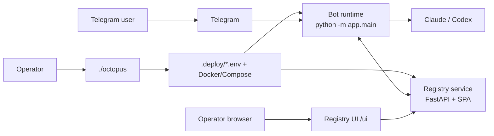
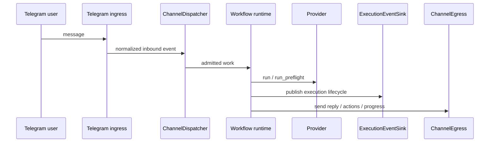
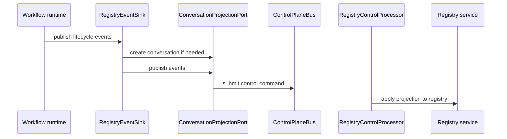
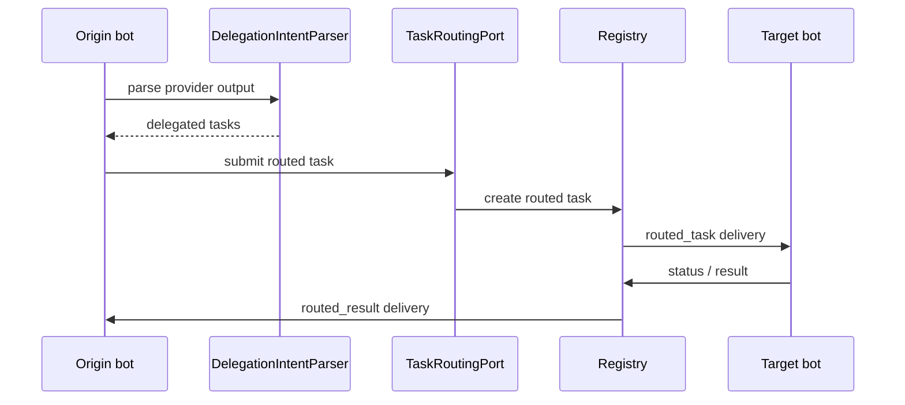

# Architecture

This document describes the current codebase as a set of systems, subsystems,
ports/interfaces, SDK contracts, APIs, and runtime interaction flows.

## System Map

Octopus is four cooperating systems:

| System | Owns |
|---|---|
| `./octopus` CLI | local deployment state, lifecycle, provider auth, workspaces, local registry operations |
| Bot runtime | Telegram ingress, workflow execution, provider orchestration, registry runtime loops, shared-runtime process roles |
| Registry service | agent API, resource API, websocket realtime API, operator SPA, registry store/query model |
| `registry_sdk/` | shared contracts for events, agents, conversations, tasks, discovery, realtime, and the registry client |

## 1. Deployment System

### Entry Point

The repo-root `octopus` script is a thin wrapper over the Python CLI in
`app/octopus_cli/`.

Canonical commands:

- `status`
- `start`
- `stop`
- `restart`
- `redeploy`
- `connect`
- `disconnect`
- `logs`
- `shell`
- `doctor`
- `clean`
- `help`

### State Ownership

| Location | Owner | Purpose |
|---|---|---|
| `.deploy/bots/<slug>/.env` | operator/CLI | bot deployment config |
| `.deploy/registry/.env` | operator/CLI | local registry deployment config |
| `BOT_DATA_DIR/agent/bot_identity.json` | runtime | stable local bot identity |
| `BOT_DATA_DIR/agent/registries/<registry_id>.json` | runtime | per-registry runtime connection state |

### Registry Scope Of The CLI

The runtime/config model still supports multiple registry connections per bot
through indexed `BOT_AGENT_REGISTRY_<n>_*` env records.

Current CLI behavior is local-first:

- local registry lifecycle is first-class
- local registry connect/disconnect is first-class
- remote/multi-registry records are still supported by runtime/config, but are
  not currently exposed through an equally rich local CLI wizard

## 2. Bot Runtime System

### Composition Root

`app/main.py` is the runtime composition root.

Current startup sequence:

1. load config
2. construct provider
3. choose runtime backend
4. initialize content and credential stores
5. create control-plane bus/directory
6. build shared bot services
7. register channels
8. build worker/runtime bundles
9. start ingress/worker/registry/control-plane pieces according to config

### Runtime Axes

| Config | Values | Effect |
|---|---|---|
| `BOT_AGENT_MODE` | `standalone`, `registry` | whether registry runtime/channels participate |
| `BOT_RUNTIME_MODE` | `local`, `shared` | single-process vs split shared runtime |
| `BOT_PROCESS_ROLE` | `all`, `webhook`, `worker` | which runtime responsibilities this process owns |

### Main Runtime Subsystems

| Subsystem | Package | Owns |
|---|---|---|
| Telegram channel | `app/channels/telegram` | Telegram bootstrap, ingress, presenters, progress hooks, Telegram execution adapters |
| Registry channels | `app/channels/registry` | registry HTTP/UI/ws surfaces, registry channel egress, registry-backed channels |
| Registry adaptation | `app/agents` | registry runtime loops, delivery adaptation, runtime registry state, delegation/runtime integration |
| Runtime composition | `app/runtime` | dispatcher, work admission, shared services, composition helpers |
| Workflows | `app/workflows/*` | execution, delegation, pending approvals, recovery, guidance, runtime skills, conversation/settings |
| Control plane | `app/control_plane` | bus, adapters, processor runner, authority directory |
| Registry service store | `app/registry_service` | registry persistence/query model |

### Channel Model

Core channel interfaces live in `app/ports/channel.py`:

- `Channel`
- `ChannelBootstrap`
- `ChannelIngress`

Current ref formats:

| Ref kind | Format |
|---|---|
| Telegram conversation | `telegram:<bot_id>:<chat_id>` |
| Registry conversation | `registry:<registry_id>:conversation:<conversation_id>` |
| Registry task | `registry:<registry_id>:task:<routed_task_id>` |

Refs are channel-owned; unknown or malformed refs fail fast.

### Egress Model

Core outbound interfaces live in `app/ports/egress.py`:

- `ConversationEgress`
- `ChannelEgress`
- `EditableHandle`
- `ChannelCapabilities`

Telegram and registry channels each implement these contracts for their own
transport behavior.

## 3. Shared Ports / Interfaces

Shared infrastructure-level interfaces live under `app/ports/`.

### Control-Plane Ports

| Port | Purpose | Current implementations |
|---|---|---|
| `ConversationProjectionPort` | create conversations and publish stored events | `BusConversationProjection`, `NoOpConversationProjection` |
| `TaskRoutingPort` | submit routed tasks, report results, update status | `BusTaskRouting`, `NoOpTaskRouting` |
| `AgentDirectoryPort` | search agents and resolve authority ownership | `BusAgentDirectory`, `NoOpAgentDirectory` |
| `HealthPublicationPort` | publish backend/runtime health summaries | `BusHealthPublication`, `NoOpHealthPublication` |

These are grouped into `BotServices` in `app/runtime/services.py`.

### Execution Event Port

`ExecutionEventSink` in `app/ports/execution_events.py` is the shared protocol
for publishing execution lifecycle events.

Current implementations:

- `RegistryEventSink`
- `NoOpEventSink`

Current published lifecycle kinds include:

- user/bot messages
- provider request/response
- tool execution
- approval requested/decided
- delegation proposed/submitted/completed
- task status
- error

### Delegation Parser Port

`DelegationIntentParser` in `app/ports/delegation.py` is the pluggable parser
for delegation intent extracted from provider output.

Default implementation:

- `XmlTagDelegationParser`

## 4. Registry SDK

`registry_sdk/` is the shared contract package. Import direction is one-way:

- `app/` may import `registry_sdk/`
- `registry_sdk/` must not import `app/`

### SDK Modules

| Module | Owns |
|---|---|
| `registry_sdk.events` | stored conversation event contracts |
| `registry_sdk.agents` | `AgentCard` and agent-facing payloads |
| `registry_sdk.conversations` | conversation create payloads |
| `registry_sdk.tasks` | routed-task request/update/result contracts |
| `registry_sdk.discovery` | discovery/search contracts |
| `registry_sdk.realtime` | websocket/progress envelope contracts |
| `registry_sdk.client` | async registry HTTP client |

### Event Contract

Stored registry conversation event kinds are defined in
`registry_sdk/events.py`:

- `message.user`
- `message.bot`
- `provider.request`
- `provider.response`
- `tool.execution`
- `approval.requested`
- `approval.decided`
- `delegation.proposed`
- `delegation.submitted`
- `delegation.completed`
- `task.status`
- `error`

These are validated through `EVENT_METADATA_SCHEMAS`.

### Realtime Contract

Realtime contracts live in `registry_sdk/realtime.py`.

Envelope types:

- `event`
- `heartbeat`
- `progress`
- `invalidate`

Collection invalidation topics:

- `summary`
- `agents`
- `conversations`
- `tasks`
- `approvals`
- `usage`

## 5. Registry Service System

The registry service spans:

- `app/channels/registry/`
- `app/registry_service/`
- `ui/`

### API Surfaces

| Surface | Purpose |
|---|---|
| Agent API | enroll/register/heartbeat/delivery/search/task flows for bots and processor/runtime code |
| Resource API | `/v1/summary`, `/v1/agents`, `/v1/conversations`, `/v1/tasks`, `/v1/approvals`, `/v1/capabilities`, `/v1/usage`, skill catalog, guidance |
| Realtime API | `WS /v1/ws` for event, heartbeat, progress, and invalidation envelopes |
| Operator SPA | browser UI under `/ui` |

Important resource API behavior:

- list endpoints use cursor/limit/has_more pagination
- agent list supports server-side `q` and `state`
- conversation list supports server-side `q` and `status`
- task list supports server-side `status`
- usage is derived from provider response events only

### Operator SPA

The operator UI is a vanilla SPA under `ui/`:

- `ui/js/router.js`
- `ui/js/api.js`
- `ui/js/ws.js`
- `ui/js/helpers/ui.js`
- `ui/js/components/*.js`

Current UI shape:

- dashboard is attention-first
- stat cards are drillable
- agents and conversations render as list rows
- tasks render as row summaries with inline detail
- approvals remain action-first cards
- conversation detail defaults to a human-first view
- websocket progress appears in the conversation UI

## 6. Identity And State Model

### Stable Identity

Stable local bot identity is stored at:

- `BOT_DATA_DIR/agent/bot_identity.json`

### Live Registry Identity

`BotConfig.registry_agent_ids` is still populated at startup from registry
state files, but it is a startup read model, not the live authority for
projection.

Live per-registry authority comes from runtime registry state:

- `app/agents/state.py::runtime_registry_agent_id(...)`

This is what current projection and delegation paths use.

### Actor Identity

`actor_key` is the single cross-channel actor identity vocabulary.

Key helpers live in `app/identity.py`:

- `telegram_actor_key(...)`
- `parse_actor_key(...)`
- `parse_conversation_key(...)`
- `delegation_session_key(...)`

## 7. Main Interaction Flows

### Telegram Execution

### Registry Projection

### Delegation / Routed Tasks

Parent conversations also receive mirrored `task.status` events so delegated
work is visible in the registry UI.

## 8. Persistence

| Seam | Backends | Owns |
|---|---|---|
| local agent state | JSON files | stable bot identity and per-registry connection state |
| session storage | SQLite / Postgres | session/runtime/delegation state |
| work queue / transport | SQLite / Postgres | queued work, claims, recovery, usage |
| control-plane bus | SQLite / Postgres | commands, replies, leases |
| content store | SQLite / Postgres | built-in/runtime content and guidance |
| credential store | SQLite / Postgres | encrypted skill credentials |
| registry store | SQLite / Postgres | agents, conversations, deliveries, events, routed tasks, skills, approvals, guidance |

Rules:

- bot runtime uses SQLite by default, Postgres when `BOT_DATABASE_URL` is set
- registry uses SQLite by default, Postgres when `REGISTRY_DATABASE_URL` is set
- SQLite and Postgres are kept aligned with contract tests

## 9. Security Boundaries

Current hardening includes:

- webhook/completion callback SSRF protection
- registry enrollment and UI login rate limiting
- approval callback binding to current pending state
- explicit Codex sandbox/config validation
- generated `BOT_CREDENTIAL_KEY` for new installs
- active-skill-scoped credential loading
- Telegram attachment size checks

## 10. Architecture Rules

1. `./octopus` owns `.deploy/`; runtime-owned identity/state lives under `BOT_DATA_DIR/agent/`.
2. Channels own refs and egress construction.
3. Workflows own business logic; channels own protocol/rendering.
4. Projection, routing, discovery, and health publication go through control-plane ports.
5. Stored registry events use contracts from `registry_sdk.events`.
6. Realtime websocket messages use contracts from `registry_sdk.realtime`.
7. Live per-registry agent identity comes from runtime registry state, not from the startup-only `BotConfig.registry_agent_ids` snapshot.
8. SQLite and Postgres backends must remain behaviorally aligned.
