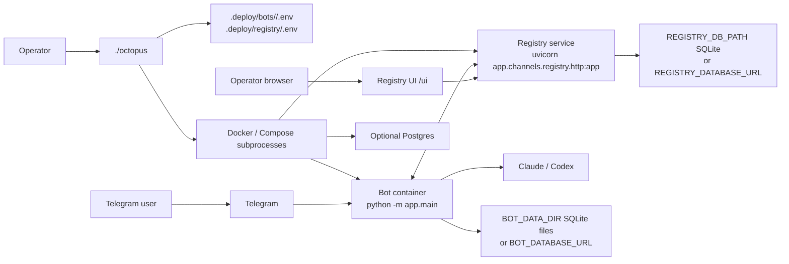
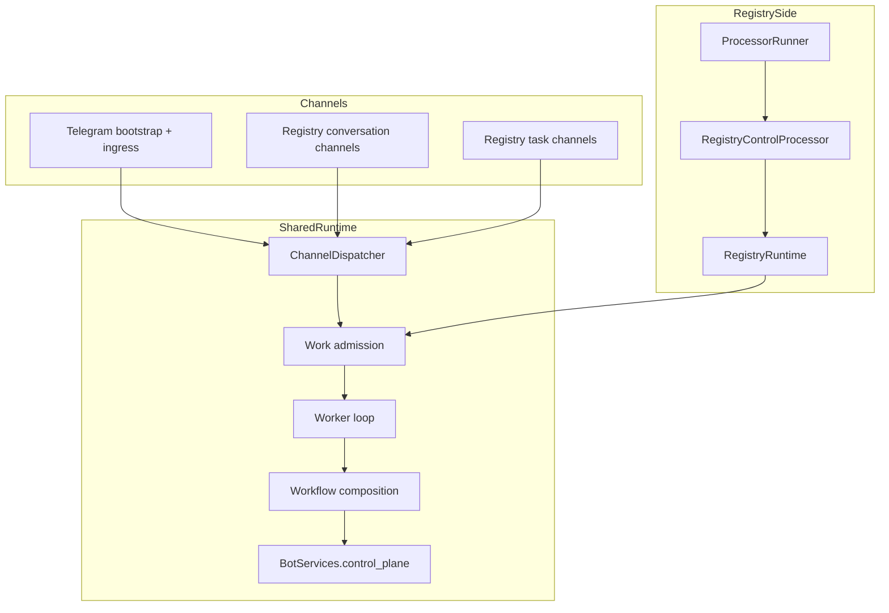
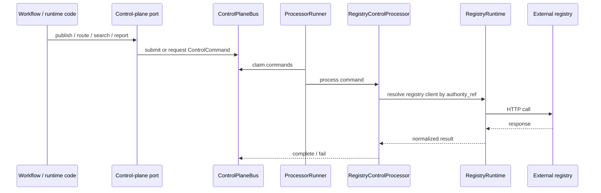

# Architecture

Octopus has two operator-facing layers:

- `./octopus` owns local deployment state, Docker orchestration, provider auth,
  workspaces, bot lifecycle, and local registry lifecycle.
- `app.main` owns the bot runtime: Telegram ingress, worker execution, registry
  runtime loops, and the optional control-plane processor.

This document describes the code as it exists today.

## System Overview

Important deployment facts:

- `./octopus` writes operator-owned env files under `.deploy/`.
- each bot gets its own compose project (`octopus-<slug>`).
- the local registry uses a separate compose project (`octopus-registry`).
- bots reach the local registry inside Docker at `http://registry:8787`.
- operators reach the local registry in the browser at
  `http://localhost:<port>/ui`.
- bot and registry images are managed as first-class local deployment targets;
  Octopus tracks their freshness and can rebuild/recreate them without a full
  destructive reset.

## Deployment And Lifecycle

The current `./octopus` control surface is implemented by the Python CLI under
`app/octopus_cli/`, with the repo-root `octopus` script acting as a thin
entrypoint wrapper.

Canonical actions are:

- `status`
- `start`
- `stop`
- `restart`
- `redeploy`
- `connect`
- `disconnect`
- `logs`
- `shell`
- `doctor`
- `clean`
- `help`

Key operational behavior:

- the no-arg `./octopus` path opens a state-driven interactive menu
- mutating commands resolve current candidates, preview them once, and ask for
  confirmation unless `--yes` is supplied
- `restart` preserves volumes/state and reuses current images
- `redeploy` rebuilds/recreates managed targets while still preserving bot and
  registry state by default
- stale bot and registry identities are reconciled during lifecycle actions
  instead of relying on a manual `clean`

### Local Registry Versus Remote Registry Configuration

The runtime still supports multiple registry connection records per bot through
indexed `BOT_AGENT_REGISTRY_<n>_*` env entries. That includes local and remote
registries, and each connection still carries its own scope.

The current Octopus CLI is intentionally local-first:

- local registry lifecycle is first-class in the CLI and no-arg menu
- local registry connect/disconnect is first-class in the CLI and no-arg menu
- remote/multi-registry capability still exists in the runtime/config model,
  but it is not currently a symmetric first-class local CLI wizard surface

## Runtime Composition

`app/main.py` is still the runtime composition root. Startup is explicit:

1. load config
2. construct the selected provider (`claude` or `codex`)
3. choose the runtime backend:
   - SQLite by default
   - Postgres when `BOT_DATABASE_URL` is set
4. run Postgres doctor/schema checks before boot when Postgres is enabled
5. initialize the content store and credential store
6. create a `ControlPlaneBus`
7. derive authority/capability ownership from configured registry connections
8. build `BotServices`
9. build one `ChannelDispatcher`
10. register Telegram bootstrap when a Telegram token exists
11. register registry conversation/task channels for each configured registry
12. build the worker bundle
13. optionally start:
   - Telegram ingress
   - worker loop
   - `RegistryRuntime`
   - `ProcessorRunner` with `RegistryControlProcessor`

There is no hidden singleton runtime reaching across packages. Composition is
explicit in `app.main`.

## Process Roles

Runtime shape depends on `BOT_RUNTIME_MODE` and `BOT_PROCESS_ROLE`.

| Role | Starts | Typical use |
|---|---|---|
| `all` | Telegram ingress, worker loop, registry runtime, processor runner | default single-process local runtime |
| `webhook` | Telegram webhook ingress, registry runtime, processor runner | shared ingress/control-plane owner |
| `worker` | worker loop only | shared worker fleet draining the durable queue |

Notes:

- `BOT_AGENT_MODE` controls standalone vs registry-enabled bot behavior
- `BOT_RUNTIME_MODE=shared` enables split `webhook` / `worker` ownership
- `RegistryRuntime` starts only when `BOT_AGENT_MODE=registry`
- in shared mode, webhook/ingress processes can own registry polling and
  control-plane processing while workers only drain queued work

## Package Responsibilities

| Area | Owns | Does not own |
|---|---|---|
| `app/channels/telegram` | Telegram bootstrap, normalization, presenters, progress hooks, Telegram-specific execution adapters | registry HTTP/UI implementation, provider orchestration policy |
| `app/channels/registry` | registry HTTP API, UI shell, registry websocket broadcast, registry channel egress | Telegram rendering, generic worker execution |
| `app/agents` | registry connection loops, delivery adaptation, registry state, delegation/runtime registry integration | generic channel-neutral presentation |
| `app/runtime` | dispatcher, shared services container, work admission, runtime composition helpers | provider-specific policy or UI rendering |
| `app/workflows/*` | execution, delegation, pending, recovery, conversation/settings, guidance, runtime skills | raw transport protocols |
| `app/control_plane` | durable bus, typed request envelopes, processor runner, authority directory | registry HTTP details |
| `app/registry_service` | registry store/query model and validation contracts | Telegram transport or provider execution |

The important correction from older docs: `app/agents` is intentionally
registry-specific adaptation code, not a generic channel-neutral layer.

## Channels, Refs, And Scope

`ChannelDispatcher` is the seam for channel-owned refs and egress construction.

Current ref formats:

| Ref kind | Format | Owning channel |
|---|---|---|
| Telegram conversation | `telegram:<bot_id>:<chat_id>` | Telegram bootstrap |
| Registry conversation | `registry:<registry_id>:conversation:<conversation_id>` | `RegistryConversationChannel` |
| Registry routed task | `registry:<registry_id>:task:<routed_task_id>` | `RegistryTaskChannel` |

Unknown or malformed refs fail instead of being silently claimed by another
channel.

### Registry Scope

Each configured registry connection has a scope:

| Scope | Registers | Polls | Contributes `registry` channel capability |
|---|---|---|---|
| `full` | conversation + task channels | all delivery kinds | yes |
| `channel` | conversation channel only | `channel_input`, `channel_action` | yes |
| `coordination` | task channel only | `routed_task`, `routed_result` | no |

Two consequences matter:

- a coordination-only connection can execute routed tasks without pretending to
  be a conversation channel
- `channel_capabilities` come from active dispatcher channels, so a
  coordination-only registry does not advertise a user-facing `registry`
  conversation surface

## Identity And Persisted Local State

Stable local bot identity lives in:

- `BOT_DATA_DIR/agent/bot_identity.json`

Per-registry runtime connection state lives in:

- `BOT_DATA_DIR/agent/registries/<registry_id>.json`

Those state files are runtime-owned. `.deploy/*.env` remains operator-owned.

### Live Registry Agent Identity

`BotConfig.registry_agent_ids` is **not** the live authority for runtime event
projection. It is a startup read model populated from registry state files when
`load_config()` runs.

The live authority is runtime registry connection state:

- `app/agents/state.py::runtime_registry_agent_id(...)`

That runtime-owned lookup is what current code uses for control-plane
projection and registry-aware execution:

- `app/main.py`
- `app/channels/registry/channel.py`
- `app/agents/delegation.py`
- `app/agents/delivery.py`
- `app/channels/telegram/execution.py`
- `app/channels/telegram/worker.py`

This matters because bots can enroll after startup. The startup snapshot on
`BotConfig` may be empty even though the runtime later obtains a valid
per-registry `agent_id`.

### Actor Identity

`app/identity.py` provides channel-neutral key helpers:

- `telegram_actor_key(user_id)` → `tg:<id>`
- `telegram_conversation_key(chat_id)` → `tg:<id>`
- `parse_actor_key(raw)` / `parse_conversation_key(raw)`
- `normalize_conversation_id(raw)`
- `delegation_session_key(origin_agent_id, parent_conversation_id)`
- `conversation_key_for_ref(ref)`

`actor_key` is the single cross-channel identity vocabulary. Seam boundaries do
not use `request_user_id`, `actor_user_id`, or bare integer IDs.

## Registry SDK

`registry_sdk/` is a standalone package at the repo root.

Import direction:

- `app/` → `registry_sdk/` is allowed
- `registry_sdk/` → `app/` is forbidden

The SDK defines shared contracts for event payloads, HTTP client usage, tasks,
and realtime envelopes.

### Event Taxonomy

`registry_sdk/events.py` is authoritative for stored conversation event kinds.

Current kinds:

| Kind | Metadata schema |
|---|---|
| `message.user` | `MessageMetadata` |
| `message.bot` | `MessageMetadata` |
| `provider.request` | `ProviderRequestMetadata` |
| `provider.response` | `ProviderResponseMetadata` |
| `tool.execution` | `ToolExecutionMetadata` |
| `approval.requested` | `ApprovalRequestedMetadata` |
| `approval.decided` | `ApprovalMetadata` |
| `delegation.proposed` | `DelegationMetadata` |
| `delegation.submitted` | `DelegationMetadata` |
| `delegation.completed` | `DelegationMetadata` |
| `task.status` | `TaskStatusMetadata` |
| `error` | `ErrorMetadata` |

All metadata schemas use `extra="forbid"`.

### Realtime Contracts

`registry_sdk/realtime.py` defines typed websocket/progress contracts for the
registry.

Envelope types:

- `event`
- `heartbeat`
- `progress`
- `invalidate`

Collection invalidation topics:

- `summary`
- `agents`
- `conversations`
- `tasks`
- `approvals`
- `usage`

`ConversationProgressUpdate` is the typed ephemeral progress payload published
for operator-visible live updates on one conversation.

## Execution Model

### TransportIdentity

`TransportIdentity` in `app/workflows/execution/contracts.py` is the frozen
dataclass every channel supplies per execution. It replaces the older execution
channel context pattern and maps one execution to registry projection, session
storage, and UI behavior.

Important fields:

- `conversation_key`
- `origin_channel`
- `external_conversation_ref`
- `target_agent_id`
- `conversation_ref`
- `routed_task_id`
- `authority_ref`
- `actor`
- optional `timeline_callback`

`ExecutionRuntime` composes:

- `build_transport_identity`
- `build_event_sink`
- runtime dispatch/progress/cancellation
- optional delegation parser
- optional agent directory
- channel-specific send/render callbacks

### ExecutionEventSink

`ExecutionEventSink` lives behind the protocol in `app/ports/execution_events.py`.
Current behavior is implemented in `app/workflows/execution/event_sink.py`.

Current sink methods include:

- `on_user_message`
- `on_provider_request`
- `on_provider_response`
- `on_tool_execution`
- `on_approval_requested`
- `on_approval_decided`
- `on_bot_reply`
- `on_delegation_proposed`
- `on_delegation_submitted`
- `on_delegation_completed`
- `on_task_status`
- `on_error`

Implementations:

| Implementation | When used |
|---|---|
| `RegistryEventSink` | projection port available and publish level allows the kind |
| `NoOpEventSink` | no registry projection or publication disabled |

`RegistryEventSink` composes:

- `ConversationProjectionPort`
- `TransportIdentity`
- live registry authority lookup

It lazily creates the registry conversation on first publish, caches the
`conversation_id`, and routes all stored event publication through
`ConversationProjectionPort`.

### Publish-Level Gating

`BOT_REGISTRY_PUBLISH_LEVEL` controls which event kinds are persisted to the
registry.

Current mapping in `app/config.py`:

| Level | Kinds |
|---|---|
| `minimal` | `message.user`, `message.bot`, `task.status`, `error` |
| `standard` | minimal + `provider.request`, `provider.response`, `tool.execution`, `approval.requested`, `approval.decided`, `delegation.*` |
| `full` | currently the same set as `standard` |

The existence of `full` is still part of the public config contract, but in the
current code it is functionally identical to `standard`.

## Delegation And Routed Tasks

### Delegation Intent

`DelegationIntentParser` is the optional execution-time parser that extracts
delegation plans from provider output.

The default parser is `XmlTagDelegationParser` in
`app/workflows/execution/delegation_parser.py`. It extracts
`<delegation>{"tasks":[...]}</delegation>` JSON blocks, resolves target slugs
to registry agent ids via the available agent list, and assigns fresh routed
task ids.

### Delegation Session Key

`delegation_session_key(origin_agent_id, parent_conversation_id)` in
`app/identity.py` produces a stable shared session key for tasks delegated from
the same origin conversation by the same origin agent. This allows the target
bot to preserve conversational continuity across multiple routed tasks tied to
one parent conversation.

### Routed Task Visibility

Routed-task lifecycle is visible in two places:

- task records in the routed-task store
- mirrored `task.status` events in the parent conversation

Registry egress also publishes ephemeral progress so operators can see
“working” / “resuming” state before a durable task or conversation event lands.

## Control Plane

The control plane is capability-scoped and authority-addressed.

`BotServices.control_plane` exposes four ports:

- `ConversationProjectionPort`
- `TaskRoutingPort`
- `AgentDirectoryPort`
- `HealthPublicationPort`

When at least one registry authority exists, these ports are backed by a
durable `ControlPlaneBus`. Otherwise they are no-op implementations.

Current rules:

- workflow/runtime code depends on ports, not on `RegistryRuntime`
- `authority_ref` identifies the owning external registry authority
- `ProcessorRunner` owns lease renewal, reclaim, and old-command purging
- event publication flows through `ExecutionEventSink` → `ConversationProjectionPort`

There is no separate ad hoc publish helper path for registry events.

## Registry Runtime And Delivery Adaptation

`RegistryRuntime` owns one `AgentRuntime` loop per configured registry
connection. Each loop owns:

- enroll/register/heartbeat sync
- delivery polling with scope-based kind filters
- discovery/search fan-out across connected coordination/full registries
- health publication

Registry-delivery adaptation is intentionally split:

- `app/agents/bridge.py`
  - `channel_input`
  - `routed_task`
- `app/agents/delivery.py`
  - `channel_action`
  - `routed_result`

### Delivery Kinds

Delivery kinds are distinct from stored conversation event kinds.

| Delivery kind | Handler | Local effect |
|---|---|---|
| `channel_input` | `admit_registry_delivery(...)` | admit inbound message, sync conversation binding, publish local timeline |
| `channel_action` | `handle_registry_delivery(...)` | queue semantic action or cancel request |
| `routed_task` | `admit_registry_delivery(...)` | admit delegated work on a task ref |
| `routed_result` | `handle_registry_delivery(...)` | apply result to parent delegation state, publish timeline, resume parent if ready |

The `deliveries` table vocabulary is transport-oriented. The `events` table
uses the SDK event taxonomy.

## Registry Service

The registry service lives under `app/channels/registry/` and
`app/registry_service/`.

It exposes three main surfaces:

### Agent API

Used by bots and the processor/runtime side for:

- enroll / register / heartbeat / deregister
- delivery poll / ack
- conversation binding and event publication
- routed-task submission, status, and result
- discovery / search

### Resource API

Used by the operator SPA and tools:

- `/v1/summary`
- `/v1/agents`
- `/v1/conversations`
- `/v1/tasks`
- `/v1/approvals`
- `/v1/capabilities`
- `/v1/usage`
- `/v1/catalog/skills/*`
- `/v1/provider-guidance/*`
- conversation messages / events / actions / export endpoints

Important current behavior:

- list endpoints use cursor/limit/has_more pagination
- agent list supports server-side `q` and `state`
- conversation list supports server-side `q` and `status`
- task list supports server-side `status`
- usage is derived from provider response events only

### Realtime API

`/v1/ws` broadcasts typed realtime envelopes defined in `registry_sdk/realtime.py`.

Current websocket behavior:

- resource-specific broadcasts for conversation events and agent heartbeats
- collection invalidations for `summary`, `agents`, `conversations`, `tasks`,
  `approvals`, and `usage`
- ephemeral conversation progress broadcasts

The client no longer relies on a fake client-only wildcard subscription model.

## Operator SPA

The operator UI under `ui/` is a vanilla SPA: plain HTML, CSS, and JS with no
framework and no build step.

Main implementation pieces:

- `ui/js/router.js`
- `ui/js/api.js`
- `ui/js/ws.js`
- `ui/js/helpers/ui.js`
- `ui/js/components/*.js`

Current UI behavior:

- Dashboard is attention-first, not just a metrics wall
- dashboard stat cards are drillable
- agents and conversations render as list rows, not stacked cards
- tasks render as lighter row summaries with inline expandable detail
- approvals remain action-first cards
- conversation detail defaults to a human-first view, with a separate
  “Full activity” toggle
- live progress shows in the conversation view via websocket `progress`
  envelopes
- list/detail pages subscribe to explicit realtime topics instead of wildcard
  UI-only assumptions

The operator SPA uses:

- operator session cookies
- CSRF tokens for mutating browser requests
- explicit route cleanups for subscriptions and timers

## Telegram Surface

Telegram bootstrap lives in `app/channels/telegram/bootstrap.py`.

Two runtime shapes matter:

- non-shared mode: direct registration of the full Telegram command set
- shared mode: shared-command dispatch for commands whose work is routed through
  the shared runtime pattern

Cross-cutting mode/config axes:

- `BOT_AGENT_MODE`: `standalone` vs `registry`
- `BOT_RUNTIME_MODE`: `local` vs `shared`
- `BOT_PROCESS_ROLE`: `all`, `webhook`, or `worker`

Telegram remains the primary end-user conversation surface even when registry
mode is enabled.

## Durable Stores And Backends

Octopus has multiple durable seams:

| Seam | Backends | Owns |
|---|---|---|
| local agent state | JSON files in `BOT_DATA_DIR/agent/` | stable bot identity and per-registry connection state |
| session storage | SQLite + Postgres | session/runtime/delegation state |
| work queue / transport | SQLite + Postgres | queued work, claims, recovery, usage |
| control-plane bus store | SQLite + Postgres | commands, replies, leases, purge lifecycle |
| content store | SQLite + Postgres | built-in/runtime content and guidance data |
| credential store | SQLite + Postgres | encrypted per-user skill credentials |
| registry service store | SQLite + Postgres | agents, conversations, deliveries, events, routed tasks, runtime skills, skill revisions, approvals, provider guidance |

Selection rules:

- bot runtime uses SQLite by default, Postgres when `BOT_DATABASE_URL` is set
- registry service uses SQLite by default, Postgres when
  `REGISTRY_DATABASE_URL` is set
- local compose defaults to SQLite for both

Contract rules:

- store methods validate their own payload boundaries
- SQLite and Postgres share contract tests for parity
- built-in content seeds on initialization
- conversation uniqueness is enforced by target/origin/ref keys for idempotent
  create behavior

## Security Boundaries

Important hardening present in current code:

- completion webhook SSRF protection against private, loopback, metadata, and
  reserved address ranges
- enrollment and operator login rate limiting
- approval callback binding to current pending request state
- generated `BOT_CREDENTIAL_KEY` for new installs, with explicit warnings on
  legacy fallbacks
- Codex sandbox/config validation against explicit allowlists
- runtime credential access limited to the active skill set unless a
  credential-management surface explicitly requests more
- preflight context minimization
- Telegram attachment size checks before download

## Testing And Guardrails

The repo uses several proof layers:

- contract tests for store parity across SQLite and Postgres
- workflow/runtime behavior tests
- integration tests for registry runtime and registry service
- compose/E2E tests for operator flows
- CLI contract tests for the shipped `./octopus` interface
- screenshot/capture checks for docs assets
- import/ownership guardrails for package boundaries

The current codebase is explicitly tested for:

- dispatcher-owned ref routing
- scope-aware registry polling and channel registration
- fail-closed registry/store validation
- control-plane ownership by authority/capability pair
- no hidden Telegram defaults in shared seams
- live registry identity resolution from runtime state, not startup snapshots

## Architecture Rules

1. `./octopus` owns operator deployment state under `.deploy/`; runtime-owned
   state lives under `BOT_DATA_DIR/agent/`.
2. Channel refs are owned by channels and routed through `ChannelDispatcher`.
3. Registry scope controls both delivery visibility and channel registration.
4. Projection-only work uses control-plane ports, not borrowed live egress.
5. Registry adaptation lives in `app/agents`, not in Telegram packages or
   generic workflow packages.
6. Workflows own business logic; channels own protocol/rendering.
7. Shared seams do not default missing provenance or channel identity to
   Telegram.
8. Store methods validate their own boundary contracts.
9. SQLite and Postgres behavior must stay aligned through contract tests.
10. Invalid or unqualified registry inputs fail fast instead of silently
    choosing a default registry.
11. `registry_sdk/` defines the stored event taxonomy and realtime envelope
    contracts. Stored conversation events use SDK kinds; delivery kinds are a
    separate transport vocabulary.
12. All stored registry event publication flows through `ExecutionEventSink`,
    never through ad hoc direct client calls.
13. `actor_key` is the single identity vocabulary across channels and
    workflows.
14. Live per-registry agent identity comes from runtime registry connection
    state under `BOT_DATA_DIR/agent/registries/<registry_id>.json`.
    `BotConfig.registry_agent_ids` is a startup read model, not the live
    authority for projection.
15. Conversation-level operations such as reset, project binding, and file
    policy changes require an explicit `conversation_key`.
