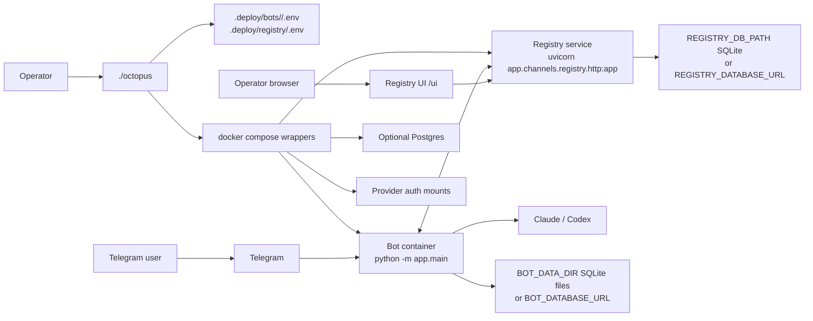
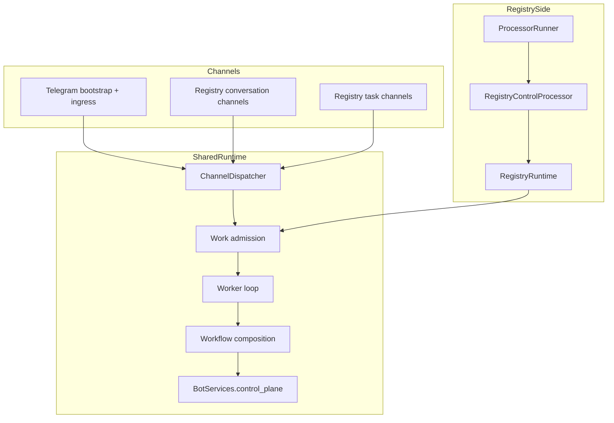
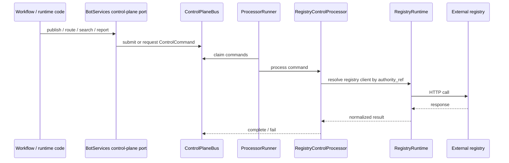
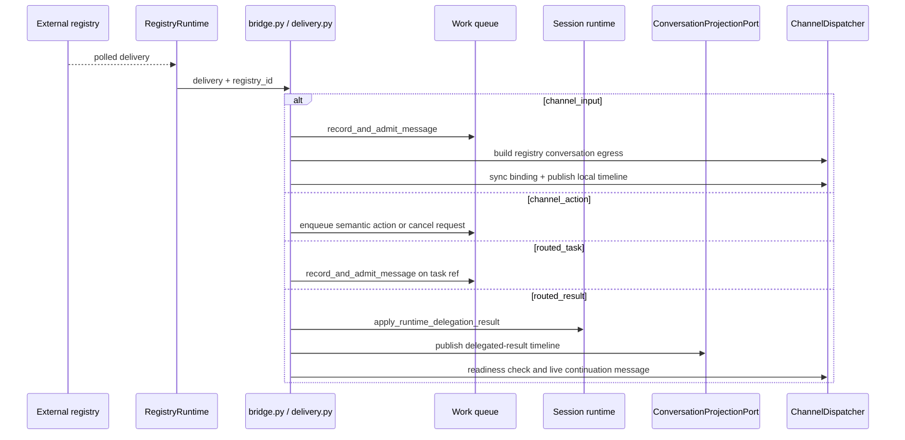

# Architecture

Octopus has two operator-facing layers:

- `./octopus` owns local deployment state, Docker orchestration, provider auth
  setup, and registry lifecycle flows.
- `app.main` owns the runtime: Telegram ingress, worker execution, optional
  registry runtime, and the optional registry-backed control-plane processor.

This document describes the code as it runs today. For rollout history and the
phase-by-phase change log, read [status.md](status.md).

## Deployment Overview

Important deployment facts:

- `./octopus` writes operator-owned env files under `.deploy/`
- each bot gets its own compose project (`octopus-<slug>`)
- the local registry uses a separate compose project (`octopus-registry`)
- Docker uses one external network, `octopus-net`
- bots reach the local registry inside Docker at `http://registry:8787`
- operators reach the local registry in the browser at
  `http://localhost:<port>/ui`

## Startup Composition

`app/main.py` composes the runtime explicitly. The startup path is:

1. load config and construct the selected provider (`claude` or `codex`)
2. select the runtime backend:
   - SQLite by default
   - Postgres when `BOT_DATABASE_URL` is set
3. run Postgres doctor/schema checks before boot when Postgres is enabled
4. initialize the shared content store and credential store
5. create a `ControlPlaneBus`
6. derive authority/capability ownership from configured registry connections
7. build `BotServices`:
   - bus-backed control-plane ports when registry authorities exist
   - no-op ports otherwise
8. create one `ChannelDispatcher`
9. register Telegram bootstrap when a Telegram token exists
10. register registry conversation/task channels for each configured registry
11. build the worker bundle
12. optionally start:
    - Telegram ingress
    - worker loop
    - `RegistryRuntime`
    - `ProcessorRunner` with `RegistryControlProcessor`

There is no implicit singleton runtime that reaches into every subsystem. The
composition root is still `app.main`.

## Process Roles

Runtime shape depends on `BOT_RUNTIME_MODE` and `BOT_PROCESS_ROLE`.

| Role | Starts | Typical use |
|---|---|---|
| `all` | Telegram ingress, worker loop, registry runtime, processor runner | default single-process local runtime |
| `webhook` | Telegram webhook ingress, registry runtime, processor runner | shared ingress/control-plane owner |
| `worker` | worker loop only | shared worker fleet draining the durable queue |

Notes:

- `BOT_RUNTIME_MODE=shared` enables split `webhook` / `worker` ownership
- `RegistryRuntime` starts only when `BOT_AGENT_MODE=registry`
- in shared mode, webhook/ingress processes can own registry polling and
  control-plane processing while workers only drain queued work
- Telegram is optional if another inbound-capable channel is present

## Runtime Surfaces

Responsibility split by package:

| Area | Owns | Does not own |
|---|---|---|
| `app/channels/telegram` | Telegram bootstrap, normalization, presenters, egress, progress hooks | provider orchestration, registry delivery adaptation |
| `app/channels/registry` | registry HTTP API, UI shell, registry channel egress, registry ref parsing | worker execution, Telegram rendering |
| `app/agents` | registry connection loops, delivery adaptation, registry control-plane processing, per-registry state | generic channel orchestration |
| `app/runtime` | dispatcher, shared services container, work admission, runtime composition helpers | provider-specific or registry-specific policy |
| `app/workflows/*` | execution, delegation, pending, recovery, runtime skills, provider guidance, conversation and credential orchestration | raw transport protocols |
| `app/control_plane` | durable bus, typed request envelopes, processor runner, authority directory | registry HTTP implementation details |
| `app/registry_service` | registry store/query model and validation contracts | Telegram transport or provider execution |

The important correction from older docs: `app/agents` is intentionally
registry-specific adaptation code, not a channel-neutral abstraction layer.

## Channels, Refs, And Registry Scope

`ChannelDispatcher` is the seam for channel-owned refs and egress construction.

Ref formats in current code:

| Ref kind | Format | Owning channel |
|---|---|---|
| Telegram conversation | `telegram:<bot_id>:<chat_id>` | Telegram channel bootstrap |
| Registry conversation | `registry:<registry_id>:conversation:<conversation_id>` | `RegistryConversationChannel` |
| Registry routed task | `registry:<registry_id>:task:<routed_task_id>` | `RegistryTaskChannel` |

There is no "anything not Telegram must be registry" fallback. Unknown or
unqualified refs fail instead of being silently claimed.

### Stable Local Identity

Telegram refs are keyed by a stable local `bot_id`, not by a registry-issued
`agent_id`.

- stable bot identity lives in `BOT_DATA_DIR/agent/bot_identity.json`
- per-registry runtime state lives in `BOT_DATA_DIR/agent/registries/<registry_id>.json`
- `./octopus` owns `.deploy/*.env`
- the Python runtime owns the `BOT_DATA_DIR/agent/*` state files

### Scope-Driven Channel Registration

Each configured registry connection has a scope:

| Scope | Registers | Polls | Contributes `registry` channel capability |
|---|---|---|---|
| `full` | conversation + task channels | all delivery kinds | yes |
| `channel` | conversation channel only | `channel_input`, `channel_action` | yes |
| `coordination` | task channel only | `routed_task`, `routed_result` | no |

Two consequences matter:

- a coordination-only connection can execute routed tasks without pretending to
  be a conversation channel
- `channel_capabilities` are derived from active dispatcher channels, so a
  coordination-only registry does not advertise a user-facing `registry`
  surface

## Control Plane

The control plane is capability-scoped and authority-addressed.

`BotServices.control_plane` exposes four ports:

- `ConversationProjectionPort`
- `TaskRoutingPort`
- `AgentDirectoryPort`
- `HealthPublicationPort`

When at least one registry authority exists, these ports are backed by a
durable `ControlPlaneBus`. Otherwise they are no-op implementations.

Current control-plane rules:

- consumer code depends on capability ports, not on `RegistryRuntime`
- `authority_ref` identifies the owning external control-plane backend
- `ProcessorRunner` owns lease renewal, reclaim, and old-command purging
- projection-only work stays on control-plane ports instead of borrowing live
  channel egress

That is why delegated-result timeline publication happens through
`ConversationProjectionPort`, while live completion messages still go through
channel egress.

## Registry Runtime And Delivery Adaptation

`RegistryRuntime` owns one `AgentRuntime` loop per configured registry
connection. Each loop owns:

- enroll/register/heartbeat sync
- delivery polling with scope-based kind filters
- discovery/search fan-out across connected coordination/full registries
- local runtime health publication

Registry-delivery adaptation is split intentionally:

- `app/agents/bridge.py`
  - `channel_input`
  - `routed_task`
- `app/agents/delivery.py`
  - `channel_action`
  - `routed_result`

### Delivery Kinds

| Delivery kind | Handler | Local effect |
|---|---|---|
| `channel_input` | `admit_registry_delivery(...)` | records a normal inbound message, syncs conversation binding, publishes local timeline |
| `channel_action` | `handle_registry_delivery(...)` | turns registry UI actions into semantic worker envelopes or cancel requests |
| `routed_task` | `admit_registry_delivery(...)` | admits delegated work on a registry task ref through the normal queue |
| `routed_result` | `handle_registry_delivery(...)` | atomically applies the result to parent delegation state, publishes projection, and resumes the parent session when ready |

Important correctness boundaries now enforced by code and tests:

- registry `channel_input` admission does not fabricate Telegram presence
- already-qualified refs pass through generic helpers instead of
  Telegram-specific branches
- malformed or missing registry scope fails closed
- parent delegated-result timelines are published only after a real matched
  routed result exists

## Worker Path

The normal worker path is:

1. admit a normalized Telegram event or registry-adapted delivery into the
   durable queue
2. claim work
3. load the session/runtime state
4. execute the appropriate workflow
5. call the provider
6. finalize usage, pending state, delegation state, projection, and egress

Core durable state machines:

- work items: `queued -> claimed -> done | failed | pending_recovery`
- routed tasks: protected/degraded/terminal transitions are store-owned
- session state: conversation/runtime/delegation state is stored separately
  from transport rows

Recovery and replay stay on the workflow/runtime boundary:

- malformed or missing replay identity fails explicitly
- durable inbound payloads preserve transport provenance
- recovery does not invent Telegram defaults when the source is missing

## Workflow Composition

`app/runtime/composition.py` groups the current workflow singletons by concern:

- `runtime_skills`
- `credentials`
- `conversation`
- `pending`
- `recovery`
- `provider_guidance`

Several workflows use explicit decision machines that take a frozen snapshot and
return a frozen decision plus effects. That keeps transition legality out of
channel code and store glue.

Shared product behavior now lives here instead of in Telegram-specific entry
points:

- runtime skill activation/import/setup/approval
- provider-guidance preview and management
- conversation actions and settings
- delegation lifecycle and routed-result continuation
- pending approval / retry / recovery machines
- delegation staleness expiration (machine-owned, measured from submission time)

## Durable Stores And Backends

Octopus has multiple durable seams:

| Seam | Backends | Owns |
|---|---|---|
| local agent state | JSON files in `BOT_DATA_DIR/agent/` | stable bot identity and per-registry connection state |
| session storage | SQLite + Postgres | session/runtime/delegation state |
| work queue / transport | SQLite + Postgres | queued work, claims, recovery, usage |
| control-plane bus store | SQLite + Postgres | commands, replies, leases, dead-letter / purge lifecycle |
| content store | SQLite + Postgres | built-in/runtime content and guidance data |
| credential store | SQLite + Postgres | encrypted per-user skill credentials |
| registry service store | SQLite + Postgres | agents, conversations, deliveries, timelines, routed tasks |

Backend-selection rules:

- bot runtime: SQLite by default, Postgres when `BOT_DATABASE_URL` is set
- registry service: SQLite by default, Postgres when `REGISTRY_DATABASE_URL` is
  set
- local compose defaults to SQLite for both bot and registry service

Boundary rules that matter:

- store methods validate their own payload contracts instead of trusting callers
- SQLite and Postgres share contract tests for parity
- content store seeds built-in content on initialization
- credential store derives an encryption key from `BOT_CREDENTIAL_KEY`, with a
  logged Telegram-token fallback only for legacy configs

## HTTP Surfaces

The registry service exposes two distinct surfaces.

### Agent API

`/v1/agents/*`

Used by registry-connected runtimes and the control-plane processor for:

- enroll/register/heartbeat
- conversation binding and timeline publication
- routed-task submission, status, and result delivery
- search/discovery
- delivery poll and ack

These endpoints validate their payloads against store contracts and use scope
checks instead of assuming happy-path callers.

### Operator UI

`/ui` and `/v1/ui/*`

Used by the browser shell for:

- live bot directory and health detail
- conversation list, detail, follow-up messaging, export, and cancel
- routed-task board
- runtime skill management
- provider-guidance management and preview
- capability kill switches

The UI is a server-rendered HTML shell with browser-side JavaScript. Login uses
session cookies, and state-changing UI requests carry CSRF headers instead of
embedding the master UI token in page JavaScript.

## Security Boundaries

Hardened in the current codebase:

- **Webhook SSRF protection**: completion webhook URLs are validated at runtime
  against private, link-local, loopback, multicast, reserved, and cloud-metadata
  IP ranges. Hostnames are resolved and all resolved addresses are checked.
  Remote webhook and bot-webhook URLs must use HTTPS.
- **Auth rate limiting**: the registry enrollment and UI login endpoints are
  throttled per client host with `429 Retry-After` responses on saturation.
- **Approval callback binding**: approval and retry buttons carry a
  request-specific token derived from the current pending state. Stale buttons
  from a previous request fail safely with a user-visible message instead of
  approving the wrong request.
- **Credential key management**: `BOT_CREDENTIAL_KEY` is generated for new
  installs. The Telegram-token fallback logs at ERROR level with explicit
  rotation guidance.
- **Provider config validation**: Codex sandbox values and config overrides are
  validated against explicit allowlists. Override keys that could weaken security
  behavior are rejected.
- **Credential scoping**: runtime credential loads are filtered to the active
  skill set. Full actor credential maps are restricted to explicit credential
  management surfaces.
- **Preflight minimization**: preflight context sent to the approval LLM
  includes skill names and capability summaries but not raw instruction bodies.
- **Attachment size limits**: Telegram file downloads are validated against a
  size limit before the download starts.

## Registry UI Rendering

Current UI rendering behavior reflected in code and tests:

- one shell renders seven operator surfaces:
  - bot directory
  - conversation list
  - shared detail panel for bot/task/conversation views
  - routed-task board
  - runtime-skills manager
  - provider-guidance manager
  - capabilities manager
- routed-task statuses such as degraded or timed-out are humanized before
  display
- badge classes are mapped from normalized event/status kinds
- malformed timestamps fall back to `(invalid date)`
- diagnostic levels are normalized to supported CSS classes
- search snippets are HTML-escaped through one helper before `<b>` tags are
  reintroduced

Accepted limitation:

- the repo has strong source-level UI shell tests
- browser screenshot regeneration for docs is an explicit script
  (`scripts/generate_registry_docs_assets.py`), not part of the normal
  automated suite

## Testing And Guardrails

The repository uses multiple proof layers:

- contract tests for store parity across SQLite and Postgres
- runtime and workflow behavior tests
- integration tests for control-plane, registry runtime, and registry service
- compose/E2E tests for operator flows
- README/operator tests for the shipped CLI contract
- registry-guide asset/reference checks for screenshot consistency
- architectural skeleton/import guardrails for package ownership

Current codebase themes reinforced by tests:

- dispatcher-owned ref routing
- scope-aware registry polling and channel registration
- fail-closed registry/store validation
- control-plane processor ownership by authority/capability pair
- no hidden Telegram defaults in shared seams

## Architecture Rules

1. `./octopus` owns operator deployment state under `.deploy/`; runtime-owned
   state lives under `BOT_DATA_DIR/agent/`.
2. Channel refs are owned by channels and routed through `ChannelDispatcher`.
3. Registry scope controls both delivery visibility and channel registration.
4. Projection-only work uses control-plane ports, not fake or borrowed egress.
5. Registry adaptation lives in `app/agents`, not in Telegram or generic
   workflow packages.
6. Workflows own business logic; channels own protocol/rendering.
7. Shared seams do not default missing provenance or channel identity to
   Telegram.
8. Store methods validate their own boundary contracts.
9. SQLite and Postgres behavior must stay aligned through contract tests.
10. Invalid or unqualified registry inputs fail fast instead of selecting a
    default registry implicitly.
