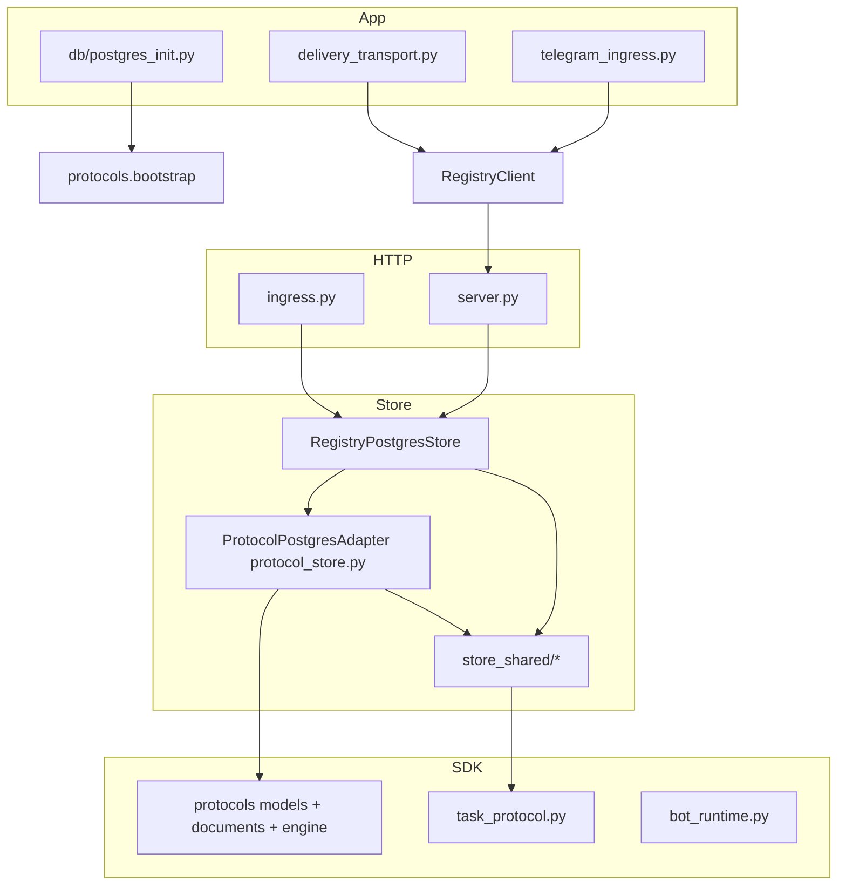

# The problem: the registry stack collapses every domain into one unmaintainable surface

**What is wrong (updated topology):** Import gates keep `app`, `octopus_sdk`, and `octopus_registry` from importing each other, but **inside** the registry process **most** persistence still flows through **`RegistryPostgresStore`** (`octopus_registry/store_postgres.py`, **~1.7k lines**, **~105** instance methods at class indent—re-verify with `rg`). **Protocol definitions, runs, dispatch, apply, advance, and maintenance** are **no longer implemented inline in that file**: they live in **`octopus_registry/protocol_store.py`** (**`ProtocolPostgresAdapter`**, **~2.3k lines**), which the store **constructs and delegates to** (`self._protocol_store.*`). Treat **`protocol_store.py`** as the **primary protocol concentration** for code navigation and reviews—not only `store_postgres.py`.

**Builtin protocol seeding** is **not** store-owned at runtime bootstrap: **`app/db/postgres_init.py`** calls **`octopus_sdk.protocols.bootstrap.ensure_builtin_protocols(conn)`** after `init.sql` (see `run_init`). The old story “seed from `RegistryPostgresStore` heartbeat path” is obsolete for the **canonical DB init** story.

**Operational coupling:** Protocol timeout sweeping **implementation** lives on **`ProtocolPostgresAdapter`** (`run_protocol_maintenance` / `_sweep_protocol_timeouts_in_tx` in **`protocol_store.py`**). **`RegistryPostgresStore.run_protocol_maintenance`** **delegates** to the adapter (thin wrapper). Scheduling remains **`server.py`** lifespan **`_protocol_maintenance_loop`** (~15s cadence)—not **`heartbeat`/`poll`**.

**New failure mode (post-extraction):** **Delegation / wrapper drift**—public store methods must stay in lockstep with **`ProtocolPostgresAdapter`** signatures and semantics (e.g. parameter names like `include_drafts`, transaction boundaries). Bugs can appear **only** at the seam between **`store_postgres`** wrappers and **`protocol_store`** implementation.

---

## What this document is

**Purpose:** Analysis of structural debt, with **concrete references** to modules and **re-verifiable** line counts (`wc -l`, `rg`). **Re-verify** anchors after large edits.

**Scope:** `octopus_registry/`, `octopus_sdk/` (focus areas), `app/` runtime/registry integration, `tests/`, `octopus_registry/ui/`.

**Related:** `STRICT_COMPLIANCE_FIX_PLAN.md` (frozen close-out record for the strict-compliance train). This document is **maintainability debt**, not the spec compliance matrix.

**How to use this doc:** Trust the **broad diagnosis** (god `AbstractRegistryStore`, large `server.py`, tests on concrete store). For **protocol file ownership**, use **`protocol_store.py` first**, then **`store_postgres.py`** wrappers—**not** the pre-2026 assumption that all protocol SQL lives in `store_postgres.py` only. For **registry UI protocol surfaces**, **`/ui/protocols`** and **`/ui/protocol-runs`** are **separate routes** (see §11–13)—do not describe the old single mixed workspace as current.

---

## 1. Normative target: persistence specific to each component

**Principle:** **Narrow ports** per bounded context; Postgres adapters own SQL for that context.

**How the codebase relates:** **Protocol** has been **partially** extracted into **`ProtocolPostgresAdapter`** (`protocol_store.py`), but **`AbstractRegistryStore`** is still a **single god Protocol** implemented by **one** `RegistryPostgresStore` that **composes** the adapter. Full component-scoped persistence (§1) is **not** done—**improved** for protocol.

---

## 2. Executive summary

| Category | Severity | Summary |
|----------|----------|---------|
| **No component-scoped persistence** | Critical | **`AbstractRegistryStore`** still spans all domains; one concrete class still implements it. |
| **Large registry store + protocol adapter** | High (was Critical monolith-only) | **`RegistryPostgresStore`** ~**1.7k** lines; **`ProtocolPostgresAdapter`** ~**2.3k** lines—**bounded** protocol module, **not** a small file. Concentration moved **out of** `store_postgres` **into** `protocol_store`. |
| **Monolithic HTTP** | High | **`server.py`** ~**1.8k** lines; **`protocol_http.build_protocol_router`** factors protocol routes. |
| **Monolithic abstract contract** | High | **`store_base.py`** ~**946** lines; **`AbstractRegistryStore`** ~**89** methods—still one type for everything. |
| **Cross-cutting protocol side effects** | Medium | Sweeps run on **lifespan** loop; **implementation** in **`protocol_store.py`**, invoked via store delegate. |
| **Delegation seam drift** | Medium (partially mitigated) | Wrapper/adapter parity is **not** unowned: **`tests/test_registry_store_type_contract.py`** asserts **signature shape** matches for delegated protocol methods (`test_registry_store_protocol_delegates_match_adapter_signatures`), and **`tests/test_protocols.py`** includes **`include_drafts`-class** coverage (`test_registry_store_list_protocols_accepts_default_include_drafts`). Drift can still happen outside those tests—treat seam honesty as **ongoing**, not closed. |
| **Protocol UI surface** | Medium | **Product-model split is done:** **`app.js`** registers **`/ui/protocols`** (authoring) and **`/ui/protocol-runs`** (operations); **`protocol-workspace.js`** implements both **`renderProtocolWorkspace`** and **`renderProtocolRuns`**. **Maintainability debt:** the **same** JS file is still **~2.1k lines**—concentration in one module, not a missing route split. (Authoring **editor UX**—progressive/visual layout—is **out of scope** for this document; track separately.) |
| **SDK `octopus_sdk/protocols/`** | Medium | **`core.py`** is a **thin re-export** (~**12** lines); real surface in **`models.py`**, **`documents.py`**, **`builtins.py`**, **`engine.py`**, **`bootstrap.py`**. Prioritize **`models.py` / `documents.py`** size (~**700** / ~**400** lines) for future splits—not a monolithic **`core.py`**. |
| **Ingress** | Medium | **`ingress.py`** ~**990** lines. |
| **Tests → concrete store** | Medium | Still true—many tests import **`RegistryPostgresStore`** / **`_SCHEMA`**. |
| **Enforced boundaries (positive)** | — | `octopus_sdk` does not import `app` / `octopus_registry`; `app` does not import `octopus_registry` (`tests/test_zero_import_gates.py`). |

---

## 3. Package inventory (reference)

Re-verify: `wc -l octopus_registry/store_postgres.py octopus_registry/protocol_store.py octopus_registry/server.py`

### 3.1 `octopus_registry/` (~30 Python modules, excluding `ui/`)

| File | ~Lines | Role |
|------|--------|------|
| **`protocol_store.py`** | **~2290** | **`ProtocolPostgresAdapter`** — protocol definitions/runs, dispatch, apply, sweep, CRUD SQL |
| `store_postgres.py` | **~1700** | **`RegistryPostgresStore`** — agents, conversations, tasks, skills, **delegates** protocol to **`_protocol_store`** |
| `server.py` | ~1792 | FastAPI app, lifespan maintenance loop |
| `store_base.py` | ~946 | `AbstractRegistryStore` |
| `ingress.py` | ~990 | Management / ingress |
| `protocol_http.py` | (see tree) | Protocol HTTP router factory |
| `store_shared/*` | (see §9) | Shared SQL helpers |
| `backend.py` | ~46 | `get_registry_store()` → `RegistryPostgresStore` |

### 3.2 `octopus_sdk/protocols/` (package)

| File | ~Lines | Role |
|------|--------|------|
| `core.py` | **~12** | Re-exports submodules (not a fat module anymore) |
| `models.py` | ~723 | Pydantic models |
| `documents.py` | ~437 | Document validation / helpers |
| `builtins.py` | ~217 | Builtin templates data |
| `engine.py` | ~644 | `ProtocolRunEngine` |
| `bootstrap.py` | ~88 | **`ensure_builtin_protocols`** — used by **`app/db/postgres_init.py`** |
| `__init__.py` | ~6 | Public surface |

### 3.3 `app/` (selected)

| File | ~Lines | Role |
|------|--------|------|
| **`db/postgres_init.py`** | (see tree) | **`run_init`** → `init.sql` + **`ensure_builtin_protocols`** — **canonical** builtin seeding path |
| `channels/registry/delivery_transport.py` | ~842 | `protocol-stage:` short-circuit |

---

## 4. Layer boundaries — what is enforced

**Source:** `tests/test_zero_import_gates.py` — SDK / app / registry import rules unchanged.

---

## 5. Protocol persistence: `ProtocolPostgresAdapter` (`protocol_store.py`) — **primary protocol surface**

**Class:** **`ProtocolPostgresAdapter`** — begins ~**line 66**.

**Construction:** **`RegistryPostgresStore.__init__`** instantiates **`ProtocolPostgresAdapter`** with **`database_url`**, **`config`**, **`protocol_engine`**, **`create_routed_task_in_tx`**, **`resolve_selector_in_tx`** (see `store_postgres.py` ~**211–230** region—re-verify).

**Orchestration anchors (re-verify line numbers):**

| Symbol | ~Line | Role |
|--------|-------|------|
| **`_dispatch_protocol_stage_in_tx`** | **~780** | Dispatch, lease/participant paths, routed task creation |
| **`_apply_protocol_engine_decision_in_tx`** | **~946** | Apply engine decisions |
| **`advance_run_for_task_in_tx`** | **~1134** | Task result → engine → persist |
| **`_sweep_protocol_timeouts_in_tx`** | **~1184** | Overdue timeouts |
| **`run_protocol_maintenance`** | **~1240** | Public maintenance entry |

**Imports:** **`octopus_sdk.protocols`**, **`ProtocolRunEngine`**, **`protocol_runtime.evaluate_protocol_dispatch`**, **`store_shared`** pieces as needed.

---

## 5b. `RegistryPostgresStore` (`store_postgres.py`) — **delegating shell + non-protocol domains**

**What remains large here:** Agents, conversations, deliveries, skills, guidance, **thin protocol method bodies** that **forward** to **`self._protocol_store`**.

**Example delegation pattern (non-exhaustive):** `list_protocols` → `return self._protocol_store.list_protocols(...)` (~**993+**); `run_protocol_maintenance` → `return self._protocol_store.run_protocol_maintenance(...)` (~**980**).

**Do not** use **appendix line numbers** from the pre-extraction era (`_dispatch` at ~1390 **inside `store_postgres`**) as primary navigation—they referred to an **older** layout. **Dispatch/apply/sweep** live in **`protocol_store.py`** first.

**Builtin seeding:** Canonical path is **`app/db/postgres_init.py`** → **`octopus_sdk.protocols.bootstrap.ensure_builtin_protocols`**. **`store_postgres.py`** contains **no** `builtin` / `ensure_builtin` helpers in the current tree—do not assign seeding to the store in new docs.

---

## 6. Abstract contract: `AbstractRegistryStore` (`store_base.py`)

**Unchanged issue:** **~89** methods on one **`Protocol`** type—implementations cannot split without breaking the type. **Fix** direction: narrow ports per domain (unchanged).

---

## 7. HTTP layer: `octopus_registry/server.py`

**Still fair:** Large aggregation point; **`build_protocol_router`** helps protocol only.

---

## 8. `octopus_registry/ingress.py`

Unchanged.

---

## 9. `store_shared/` — shared SQL helpers

Unchanged; **`resolve_selector`** still high blast-radius for protocol + routing.

---

## 10. SDK hotspots

### 10.1 `octopus_sdk/protocols/` — **post-split**

- **`core.py`** is a **re-export barrel**, not the hotspot.
- **Larger files:** **`models.py`**, **`documents.py`**, **`engine.py`**, **`builtins.py`** — use these for **future** decomposition or lint budgets.
- **Risk:** Drift between **`engine.py`** and **`models.py`** validators—keep contract tests.

### 10.2–10.4 `bot_runtime.py`, `delegation.py`, `task_protocol.py`

Unchanged in spirit.

---

## 11–13. Runtime, UI, database

**Runtime / database:** Broadly as before; re-`wc -l` large files after major edits.

**UI (registry) — updated 2026:** The protocol experience is **no longer** a single mixed **author + operate + issues** workspace on one URL.

- **Routes:** **`octopus_registry/ui/js/app.js`** registers **`/ui/protocols`** and **`/ui/protocol-runs`** separately.
- **Implementation:** **`octopus_registry/ui/js/components/protocol-workspace.js`** (~**2077** lines, re-verify) holds **shared protocol helpers**, **`renderProtocolWorkspace`** (authoring/catalog/editor), and **`renderProtocolRuns`** (run list, detail, issues, operator actions). **Debt:** two routes still live in **one** large file—ownership is correct at the **router** level; **file-level** decomposition is still open.

This doc does **not** track authoring **editor design** (visual/progressive layout); that is a separate product track.

---

## 14. Testing

**Still accurate:** Many tests import **`RegistryPostgresStore`** and schema constants—**expensive** to swap storage. Protocol-heavy tests exercise **`ProtocolPostgresAdapter`** indirectly via the store—**same** coupling story.

**Delegation / seam (incremental hardening):** **`tests/test_registry_store_type_contract.py`** compares **`RegistryPostgresStore`** and **`ProtocolPostgresAdapter`** **public delegated** protocol method **signatures** (`test_registry_store_protocol_delegates_match_adapter_signatures`). **`tests/test_protocols.py`** includes regression coverage for **`list_protocols`** default behavior around **`include_drafts`** (`test_registry_store_list_protocols_accepts_default_include_drafts`). These reduce but do not eliminate wrapper-drift risk (new kwargs, HTTP layers, optional defaults).

---

## 15–16. Backend singleton and authority

Unchanged.

---

## 17. Prioritized remediation roadmap (current shape of open work)

| Priority | Action | Primary files | Notes |
|----------|--------|-----------------|-------|
| P0 | **Keep delegation seam honest** — wrapper args, tx boundaries, OpenAPI vs handler parity | `store_postgres.py` + `protocol_store.py` | **Partially mitigated** by **`test_registry_store_type_contract.py`** (signature parity for delegated protocol methods) and targeted protocol store tests (e.g. **`include_drafts`**). **Still open:** new parameters, HTTP/query plumbing, behavior not covered by tests. |
| P1 | **Narrow `AbstractRegistryStore`** or introduce composed ports | `store_base.py`, `authority.py` | Still the main **type-system** debt |
| P1 | **Split `server.py`** into routers | `server.py` | Partially mitigated by `protocol_http` |
| P2 | **Reduce test coupling** to concrete store / `_SCHEMA` | `tests/**` | Use ports/mocks where feasible |
| P2 | **Optional:** split **`protocol_store.py`** further if file size hurts reviewability | `protocol_store.py` | It is already **bounded**—splitting is **organizational**, not “extract protocol from store” (done) |
| P2 | **Split or modularize** large protocol UI module | `octopus_registry/ui/js/components/protocol-workspace.js` | **Route split is done**; **file** is still ~**2k** lines (author + runs + shared helpers). Optional follow-on: separate files per route or shared `protocol-ui-*.js` helpers. |
| P3 | OpenAPI-driven UI client | `octopus_registry/ui/js` | Optional DX |

**Closed / obsolete as primary roadmap items:** “Extract protocol from `store_postgres` into a dedicated module” — **done** as **`protocol_store.py` / `ProtocolPostgresAdapter`**. “Split monolithic **`core.py`**” — **done** as **`models.py` / `documents.py` / …`**; **`core.py`** is thin.

**Product / UI (closed for *route ownership*):** The old **single** `/ui/protocols` **mixed authoring + operations + issues** model is **retired** in favor of **`/ui/protocols`** (authoring) + **`/ui/protocol-runs`** (operations). Remaining UI debt is **maintainability** (large combined JS file) and **editor UX** (tracked outside this document).

---

## 18. Summary diagram (current coupling)

**Target state (still aspirational):** Narrow store **ports**; handlers depend on small interfaces; **`protocol_store.py`** may split into smaller modules **without** moving logic back into `store_postgres.py`.

---

## 19. Appendix: navigation anchors (re-verify after edits)

### A. `protocol_store.py` — **`ProtocolPostgresAdapter`**

| Symbol | ~Line | Role |
|--------|-------|------|
| `_dispatch_protocol_stage_in_tx` | ~780 | Stage dispatch |
| `_apply_protocol_engine_decision_in_tx` | ~946 | Apply path |
| `advance_run_for_task_in_tx` | ~1134 | Task completion path |
| `_sweep_protocol_timeouts_in_tx` | ~1184 | Timeout sweep |
| `run_protocol_maintenance` | ~1240 | Maintenance entry |

### B. `store_postgres.py` — **delegation / non-protocol**

| Symbol | ~Line | Role |
|--------|-------|------|
| `_protocol_store` | ~218 | Adapter construction |
| `run_protocol_maintenance` | ~980 | Delegates to adapter |
| `list_protocols` / CRUD wrappers | ~993+ | Delegate to adapter |

### C. **External:** `server.py` **`_protocol_maintenance_loop`** → `get_store().run_protocol_maintenance`

---

## 20. Document control

| Version | Date | Notes |
|---------|------|--------|
| 1.0–1.1 | 2026-04-01 | Initial + normative §1 |
| 1.2 | 2026-04-16 | Package split, sweep off poll, roadmap tweaks |
| **2.0** | **2026-04-16** | **Major refresh:** **`protocol_store.py`** as protocol concentration; **`store_postgres`** size/method count updated; **`core.py`** re-export; **`postgres_init`** bootstrap; **delegation seam** risk; roadmap **closed** obsolete extraction items; diagram + appendix **split** anchors; **do not** use pre-extraction `store_postgres` protocol line numbers as primary |
| **2.1** | **2026-04-01** | **UI:** document **`/ui/protocols`** vs **`/ui/protocol-runs`** split and **`protocol-workspace.js`** ~**2k**-line concentration; **§11–13** no longer “unchanged.” **Seam:** P0 delegation marked **partially mitigated** (`test_registry_store_type_contract.py`, `test_protocols` **`include_drafts`**); roadmap + exec summary updated. **Editor UX** explicitly out of scope here. |

---

*End of document.*
