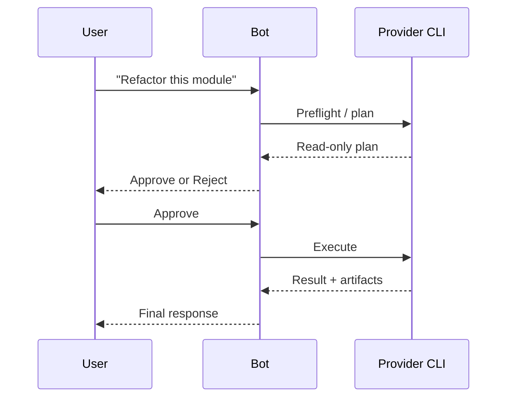
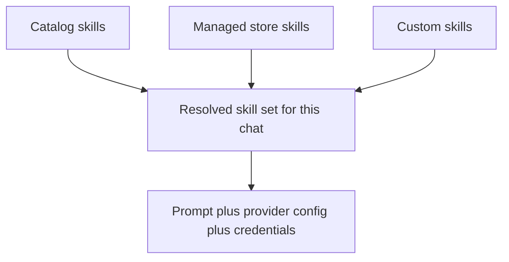

# Telegram Agent Bot

Run **Claude Code** or **Codex CLI** through Telegram, with approvals, file exchange, skills, and separate bot instances.

**Repo**: [github.com/privacynow/octopus](https://github.com/privacynow/octopus)

## Why People Use It

- Talk to your local coding agent from your phone, desktop Telegram, or a group chat.
- Review a plan before the bot executes changes.
- Upload files and screenshots, then get files back in the same chat.
- Add reusable skills and store per-user credentials securely.
- Run multiple bots at once, each with its own token, provider, model, and history.


## Get Started

You need Python 3.12+ and the CLI for your chosen provider (`claude` or `codex`) installed.

```bash
git clone git@github.com:privacynow/octopus.git ~/telegram-agent-bot
cd ~/telegram-agent-bot
./setup.sh
```

The setup wizard walks you through:

1. choosing a bot instance name
2. creating or pasting a Telegram bot token from `@BotFather`
3. selecting a provider and model
4. choosing who can talk to the bot
5. reviewing the config
6. optionally launching it as a background service

When it finishes, message your bot in Telegram and start using it.

To add another bot, run `./setup.sh` again. Each instance gets its own token, config, and conversation state.

```mermaid
flowchart LR
  A[my-claude] --> TA[@BotFather token A]
  A --> PA[Claude]
  B[my-codex] --> TB[@BotFather token B]
  B --> PB[Codex]
```

## What Using It Feels Like

### 1. Ask for work

Send a normal message:

> "Review this diff and suggest a safer refactor."

or upload files and ask:

> "Summarize these logs and tell me what broke."

### 2. Review the plan

If approval mode is on, the bot asks the provider for a read-only plan first. You approve or reject with buttons in chat.



### 3. Work with results

The bot can:

- reply with formatted output
- summarize long results for mobile
- let you fetch the full raw response
- send back files generated by the provider

## Everyday Commands

| Command | What it does |
|---|---|
| `/help` | Show command help |
| `/new` | Start a fresh conversation |
| `/cancel` | Cancel a pending request or credential setup |
| `/approval on\|off\|status` | Control plan approval mode |
| `/approve` / `/reject` | Approve or reject the current plan |
| `/session` | Show the current chat's state |
| `/send <path>` | Send a local file back into Telegram |
| `/id` | Show your Telegram user ID and username |
| `/compact on\|off` | Summarize long responses for mobile |
| `/raw [N]` | Retrieve the full raw model output |
| `/export` | Download recent conversation history |
| `/clear_credentials [skill]` | Remove your stored skill credentials |
| `/role [text]` | Set or reset the bot persona for this chat |
| `/doctor` | Run health and runtime checks |
| `/admin sessions [chat_id]` | Inspect active sessions across chats (admin) |

## Skills

Skills are capability packs that change prompt behavior and can also provide provider config, scripts, or credential requirements.

There are three sources of skills:

- built-in catalog skills from the repo
- managed store skills installed by an admin
- custom skills you create locally



### Skill Commands

| Command | What it does |
|---|---|
| `/skills` | Show active skills in this chat |
| `/skills list` | Show all available skills and readiness |
| `/skills add <name>` | Activate a skill |
| `/skills remove <name>` | Deactivate a skill |
| `/skills clear` | Remove all active skills from this chat |
| `/skills setup <name>` | Re-enter credentials for a skill |
| `/skills info <name>` | Show skill details, source, and compatibility |
| `/skills diff <name>` | Show differences for a managed or overridden skill |
| `/skills search <query>` | Search the skill store |
| `/skills create <name>` | Scaffold a custom skill |
| `/skills install <name>` | Install a store skill (admin) |
| `/skills uninstall <name>` | Remove a store skill (admin) |
| `/skills updates` | Show managed skill update status |
| `/skills update <name>` | Update one managed skill (admin) |
| `/skills update all` | Update all managed skills (admin) |

If a skill needs credentials, the bot prompts for them, encrypts them per user, and deletes the secret message after capture.

For the full store workflow, see [docs/OPS-skill-store.md](docs/OPS-skill-store.md).

## Features That Matter

### Approval Flow

Approval mode is the main safety feature. The bot can generate a plan before acting, and you approve execution in chat.

### File Exchange

Upload files to the bot and reference them naturally in your message. The provider can also return files, images, and artifacts.

### Compact Mode

Long responses can be summarized for mobile readability. Use `/raw` whenever you want the full output.

### Prompt Size Warnings

If enabling a skill would make the prompt too large, the bot warns first and asks for confirmation.

### Rate Limiting

Admins can set per-user per-minute and per-hour limits to control spend and abuse.

## Managing Bots

Each bot instance is separate: its own Telegram token, config file, provider choice, and conversation history.

```bash
systemctl --user status telegram-agent-bot@my-claude
systemctl --user restart telegram-agent-bot@my-claude
journalctl --user -u telegram-agent-bot@my-claude -f
```

Config lives at:

```bash
~/.config/telegram-agent-bot/<instance>.env
```

To edit later:

```bash
$EDITOR ~/.config/telegram-agent-bot/my-claude.env
systemctl --user restart telegram-agent-bot@my-claude
```

## Important Configuration

See [.env.example](.env.example) for the full reference. The most useful settings are:

| Setting | Default | Notes |
|---|---|---|
| `BOT_PROVIDER` | `claude` | `claude` or `codex` |
| `BOT_MODEL` | provider default | Provider model name |
| `BOT_TIMEOUT_SECONDS` | `300` | Max runtime per request |
| `BOT_APPROVAL_MODE` | `on` | Plan approval before execution |
| `BOT_WORKING_DIR` | `$HOME` | Where the CLI runs |
| `BOT_EXTRA_DIRS` | *(none)* | Extra readable directories |
| `BOT_ADMIN_USERS` | same as allowed | Who can install and update managed skills |
| `BOT_SKILLS` | *(none)* | Default skills for new chats |
| `BOT_RATE_LIMIT_PER_MINUTE` | `0` | Per-user minute limit |
| `BOT_RATE_LIMIT_PER_HOUR` | `0` | Per-user hour limit |
| `BOT_COMPACT_MODE` | `off` | Summarize long responses by default |
| `BOT_SUMMARY_MODEL` | provider-specific | Model used for compact summaries |

## Development

1,580 tests across 24 entrypoints.

```bash
./scripts/bootstrap.sh
./scripts/test_all.sh
./scripts/doctor.sh <instance>
```

### Main Modules

| Module | Purpose |
|---|---|
| `app/transport.py` | Normalizes inbound Telegram updates before business logic |
| `app/telegram_handlers.py` | Command, message, and callback entry points |
| `app/doctor.py` | Shared health and session diagnostics |
| `app/skill_commands.py` | `/skills` subcommand handlers |
| `app/skills.py` | Skill resolution, prompt composition, credentials |
| `app/store.py` | Immutable managed skill store with refs and GC |
| `app/storage.py` | SQLite session backend and upload/session paths |
| `app/providers/` | Claude and Codex provider adapters |
| `app/formatting.py` | Markdown-to-Telegram HTML and splitting |

## Roadmap And Status

- [docs/PLAN-commercial-polish.md](docs/PLAN-commercial-polish.md)
- [docs/STATUS-commercial-polish.md](docs/STATUS-commercial-polish.md)
