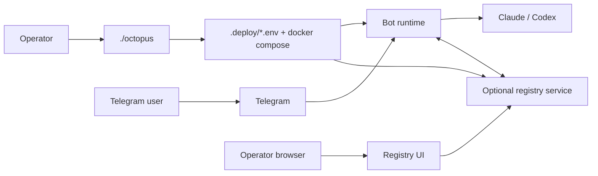
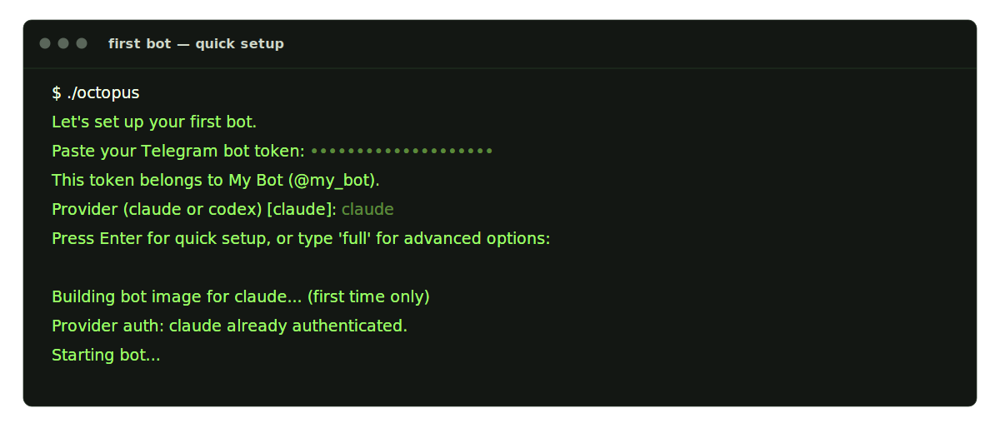
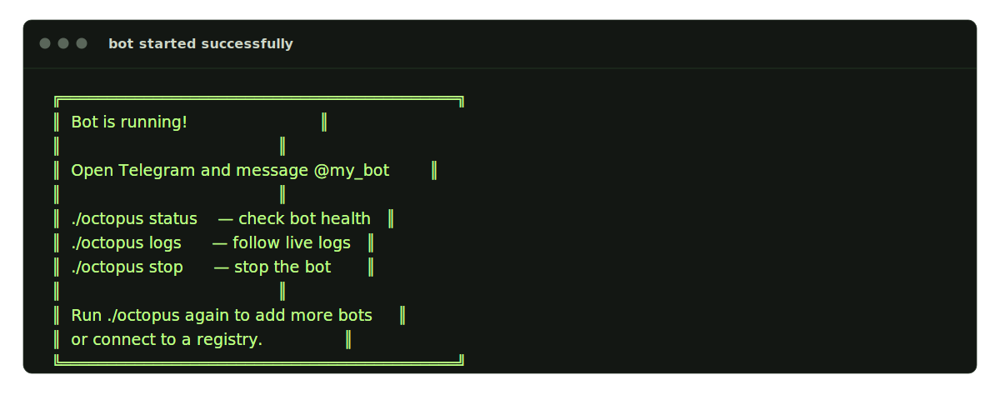
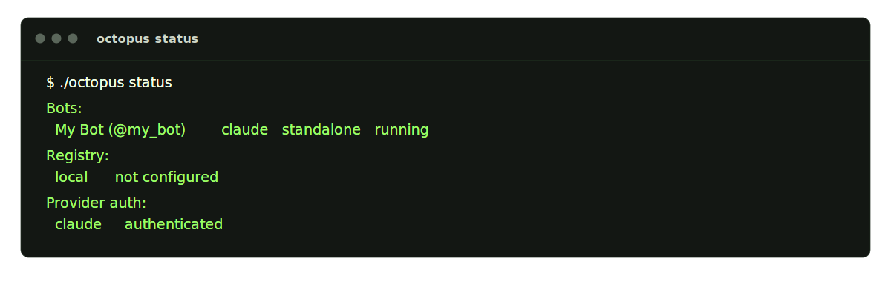
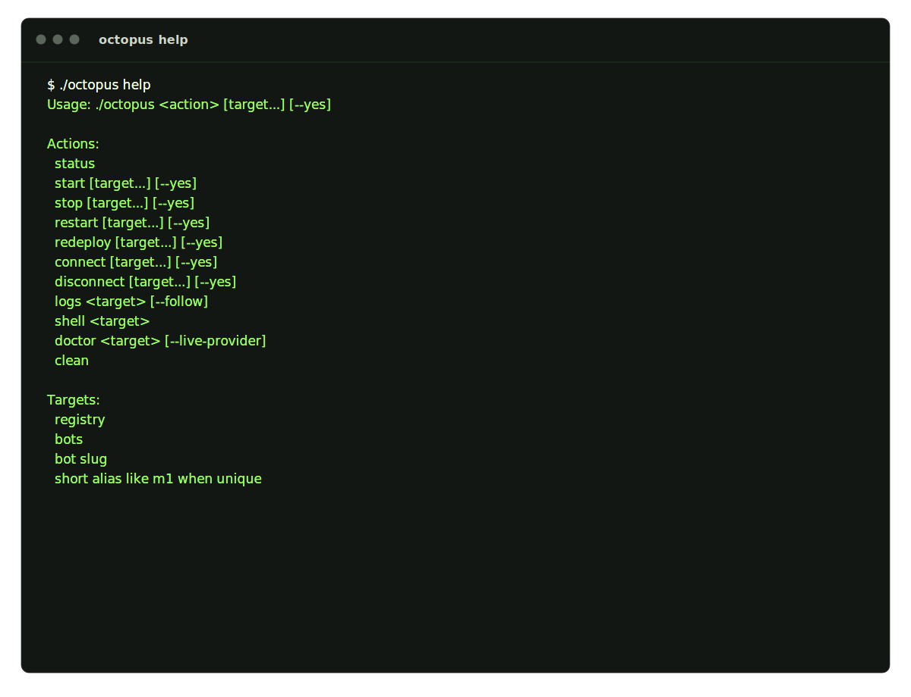

# Octopus Agent Platform

Run Claude or Codex through Telegram, with an optional registry for operator
visibility, multi-agent coordination, routed tasks, and browser-based
administration.

The primary command is:

```bash
./octopus
```

`./octopus` validates your Telegram bot token, guides provider login, writes
deployment config under `.deploy/`, starts Docker services, and manages local
or remote registry connections for each bot.

**Repo:** [github.com/privacynow/octopus](https://github.com/privacynow/octopus)

## What Octopus Includes

- Telegram chat UX for end users
- `./octopus` operator CLI for setup, status, logs, doctor, and registry
  lifecycle
- optional registry mode with:
  - local or remote registry connections
  - per-bot multi-registry support
  - scope selection per connection: `full`, `channel`, or `coordination`
  - a browser UI for operators
  - registry-backed conversation projection, routed-task coordination, agent
    discovery, and health publication
- Claude or Codex provider runtimes
- SQLite by default, with optional Postgres across the main durable seams

## Quick Mental Model



For local registry mode, the browser uses `http://localhost:<port>/ui` while
bot containers talk to the registry over Docker as `http://registry:8787`.

## What You Need

- Docker and Docker Compose
- a Telegram bot token from `@BotFather`
- one provider: `claude` or `codex`

## Quick Start

### 1. Create a Telegram bot

1. Open Telegram and search for `@BotFather`.
2. Send `/newbot`.
3. Choose a display name and a username ending in `bot`.
4. Copy the token BotFather gives you.

### 2. Clone the repo

```bash
git clone git@github.com:privacynow/octopus.git ~/octopus
cd ~/octopus
```

### 3. Run Octopus

```bash
./octopus
```

Setup offers three modes:

- **Autonomous** — full agent, no approval gates, full provider permissions,
  private (allowed users only). Optionally joins a shared workspace.
- **Safe** (default) — human reviews plans before execution, public access ok,
  provider runs in sandboxed mode.
- **Advanced** — configure everything manually (role, tags, skills, allowed
  users, working dir, timeout, webhook, registry).



When the bot starts successfully:



For the full advanced setup on first run:

```bash
./octopus --full
```

### Autonomous Mode

Autonomous bots run with `BOT_AUTONOMOUS=1`. This is a single policy flag that:

- Defaults `BOT_APPROVAL_MODE=off` (no preflight plan review)
- Grants `skip_permissions` to the provider CLI (Claude gets
  `--dangerously-skip-permissions`, Codex gets
  `--dangerously-bypass-approvals-and-sandbox`)
- Auto-submits delegation plans without waiting for human approval
- Requires `BOT_ALLOWED_USERS` and `BOT_ALLOW_OPEN=0`

The container is the security boundary. `file_policy=inspect` (read-only
workspaces) still overrides autonomous permissions. Per-chat `/approval on`
restores human review for that conversation.

### 4. Message the bot

Open Telegram, find the bot by username, and send a normal message.

Example:

> Review this diff and suggest a safer refactor.

### 5. Check status

```bash
./octopus status
```



## Operating Shapes

Octopus can run in three practical shapes:

- **Telegram-first standalone bot**
  - users talk to the bot directly in Telegram
  - no registry UI is required
- **Registry-backed bot**
  - Telegram remains the user-facing chat surface
  - one bot can connect to one or more local/remote registries
  - the registry adds operator UI, routed-task flows, agent discovery, and
    shared timelines
- **Shared runtime deployment**
  - optional `BOT_RUNTIME_MODE=shared`
  - split roles with `BOT_PROCESS_ROLE=webhook` and `BOT_PROCESS_ROLE=worker`
  - ingress/webhook processes can own registry polling and control-plane
    processing while worker processes drain the durable queue

## Registry Connections And Scopes

Each bot can have zero, one, or multiple registry connections. Octopus stores
them as indexed `BOT_AGENT_REGISTRY_<n>_*` entries in the bot env file.

Every connection has a scope:

- `full`: conversation + coordination surfaces
- `channel`: conversation/UI/timeline surfaces only
- `coordination`: routed tasks, agent discovery, and health publication only

Octopus prompts for a scope whenever you add or switch a registry connection.

Registry mode can point at:

- a **local registry** managed from `./octopus registry`
- a **remote registry** over HTTPS

## Day-To-Day Commands



The most common operator commands:

```bash
./octopus status       # show bots, registry, and provider auth
./octopus logs         # follow live logs
./octopus doctor       # run a health check
./octopus registry     # manage the local registry
./octopus workspace    # manage shared workspaces
./octopus clean        # wipe everything and start fresh
```

If more than one bot exists, Octopus asks which bot to use only when the choice
is ambiguous.

### Registry Subcommands

```bash
./octopus registry start     # start (or create) the local registry
./octopus registry stop      # stop the local registry
./octopus registry logs      # follow registry logs
./octopus registry status    # show registry and bot connection status
./octopus registry connect   # connect bot(s) to local registry
```

## Shared Workspaces

Multiple bots on the same machine can share a project directory so they
collaborate on the same codebase. A workspace is a host directory that gets
bind-mounted into member bot containers.

```bash
# Create a workspace pointing at a host directory
./octopus workspace create myapp /path/to/project

# Add bots to the workspace
./octopus workspace add-bot myapp my-claude-bot
./octopus workspace add-bot myapp my-codex-bot

# Check workspace status
./octopus workspace status

# Verify workspace health
./octopus workspace verify
```

After adding a bot to a workspace, restart it (`./octopus stop <slug> &&
./octopus start <slug>`) for the mount to take effect. Inside the container,
the workspace is available at `/workspace/<name>`. Each member bot gets a
`BOT_PROJECTS` entry so users can switch to the workspace with `/project
myapp` in the chat.

Bots in the same workspace can discover each other via `workspace:<name>` tags
in registry agent search. Coordination uses registry delegation, not file
locks. For git repos, each bot can work on branches and the operator or a
coordinator bot merges results.

A workspace mount gives every member bot full access to the tree. Do not mount
directories containing secrets. Use the `/project` command or `BOT_PROJECTS`
subpath entries for internal directory splitting.

## Build Troubleshooting

Bot images always start from `python:3.12-slim`, then install the selected
provider CLI inside the image.

- Claude builds default to Anthropic's documented npm package install path:
  `npm install -g @anthropic-ai/claude-code`
- If you need to pin or override that path, set
  `CLAUDE_CLI_NPM_PACKAGE=@anthropic-ai/claude-code@<version>` before running
  `./octopus` or `./scripts/provider/build_bot_image.sh claude`
- If you specifically want Anthropic's native installer instead, set
  `CLAUDE_INSTALL_METHOD=native`; `CLAUDE_INSTALL_URL` remains available as an
  override for that path
- If Docker Desktop cannot pull `python:3.12-slim` from Docker Hub, retry
  `docker pull python:3.12-slim` directly first; on Macs with flaky dual-stack
  Docker networking, switching Docker Desktop to IPv4-only mode can stabilize
  pulls

## Most Useful Commands

| Command | What it does |
|---|---|
| `/start` | Show the main help |
| `/help` | Show help |
| `/approval on\|off\|status` | Review plans before execution |
| `/approve` | Approve the current pending plan |
| `/reject` | Reject the current pending plan |
| `/cancel` | Stop the current request or pending action |
| `/send <path>` | Retrieve a file the bot created |
| `/skills` | Show active skills |
| `/skills list` | Show available skills |
| `/skills add <name>` | Activate a skill |
| `/skills setup <name>` | Configure a skill when prompted |
| `/settings` | Open chat settings |
| `/session` | Show current session details |
| `/doctor` | Run the bot health check |

## Registry UI

Registry mode is optional. When enabled, Octopus can connect a bot to a local
or remote registry.

For a local registry, Octopus prints a browser URL like:

```text
http://localhost:8787/ui
```

Log in with `REGISTRY_UI_TOKEN` from `.deploy/registry/.env`. The UI uses
session cookies and CSRF protection for state-changing requests.

The UI is a vanilla HTML/JS/CSS single-page application with real-time updates
via WebSocket when the ASGI stack supports it. Components include:

- agent directory and agent detail
- conversation list and detail with a chat-like timeline
- routed-task board
- capabilities manager
- skills catalog
- usage overview

**Screenshots** (annotated for learning) live under `docs/assets/registry/ui/`
— for example the agent list after sign-in:


The full walkthrough with **every screen** (login, search filter, conversation
timeline, tasks, capabilities, skills, usage, and bookmarkable agent URLs) is
in **[docs/registry-guide.md](docs/registry-guide.md)**.

## Storage and Runtime Notes

- `.deploy/bots/<slug>/.env` and `.deploy/registry/.env` are operator-owned
  deployment state
- the bot runtime keeps stable local bot identity and per-registry connection
  state under `BOT_DATA_DIR/agent/`
- SQLite is the default runtime backend; set `BOT_DATABASE_URL` to move the
  main durable stores to Postgres
- the local registry service uses `REGISTRY_DB_PATH` by default and can switch
  to Postgres with `REGISTRY_DATABASE_URL`
- startup validates Postgres schema health before boot when
  `BOT_DATABASE_URL` is set
- `BOT_REGISTRY_PUBLISH_LEVEL` controls what events bots publish to the
  registry. Three levels: `minimal` (messages + errors), `standard` (+
  approvals, delegation, provider summary), `full` (+ provider requests, tool
  execution, file changes). Default: `standard`

## Security Notes

- `BOT_CREDENTIAL_KEY` encrypts stored skill credentials. New installs from
  `./octopus` generate this automatically. For existing deployments, set it in
  the bot env file before rotating the Telegram bot token — otherwise encrypted
  credentials become inaccessible.
- Completion webhook URLs are validated against private/metadata IP ranges at
  runtime. Remote webhook URLs must use HTTPS.
- The registry enrollment endpoint and UI login are rate-limited per client host.
- `REGISTRY_SESSION_SECRET` should be set explicitly for multi-instance registry
  deployments. Single-instance setups use a stable derived fallback.

If you use Postgres instead of the default SQLite runtime:

1. Run `./scripts/db/dev_up_postgres.sh`.
2. Set `BOT_DATABASE_URL` in the bot env file.
3. Restart with `./octopus`.

## Verify It Works

After setup, send this message to the bot:

> What files are in my working directory?

You should get a reply within a few seconds.

If the bot is registry-backed:

1. Run `./octopus status` and confirm the bot shows the expected registry
   connection rows.
2. Open the local UI or hosted registry UI.
3. Send `/doctor` in Telegram or run `./octopus doctor`.

## Troubleshooting

If the bot will not start:

1. Run `./octopus` again.
2. If provider auth expired, Octopus will walk you through login again.
3. Run `./octopus doctor`.
4. Send `/doctor` to the bot in Telegram if it is reachable.

If a remote registry connect fails immediately:

1. Confirm the URL starts with `https://`.
2. Confirm the enrollment token is correct.
3. Re-run the registry flow from `./octopus`.

If a switch flow is unavailable:

1. Run `./octopus status`.
2. Check how many registry connections the bot already has.
3. Use add/remove connection flows when more than one registry connection is
   configured.

If the registry UI is not updating:

1. Run `./octopus registry`.
2. Confirm the local registry is running, or verify the remote registry URL.
3. Re-run `./octopus status` and inspect the per-bot connection state.
4. Re-run `./octopus` and choose the registry management path if needed.

## More Documentation

- [docs/manual/README.md](docs/manual/README.md): **user manual** (linear setup →
  operator → product → API → troubleshooting); **SVG** diagrams plus **Registry
  UI** screenshots where the real browser UI matters
- [ARCHITECTURE.md](ARCHITECTURE.md): current deployment, runtime,
  control-plane, registry, and store architecture
- [docs/flows-catalog.md](docs/flows-catalog.md): **canonical index** of every
  operator and product flow (Octopus, Registry UI/API, Telegram, optional DB
  CLI), with pointers to code and existing tutorials
- [docs/registry-guide.md](docs/registry-guide.md): step-by-step local and
  remote registry guide with current dashboard, detail, and management screens
  plus the CLI SVG flows
