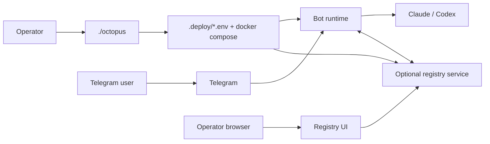

# Octopus Agent Platform

Run Claude or Codex through Telegram, with an optional registry for operator
visibility, multi-agent coordination, routed tasks, and browser-based
administration.

The primary command is:

```bash
./octopus
```

`./octopus` validates your Telegram bot token, guides provider login, writes
deployment config under `.deploy/`, starts Docker services, and manages local
deployment state for bots, workspaces, and the local registry. Runtime config
still supports multiple local or remote registry connections per bot, but the
current first-class Octopus connect/disconnect flows are local-registry focused.

**Repo:** [github.com/privacynow/octopus](https://github.com/privacynow/octopus)

## What Octopus Includes

- Telegram chat UX for end users
- `./octopus` operator CLI for setup, status, logs, doctor, and registry
  lifecycle
- optional registry mode with:
  - local or remote registry connections
  - per-bot multi-registry support
  - scope selection per connection: `full`, `channel`, or `coordination`
  - a browser UI for operators
  - registry-backed conversation projection, routed-task coordination, agent
    discovery, and health publication
- Claude or Codex provider runtimes
- SQLite by default, with optional Postgres across the main durable seams

## Quick Mental Model



For local registry mode, the browser uses `http://localhost:<port>/ui` while
bot containers talk to the registry over Docker as `http://registry:8787`.

## What You Need

- Docker and Docker Compose
- a Telegram bot token from `@BotFather`
- one provider: `claude` or `codex`

## Quick Start

### 1. Create a Telegram bot

1. Open Telegram and search for `@BotFather`.
2. Send `/newbot`.
3. Choose a display name and a username ending in `bot`.
4. Copy the token BotFather gives you.

### 2. Clone the repo

```bash
git clone git@github.com:privacynow/octopus.git ~/octopus
cd ~/octopus
```

### 3. Run Octopus

```bash
./octopus
```

Setup offers three modes:

- **Autonomous** — full agent, no approval gates, full provider permissions,
  private (allowed users only). Optionally joins a shared workspace.
- **Safe** (default) — human reviews plans before execution, public access ok,
  provider runs in sandboxed mode.
- **Advanced** — configure everything manually (role, tags, description,
  skills, allowed users, working dir, timeout, completion webhook URL).


When the bot starts successfully:


For advanced setup, choose **Bots → Add bot** from the no-arg menu and select
the **Advanced** mode when prompted.

### Autonomous Mode

Autonomous bots run with `BOT_AUTONOMOUS=1`. This is a single policy flag that:

- Defaults `BOT_APPROVAL_MODE=off` (no preflight plan review)
- Grants `skip_permissions` to the provider CLI (Claude gets
  `--dangerously-skip-permissions`, Codex gets
  `--dangerously-bypass-approvals-and-sandbox`)
- Auto-submits delegation plans without waiting for human approval
- Requires `BOT_ALLOWED_USERS` and `BOT_ALLOW_OPEN=0`

The container is the security boundary. `file_policy=inspect` (read-only
workspaces) still overrides autonomous permissions. Per-chat `/approval on`
restores human review for that conversation.

### 4. Message the bot

Open Telegram, find the bot by username, and send a normal message.

Example:

> Review this diff and suggest a safer refactor.

### 5. Check status

```bash
./octopus status
```


## Operating Shapes

Octopus can run in three practical shapes:

- **Telegram-first standalone bot**
  - users talk to the bot directly in Telegram
  - no registry UI is required
- **Registry-backed bot**
  - Telegram remains the user-facing chat surface
  - one bot can still connect to one or more local/remote registries
  - the registry adds operator UI, routed-task flows, agent discovery, and
    shared timelines
- **Shared runtime deployment**
  - optional `BOT_RUNTIME_MODE=shared`
  - split roles with `BOT_PROCESS_ROLE=webhook` and `BOT_PROCESS_ROLE=worker`
  - ingress/webhook processes can own registry polling and control-plane
    processing while worker processes drain the durable queue

## Registry Connections And Scopes

Each bot can have zero, one, or multiple registry connections. The runtime and
env model store them as indexed `BOT_AGENT_REGISTRY_<n>_*` entries in the bot
env file.

Every connection has a scope:

- `full`: conversation + coordination surfaces
- `channel`: conversation/UI/timeline surfaces only
- `coordination`: routed tasks, agent discovery, and health publication only

The current Octopus CLI first-class manages the **local** registry connection
path (`connect` / `disconnect` plus local registry lifecycle). Remote and
multi-registry records still exist in config/runtime, but they are not exposed
through an equally rich local CLI wizard today.

Registry mode can point at:

- a **local registry** managed from `./octopus start registry` or the no-arg menu
- a **remote registry** over HTTPS

## Day-To-Day Commands


The most common operator commands:

```bash
./octopus                     # dynamic menu: recommended actions, lifecycle, bots, registry, workspaces
./octopus status              # show bots, registry, provider auth, and image freshness
./octopus start registry      # start (or create) the local registry
./octopus connect             # connect all eligible bots to the local registry
./octopus restart bots        # restart all configured bots
./octopus redeploy registry   # rebuild and recreate the local registry, preserving data
./octopus logs m1 --follow    # follow one bot's logs
./octopus shell m1            # open a shell in one bot container
./octopus doctor m1           # run a health check for one bot
./octopus clean               # destructive reset of Octopus Docker state and .deploy
```

If more than one bot exists, Octopus asks which bot to use only when the choice
is ambiguous.

All mutating commands resolve the current candidates, preview them, and ask for
one confirmation unless `--yes` is provided.

Short selectors such as `m1` work when they are unique.

## Shared Workspaces

Multiple bots on the same machine can share a project directory so they
collaborate on the same codebase. A workspace is a host directory that gets
bind-mounted into member bot containers.

Use the no-arg menu:

1. Run `./octopus`
2. Open `Workspaces`
3. Create the workspace
4. Attach one or more bots
5. Inspect the generated assignments from the same section

After adding a bot to a workspace, restart it (`./octopus restart <slug>`) for
the mount to take effect. Inside the container,
the workspace is available at `/workspace/<name>`. Each member bot gets a
`BOT_PROJECTS` entry so users can switch to the workspace with `/project
myapp` in the chat.

Bots in the same workspace can discover each other via `workspace:<name>` tags
in registry agent search. Coordination uses registry delegation, not file
locks. For git repos, each bot can work on branches and the operator or a
coordinator bot merges results.

A workspace mount gives every member bot full access to the tree. Do not mount
directories containing secrets. Use the `/project` command or `BOT_PROJECTS`
subpath entries for internal directory splitting.

## Build Troubleshooting

Bot images always start from `python:3.12-slim`, then install the selected
provider CLI inside the image.

- Claude builds default to Anthropic's documented npm package install path:
  `npm install -g @anthropic-ai/claude-code`
- If you need to pin or override that path, set
  `CLAUDE_CLI_NPM_PACKAGE=@anthropic-ai/claude-code@<version>` before running
  `./octopus redeploy bots`
- If you specifically want Anthropic's native installer instead, set
  `CLAUDE_INSTALL_METHOD=native`; `CLAUDE_INSTALL_URL` remains available as an
  override for that path
- If Docker Desktop cannot pull `python:3.12-slim` from Docker Hub, retry
  `docker pull python:3.12-slim` directly first; on Macs with flaky dual-stack
  Docker networking, switching Docker Desktop to IPv4-only mode can stabilize
  pulls

## Most Useful Commands

| Command | What it does |
|---|---|
| `/start` | Show the main help |
| `/help` | Show help |
| `/approval on\|off\|status` | Review plans before execution |
| `/approve` | Approve the current pending plan |
| `/reject` | Reject the current pending plan |
| `/cancel` | Stop the current request or pending action |
| `/send <path>` | Retrieve a file the bot created |
| `/skills` | Show active skills |
| `/skills list` | Show available skills |
| `/skills add <name>` | Activate a skill |
| `/skills setup <name>` | Configure a skill when prompted |
| `/settings` | Open chat settings |
| `/session` | Show current session details |
| `/doctor` | Run the bot health check |

## Registry UI

Registry mode is optional. When enabled, Octopus can connect a bot to a local
or remote registry.

For a local registry, Octopus prints a browser URL like:

```text
http://localhost:8787/ui
```

Log in with `REGISTRY_UI_TOKEN` from `.deploy/registry/.env`. The operator SPA
uses **session cookies** and **CSRF** on mutating requests (`/v1/auth/csrf`).

The UI is **vanilla HTML, JS, and CSS** under `ui/` (no framework, no build
step). It includes:

- **Agents** — paginated list rows with server-side search/status filtering,
  connectivity badges, WebSocket heartbeat hints; agent detail with workers and
  a paginated conversation sub-list
- **Conversations** — paginated list, **debounced server-side search** (`q`,
  ≥3 characters), **status** filter; detail with **compose** (operator
  messages), **cancel / export**, **Conversation** vs **Full activity**,
  scroll-up history loading, and live **WebSocket** updates when `/v1/ws` is
  available
- **Tasks** — paginated **routed tasks** with row summaries, inline detail,
  status filter, jump to parent conversation, and live refresh on task status
  events
- **Capabilities** — global toggles with confirmation
- **Skills** — catalog browse with client-side search
- **Usage** — date ranges (**Today / 7d / 30d**) via `since` / `until` query
  params
- **Responsive shell** — mobile drawer sidebar, tablet collapsed nav, desktop
  full sidebar, max-width content; connection status and reconnect backoff for
  the WebSocket client

**Screenshots** (annotated) are generated by Playwright + `annotate.py` into
`docs/assets/registry/ui/`. The current desktop set is:

- `00-login`
- `01-dashboard`
- `01b-approvals`
- `02-agents`
- `03-agent-detail`
- `04-agent-conversations`
- `05-conversations`
- `05b-conversations-filtered`
- `06-conversation-detail`
- `07-tasks`
- `08-capabilities`
- `09-skills`
- `10-usage`
- `11-guidance`
- `12-agent-detail-deep-link`
- `13-conversation-deep-link`

The mobile quick-look images are raw captures:

- `14-mobile-dashboard`
- `15-mobile-approvals`
- `16-mobile-conversation`

Examples:


Full **screen-by-screen** tour in one doc: **[docs/registry-guide.md](docs/registry-guide.md)**.
Operator **manual** (feature pages, each with a screenshot): **[docs/manual/03-operator-registry.md](docs/manual/03-operator-registry.md)** → **[docs/manual/registry-ui/](docs/manual/registry-ui/)**.
CLI registry flows use **SVG** in `docs/assets/registry/`. Regenerate PNGs: registry guide § *Regenerating UI screenshots*.

## Storage and Runtime Notes

- `.deploy/bots/<slug>/.env` and `.deploy/registry/.env` are operator-owned
  deployment state
- the bot runtime keeps stable local bot identity and per-registry connection
  state under `BOT_DATA_DIR/agent/`
- SQLite is the default runtime backend; set `BOT_DATABASE_URL` to move the
  main durable stores to Postgres
- the local registry service uses `REGISTRY_DB_PATH` by default and can switch
  to Postgres with `REGISTRY_DATABASE_URL`
- startup validates Postgres schema health before boot when
  `BOT_DATABASE_URL` is set
- `BOT_REGISTRY_PUBLISH_LEVEL` controls what events bots publish to the
  registry. Three levels:
  - `minimal`: `message.user`, `message.bot`, `task.status`, `error`
  - `standard`: minimal + `provider.request`, `provider.response`,
    `tool.execution`, `approval.requested`, `approval.decided`,
    `delegation.proposed`, `delegation.submitted`, `delegation.completed`
  - `full`: currently the same event set as `standard`
  Default: `standard`

## Security Notes

- `BOT_CREDENTIAL_KEY` encrypts stored skill credentials. New installs from
  `./octopus` generate this automatically. For existing deployments, set it in
  the bot env file before rotating the Telegram bot token — otherwise encrypted
  credentials become inaccessible.
- Completion webhook URLs are validated against private/metadata IP ranges at
  runtime. Remote webhook URLs must use HTTPS.
- The registry enrollment endpoint and UI login are rate-limited per client host.
- `REGISTRY_SESSION_SECRET` should be set explicitly for multi-instance registry
  deployments. Single-instance setups use a stable derived fallback.

If you use Postgres instead of the default SQLite runtime:

1. Run `./scripts/db/dev_up_postgres.sh`.
2. Set `BOT_DATABASE_URL` in the bot env file.
3. Restart with `./octopus`.

## Verify It Works

After setup, send this message to the bot:

> What files are in my working directory?

You should get a reply within a few seconds.

If the bot is registry-backed:

1. Run `./octopus status` and confirm the bot shows the expected registry
   connection rows.
2. Open the local UI or hosted registry UI.
3. Send `/doctor` in Telegram or run `./octopus doctor <bot>`.

## Troubleshooting

If the bot will not start:

1. Run `./octopus` again.
2. If provider auth expired, Octopus will walk you through login again.
3. Run `./octopus doctor <bot>`.
4. Send `/doctor` to the bot in Telegram if it is reachable.

If a remote registry connection that you configured manually fails:

1. Confirm the URL starts with `https://`.
2. Confirm the enrollment token and scope values are correct.
3. Inspect the indexed `BOT_AGENT_REGISTRY_<n>_*` records in the bot env file.
4. Run `./octopus doctor <bot>` and check the per-registry connection state.

If the registry UI is not updating:

1. Run `./octopus status`.
2. Confirm the local registry is running, or verify the remote registry URL.
3. Re-run `./octopus status` and inspect the per-bot connection state.
4. Re-run `./octopus` and use **Registry** or **Bots → Connect** if needed.

## More Documentation

| Doc | Purpose |
|-----|---------|
| [docs/manual/README.md](docs/manual/README.md) | **User manual** — setup → Octopus CLI → Registry UI → Telegram → HTTP API → troubleshooting |
| [ARCHITECTURE.md](ARCHITECTURE.md) | Deployment, process roles, channels, control plane, registry service, stores, security |
| [docs/registry-guide.md](docs/registry-guide.md) | Registry **why/how**, `./octopus` lifecycle (SVG), **browser UI** screen-by-screen, screenshot regeneration |
| [docs/flows-catalog.md](docs/flows-catalog.md) | Index of operator/product flows with code pointers |

**Diagrams:** Quick mental models in this README and in the manual use **Mermaid**
(in-repo). CLI registry flows use **SVG** under `docs/assets/registry/`.
**Registry UI** learning images are **PNG** under `docs/assets/registry/ui/`
(regenerate with Playwright — see registry guide § *Regenerating UI screenshots*).
