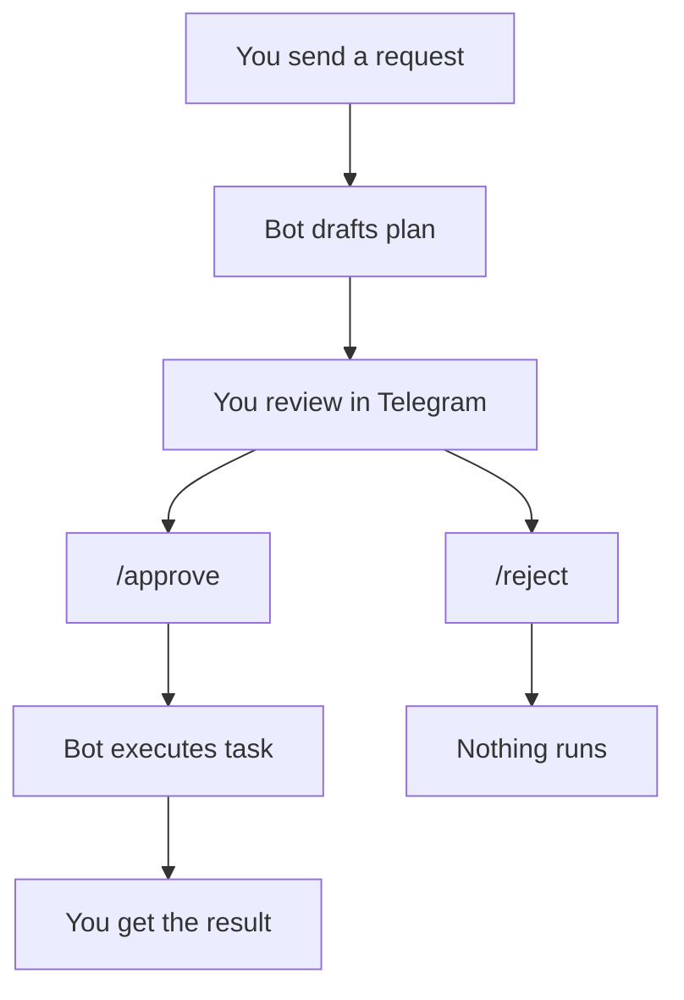

# Telegram Agent Bot

Talk to Claude Code or Codex from Telegram.

This bot lets you:

- ask for coding help from Telegram
- review a plan before anything runs
- upload files and get files back
- add skills and credentials when needed

You do **not** need to set up a database or choose a storage backend for normal
use. The standard setup is one guided script.

**Repo:** [github.com/privacynow/octopus](https://github.com/privacynow/octopus)

## What You Need

- Docker and Docker Compose
- a Telegram bot token from `@BotFather`
- one provider: `claude` or `codex`
- your Telegram user ID for `BOT_ALLOWED_USERS`

## First-Time Setup

1. **Clone the repo**

   ```bash
   git clone git@github.com:privacynow/octopus.git ~/telegram-agent-bot
   cd ~/telegram-agent-bot
   ```

2. **Create `.env.bot`**

   Minimal example:

   ```bash
   TELEGRAM_BOT_TOKEN=<from @BotFather>
   BOT_PROVIDER=claude
   BOT_ALLOWED_USERS=123456789
   ```

   `BOT_ALLOWED_USERS` should be your own Telegram user ID so the bot starts in
   a simple private mode.

3. **Run the guided setup**

   ```bash
   ./scripts/guided_start.sh
   ```

   The script builds what it needs, walks you through provider login if needed,
   and starts the bot.

4. **Message the bot in Telegram**

   Start with `/start`, then send a normal request such as:

   > Review this diff and suggest a safer refactor.

## Day-To-Day Use

The bot is designed to feel simple from Telegram:

- send a normal message to ask for work
- turn approval on if you want to review a plan first
- upload files when you want the agent to inspect them
- use `/cancel` if you want to stop the current request

After a `git pull`, run `./scripts/guided_start.sh` again. It will rebuild and
restart the bot if needed.

## Using the Bot

Send a normal message:

> Review this diff and suggest a safer refactor.

Upload files and ask:

> Summarize these logs and tell me what broke.

### Review before execution

Turn on approval mode and the bot shows you a plan before doing anything.



Use `/approval on` to enable this. Use `/approve` or `/reject` (or the inline
buttons) to respond.

### Work with files

Upload logs, screenshots, or documents alongside your message. The bot passes
them to the agent and can send files back when done.

Use `/send <path>` to retrieve any file the agent created.

### Use skills

Skills extend the bot with domain knowledge, credentials, and integrations.

- `/skills` shows active skills in the current chat
- `/skills list` shows all available skills and whether they are active or need setup
- `/skills add <name>` activates a capability
- `/skills setup <name>` captures credentials when required
- `/skills info <name>` shows the resolved tier and compatibility

If a skill would make the composed prompt too large, the bot warns you first.

### Compact mode for mobile

Long responses get summarized automatically when compact mode is on. Use `/raw`
to see the full output whenever you need it.

## Most Useful Commands

| Command | What it does |
|---|---|
| `/start` | Show the main help and chat controls |
| `/help` | Show help |
| `/approval on\|off\|status` | Review plans before execution |
| `/approve` | Approve the current pending plan |
| `/reject` | Reject the current pending plan |
| `/cancel` | Stop the current request or pending action |
| `/send <path>` | Retrieve a file the agent created |
| `/skills` | See active skills |
| `/skills list` | See available skills |
| `/skills add <name>` | Activate a skill |
| `/skills setup <name>` | Configure a skill when prompted |
| `/settings` | Open chat settings |
| `/session` | Show current session details |
| `/doctor` | Run the bot health check |

## Troubleshooting

### Provider not authenticated or unavailable

If startup tells you to run `./scripts/provider_login.sh`, do that once and
then run `./scripts/guided_start.sh` again.

The login script will walk you through the right sign-in flow for your
provider.

If you want the bot to check itself from Telegram, use `/doctor`.

If a technical helper wants to run the full health check locally, use:

```bash
docker compose --profile bot --env-file .env.bot run --rm bot python -m app.main --doctor
```

### The bot still will not start

Try these in order:

1. Run `./scripts/guided_start.sh` again
2. If it asks for provider login, complete that step
3. Run `/doctor` in Telegram or the full app health command above

### `claude` or `codex` not found

Run `./scripts/guided_start.sh` again. It will rebuild the bot image if needed.

### Polling conflict

Telegram allows a single active polling connection per bot token. If you see
`Conflict: terminated by other getUpdates request`, another process is already
using that token. Stop it first, then start the current instance.

## Want The Technical Details?

For deeper details, use:

- [docs/ARCHITECTURE.md](docs/ARCHITECTURE.md): runtime, storage, bootstrap, and testing contracts
- [docs/plan.md](docs/plan.md): product definition, roadmap, and design decisions
- [docs/status.md](docs/status.md): current shipped state and progress
