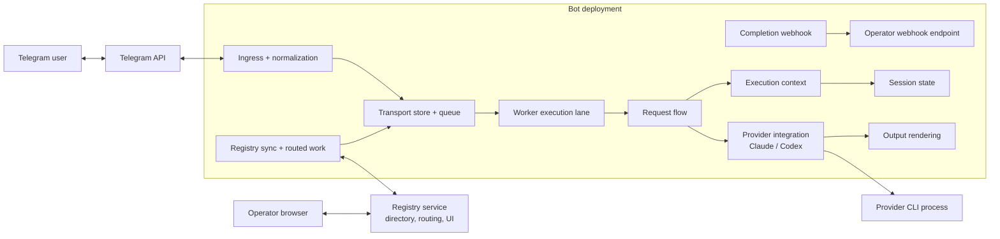
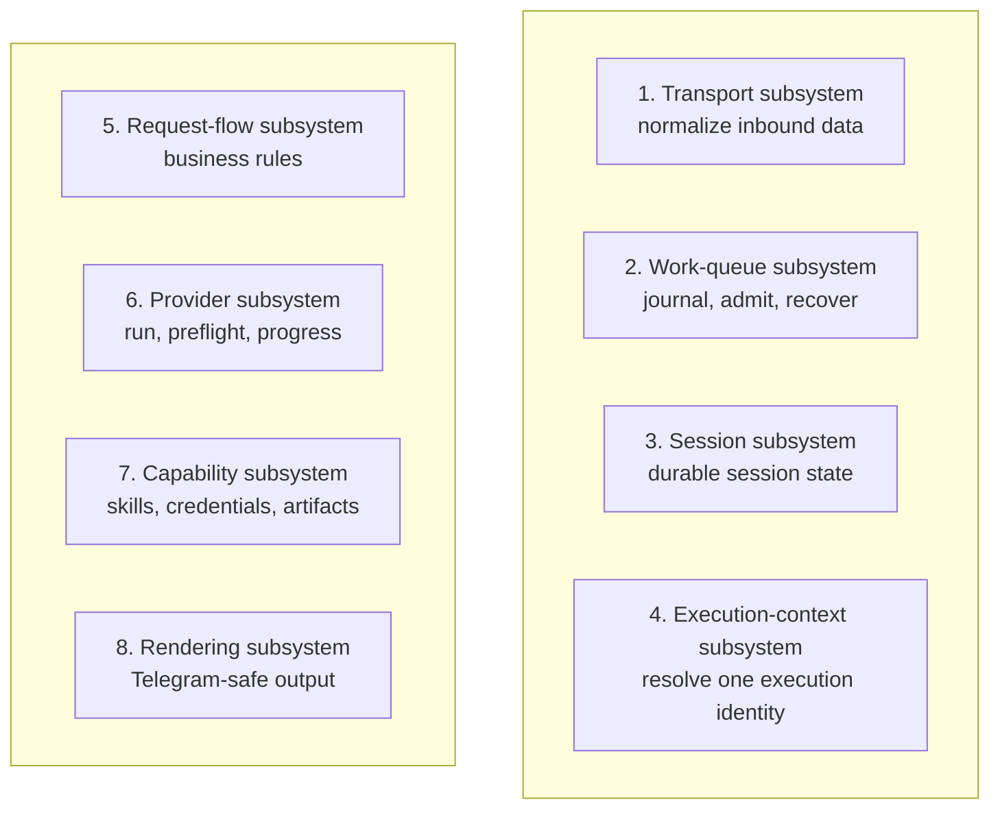
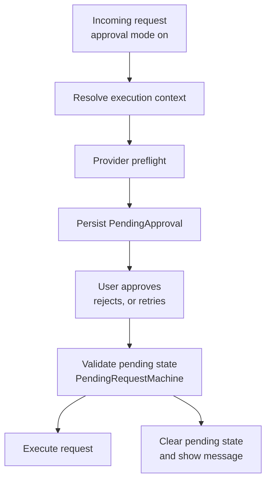
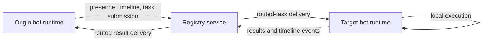
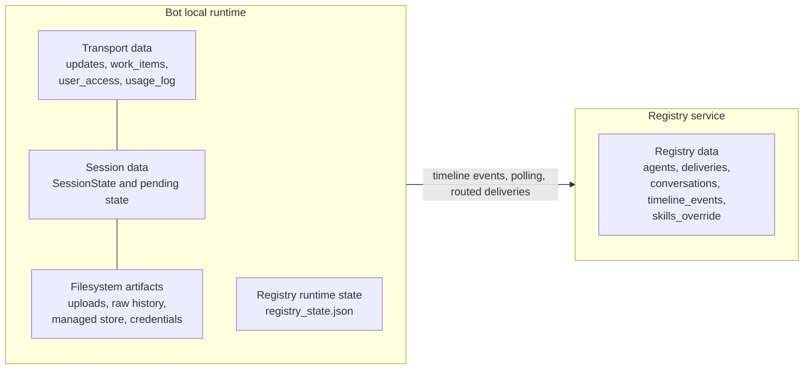
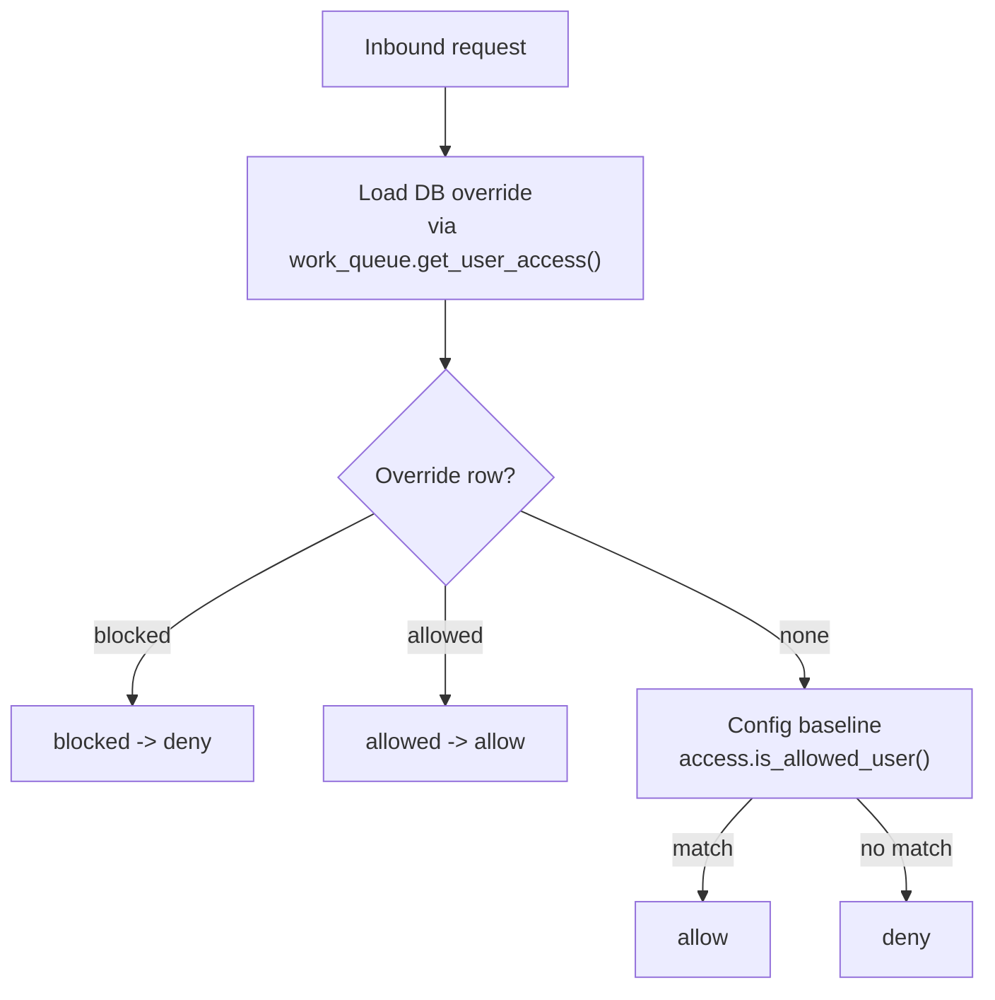
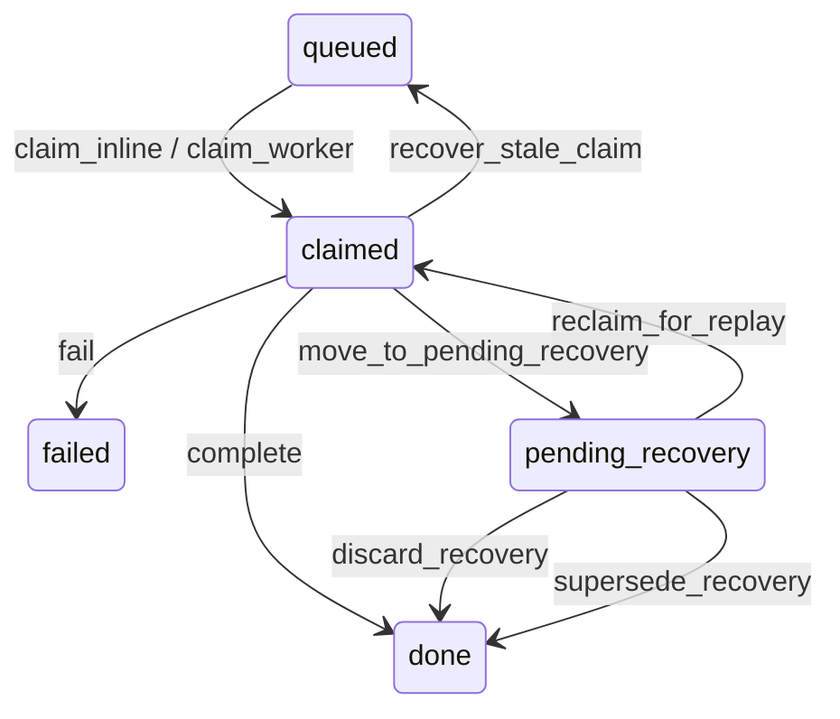

# Architecture

This document explains the current system shape: the main subsystems and
components, the data flows between them, the interfaces and implementations in
play, and the runtime contracts the code must preserve. It is architecture,
not a changelog. Current implementation status
lives in [status.md](status.md). For setup and day-to-day use, start with
[README.md](../README.md).

Current shipped baseline: **Phase 20 is complete and Phase 21 runtime
hardening is in progress**. The product now includes the multi-agent registry
surfaces while execution still stays bot-local per bot deployment. The normal
operator path remains Local Runtime with SQLite and `BOT_DATABASE_URL` unset.
Postgres is a supported alternate backend for the same runtime contract when
`BOT_DATABASE_URL` is set. The registry service has its own backend interface
and selector: SQLite by default via `REGISTRY_DB_PATH`, or Postgres via
`REGISTRY_DATABASE_URL`.

Shared Runtime is no longer just design intent. The runtime contract is now
shipped in code: surface-neutral durable identity keys
(`conversation_key`, `event_id`, `actor_key`), persist-first ingress for
worker-owned interactions, semantic `InboundAction`, durable cancel,
queue-first admission (`duplicate` / `admitted` / `queued`), and lease-based
stale recovery are all part of the current bot runtime. Shared Runtime
observability is also now part of the shipped contract: queue summary and
worker liveness live in the transport store, one canonical runtime-health
report is projected to `/doctor`, CLI `--doctor`, registry heartbeat
mirroring, and the registry UI, and the registry never queries the bot
transport DB directly. What is still not the default operator path is Shared
Runtime itself. Local Runtime is still the simpler default. The reference
Shared Runtime deployment shape is now explicit:
one `BOT_PROCESS_ROLE=webhook` ingress process plus one or more
`BOT_PROCESS_ROLE=worker` processes, usually started through
`infra/compose/docker-compose.shared.yml` or
`./scripts/app/shared_start.sh`.

If you only remember four things, remember these:

- worker-owned interactions are admitted durably and executed by the worker
- credential-setup replies stay inline and off-queue
- one resolved execution context owns execution-scope truth for each request
- the registry is a control plane for visibility, delivery, and coordination;
  execution still happens inside each bot

Quick orientation:

- **Runtime matrix:** Local Runtime with SQLite is the default. Local Runtime
  with Postgres is supported. Shared Runtime semantics are shipped for both
  backends, and the split-role deployment path now exists as a separate
  operator flow.
- **Bot backend interface and selector:** `app/runtime_backend.py` chooses the
  session and transport implementations. `storage.py` and `work_queue.py` stay
  backend-neutral.
- **Registry backend interface and selector:**
  `app/registry_service/backend.py` chooses the registry store
  implementation. `app/registry_service/store_base.py` defines the
  control-plane interface and contract.
- **Contract suites:** backend-neutral behavior is pinned by
  `tests/contracts/test_session_store_contract.py`,
  `tests/contracts/test_transport_store_contract.py`, and
  `tests/contracts/test_registry_store_contract.py`.
- **Primary E2E gate:** `tests/e2e/test_compose_flows.py` verifies the main
  Docker operator path.

Terminology used in this document:

- **subsystem** = a major part of the system with a clear job
- **component** = a concrete part inside a subsystem
- **data flow** = how requests, state, or events move between subsystems
- **interface** = the API shape other code depends on
- **implementation** = a concrete SQLite, Postgres, Telegram, or provider-specific realization
- **contract** = the behavior and invariants that must remain true
- **boundary** = used only when the ownership line between responsibilities is the important point
- **seam** = used only when emphasizing a deliberate replacement point for testing or backend swapping

The default language in this document is **subsystems, components, data
flows, interfaces, implementations, and contracts**. Terms like
**boundary**, **authority**, and **seam** are used only when they are more
precise than the simpler words above.

---

## System context (high-level)

This is the top-level subsystem view: external actors, the bot runtime, the
registry service, and the main data flows between them.

The system has two top-level subsystems:

- the **bot runtime**, which owns durable admission, workflow state,
  provider execution, response rendering, and bot-local persistence
- the **registry service**, which owns bot discovery, routed delivery queues,
  shared conversation visibility, and the operator UI

When the distinction matters, each of those subsystems is also the source of
truth for its own data:

- the bot runtime is the source of truth for execution and bot-local workflow
  state
- the registry service is the source of truth for shared directory, routing,
  and UI-visible coordination state

The registry is a **delivery and visibility plane**, not an execution engine.
Registry mode adds coordination without changing where code actually runs.

### Runtime matrix

- **Local Runtime + SQLite**
  - default shipped operator path
  - bot runtime uses `sessions.db` and `transport.db`
  - registry service uses `REGISTRY_DB_PATH` unless configured otherwise
- **Local Runtime + Postgres**
  - supported alternate backend for the same contracts
  - bot runtime uses `BOT_DATABASE_URL`
  - registry service uses `REGISTRY_DATABASE_URL`
- **Shared Runtime + SQLite**
  - shipped runtime contract
  - requires webhook ingress
  - same-host only: all processes must share one local `BOT_DATA_DIR`
  - reference deployment uses one webhook service plus scaled worker services
- **Shared Runtime + Postgres**
  - shipped runtime contract over `BOT_DATABASE_URL`
  - requires webhook ingress
  - reference deployment uses the same split-role shape with Postgres-backed
    transport/session state
  - bot-local files such as provider auth, uploads, and local artifacts still
    need an intentional deployment layout

### Registry mode and degraded mode

Operating modes:

- `BOT_AGENT_MODE=registry`
  - bot enrolls, heartbeats, polls routed deliveries, and mirrors timeline
    state to the registry
- `BOT_AGENT_MODE=standalone`
  - explicit single-bot mode with no registry participation

Registry connectivity resolves to one truthful state:

- `connected`
  - discovery, delegation, and registry UI sync are working
- `degraded`
  - registry mode is configured, but the registry is currently unavailable
  - Telegram execution continues through the normal bot-local worker path
  - discovery and delegation are unavailable until connectivity returns
- `standalone`
  - registry participation is intentionally disabled

Operator surfaces must tell the truth about that state. `/doctor`, startup
output, logs, and the registry UI must never imply that delegation or shared
visibility are healthy when the runtime is degraded.

## Subsystems and Ownership

The runtime is easiest to reason about as eight core subsystems. Each one owns
a kind of decision and exposes a small set of interfaces to the rest of the
system. Code should not skip across those responsibility lines.

### 1. Transport subsystem

**Owner**

- normalize transport-shaped input into project-owned inbound types before
  business logic runs

**Main modules**

- `app/transport.py`
- `app/transports/`

**Owns**

- `InboundMessage`, `InboundCommand`, `InboundCallback`, and `InboundAction`
- `serialize_inbound()` / `deserialize_inbound()`
- `InboundEnvelope`, `ConversationIO`, `EditableMessageHandle`, and
  transport capability contracts
- the mapping from a `conversation_ref` to the right interaction surface

**Does not own**

- business-rule decisions
- durable queue semantics
- approval or retry logic

**Key guarantees**

- business logic should not depend on raw Telegram payload structure when a
  normalized type exists
- serialized inbound payload JSON is a stable runtime contract across the
  supported backends
- worker-owned non-message interactions normalize to semantic actions before
  worker dispatch; the worker should not depend on Telegram command names or
  callback payload syntax
- Telegram numeric IDs are edge-local conveniences for PTB calls; durable
  payloads and stores use prefixed text keys instead
- worker-owned message/action ingress and worker-owned outbound output already
  use the project-owned transport interfaces
- some inline command and callback entrypoints still have PTB-direct behavior;
  that limitation is explicit, not hidden

### 2. Work-queue subsystem

**Owner**

- durable admission, claiming, idempotency, cancel, and crash recovery for
  worker-owned interactions

**Main modules**

- `app/work_queue.py`
- `app/worker.py`
- `app/workflows/transport_recovery.py`
- `app/workflows/results.py`

**Owns**

- `event_id` journaling and surface-neutral durable identity keys
- work-item lifecycle (`queued`, `claimed`, `pending_recovery`, `done`,
  `failed`)
- fresh-vs-recovery dispatch routing
- stale-claim recovery and pending-recovery replay/discard/supersede
- transport-scoped user overrides and usage-log persistence

**Does not own**

- session mutation
- execution-context resolution
- provider invocation details
- rendering wording

**Key guarantees**

- duplicate `event_id` delivery is journaled idempotently, not reprocessed
- worker-owned fresh work is admitted durably and atomically
- fresh admission uses the durable contract `duplicate`, `admitted`, or
  `queued`; queueing is acceptance, not reject-and-redeliver fallback
- multiple fresh queued worker-owned items may coexist per
  conversation key and drain in FIFO order
- at most one fresh claimed worker-owned item may exist per
  conversation key at a time
- stale claimed work is recovered by lease age, not by foreign worker ID
- stale non-cancelled work re-enters through replay/discard notice flow; it
  does not auto-rerun
- queued fresh work may be cancelled before claim through the queue; claimed
  work is cancelled cooperatively through the worker-owned cancel bridge
- `app/work_queue.py` is the backend-neutral owner across SQLite and Postgres

### 3. Session subsystem

**Owner**

- durable, conversation-scoped runtime state

**Main modules**

- `app/session_state.py`
- `app/storage.py`

**Owns**

- `SessionState`
- approval mode
- active skills and role
- project binding, file policy, model-profile override, compact-mode override
- pending approval / retry state
- awaiting credential setup state
- conversation-keyed session persistence and actor-keyed pending identities

**Does not own**

- authorization policy
- provider execution
- uploads and filesystem artifacts
- raw provider output

**Key guarantees**

- orchestration operates on typed session objects, not raw dicts
- project/settings mutation must flow through the typed session interface
- changing project or file policy resets provider-local state and clears stale
  pending workflow state
- trust tier is resolved per request, not stored here as the source of truth

### 4. Execution-context subsystem

**Owner**

- one resolved execution identity per request

**Main module**

- `app/execution_context.py`

**Owns**

- resolved working directory, allowed roots, extra dirs, file policy,
  project scope, skill set, and effective model
- the context hash used for pending validation and Codex thread reuse
- public/open execution-scope restrictions

**Does not own**

- queue admission
- provider subprocess logic
- transport rendering

**Key guarantees**

- downstream code reads execution-scope fields from
  `ResolvedExecutionContext`, never raw `session.*` or `config.*`
- approval validity, retry validity, provider thread invalidation, and
  `/session` all agree on the same resolved identity
- effective model selection resolves here, not inside providers

### 5. Request-flow subsystem

**Owner**

- business-rule orchestration independent of Telegram transport details

**Main modules**

- `app/request_flow.py`
- `app/approvals.py`
- `app/workflows/pending_request.py`

**Owns**

- credential satisfaction checks
- pending approval and retry freshness classification
- denial formatting and retry permission scope
- transition legality for pending approval / retry workflow

**Does not own**

- transport normalization
- direct Telegram I/O
- provider-local subprocess details

**Key guarantees**

- credential checks use resolved active skills, not raw session state
- `classify_pending_validation()` is the single freshness classifier
- `PendingRequestMachine` owns transition legality; handlers select events and
  render outcomes, but do not define the workflow rules

### 6. Provider subsystem

**Owner**

- provider protocol, subprocess execution, progress mapping, and provider-local
  state updates

**Main modules**

- `app/providers/base.py`
- `app/providers/claude.py`
- `app/providers/codex.py`

**Owns**

- `Provider` protocol
- `PreflightContext`, `RunContext`, `RunResult`, and `ProgressSink`
- health probes and provider CLI invocation
- mapping raw CLI events to shared progress events

**Does not own**

- session or project resolution
- approval decisions
- skill discovery
- final HTML wording

**Key guarantees**

- providers receive only provider-facing contexts
- providers emit `ProgressEvent` instances rather than Telegram HTML
- reported token/cost fields in `RunResult` are best-effort and may remain zero
  when a CLI does not expose usage metadata

### 7. Capability subsystem

**Owner**

- skills, credentials, managed artifact store, and registry-delivered content

**Main modules**

- `app/skills.py`
- `app/store.py`
- `app/registry.py`
- `app/skill_commands.py`

**Owns**

- skill resolution order
- immutable managed-skill object store and refs
- digest verification for downloaded artifacts
- per-user credential loading at execution time

**Does not own**

- provider invocation
- session persistence
- transport delivery

**Key guarantees**

- skill resolution is deterministic: custom > managed > built-in
- managed objects are immutable and content-addressed
- credentials are loaded only for the request user at execution time

### 8. Rendering subsystem

**Owner**

- adaptation from model output to Telegram-safe user-visible output

**Main modules**

- `app/formatting.py`
- `app/summarize.py`
- `app/progress.py`

**Owns**

- shared progress-event rendering
- Markdown-to-Telegram HTML conversion
- compact mode and progressive disclosure
- raw-response ring buffer and `/raw` export behavior

**Does not own**

- provider command construction
- session or queue mutation
- access-control decisions

**Key guarantees**

- providers never build final display HTML directly
- compact/full response presentation is a rendering concern
- long responses use progressive disclosure against one stable ring-buffer slot
  format

## Main Runtime Flows

This section is the main narrative path through the system. The rest of the
document should elaborate these flows, not restate them from scratch.

### Normal worker-owned interaction

This is the main worker-owned data flow through the bot runtime.

```mermaid
flowchart LR
    U["Telegram update"]
    T["Normalize inbound data"]
    A["Check access<br/>and trust tier"]
    Q["Journal update<br/>and admit or queue work"]
    W["Worker claims work item"]
    X["Resolve execution context"]
    R["Apply request rules<br/>credentials, pending state"]
    P["Run provider<br/>or preflight"]
    O["Render and send output"]
    S["Persist session<br/>and work-item state"]

    U --> T --> A --> Q --> W --> X --> R --> P --> O --> S
```

Execution order in plain language:

1. normalize the inbound update
2. authorize the user and resolve trust tier
3. handle credential-setup replies inline when setup state owns the next
   message
4. otherwise journal the update and atomically admit or queue fresh
   worker-owned work
5. return promptly from the ingress handler or surface adapter; the worker
   later claims runnable work
6. load typed session state in the worker-owned path
7. resolve the execution context
8. apply business rules using the resolved context
9. build provider-facing context and invoke the provider
10. render transport-safe output, persist session and delivery state, save raw
    response history, and deliver any directed artifacts

The process boundary depends on runtime mode, but the durable contract is the
same:

- in **Local Runtime**, ingress and worker commonly share one process
- in **Shared Runtime**, webhook ingress persists and returns promptly while
  worker execution may run in the same or a different process

### Approval and retry

Approval and retry are the same workflow family: persist pending state, then
validate that state against the current execution identity before executing.

Rules that must stay true:

- pending freshness is classified in one place
- stored `trust_tier` must be used when recomputing pending validity
- retry adds denial-derived permission scope; it does not invent a second
  workflow system

### Registry and delegation

Registry mode adds coordination, not remote execution.

Delegation flow in practice:

- discovery finds candidate specialist bots in the registry
- the origin bot proposes a delegation plan and persists `PendingDelegation`
- user approval or cancellation is handled at the origin surface
- approved child tasks are submitted through the registry
- target bots execute child tasks locally through their own normal worker path
- routed results are delivered back to the origin bot and merged into the
  parent conversation

### Recovery summary

Transport recovery is specialized enough to live mostly in the appendix, but
the narrative contract is simple:

- stale claimed items are requeued as `dispatch_mode='recovery'`
- stale claimed items are detected by lease age, not by foreign worker ID
- recovery work must surface replay/discard decisions to the user before
  pretending execution succeeded
- replay/discard/supersede are explicit workflow outcomes, not implicit
  cleanup

## State and Storage Model

The system has four durable state families: bot-local transport state,
bot-local session state, filesystem artifacts, and registry control-plane
state.

This diagram is the durable-state map for the shipped system.

### Durable subsystems and stores

**Bot runtime**

- **transport store**
  - journaled inbound events
  - work-item state machine
  - queued-cancel and recovery state
  - surface-neutral durable identity keys (`conversation_key`, `event_id`,
    `actor_key`)
  - actor-keyed user-access overrides
  - per-run usage history
- **session store**
  - typed conversation-scoped session state
  - pending approval / retry / setup state
  - project / model / policy / compact-mode preferences
- **filesystem**
  - uploads per conversation
  - raw-response ring buffer
  - managed skill objects and refs
  - encrypted credentials
  - staged helper scripts and artifacts

**Registry service**

- enrolled bot directory
- delivery queues for routed tasks and surface actions
- shared conversations and timeline events
- global skills overrides
- UI-facing search, export, and usage-summary views

### Backend interfaces and implementations

Bot runtime backends:

- selected by `app/runtime_backend.py`
- SQLite default when `BOT_DATABASE_URL` is unset
- Postgres alternate when `BOT_DATABASE_URL` is set
- `app/storage.py` and `app/work_queue.py` are the backend-neutral facades

Registry backends:

- selected by `app/registry_service/backend.py`
- SQLite default via `REGISTRY_DB_PATH`
- Postgres alternate via `REGISTRY_DATABASE_URL`
- `app/registry_service/store_base.py` defines the backend-neutral interface

### Why this split exists

- transport state and session state have different lifecycles and failure
  modes
- files and artifacts benefit from filesystem semantics and direct provider
  access
- registry state is a control-plane concern and must stay separate from
  bot-local execution state
- the split lets the bot keep executing locally even when registry
  connectivity degrades

### Response history and progressive disclosure

The raw-response ring buffer is the single source of truth for `/raw` and
expand/collapse flows.

- `save_raw()` stores prompt + raw text in numbered slots
- `load_raw()` and `load_raw_by_slot()` resolve the latest or specific slot
- slots rotate FIFO; expired slots return “no longer available”
- rendered compact/full variants are derived views, not separate durable state

## Access and Safety Model

### User authorization

Only allowed users may interact. When open mode is enabled, users resolve to
`trusted` or `public`.

Authorization applies two layers in order:

1. a DB override fetched at the handler / transport layer
2. the config baseline evaluated by `app/access.py`

`app/access.py` must stay a pure policy module. It must not import storage,
SQLite, Postgres, or backend selectors.

### Admin authorization

Admin access is narrower than general allowed-user access. Admin-only surfaces
manage store-backed skills and broader state inspection.

### Approval mode

Approval mode determines whether execution requires preflight plan review
before the provider is invoked.

### File, project, and model scope

Allowed roots and working scope derive from the resolved execution context:

- resolved working directory
- resolved extra dirs
- per-conversation upload dir
- denial-derived retry dirs

Those roots must be computed from `ResolvedExecutionContext`, not from raw
config or raw session fields scattered across handlers.

### Public-trust enforcement

Two layers enforce public/trusted behavior:

- **execution scope**
  - forced inspect policy
  - forced public working dir
  - stripped extra dirs
  - stripped skills
  - disabled project binding
- **command availability**
  - disabled skill management for public users
  - restricted project and `/send` behavior
  - restricted model-profile surface

The execution-scope layer is stronger. Once the context is resolved, those
restrictions flow through provider context, pending validation, allowed roots,
artifact delivery, and rendering automatically.

## Stable Contracts

This section is intentionally normative. These are the surfaces the rest of
the document exists to explain.

### Interfaces That Must Stay Stable

The following contracts should change only deliberately:

- `InboundAction`
- `SessionState`
- `PendingApproval` / `PendingRetry` (including stored `trust_tier`)
- `ResolvedExecutionContext`
- `PreflightContext` / `RunContext`
- `Provider` protocol and `RunResult`
- `ProgressEvent` family and `render()` contract
- serialized inbound payload JSON shape used by the durable work queue
- `check_credential_satisfaction` signature (resolved active skills)
- pending-validation contract built on `classify_pending_validation()`
- work-item state machine and `TransportRecoveryMachine` events / guards
- transport delivery semantics (`event_id` handling, `conversation_key` /
  `actor_key` identity rules, `duplicate|admitted|queued` admission rules,
  queued-cancel rules, lease-based recovery routing)
- managed store layout (`objects/`, `refs/`, `custom/`)
- registry store contract in `app/registry_service/store_base.py`
- ring-buffer slot format used by expand/collapse callback data

Changing these should trigger both code review and invariant-test updates.

### Execution Order Constraints

If you rework the runtime, preserve this order:

1. normalize transport
2. journal updates and enforce transport idempotency
3. handle credential-setup replies inline and off-queue when setup state owns
   the next message
4. atomically admit or queue fresh worker-owned work
5. claim runnable work from the worker-owned execution lane
6. load typed session state
7. resolve trust tier and execution context
8. apply business rules using the resolved context
9. build provider-facing context from the resolved context
10. invoke provider and map raw events to shared progress events
11. persist session and durable delivery state
12. render transport-safe output, save raw history, and deliver artifacts

The single most important architectural rule: once
`resolve_execution_context()` produces a `ResolvedExecutionContext`, all
downstream execution-scope reads come from that object. Never from raw
`session.*` or `config.*` for working directory, file policy, active skills,
extra dirs, project binding, or effective model.

### Backend parity and contract testing

The codebase has three backend-neutral persistence interfaces:

- **session store**
  - facade: `app/storage.py`
  - backends: `storage_sqlite.py`, `storage_postgres.py`
  - contract suite: `tests/contracts/test_session_store_contract.py`
- **transport store**
  - facade: `app/work_queue.py`
  - backends: `work_queue_sqlite.py`, `work_queue_postgres.py`
  - contract suite: `tests/contracts/test_transport_store_contract.py`
- **registry store**
  - contract: `app/registry_service/store_base.py`
  - backends: `RegistrySQLiteStore`, `RegistryPostgresStore`
  - contract suite: `tests/contracts/test_registry_store_contract.py`

New persistence behavior belongs behind these interfaces. New facade or
contract methods must land with both backend implementations and matching
contract-test coverage in the same change.

## Reference Appendix

The sections below are reference material. They are useful, but they are not
the primary reading path.

### Key Data Types

**SessionState**

- typed runtime representation of a conversation session
- owns provider-local state, approval mode, active skills, project binding,
  model/profile overrides, compact mode, and pending/setup workflow state

**PendingApproval / PendingRetry**

- carry original requester identity, prompt, image list, context hash,
  creation time, and stored `trust_tier`
- `PendingRetry` additionally carries denial records used to derive retry
  permission scope

**ResolvedExecutionContext**

- single resolved execution identity
- source of context hash, provider-facing working dir, effective model, file
  policy, allowed roots, and public/trusted execution-scope restrictions

**Provider contexts**

- `PreflightContext`: provider-facing planning input
- `RunContext`: provider-facing execution input
- intentionally narrower than session state

**RunResult**

- provider result carrying text, status flags, provider-state updates, denial
  records, and best-effort reported token/cost fields

**ProgressEvent**

- frozen event family rendered by the shared `progress.py` renderer

### Transport and simulator architecture

The current transport architecture deliberately separates three concerns:

1. inbound normalization
2. durable admission and worker execution
3. handler-owned Telegram UI behavior

That means the simulator is best understood as a **handler-level runtime
harness**, not a transport-port simulator.

Current simulator contract (`tests/support/conversation_simulator.py`):

- runs the real queue and worker loop
- injects via `handle_message()` / `cmd_*` directly
- exposes one ordered text-output log
- does not include markup-only edits
- does not yet inject callbacks as a first-class simulator surface
- does not yet drive all Telegram ingress through `InboundEnvelope`
  end-to-end; plain-message production admission does, but the simulator still
  enters mostly through handler-owned entrypoints
- does not yet model the split-role Shared Runtime deployment shape; it is an
  in-process runtime harness, not a multi-process orchestration harness

The remaining gap is explicit:

- unify more handler-owned outbound messaging behind `ConversationIO`
- add first-class callback injection to the simulator
- optionally move from direct handler injection to transport-level delivery
  without making PTB internals the main contract

### Transport workflow detail

`TransportRecoveryMachine` owns transition legality. Repository/store code owns
SQL, compare-and-update, races, and repository-only outcomes such as
`already_handled`.

This is the work-item lifecycle inside the transport store.

Runtime invariants:

- `work_items.state` must be one of `queued`, `claimed`, `pending_recovery`,
  `done`, `failed`
- `dispatch_mode` must be `fresh` or `recovery`
- `claimed` rows must have `worker_id` and `claimed_at`
- at most one `claimed` row may exist per conversation key
- multiple fresh `queued` rows may exist per conversation key
- fresh queued rows must drain in FIFO order
- stale claims must requeue as `dispatch_mode='recovery'`
- stale claims must be recovered by lease age, not by foreign worker identity
- queued fresh cancel must terminate the item visibly as cancelled; it must not
  silently disappear

### Testing Architecture

The suite is organized around contracts, not just features.

**Four-layer model**

1. **Pure or owner suites**
   - workflow machines, execution context, request-flow rules, providers,
     formatting, progress, and other backend-neutral contracts
2. **In-process integration**
   - real handlers, real request flow, fake Telegram doubles, fake providers,
     and real local persistence
3. **Postgres bootstrap and repository integration**
   - real Postgres, real schema bootstrap/update/doctor, real pooling
4. **E2E**
   - Compose-based operator-path validation in
     `tests/e2e/test_compose_flows.py`

Current E2E emphasis is still the primary operator path and registry/UI flows,
with added Shared Runtime orchestration smoke for split roles. Full Shared
Runtime durability, crash, and recovery proof remains separate E2E work.

**Postgres harness rules**

- Docker is required
- each pytest-xdist worker gets an isolated Postgres test DB
- schema is applied once per worker
- runtime tables are truncated between tests
- the harness never mutates dev, staging, or production databases

### Health, admin, and provider notes

**doctor.py**

- shared health orchestration for Telegram `/doctor`, CLI `--doctor`, and
  registry mirroring
- covers config validation, provider health, managed-store health, stale
  session scanning, public-mode diagnostics, and transport diagnostics
- in Shared Runtime, the primary health source is the transport store:
  queue snapshots are derived from `work_items`, and worker liveness comes
  from durable `worker_heartbeats`
- provider runtime checks are role-aware: `BOT_PROCESS_ROLE=webhook`
  validates ingress health but does not require provider auth to report
  the process healthy
- the canonical `RuntimeHealthReport` is projected into the registry
  heartbeat when `BOT_AGENT_MODE=registry` is active; the registry UI
  renders mirrored health from that report instead of computing a second
  health view

**Admin views**

- reporting surfaces over current durable state such as `/admin sessions` and
  stale pending/setup visibility

**Provider notes**

- Claude is session-oriented and maps `stream-json` events inline
- Codex is thread-oriented and thread reuse depends on context hash plus boot
  ID
- providers own subprocess invocation and progress mapping, not session
  persistence or approval logic

## Deployment and dependencies

The bot’s Python dependencies live in **`requirements.txt`**. The normal
runtime path is Docker, and the same dependency set also supports host-side
debugging and tests.

- **Current runtime contract:** Local Runtime remains the default operator
  path. Shared Runtime is also a shipped runtime mode when
  `BOT_RUNTIME_MODE=shared` and `BOT_MODE=webhook` are set. Leave
  `BOT_DATABASE_URL` unset for SQLite (default), or set it to a Postgres DSN
  to use Postgres as the bot-runtime backend for the same product/runtime
  contract. The app validates runtime/backend compatibility at startup.
- **Process roles:** `BOT_PROCESS_ROLE=all|webhook|worker` selects whether one
  process runs the full Local Runtime shape (`all`), webhook ingress only
  (`webhook`), or worker execution only (`worker`). Non-`all` roles are a
  Shared Runtime deployment feature and require `BOT_RUNTIME_MODE=shared`.
- **Registry control-plane backend:** the registry service is separate from the
  bot runtime. Use `REGISTRY_DB_PATH` for the default SQLite control-plane
  store, or `REGISTRY_DATABASE_URL` for the Postgres control-plane store.
- **Optional Postgres workflows:** explicit repo-owned DB commands
  (`scripts/db/db_bootstrap.sh`, `scripts/db/db_update.sh`,
  `scripts/db/db_doctor.sh`) prepare and verify Postgres before the app starts
  when a Postgres DSN is configured. `./scripts/db/dev_up_postgres.sh` remains
  the fast local operator path for standing up the alternate Postgres backend.
- **Environment identity:** each bot environment has its own database, config,
  Telegram token, and app instance identity. Side-by-side dev/staging
  environments use separate databases regardless of backend choice.
- **Responsibilities are explicit:**
  1. infrastructure provides the runtime substrate for the selected mode
  2. repo-owned DB/runtime commands apply schema and validate compatibility
  3. the app validates and runs; it does not create the DB, role, or schema at
     startup
- **Primary operational model:** Dockerized bot is the main operator path.
  `./scripts/app/guided_start.sh` is the main zero-to-running path for SQLite
  Local Runtime. The canonical Compose entrypoints live under
  `infra/compose/docker-compose.yml` and `infra/compose/docker-compose.e2e.yml`.
- **Shared Runtime operator path:** `./scripts/app/shared_start.sh` starts the
  reference split-role deployment over
  `infra/compose/docker-compose.shared.yml`: one `bot-webhook` service and a
  scalable `bot-worker` service using the same image and durable backend.
- **SQLite Shared Runtime constraint:** SQLite-backed Shared Runtime is
  same-host only because all processes must share one local `BOT_DATA_DIR`.
  That is a deployment rule, not an application-level validation check.
- **Registry scope in Shared Runtime:** when `BOT_AGENT_MODE=registry` is set,
  the singleton `bot-webhook` / `BOT_PROCESS_ROLE=webhook` process owns
  registry sync, delivery polling, and mirrored runtime-health publication.
  `BOT_PROCESS_ROLE=worker` processes never heartbeat the registry directly.
  The registry remains a mirrored control-plane view; it does not read the bot
  transport DB directly.
- **Supported bot image:** the supported Docker path uses a real
  provider-enabled image built from `infra/docker/Dockerfile.bot`.
  `./scripts/provider/build_bot_image.sh` selects the provider-specific target
  from `BOT_PROVIDER`. A stub-provider image exists only for test/dev smoke.
- **Provider authentication contract:** provider auth state is not baked into
  the image. Login runs inside the same bot image, persists in a dedicated
  Docker volume mounted at `/home/bot`, and startup plus `/doctor` validate
  runtime/auth health before treating worker or all-in-one roles as ready.
  Webhook-only role still reports Shared Runtime queue/worker health, but
  does not fail health solely on missing provider runtime auth.
- **Host-run bot:** still supported as a secondary fallback/debug path with the
  same Local Runtime contract above the storage interfaces.
- **Later environments:** staging and production may choose either Local
  Runtime or Shared Runtime depending on the deployment tier they want to run;
  Local Runtime remains the simpler default.

See [README.md](../README.md) for the operator path, and [status.md](status.md)
for current shipped-state truth.
