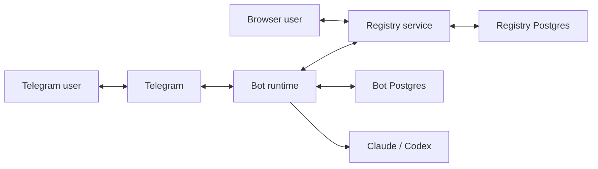

# Architecture

This document describes the current shipped Octopus codebase in this repo.

Octopus is a Python/FastAPI based multi-agent platform. Bot runtimes connect to
a shared registry. Users can interact through Telegram or through
registry-origin browser conversations. Operators use the registry UI to inspect
agents, conversations, routed work, protocol runs, skills/capabilities,
guidance, routing, usage, and operational status.

The Java rebuild plan in `plan_java.md` is not this runtime.

## Current Package Boundaries

| Package | Owns | Deploys as |
| --- | --- | --- |
| `octopus_sdk/` | Shared contracts, protocol models/engine, registry clients, runtime workflows, skill/guidance models, conversation/workflow helpers. | Embedded dependency. |
| `octopus_registry/` | Registry FastAPI app, registry store, protocol store/runtime, management bridge, WebSocket/realtime, UI assets. | Registry service container. |
| `app/` | Bot runtime composition, Telegram channel, provider integration, local Postgres-backed runtime state, CLI/deploy wiring. | Bot container(s) and host CLI. |

Import direction:

```text
app/              -> octopus_sdk/
octopus_registry/ -> octopus_sdk/
octopus_sdk/      -> neither app nor registry
```

`app/` and `octopus_registry/` must not import each other.

## Deployment Topology

`./octopus` manages Docker deployment under `.deploy/`.

Default local topology:



Important distinction:

- Local deployment normally uses one registry stack and one bot stack per bot.
- The logical schema families can be hosted in a shared external Postgres if
  deployment is configured that way, but that is not the default local shape.

## Durable Schema Families

Current durable state is split by responsibility:

| Schema family | Owner | Purpose |
| --- | --- | --- |
| `agent_registry` | Registry | Agents, conversations, routed tasks, events, approvals, protocols, runs, artifacts, routing, usage. |
| `bot_runtime` | Bot runtime | Sessions, updates, work queue, execution state, runtime events. |
| `bot_content` | Bot runtime/content | Skills, guidance, package content, revision state. |
| `bot_credentials` | Bot runtime/credentials | Runtime credential state. |

The product direction is one lineage model:

```text
Conversation
  -> routed work/task
  -> protocol run
  -> stage execution
  -> artifact
  -> approval/action/audit event
```

The current implementation still exposes some backing nouns such as `tasks`
because routed tasks are the execution substrate. The UI should present them as
linked work rather than a separate unrelated application.

## Registry Service

The registry is the control plane.

It owns:

- agent enrollment, heartbeat, status, and deregistration
- conversation storage and event timelines
- browser-origin operator conversations
- routed task lifecycle and result projection
- approval listing
- protocol definitions, templates, versions, runs, stage executions, artifacts,
  transitions, issues, metrics, and exports
- skill/capability catalog and provider guidance management via management
  bridge
- routing policy and routing skill projection
- usage and dashboard summaries
- WebSocket realtime invalidations
- session authentication for the UI

Key files:

- `octopus_registry/server.py`
- `octopus_registry/protocol_store.py`
- `octopus_registry/protocol_http.py`
- `octopus_registry/protocol_runtime.py`
- `octopus_registry/rehearsal.py`
- `octopus_registry/store_postgres.py`
- `octopus_registry/store_shared/`
- `octopus_registry/ui/`

## SDK

The SDK is the shared product contract and runtime library.

It owns:

- protocol document models and validation
- protocol run engine and state decisions
- registry client and protocol service interfaces
- bot runtime ports and workflows
- conversation, delegation, pending approval, execution finalization, skill, and
  guidance workflows
- runtime events, inbound envelopes, sessions, and work queue abstractions

Key files/directories:

- `octopus_sdk/bot_runtime.py`
- `octopus_sdk/protocols/`
- `octopus_sdk/registry/`
- `octopus_sdk/workflows/`
- `octopus_sdk/events.py`
- `octopus_sdk/sessions.py`
- `octopus_sdk/inbound_types.py`

Rules:

- Shared lifecycle and validation rules belong in the SDK.
- Registry UI and Telegram must be peer clients over shared backend operations.
- Do not copy protocol, skill, or guidance logic into a channel adapter.

## Bot Runtime

The bot runtime owns provider execution and channel handling.

It includes:

- Telegram ingress/egress and presentation
- provider integration for Claude/Codex
- runtime session state
- work queue processing
- registry participant implementation
- skill/guidance runtime composition
- direct assignment and delegation continuation
- approval and retry/cancel handling

Key files/directories:

- `app/runtime/`
- `app/channels/telegram/`
- `app/channels/registry/`
- `app/providers/`
- `app/db/`

## Registry UI

The registry UI is currently a vanilla JavaScript single page app served by the
registry.

Current navigation:

| Group | Entries |
| --- | --- |
| Work | Conversations, Runs, Agents |
| Build | Protocols, Capabilities, Guidance |
| Operations | Dashboard, Routing, Usage |

Hidden or linked routes that still exist:

- `/ui/tasks`: routed work detail/list. Opened from conversations, runs, and
  dashboard links.
- `/ui/approvals`: approval list. Opened from dashboard or direct links.
- `/ui/agents/:id`: agent detail.
- `/ui/conversations/:id`: conversation detail.

There is no primary `/ui/templates` or `/ui/gallery` navigation entry.
Templates are handled inside Protocols.

Key UI files:

- `octopus_registry/ui/index.html`
- `octopus_registry/ui/js/app.js`
- `octopus_registry/ui/js/router.js`
- `octopus_registry/ui/js/helpers/ui.js`
- `octopus_registry/ui/js/helpers/kit.js`
- `octopus_registry/ui/js/components/`
- `octopus_registry/ui/css/main.css`

Known UI architecture constraints:

- The SPA has accumulated too much state and presentation logic in large files,
  especially protocol authoring.
- The product direction is shared primitives: one expandable-row grammar, one
  section-tab grammar, one artifact action row, and one progressive protocol
  stage editor grammar.
- Desktop and narrow/mobile behavior must be tested together.
- Safari cache must be hard-refreshed after deploys when verifying UI assets.

## Skills And Capabilities

The UI label is `Capabilities`. The runtime model is still `skills`.

Canonical skill states:

- Catalog
- Available on this bot
- Default for new conversations
- Active in this conversation
- Routing skills

Routing skills are derived from available/runtime-ready skills plus registry
routing policy. They are not a second skill system.

Guidance is not a skill. It is provider baseline policy.

## Protocol Architecture

Protocols are registry-owned definitions and runs.

Current protocol flow:

```text
Protocol definition
  -> draft/published version/template
  -> run
  -> stage execution
  -> routed task
  -> runtime/provider execution
  -> artifact observation/result
  -> protocol engine advancement
```

Important runtime rules:

- `octopus_sdk/protocols/engine.py` evaluates protocol state decisions.
- `octopus_registry/protocol_store.py` persists canonical run state.
- Stage execution dispatch uses routed tasks.
- Telegram and registry UI start/observe runs but do not own protocol state.
- Operator actions are versioned and idempotent registry mutations:
  `retry`, `accept`, `send-back`, `cancel`.
- Protocol realtime updates use registry invalidation topics.

Current authoring rules:

- Standard authors should use the progressive Protocols UI.
- Operator-only internals such as raw stage keys, internal selector plumbing,
  max rounds, timeouts, and custom runtime selection must not appear on the
  standard authoring surface.
- Assignment is stage-owned. Participants/roles provide reusable role identity
  and shared instructions; they are not the primary assignment editor.
- Current validation still requires publishable stages to resolve an
  assignment/selector. The UI may allow incomplete draft stages while the author
  is still building.

## Artifacts

Artifacts are the durable output/input contract between work, protocol stages,
conversations, and runs.

Current product rule:

- Wherever an artifact is referenced, the user should get the same action model:
  preview/open/download/copy path or a clear not-produced/unavailable state.

Current implementation status:

- Artifact metadata and protocol artifact projections exist.
- Task artifact content routes exist.
- Protocol run artifact routes exist.
- Artifact action coverage is still being consolidated across every surface.
  Missing artifact actions are product gaps, not a separate model.

## API Surfaces

Main registry API families:

- agents and heartbeats
- conversations and events
- routed tasks
- approvals
- skills/capabilities management
- guidance management
- protocols, templates, runs, actions, artifacts, timelines, scenarios
- routing policy and routing skills
- usage and dashboard summaries

The checked-in OpenAPI artifact is:

- `docs/registry-openapi.json`

Regenerate/update it when route contracts change.

## Testing And Verification

Use tests that exercise the product path, not direct database writes as the
main proof of behavior.

Relevant test families:

- registry service/API tests
- protocol document/engine/runtime tests
- Telegram protocol tests
- SDK runtime skill tests
- UI contract tests
- Playwright registry UI flows
- live registry smoke tests

Database inspection is allowed for diagnosis. It is not a substitute for UI,
API, or Telegram verification.

## Current Known Gaps

These are known architecture/product issues, not documentation omissions:

- Runs, routed tasks, conversations, and artifacts are still being consolidated
  around a clearer lineage-first UI.
- Some artifact references may not yet expose the full artifact action model.
- Protocol authoring still contains internal complexity and large UI code paths.
- Standard/operator authoring separation exists but must remain guarded by API
  and UI tests.
- Generated/rehearsal/test data must stay hidden from default human surfaces
  and visible through explicit filters.
- The current codebase is monolithic in places. Refactors should consolidate
  around shared primitives and SDK/backend operations, not create parallel
  implementations.
