# Architecture

Octopus is a multi-agent bot platform. Operators deploy bot runtimes that
connect to a shared registry. The registry is the management plane — it
handles enrollment, status, task routing, skill/guidance management, browser
conversations, and an operator dashboard. Bots handle user conversations,
provider execution, and delegation. The SDK defines the contracts between
them.

Three packages, three clean boundaries:

| Package | Owns | Deploys as |
|---------|------|-----------|
| `octopus_registry/` | Management plane — API, store, UI, realtime | Registry service container |
| `octopus_sdk/` | Shared contracts, orchestration, workflow logic | Shared dependency (not deployed alone) |
| `app/` | Telegram bot runtime, providers, Postgres-backed state, and `./octopus` CLI | Bot container(s) + host-side CLI |

Import direction is one-way: `app/` → `octopus_sdk/`; `octopus_registry/` → `octopus_sdk/`.
Neither `app/` nor `octopus_registry/` imports the other. The SDK imports neither.

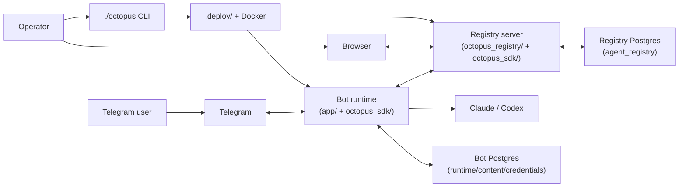

`octopus_sdk/` is a shared library embedded in both Bot and Registry at
build time. It is not a separately deployed system.

Two views matter:

- **Shipped local deployment topology**
  `./octopus` starts one compose project for the registry and one compose
  project per bot. By default each stack gets its own Postgres container and
  its own `OCTOPUS_DATABASE_URL`.
- **Logical platform model**
  the codebase defines four durable schema families — `bot_runtime`,
  `bot_content`, `bot_credentials`, and `agent_registry` — and can host them in
  one external Postgres instance if the deployment points multiple processes at
  the same database. That logical model is useful for contracts and schema
  ownership, but it is not the default local topology.

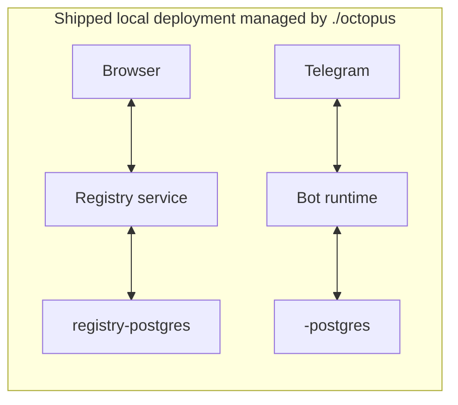

---

## 1. Registry

This section describes the registry as a standalone deployable management
plane. It runs independently of any bot. When bots connect, it manages them.

### What the registry owns

- Agent enrollment, heartbeat, connectivity state, deregistration
- Mirrored runtime-health state, including execution-fault status
- Conversation storage, event timeline, message/action APIs, and browser-origin
  operator messages
- Routed task lifecycle (create, status, result, recipient projection)
- Protocol definition/version storage and protocol run orchestration
- Skill catalog and provider guidance management (via management protocol)
- Skill-derived routing projection and global routing policy
- Operator dashboard and SPA
- WebSocket realtime (events, invalidations, progress)
- Authentication (agent tokens, operator sessions)

### Internal structure

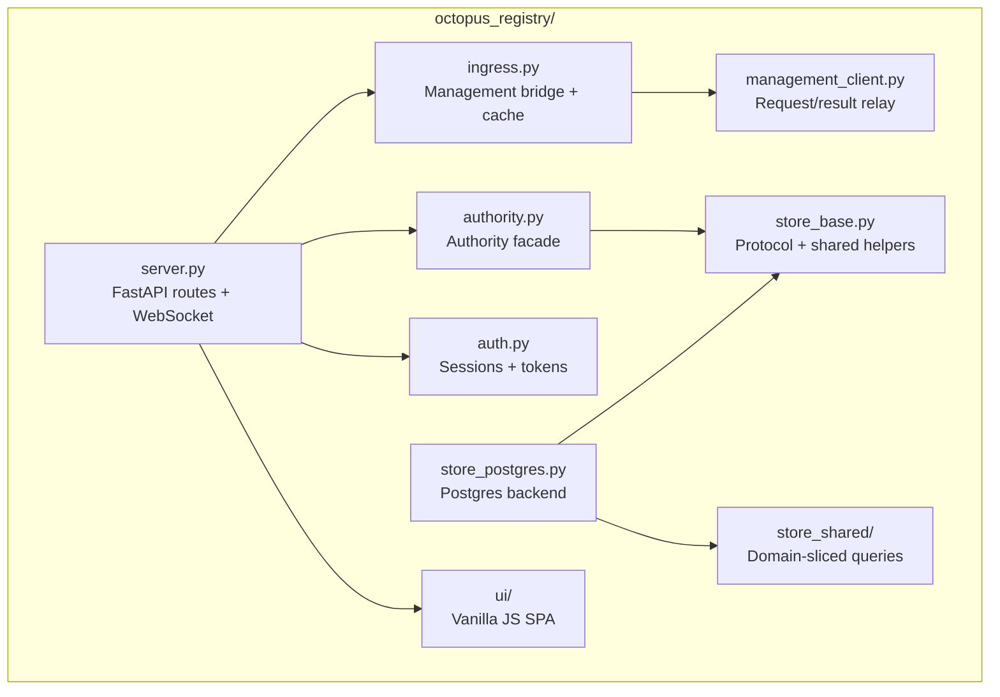

### API surfaces

| Surface | Auth | Description |
|---------|------|-------------|
| Agent API | Agent token | Enroll, register, heartbeat, poll, ack, deregister |
| Resource API | Agent token, operator session, or both (varies per endpoint) | Agents, conversations, tasks, events. Usage and summary are operator-only. |
| Management bridge | Operator session or UI bearer token | Agent-scoped skill/guidance operations via management protocol |
| Protocol API | Operator session or UI write access | Protocol templates, definitions, versions, runs, and run inspection |
| Realtime API | Operator session | WebSocket — events, heartbeats, progress, invalidations |
| Operator SPA | Session cookie | Dashboard, conversations, agents, tasks, approvals, skills, routing, guidance, usage |

All management endpoints are agent-scoped: `/v1/agents/{agent_id}/catalog/skills`,
`/v1/agents/{agent_id}/guidance/{provider}`, etc. No global management endpoints
that assume a single connected bot.

The generated registry OpenAPI artifact is checked in at
`docs/registry-openapi.json` and locked by tests against the live FastAPI app,
so protocol clients do not depend on undocumented route drift.

Protocol definitions and protocol runs are registry-owned control-plane
objects:

- definitions are versioned in `agent_registry`
- runs are persisted in `agent_registry`
- lifecycle decisions are evaluated by `octopus_sdk/protocols/engine.py`
  (`ProtocolRunEngine`) and persisted through one canonical registry applier
  in the Postgres store
- stage execution is dispatched through the existing routed-task/runtime path
- work-stage completion is enforced through protocol control lines plus runtime-reported artifact observations
- operator actions are versioned, idempotent registry mutations over the same
  run state (`cancel`, `retry`, `accept`, `send-back` in the current release)
- built-in protocol templates are seeded by the canonical DB init/bootstrap path
  (`app/db/postgres_init.py` calling `octopus_sdk/protocols/bootstrap.py`), then
  served from the registry database as the runtime/control-plane source of truth
- stage timeout enforcement uses a registry maintenance loop and the same
  canonical applier; it does not depend on receiving a late routed-task result
- the registry maintenance loop emits post-applier protocol invalidations so the
  browser and operator tooling observe the same protocol truth the GET/timeline
  APIs expose
- protocol draft parsing, JSON/YAML export, and draft-vs-published diff use the
  shared SDK document helpers in `octopus_sdk/protocols/`; the registry UI and
  API do not maintain a second protocol text conversion path
- protocol support/admin visibility is exposed through registry-backed issue
  queries for blocked runs, invalid contracts, expired timeouts, and stuck
  leases; the dashboard and protocol workspace consume those control-plane reads
- protocol operational metrics are projected through the canonical summary path;
  the dashboard reads them from registry summary data instead of computing a
  browser-local protocol health model
- transport clients such as Telegram invoke and observe protocol runs, but they
  do not own protocol state or state-machine rules
- `protocol-stage:` routed-task results intentionally short-circuit delegation
  continuation in `app/channels/registry/delivery_transport.py`; the
  authoritative completion path is routed-task result update in the registry,
  followed by protocol engine advancement

For skills, the shared user-facing states are:

- `Catalog`
- `Available on this bot`
- `Default for new conversations`
- `Active in this conversation`

With orthogonal dimensions:

- `Source`: `Core | Store | Custom`
- `Setup`: `Needs setup | Ready`
- `Lifecycle`: draft/review/publish/archive for mutable custom skills

Cross-bot discovery and delegation do not use a second product object called
`capabilities`. They use a derived bot-level routing projection over skills:

- `Routing skills`

A routing skill is a skill that is available on the bot, runtime-ready, and
allowed by registry-owned routing policy. Additional routing filters such as
region, tier, or compliance may exist as policy dimensions, but they do not
replace skill-derived routing and are not presented as skills. Conversation
activation remains session-local and does not by itself change what the bot
advertises for routing.


Custom skills now use one package-aware draft model across clients:

- metadata: `name`, `display_name`, `description`
- instructions: `body`
- setup requirements: `requirements`
- provider extensions: `provider_config`
- supporting artifacts: `files`

The package content is the persisted source of truth. The following fields are
derived on read or lifecycle transitions:

- `validation_problems`
- `publish_ready`
- `runtime_available`
- `has_unpublished_changes`

### Management protocol

When an operator manages a bot's skills or guidance from the registry UI, or a
chat client invokes the same skill lifecycle through commands, the request must
land on the same backend operations. The browser is a richer wrapper, not a
separate source of truth. A typical registry UI request crosses the registry
connection through a typed protocol:

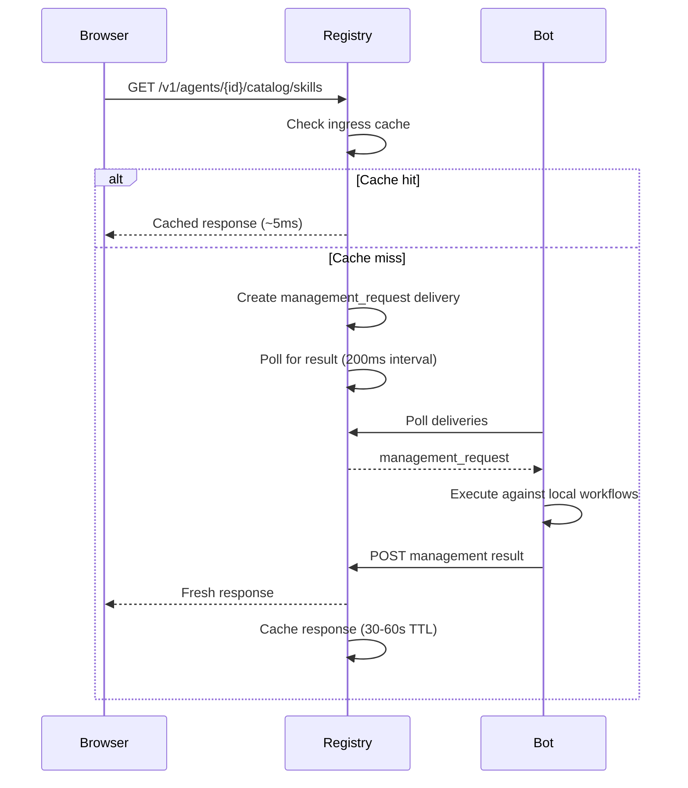

Management responses are cached server-side in `ingress.py` with TTL and
in-flight deduplication. Mutations (make available, publish, archive) invalidate
the cache. Client-side stale-while-revalidate provides instant revisits.

Browser-origin conversations are also real runtime traffic, not just registry
inspection:

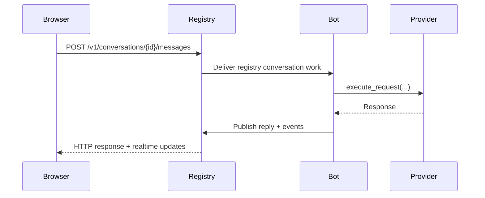

`ingress.py` and `management_client.py` have different jobs:

- `ingress.py` is the operator-facing HTTP bridge. It validates browser/API
  requests, manages cache/invalidation, and translates them into typed
  management operations.
- `management_client.py` is the registry-internal delivery relay. It pushes a
  typed management request onto a connected agent's delivery queue and waits
  for the corresponding typed result.

They both touch management traffic, but they are not duplicate surfaces.
`ingress.py` owns operator request semantics; `management_client.py` owns the
server-side request/result relay to connected bots.

Guidance remains a separate product concept from skills:

- skills are selectable capability packages
- guidance is provider-scoped baseline policy for Claude/Codex behavior
- published guidance is applied to every run for that provider on that bot
- guidance is not routed and is not activated per conversation
- registry and chat both expose the same lifecycle, but registry can present it
  as `Published`, `Draft`, and `Runtime preview` over the same backend
  operations

For custom skill authoring, the registry UI and chat clients both target the
same management operations. The browser can bundle them into a richer editor,
while chat exposes the same package mutations and lifecycle transitions in
smaller steps. Validation, lifecycle guards, and file policy stay in the
shared backend workflow:

- submit and publish always run shared validation
- attached files use one ingestion/validation path regardless of client
- only safe relative paths are allowed
- only `.sh` files may be marked executable
- package limits are 16 attached files, 64 KB per file, 256 KB total

The registry UI now keeps one bot-scoped `Skills` workspace for installed,
store-backed, and custom skills. Conversation activation remains a separate,
conversation-scoped flow. The agent page can launch into either surface, but it
does not own a second skill-management model.

The current registry studio is still agent-scoped because the mutable draft and
lifecycle state live on one bot's skill catalog. The UI can present that as a
progressive editor, but the owning bot remains part of the request identity.

### Realtime model

WebSocket topics:
- `conversation:{id}` — conversation events and progress
- `agent:{id}` — agent heartbeat and status
- `protocol-run:{id}` — protocol run detail invalidations
- Collection topics: `agents`, `conversations`, `tasks`, `approvals`,
  `summary`, `usage`, `protocols`

Protocol run invalidations are emitted from the canonical registry path on run
create, operator actions, and protocol-stage routed-task completion. The
browser reacts to those invalidations; it does not infer protocol advancement
locally from task rows.

The same `protocol-run:{id}` topic also carries named `event` envelopes for
post-applier protocol lifecycle updates:

- `protocol_run.updated`
- `protocol_run.stage_changed`
- `protocol_run.terminal`

Those payloads are built in `octopus_registry/protocol_runtime.py` from the same
registry-backed run detail projection used by `GET /v1/protocol-runs/{id}`.

Four envelope types (defined in `octopus_sdk/realtime.py`):
`RealtimeEventEnvelope`, `RealtimeHeartbeatEnvelope`,
`RealtimeProgressEnvelope`, `RealtimeInvalidationEnvelope`.

The realtime contracts stay strict. The registry must emit payloads that match
the SDK envelope schemas exactly; it does not accept or silently widen invalid
payloads at the websocket boundary.

SPA components subscribe to explicit topics (not wildcards). Updates use
`UI.memoizedRender` with morphdom — signatures use rendered values (e.g.,
`UI.relativeTime()`) not raw timestamps, so heartbeat-driven refreshes
only rebuild rows when the visible text actually changes.

### Store architecture

The registry store is Postgres-only.

- `store_base.py` defines the protocol and shared validation helpers
- `store_shared/` contains domain-sliced SQL helpers used by the Postgres store
- `store_postgres.py` owns the live registry persistence implementation

The registry database lives in the shared deployment Postgres instance under
the `agent_registry` schema.

---

## 2. Bot SDK

This section describes the SDK as the shared contract and orchestration
layer. It defines what a bot IS, not how any specific bot works.

### What the SDK owns

- Transport contracts (how bots connect to messaging platforms)
- Runtime orchestration (`BotRuntime` — admission, dispatch, worker loop)
- Execution engine (`execute_request` — provider invocation, delegation, finalization)
- Registry participant contracts (enrollment, mirroring, coordination)
- Protocol models, schema migration, validation, stage prompt rendering,
  lifecycle evaluation (`protocol_engine.py`), and participant session-keying
- Workflow composition (`WorkflowComposer` with builder pattern)
- Event taxonomy (12 typed event kinds with validated metadata)
- Task protocol (lifecycle state machine, transition validation)
- Delegation continuation (SDK-owned parent resume, not synthetic message re-entry)
- Identity helpers (actor keys, conversation keys, transport refs)
- Testing fence (`octopus_sdk/testing/` — non-durable, non-production)

### Package structure (import direction)

Arrows show import direction: A → B means A imports from B.

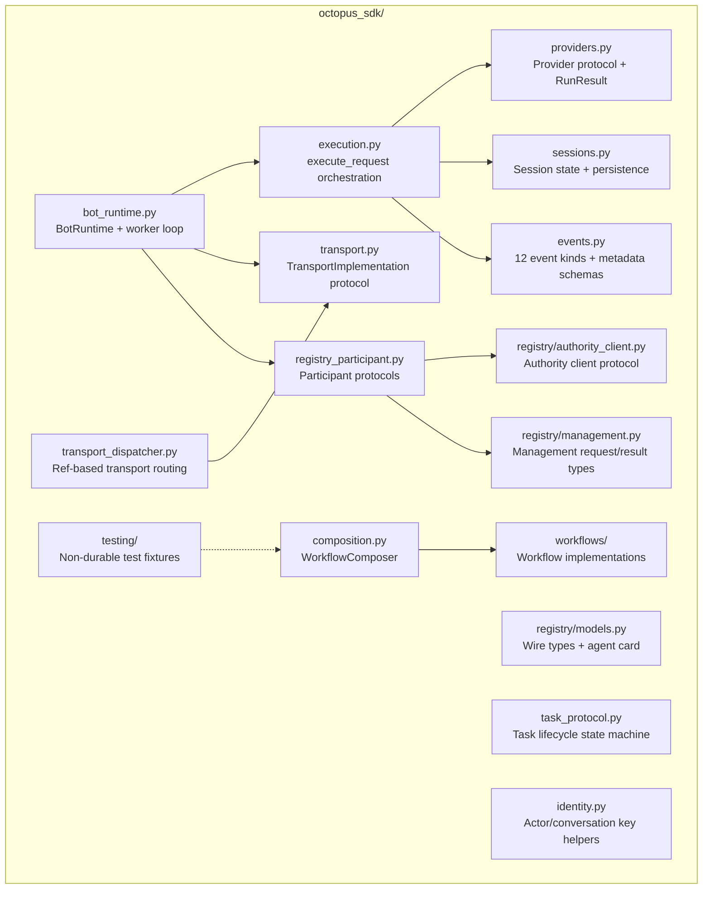

Note: `BotRuntime` does NOT import `composition.py`. The `WorkflowComposer`
builds a `WorkflowComposition` object that is injected into `BotRuntime` at
construction time by the application layer.

### Transport contract

Every messaging platform implements `TransportImplementation`:

```python
class TransportImplementation(ABC):
    @property
    def transport_id(self) -> str: ...
    @property
    def descriptor(self) -> TransportDescriptor: ...
    @property
    def identity(self) -> TransportIdentityResolver | None: ...
    def ref_prefix(self) -> str: ...
    def can_build_egress(self, *, conversation_ref, config, **kw) -> bool: ...
    def build_egress(self, *, conversation_ref, config, **kw) -> TransportEgress: ...
    def worker_egress_kwargs(self, *, conversation_ref) -> dict: ...
    def descriptor_for_ref(self, conversation_ref) -> TransportDescriptor | None: ...
    async def start(self, *, runtime, stop_event) -> None: ...
    async def stop(self) -> None: ...
```

The runtime calls `transport.start()` to begin receiving messages. The
transport calls `runtime.submit(envelope)` when work arrives. The runtime
dispatches through `BotRuntime._run_worker_loop()` to SDK-owned workflows.

### Workflow composition

`WorkflowComposer` assembles the SDK workflow implementations from injected
ports:

```python
workflows = (
    WorkflowComposer()
    .with_messages(my_message_templates)
    .with_sessions(my_session_store)
    .with_config(my_config)
    .with_catalog_service(my_catalog_svc)
    .with_skill_activation(my_activation_svc)
    .with_credentials(my_credential_svc)
    .with_provider_guidance(my_guidance_svc)
    .with_content_store(my_content_store)
    .with_work_queue(my_work_queue)
    .build()  # production — rejects test implementations
)
```

Required ports fail at `.build()` time. Optional ports default to loud
`NotConfiguredError` on any method call. `.build()` rejects
`octopus_sdk.testing.*` implementations. `.build_for_testing()` accepts
them and marks the composition test-only. `BotRuntime` refuses to start
with a test-only composition unless explicitly overridden.

### Delegation continuation

When a child bot completes delegated work, the parent bot resumes through
an SDK-owned continuation path — NOT through synthetic inbound message
re-entry:

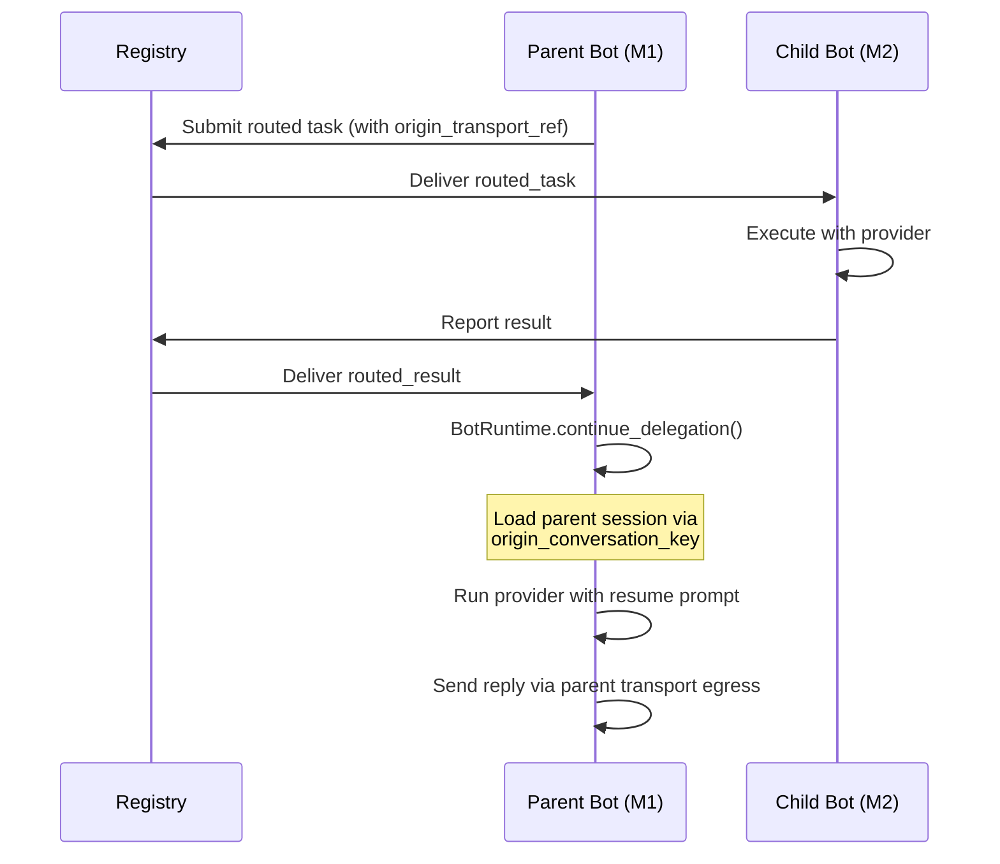

The continuation resolves the parent transport directly from the dispatcher.
No `InboundMessage` fabrication, no `admit_message`, no access control bypass.
`PendingDelegation.origin_conversation_key` and
`RoutedTaskRequest.origin_transport_ref` carry the transport identity
explicitly through the round-trip.

### Event taxonomy

12 typed event kinds with Pydantic-validated metadata:

| Kind | Metadata schema |
|------|----------------|
| `message.user` | `MessageMetadata` |
| `message.bot` | `MessageMetadata` |
| `provider.request` | `ProviderRequestMetadata` |
| `provider.response` | `ProviderResponseMetadata` |
| `tool.execution` | `ToolExecutionMetadata` |
| `approval.requested` | `ApprovalRequestedMetadata` |
| `approval.decided` | `ApprovalMetadata` |
| `delegation.proposed` | `DelegationMetadata` |
| `delegation.submitted` | `DelegationMetadata` |
| `delegation.completed` | `DelegationMetadata` |
| `task.status` | `TaskStatusMetadata` |
| `error` | `ErrorMetadata` |

All metadata models use `extra="forbid"` — unknown fields are rejected.

`provider.request` metadata now carries a bounded `skill_manifest` alongside
the human-readable prompt content. In the shipped runtime, normal model
awareness of skills comes from the shared provider-guidance composition in
`octopus_sdk/provider_guidance_service.py`, which injects authoritative
available/active skill state and active skill bodies into the run context.
`skill_manifest` remains an execution/event artifact and an input for
debug/admin inspection. `SkillInspectionService` is currently a deterministic
debug/admin service, not a normal chat interception path. Canonical skill terms
are:

- available on this bot
- active in this conversation
- advertised for routing
- requested for run
- composed for run
- invoked for run

### Task protocol

Routed tasks follow a formal lifecycle enforced by `python-statemachine`:

```
queued → leased → running → completed / failed / cancelled / timed_out
```

Transitions require `transition_id` (idempotent) and `actor_role`
(authorized). The store validates every transition against the state
machine before persisting.

---

## 3. Bot Implementation

This section describes the shipped Telegram bot built on the SDK.

### What `app/` owns

- Telegram transport (`app/channels/telegram/`)
- Registry bot-side transport (`app/channels/registry/`)
- Claude and Codex provider implementations (`app/providers/`)
- Postgres-backed sessions, work queue, content, credentials, and control-plane state
- Runtime composition and startup (`app/runtime/`)
- Control plane bus and adapters (`app/control_plane/`)
- Telegram-specific workflows (`app/workflows/`)
- Deployment CLI (`app/octopus_cli/`)
- Configuration and env var parsing (`app/config.py`)

### Composition root

The orchestrator is `app/runtime/services.py`. It builds the runtime in
three stages:

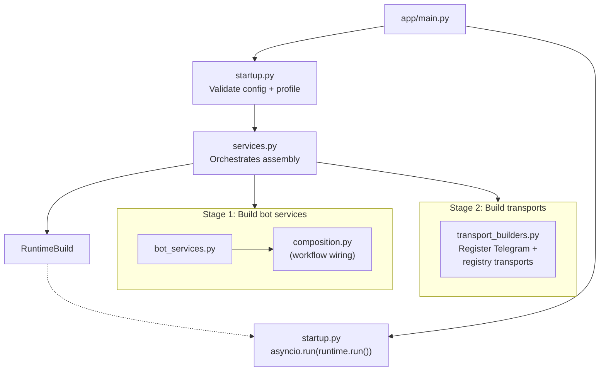

`app/runtime/composition.py` wires the process-wide provider-guidance singleton
into workflow composition, and `app/runtime/bot_services.py` currently injects
that same singleton into `ExecutionServices`. The implementation core now lives in
`octopus_sdk/provider_guidance_service.py`; `app/provider_guidance_service.py`
is a thin app-side wrapper that binds the SDK service to app factories.
Runtime handlers should still consume injected `BotServices` /
`ExecutionServices` ports rather than perform ad-hoc singleton lookups.

1. `services.py` calls `bot_services.py` which internally uses
   `composition.py` to wire the `WorkflowComposer` with app-side port
   implementations (Postgres session store, content store, credential
   service, etc.)
2. `services.py` calls `transport_builders.py` to register Telegram
   and registry transports with the dispatcher
3. `services.py` returns a `RuntimeBuild` containing the assembled
   `BotRuntime`. `main.py` hands it to `startup.py`, which calls
   `asyncio.run(runtime_build.bot_runtime.run())` to launch the process.

Assembly (`services.py`) and process launch (`startup.py`) are separate
concerns. `services.py` never calls `runtime.run()` directly.

`composition.py` is a thin wrapper over `WorkflowComposer`. It does not
own business logic. It is used inside `bot_services.py`, not as a
system-wide composition root.

### Telegram request flow

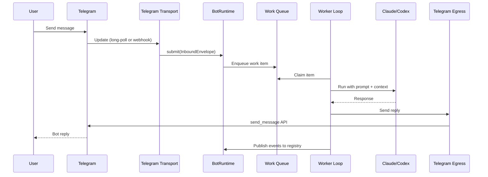

### Process configuration

| Axis | Values | Controls |
|------|--------|----------|
| `BOT_AGENT_MODE` | `standalone`, `registry` | Whether the bot connects to a registry |
| `BOT_PROCESS_ROLE` | `all`, `webhook`, `worker` | Which responsibilities this process handles |

The shipped Telegram bot requires `registry` mode with full participant
coverage. `standalone` mode is supported by the SDK but not by the
shipped Telegram implementation.

### Registry connection surfaces

`./octopus` manages three distinct registry addresses for the shipped local
deployment:

- **bind host + port**: where Docker publishes the registry on the host
  (`127.0.0.1`, `0.0.0.0`, or a concrete IP)
- **public URL**: what operators open in the browser and what remote bots use
- **internal Docker URL**: `http://registry:8787` for co-deployed local bot
  containers

That split is intentional. `0.0.0.0` is a valid bind address, but never a
usable client destination.

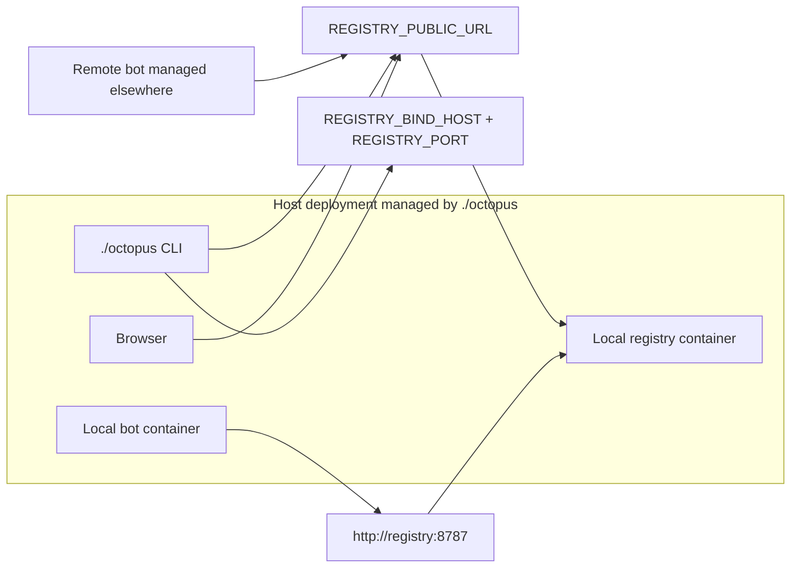

Authentication is also split by role:

- `REGISTRY_UI_TOKEN` authenticates operators to the browser/API
- `REGISTRY_ENROLL_TOKEN` bootstraps bot enrollment
- after enrollment, each bot uses its issued `agent_token`

`./octopus connect` can now write either:

- a local registry record pointing at `http://registry:8787`, or
- a remote registry record pointing at an explicit `--registry-url` with an
  operator-supplied enroll token

Remote enroll tokens are still distributed out-of-band. The registry does not
expose them back through the operator UI.

### Providers

| Provider | Implementation | Notes |
|----------|---------------|-------|
| Claude | `app/providers/claude.py` | Claude Code CLI, streaming JSON |
| Codex | `app/providers/codex.py` | Codex CLI, workspace routing |

Both implement the SDK `Provider` protocol with deterministic `session_id`
via `uuid5(conversation_key)`.

For the shipped runtime, provider health is split into two levels:

- startup-safe auth health:
  `Provider.check_auth_health()`
  This is what bot startup uses. It may inspect local auth artifacts and run
  cheap CLI status commands, but it must not require a real model inference.
- deep runtime health:
  `Provider.check_runtime_health()`
  This may run a real provider request. It is used by explicit diagnostics and
  live provider checks, not by normal startup admission.

Operationally that means:

- `./octopus status` is static by default and reports only configured vs not
  configured auth state
- `./octopus status --live-provider`, `Diagnose -> Provider auth`, and other
  action-oriented flows may run the deep provider probe and report
  `authenticated` or `configured, unable to authenticate`
- bot startup validates startup-safe auth health, not deep runtime health
- `./octopus` provider-auth flows still reuse the live runtime probe after
  login so a written auth file is not treated as success unless the provider
  can actually authenticate

Provider auth and execution availability are intentionally separate:

- startup and deploy stay simple; they do not try to repair or proactively
  prove live provider login
- transport connectivity still means registry enrollment + heartbeats
- real runtime provider failures can latch a bot into `execution faulted`
- while faulted, the bot remains transport-connected and manageable, but new
  provider executions are blocked until reset
- fault state is mirrored through runtime health to the registry and surfaced
  in CLI and UI status
- operators clear the latch explicitly with the agent runtime reset control

---

## 4. Extending Octopus

This section shows how to add a new transport (e.g., Slack) using only the SDK.

### What a Slack developer writes

1. **SlackTransport** implementing `TransportImplementation` (~500-1,000 lines)
   - Ingress: receive Slack events via Bolt, normalize to `InboundEnvelope`
   - Egress: send messages via Slack Web API
   - Identity: map channel_id/user_id to conversation_key/actor_key

2. **Durable store implementations** for the required SDK ports
   - shipped repo: Postgres-backed runtime/content/credential stores
   - external integrations may implement the same ports over another durable backend

3. **main.py** (~50 lines) — compose and run

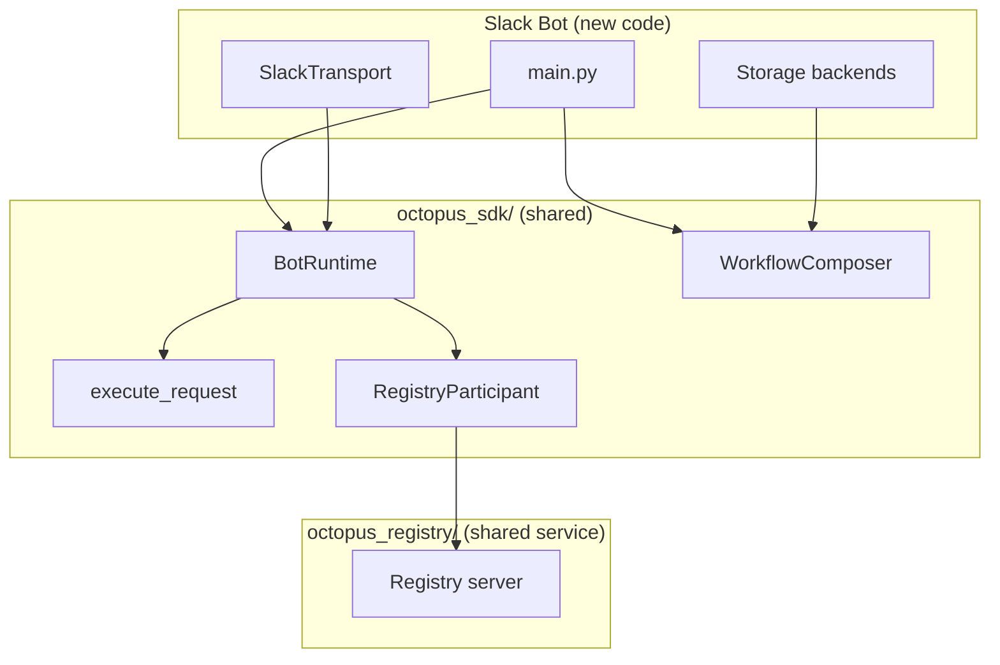

### What the Slack developer does NOT write

- Workflow logic (approvals, delegation, skills, recovery) — SDK-owned
- Event taxonomy and validation — SDK-owned
- Task protocol and lifecycle — SDK-owned
- Registry connectivity and management protocol — SDK-owned
- Provider execution orchestration — SDK-owned

### Implementation steps

1. Add `octopus_sdk/` to the Python path (local dependency — not yet
   published as a distributable package)
2. Implement `SlackTransport(TransportImplementation)`
3. Implement durable store adapters for the required ports
4. Compose with `WorkflowComposer().with_messages(...).with_sessions(...).build()`
5. Create `BotRuntime(transport=slack, workflows=composed, ...)`
6. Call `runtime.run()`

The bot connects to the same registry as Telegram bots. The registry
manages it through the same management protocol. The operator sees it
in the same dashboard.

---

## 5. Cross-Cutting Concerns

### Identity and refs

| Helper | Input | Output | Example |
|--------|-------|--------|---------|
| `telegram_actor_key(user_id)` | Telegram user ID | `tg:<id>` | `tg:8698216169` |
| `parse_actor_key(raw)` | Any raw ID | Normalized actor key | `tg:8698216169` |
| `telegram_conversation_key(chat_id)` | Telegram chat ID | `tg:<chat_id>` | `tg:12345` |
| `parse_conversation_key(raw)` | Any raw ref | Normalized key | `tg:12345` |
| `normalize_conversation_id(raw)` | Registry-qualified ref | Bare conversation ID | `abc123` |
| `delegation_session_key(origin, parent)` | Agent + conversation | Shared session key | `delegation:m1:abc` |

Ref families: `telegram:<bot_id>:<chat_id>`, `registry:<id>:conversation:<cid>`,
`registry:<id>:task:<tid>`.

Actor identity uses `actor_key` everywhere — not `user_id`, not
`request_user_id`, not bare integers.

### Persistence seams

Logically, the platform defines four durable schema families. A deployment can
host them in one external Postgres instance, or split them across multiple
Postgres instances by giving different processes different
`OCTOPUS_DATABASE_URL` values. The shipped local deployment uses separate
compose stacks and separate Postgres containers by default.

| Schema | Owns | Notes |
|--------|------|-------|
| `bot_runtime` | Sessions, work queue, usage log, control-plane commands | Per-conversation runtime state |
| `bot_content` | Skills and provider guidance | Shared package/policy content |
| `bot_credentials` | Encrypted user credentials | Provider/setup secrets |
| `agent_registry` | Agents, conversations, events, routed tasks, deliveries | Shared management plane state |

### Approval and delegation

Two coordination lanes:
- **Content lane:** human text → provider → response
- **Coordination lane:** structured task intents, approvals, status updates

Delegation uses typed SDK contracts, not provider-generated XML. The
`<delegation>` XML parser was removed. Provider `RunResult.coordination_intent`
carries structured delegation intent. Direct assignment from the UI uses
`CoordinationActionEnvelope` through the conversation action API.

### Architecture rules

1. `app/` imports `octopus_sdk/`. SDK imports neither `app/` nor `octopus_registry/`.
2. `octopus_registry/` imports `octopus_sdk/`. Never `app/`.
3. `app/` never imports `octopus_registry/`.
4. Assembly is orchestrated by `app/runtime/services.py`. Workflow wiring
   uses `app/runtime/composition.py` (thin wrapper over `WorkflowComposer`,
   no business logic).
5. Execution orchestration is SDK-owned in `octopus_sdk/execution.py`.
6. Transport implementations own ingress/egress only. Workflow dispatch is SDK-native.
7. Coordination uses typed SDK/registry contracts, not provider text conventions.
8. All workflow ports are SDK Protocols. Implementations are constructor-injected.
9. Task lifecycle is enforced by `python-statemachine` with `transition_id` idempotency.
10. Event metadata uses `extra="forbid"`. Unknown fields are rejected.
11. Realtime topics are explicit. No wildcard subscriptions.
12. Live registry identity comes from runtime state, not startup config snapshots.
13. Postgres-backed seams pass the shared contract tests and deploy through one startup path.
14. New or extended features use **one coherent code path** — no parallel implementations, backward-compatibility shims, or redundant ways to do the same thing.
15. **File/module size and LOC** are not primary constraints for feature work; clarity and a single pipeline matter more than keeping files small.
