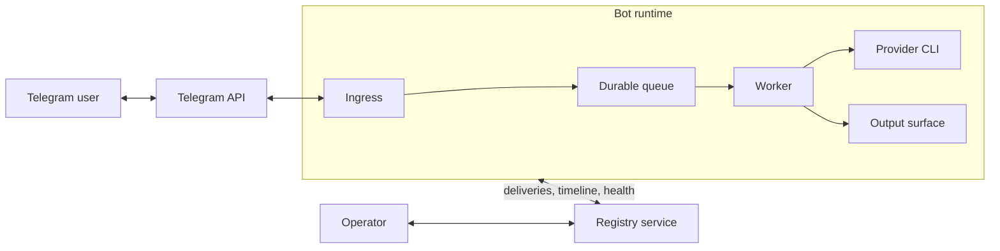
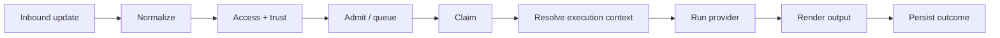
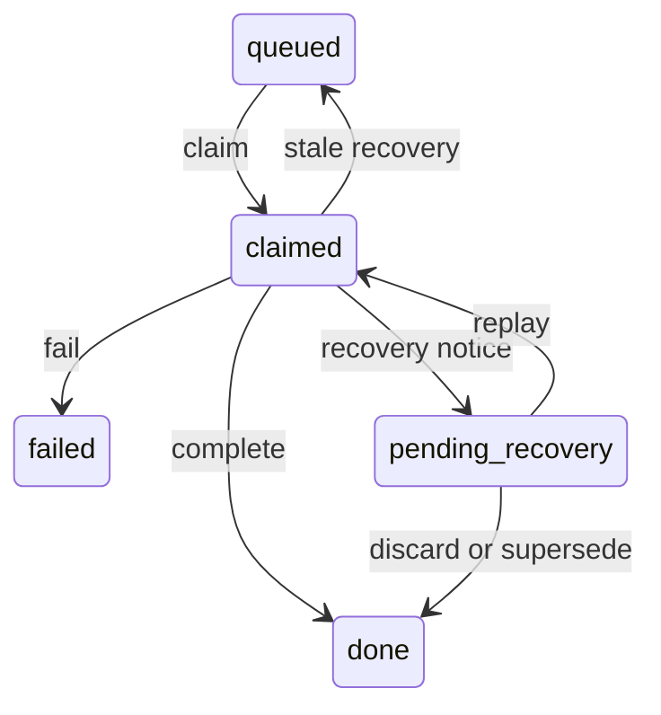

# Architecture

This document describes the system shape and runtime boundaries. For setup,
day-to-day use, and operator workflows, see [README.md](../README.md).

## System Overview

The product has two runtime subsystems:

- **Bot runtime**: receives input, stores durable work, runs providers,
  persists session state, and sends results back to Telegram or registry-backed
  surfaces.
- **Registry service**: stores bot directory state, routed deliveries,
  conversation visibility, and mirrored health. It never executes provider work
  and never reads the bot transport database directly.

## Runtime Modes

| Mode | Backend | Process shape |
|---|---|---|
| **Local** | SQLite or Postgres | one process, all roles |
| **Shared** | SQLite (same host) or Postgres | webhook ingress + one or more workers |

### Local

`BOT_RUNTIME_MODE=local` is the default. One process receives updates and runs
work itself.

### Shared

`BOT_RUNTIME_MODE=shared` splits ingress from execution:

- `BOT_PROCESS_ROLE=webhook` persists incoming updates
- `BOT_PROCESS_ROLE=worker` claims and executes durable work

### Registry participation

- `BOT_AGENT_MODE=standalone`: no registry participation
- `BOT_AGENT_MODE=registry`: the bot enrolls, mirrors timeline and health, and
  accepts routed deliveries

In Shared Runtime with registry enabled, the webhook process is the singleton
registry publisher. Workers do not heartbeat the registry directly.

## Request Lifecycle

The durable contract is the same in Local and Shared Runtime:

1. normalize inbound input into project-owned types
2. apply access rules and trust tier
3. persist the update
4. admit or queue work durably
5. claim work through the queue contract
6. resolve execution context
7. run the provider
8. render output and persist the final state

Credential-setup replies are the main intentional off-queue exception.

### Approval

With approval enabled, the provider first produces a plan. That pending request
is stored durably, then later approved or rejected by the user. Execution only
continues after that second step.

### Delegation

Delegation is routed through the registry service, but delegated work still
executes through the target bot’s normal local worker path.

## Queue and Recovery

The work queue is app-owned. There is no external broker.

Important invariants:

- fresh admission returns `duplicate`, `admitted`, or `queued`
- multiple queued items per conversation are allowed
- at most one item per conversation may be `claimed` at a time
- queued items drain FIFO within a conversation
- stale claims are detected by lease age, not by worker identity
- stale recovered work goes through replay/discard notice flow
- stale work is never auto-rerun

Cancel behavior is also durable:

- queued fresh work can be cancelled before execution
- claimed work observes a durable cancel flag cooperatively

## Storage Model

There are three storage concerns:

- **Transport state**: updates, work items, worker heartbeats
- **Session state**: approval mode, skills, role, project, pending state
- **Registry state**: enrolled bots, deliveries, conversations, mirrored health

SQLite is the default backend. Postgres is the alternate backend for bot
transport/session storage and registry storage.

Bot-local files remain on disk even when Postgres is used:

- provider auth
- uploads
- raw response history
- credentials and related runtime artifacts

## Health Model

Shared Runtime health is collected once from the bot runtime and projected to
multiple surfaces:

- Telegram `/doctor`
- CLI `python -m app.main --doctor`
- registry heartbeat mirroring
- Registry UI health views

The transport store is the primary truth source for queue and worker health.
The registry stores a mirrored copy when registry mode is enabled.

## Deployment Model

### Local Runtime

- one process receives updates and executes work
- SQLite is the default backend
- best fit for one private bot or straightforward operation

### Shared Runtime

- one webhook ingress process persists updates
- one or more worker processes drain the durable queue
- the same queue semantics apply as in Local Runtime

Backend constraints:

- SQLite Shared Runtime is same-host only
- Postgres Shared Runtime moves queue and session state to Postgres
- bot-local files still need shared storage either way

## Design Boundaries

These boundaries are intentional:

- the registry never executes provider work
- the registry never queries the bot transport database directly
- queue ownership stays in the bot runtime
- provider execution stays outside short database transactions
- Local Runtime and Shared Runtime share the same durable semantics

That separation is what lets the system support:

- a simple single-process local mode
- a split-role shared mode
- registry-backed visibility and routing

without introducing a second execution model.
