# Architecture

This document describes the current shipped Octopus runtime in this repository.
It is intentionally grounded in code paths that exist today. The Java rebuild
plan is separate; this file documents the Python/FastAPI/Postgres product that
customers and operators run now.

Octopus is a multi-agent work platform. A registry service owns shared
coordination, discovery, browser UI, protocols, runs, artifacts, routing, and
operator state. Bot runtimes connect to the registry, receive work, execute it
through providers such as Claude or Codex, and publish events and results back
to the registry. Users can work through Telegram or through browser-origin
registry conversations. Operators use the registry UI to inspect and manage
agents, conversations, runs, skills, guidance, routing, usage, and health.

The core product lineage is:

```text
Agent
  -> Conversation
  -> Work item / routed task
  -> Protocol run
  -> Stage execution
  -> Artifact
  -> Event / approval / operator action
```

Tasks still exist as the routed-work substrate. The user-facing UI should
present tasks as linked work inside conversations and runs, not as an unrelated
second application.

## Package Boundaries

| Package | Owns | Must not own | Deploys as |
| --- | --- | --- | --- |
| `octopus_sdk/` | Shared contracts, Pydantic wire models, bot runtime orchestration, protocol models/engine, registry clients, workflow use cases, transport abstractions, testing fakes. | Concrete Telegram implementation, registry FastAPI routes, app persistence wiring. | Embedded library in registry and bots. |
| `octopus_registry/` | Registry FastAPI app, registry Postgres store, protocol store/runtime, management bridge, realtime WebSocket, SPA assets, artifact download resolution. | Provider execution, Telegram transport, bot-local sessions/queues. | Registry service container. |
| `app/` | Bot process composition, Telegram channel, registry delivery transport, provider adapters, bot-local Postgres stores, control-plane bus, host CLI and deployment scripts. | Registry HTTP server, registry UI, shared SDK business contracts. | Bot containers and host CLI. |

Import direction is a hard boundary:

```text
app/              -> octopus_sdk/
octopus_registry/ -> octopus_sdk/
octopus_sdk/      -> neither app/ nor octopus_registry/
```

`app/` and `octopus_registry/` must not import each other. Shared behavior goes
into `octopus_sdk/`; concrete process wiring stays in the owning package.

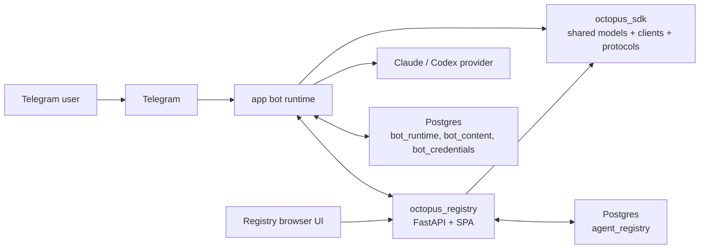

## Deployment Topology

`./octopus` and `app/octopus_cli/` manage local Docker deployment under
`.deploy/`. The default local topology is one registry stack plus one bot stack
per bot. Each stack normally has its own Postgres container, although the schema
families can be pointed at a shared external Postgres by configuration.

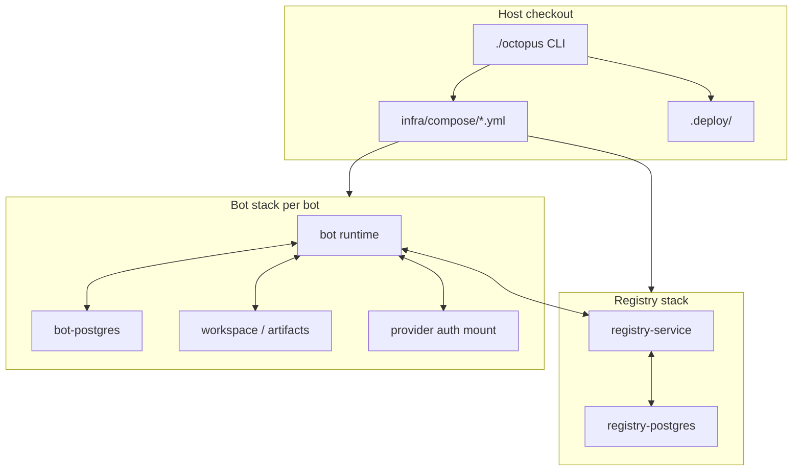

Registry addressing has three separate values:

| Address | Purpose |
| --- | --- |
| Bind host and port | Where Docker publishes the registry on the host. `0.0.0.0` is only a bind address. |
| Public URL | What browsers and remote bots use. |
| Internal Docker URL | What co-deployed local bot containers use, normally `http://registry:8787`. |

Authentication is split by actor:

| Token/session | Used by |
| --- | --- |
| UI session cookie and CSRF token | Browser UI mutations. |
| `REGISTRY_UI_TOKEN` | Operator API access where bearer token auth is used. |
| `REGISTRY_ENROLL_TOKEN` | Initial bot enrollment. |
| Issued `agent_token` | Registered bot heartbeat, poll, ack, task result, and management result calls. |

## Persistence Model

The shipped runtime is Postgres-backed. The canonical application schema is
`app/db/init.sql`. The active source tree has Postgres stores for app runtime,
content, credentials, control plane, and registry state. Generated pycache,
provider auth, or backup files do not define a supported persistence path.

| Schema | Owner | Tables and purpose |
| --- | --- | --- |
| `bot_runtime` | Bot runtime | Sessions, inbound updates, work items, user access, usage log, worker heartbeats, control-plane commands, deferred notifications. |
| `agent_registry` | Registry | Agents, runtime workers, deliveries, management requests, conversations, routed tasks, events, protocol definitions, versions, runs, participants, stages, artifacts, transitions, idempotency, compliance, routing skill overrides, registry-managed runtime skills and guidance. |
| `bot_content` | Bot content services | Skill namespaces, tracks, revisions, files, provider guidance tracks/revisions, approval records. |
| `bot_credentials` | Bot credential service | Actor/skill credential values. |

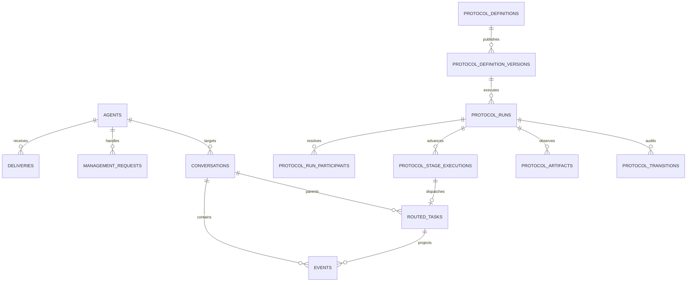

Important indexes and constraints:

| Area | Index/constraint intent |
| --- | --- |
| `bot_runtime.work_items` | One claimed work item per conversation, state/conversation lookup, event uniqueness. |
| `agent_registry.events` | Conversation timeline by sequence, kind filtering, full-text content search. |
| `agent_registry.deliveries` | Agent poll by target, state, and sequence. |
| `agent_registry.protocol_runs` | Updated/status/org/protocol/entry-agent/root-conversation/origin-channel/blocked-code filters. |
| `agent_registry.protocol_stage_executions` | Run lookup, routed task uniqueness, running lease and timeout sweeps. |
| `agent_registry.protocol_artifacts` | Latest artifact by run/key. |
| `agent_registry.protocol_idempotency` | One response per scoped action and idempotency key. |
| `bot_content.skill_*` | Skill track/revision/file integrity and approval history. |

The persistence rule is one owner per state family. Registry stores do not write
bot runtime tables. Bot runtime stores do not write registry tables except
through registry APIs or the registry participant abstraction.

## Registry Service

The registry service is the coordination and management plane.

Key files:

| File | Responsibility |
| --- | --- |
| `octopus_registry/server.py` | FastAPI app, non-protocol HTTP routes, auth dependencies, WebSocket route, lifecycle maintenance loop. |
| `octopus_registry/protocol_http.py` | Protocol definitions, templates, runs, artifacts, rehearsal, scenarios, and run actions HTTP routes. |
| `octopus_registry/store_base.py` | Store protocol, validation helpers, registry scope helpers, runtime health projection. |
| `octopus_registry/store_postgres.py` | Postgres registry store implementation. |
| `octopus_registry/store_shared/` | Domain-sliced SQL helpers for agents, conversations, deliveries, tasks, usage, content, summary. |
| `octopus_registry/protocol_store.py` | Protocol-specific Postgres adapter and canonical protocol mutation applier. |
| `octopus_registry/protocol_runtime.py` | Protocol run event payloads, participant resolution, dispatch evaluation. |
| `octopus_registry/rehearsal.py` | Rehearsal session manager for dry protocol response flows. |
| `octopus_registry/ingress.py` | Operator-facing management bridge for skills, guidance, conversation settings, reset. |
| `octopus_registry/management_client.py` | Registry-internal request/result relay to connected agents. |
| `octopus_registry/artifact_paths.py` | Safe artifact path resolution for protocol and task artifact content. |
| `octopus_registry/ui_http.py` | UI shell routes, login/logout, static asset cache busting. |
| `octopus_registry/ws.py` | WebSocket client/topic manager. |

Registry API families:

| Family | Representative routes | Primary caller |
| --- | --- | --- |
| Health/auth | `GET /healthz`, `GET /v1/auth/csrf`, `/ui/login`, `/ui/logout` | Browser, operators, deployment checks. |
| Agent participant | `POST /v1/agents/enroll`, `register`, `heartbeat`, `poll`, `ack`, `deregister` | Bot runtimes. |
| Agent discovery/routing | `POST /v1/agents/discovery/search`, `POST /v1/selector/preview`, `GET/POST /v1/routing/skills` | SDK delegation, protocol runtime, Registry UI. |
| Routed work | `POST /v1/agents/routed-tasks`, status/result endpoints, `GET /v1/tasks`, `GET /v1/tasks/{id}` | Bot runtimes, Registry UI. |
| Conversations | `GET/POST /v1/conversations`, messages, actions, events, progress, export | Registry UI and bot runtimes. |
| Management bridge | `/v1/agents/{agent_id}/catalog/skills...`, `/guidance/{provider}...`, conversation skill/settings/reset routes | Registry UI, future peer channels. |
| Protocol authoring | `GET /v1/protocols`, `POST /v1/protocols`, `POST /v1/protocol-drafts`, parse/export/diff/validate/publish/archive | Registry UI. |
| Protocol templates | `GET/POST /v1/protocol-templates` | Protocols UI. |
| Protocol runs | `GET/POST /v1/protocol-runs`, issues, participants, artifacts, timeline, export, actions, rehearsal | Registry UI, Telegram protocol commands, SDK client. |
| Usage/summary/approvals | `GET /v1/summary`, `GET /v1/usage`, `GET /v1/approvals` | Operations surfaces. |

The checked-in OpenAPI artifact is `docs/registry-openapi.json`. When registry
route contracts change, regenerate and test it.

### Registry Realtime

The registry WebSocket endpoint is `GET /v1/ws`. Topics are explicit:

| Topic | Meaning |
| --- | --- |
| `conversation:{id}` | Conversation events and progress. |
| `agent:{id}` | Agent heartbeat, connectivity, execution health. |
| `protocol-run:{id}` | Protocol run updates, terminal events, detail invalidation. |
| `agents`, `conversations`, `tasks`, `approvals`, `summary`, `usage`, `protocols` | Collection invalidations. |

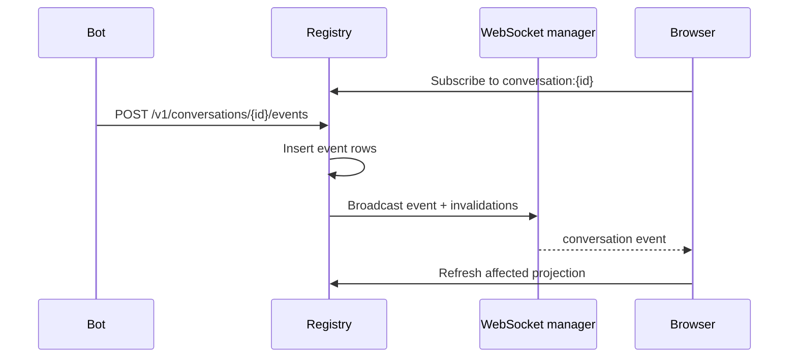

Realtime envelopes are SDK records in `octopus_sdk/realtime.py`. The registry
must emit payloads that match those contracts; browser components should not
infer authoritative run advancement from local row state.

### Management Bridge

The registry exposes browser-friendly management routes, but the bot owns the
actual skill/guidance runtime state for that agent. The bridge converts operator
requests into typed management requests and waits for typed results.

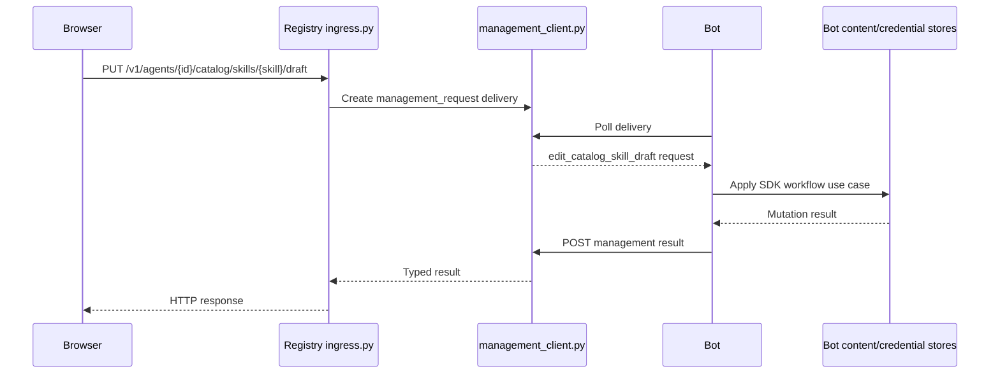

`ingress.py` owns operator request semantics and caching. `management_client.py`
owns delivery and result correlation. They are not duplicate management systems.

## SDK

The SDK defines shared product contracts. Any new bot surface should build on
SDK interfaces instead of reimplementing Telegram or registry behavior.

Key files:

| File | Responsibility |
| --- | --- |
| `octopus_sdk/bot_runtime.py` | Bot runtime loop, admission, claimed work dispatch, direct assignment and action dispatch, delegation continuation. |
| `octopus_sdk/execution.py` | Provider execution orchestration. |
| `octopus_sdk/transport.py` | Transport abstractions: inbound submission, egress, identity, health, continuation. |
| `octopus_sdk/transport_dispatcher.py` | Ref-based transport routing. |
| `octopus_sdk/composition.py` | `WorkflowComposer` and injected workflow ports. |
| `octopus_sdk/registry/models.py` | Registry wire records for agents, conversations, tasks, selectors, coordination actions, results. |
| `octopus_sdk/registry/client.py` | HTTP client for registry APIs. |
| `octopus_sdk/registry/authority_client.py` | Authority client protocol for registry-backed operations. |
| `octopus_sdk/registry/management.py` | Management request/result types for skills, guidance, settings, reset. |
| `octopus_sdk/registry_participant.py` | Participant interfaces for enrollment, health, discovery, mirroring, coordination. |
| `octopus_sdk/workflows/` | Conversation, delegation, pending, recovery, skills, guidance, lifecycle use cases. |
| `octopus_sdk/protocols/` | Protocol models, documents, validation, prompt rendering, engine, service, launch helpers. |
| `octopus_sdk/events.py` | Typed event taxonomy and metadata validation. |
| `octopus_sdk/testing/` | Non-production test fakes. |

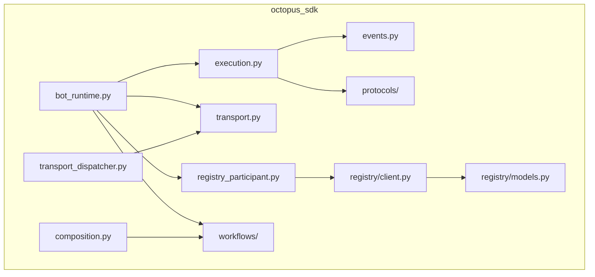

SDK rules:

- Workflow behavior belongs in SDK workflows, not in Telegram handlers or
  browser components.
- Wire objects use Pydantic records with `extra="forbid"` where strictness is
  required.
- Coordination uses typed action envelopes, not provider-authored XML or ad-hoc
  command text.
- Production composition rejects `octopus_sdk.testing.*` implementations unless
  explicitly built for testing.
- Protocol lifecycle decisions are pure SDK engine decisions applied by the
  registry store.

### Transport Contract

Every channel implements `TransportImplementation` from
`octopus_sdk/transport.py`. A transport receives platform-specific input,
normalizes it into SDK inbound envelopes, builds egress for replies, and exposes
transport identity. It does not own workflow behavior.

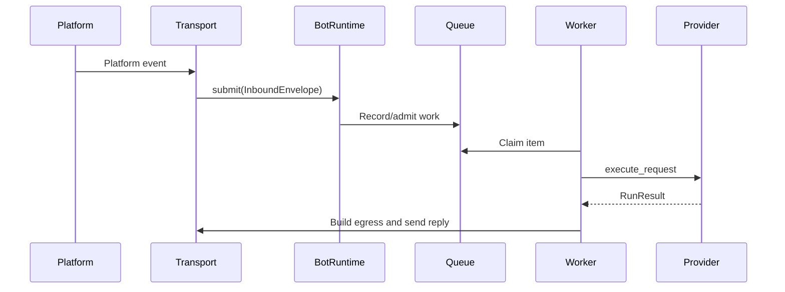

## Bot Runtime

`app/` is the shipped bot implementation. It composes SDK workflows, Telegram,
registry delivery, providers, and Postgres stores.

Key files:

| File | Responsibility |
| --- | --- |
| `app/main.py` | Process entrypoint. |
| `app/runtime/startup.py` | Startup validation and runtime launch. |
| `app/runtime/services.py` | Top-level assembly of bot services, transports, runtime build. |
| `app/runtime/bot_services.py` | Bot service construction and control-plane service wiring. |
| `app/runtime/composition.py` | Thin wrapper over SDK `WorkflowComposer`. |
| `app/runtime/transport_builders.py` | Telegram and registry transport registration. |
| `app/runtime/registry_participant.py` | Bot-side registry participant implementation. |
| `app/channels/telegram/` | Telegram transport, egress, runtime state, bootstrap. |
| `app/runtime/telegram_ingress.py` | Telegram command/message/callback handlers. |
| `app/runtime/telegram_execution.py` | Telegram execution presentation, artifacts, prompts. |
| `app/runtime/telegram_protocols.py` | Protocol command helpers and run watch loop. |
| `app/channels/registry/delivery_transport.py` | Registry-origin conversation and routed-task delivery handling. |
| `app/channels/registry/egress.py` | Registry conversation egress. |
| `app/providers/claude.py`, `app/providers/codex.py` | Provider adapters. |
| `app/storage_postgres.py`, `app/work_queue_postgres_impl.py` | Bot runtime state and work queue. |
| `app/content_store_postgres.py`, `app/credential_store_postgres.py` | Skill/guidance content and credentials. |
| `app/control_plane/` | Control-plane command bus, adapters, machine, Postgres implementation. |
| `app/octopus_cli/` | Host CLI for deployment and operations. |

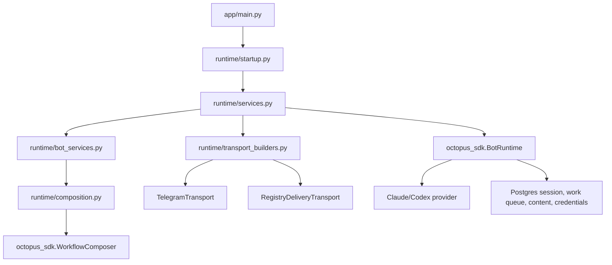

Process modes:

| Setting | Values | Effect |
| --- | --- | --- |
| `BOT_AGENT_MODE` | `standalone`, `registry` | Whether the bot enrolls with a registry. The shipped Telegram product expects registry mode. |
| `BOT_PROCESS_ROLE` | `all`, `webhook`, `worker` | Which process responsibilities run. |

Provider health has two levels:

| Health type | Purpose |
| --- | --- |
| Startup-safe auth health | Cheap check used by startup. Does not require real model inference. |
| Deep runtime health | Explicit diagnostic path that may invoke provider tooling. |

Execution faults are latched in runtime health and mirrored to the registry.
Faulted bots can remain connected and manageable while new provider executions
are blocked until an operator resets execution state.

## Conversations, Direct Assignment, And Delegation

Conversations are first-class registry records. Telegram conversations and
browser-origin conversations both become registry-visible timelines, but their
ingress paths differ.

Browser-origin message path:

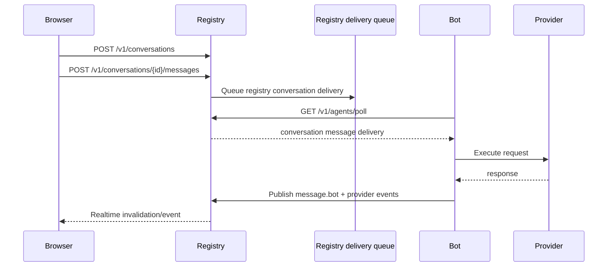

Telegram-origin message path:

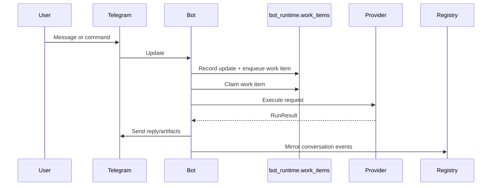

Direct assignment is a typed coordination action. A browser composer or Telegram
message can target `@m2`, `@skill:testing`, or `@role:reviewer`; both should end
up as SDK selector and direct-assignment records, not separate channel logic.

Delegation is a two-bot routed-task flow. The parent submits a typed
`RoutedTaskRequest`; the child reports status and result; the parent resumes
through SDK continuation, not synthetic inbound message re-entry.

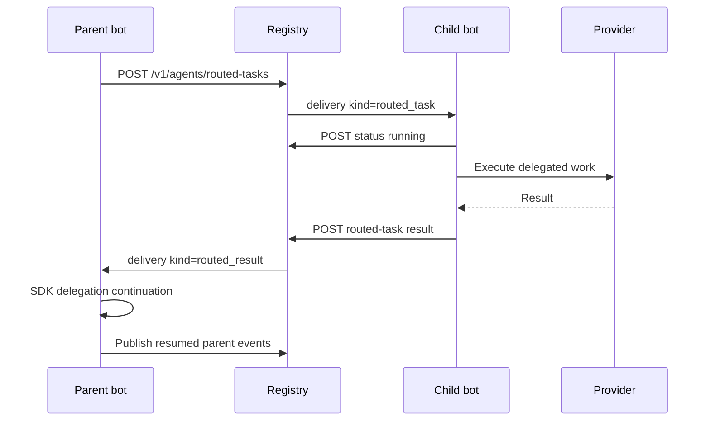

## Protocol Architecture

Protocols are registry-owned definitions and runs. The SDK owns document models,
validation, prompt rendering, stage decision parsing, and lifecycle evaluation.
The registry owns HTTP APIs, persistence, idempotency, run projection, and task
dispatch.

Lifecycle decisions are evaluated by `octopus_sdk/protocols/engine.py` and then
applied by `octopus_registry/protocol_store.py`.

Protocol stage prompts are SDK behavior. Stage instructions, run context, input
artifacts, and output write scope are rendered by `octopus_sdk/protocols/` so
Registry UI, Telegram, and future channels inherit the same execution contract.
Registry routes and UI components must not create a second prompt contract.

Protocol document model:

| Object | Fields |
| --- | --- |
| Metadata | `slug`, `display_name`, `description`, schema version. |
| Participants | `participant_key`, display name, shared instructions. |
| Artifacts | `artifact_key`, display name, description, kind, workspace path, verify flag. |
| Stages | `stage_key`, participant, selector, stage kind, instructions, inputs, outputs, transitions, write access, strict completion, timeout. |
| Policies | Single active writer, max review rounds. |

Run launch model:

| Input | Owner | Notes |
| --- | --- | --- |
| `entry_agent_id` | Launching surface | Required. Owns the root run conversation; stage selectors still decide which agent receives each step. |
| `workspace_ref` | Launching surface/user | Optional workspace/project reference for generated artifacts. |
| `problem_statement` | Launching surface/user | Required run goal visible to assigned agents. |
| `constraints_json` | Launching surface/user | Holds generic fields such as context, constraints, expected outputs, plus any protocol-authored custom run inputs. |
| `metadata.run_inputs` | Protocol author | Optional protocol document metadata that replaces the conservative default launch form across UI/Telegram/SDK surfaces. |

The default launch form is intentionally generic: workspace, concrete goal,
context, constraints, and expected outputs. Product surfaces must not invent
scenario-specific launch fields. If a workflow needs specialized run fields,
the protocol author defines them in `metadata.run_inputs` so every launch
surface reads the same contract. The Registry UI may warn when expected outputs
entered at launch do not match declared protocol artifacts; the run can still
start, but only declared artifacts are contract-verified.

Runtime lineage:

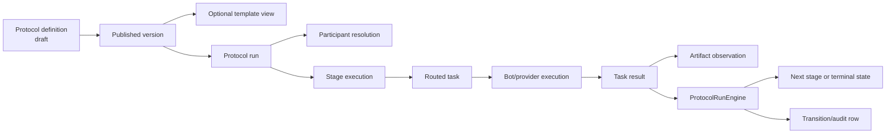

Protocol execution sequence:

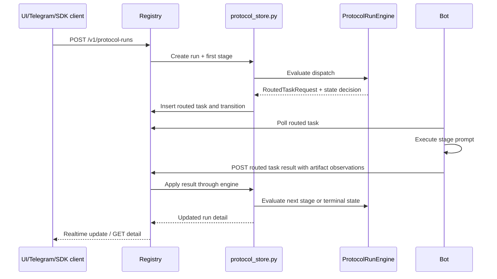

Operator actions are versioned run mutations:

| Action | Purpose |
| --- | --- |
| `retry` | Re-dispatch the current failed/blocked stage. |
| `accept` | Accept current stage outcome when the run is waiting for operator decision. |
| `send-back` | Send a review/acceptance stage back for more work. |
| `cancel` | Stop the run and write terminal audit state. |

Run actions use `If-Match` and `Idempotency-Key` where applicable. This prevents
duplicate operator mutations and stale UI writes from corrupting run state.

Rehearsal runs use `REHEARSAL_AUTHORITY_REF = "rehearsal"` and resolve stages to
rehearsal agents/sessions. Rehearsal is dry-run execution for protocol behavior,
not a second protocol model.

Protocol templates and scenarios are supporting records. Templates are created
from user-authored protocols and copied back into editable protocols. Scenarios
support rehearsal/testing workflows. Neither is a built-in starter gallery or a
product-default workflow path.

## Artifacts

Artifacts are part of the work lineage. A protocol can declare artifacts in its
definition; stage execution can observe produced artifacts; registry APIs expose
artifact metadata and content where the current host can resolve the path.

Artifact kinds:

| Kind | Meaning |
| --- | --- |
| `workspace_file` | File path relative to a bot workspace. Download/preview requires safe host/container path resolution. |
| `control_plane_text` | Text captured in the control plane, such as rehearsal output or inline response content. |

Artifact content paths:

| Surface | Route |
| --- | --- |
| Protocol run artifact | `GET /v1/protocol-runs/{run_id}/artifacts/{artifact_key}/content` |
| Task artifact | `GET /v1/tasks/{routed_task_id}/artifacts/{artifact_key}/content` |

Artifact resolution rules:

- Paths must not escape the workspace root.
- Missing artifacts should be represented as declared/missing, not broken
  buttons.
- If an artifact is available from a task, run, stage, conversation, or
  dashboard link, the same preview/open/download/copy affordance should be used.
- Rehearsal text can be served even when no workspace file exists.
- Protocol run export includes metadata and lineage. It should not silently
  expose file contents except through explicit content routes.

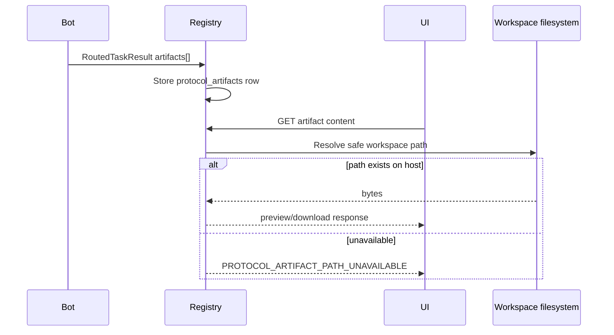

## Skills And Guidance

The UI label is `Skills`. The runtime model and APIs still use `skills`.
Routing skills are derived from bot skill availability and routing policy; they
are not a second skill system.

Canonical skill states:

| State | Meaning |
| --- | --- |
| Catalog | Known skills that can be installed or inspected. |
| Available on this bot | Skill installed and available to the bot runtime. |
| Default for new conversations | Available skills seeded into new conversations. |
| Active in this conversation | Conversation-scoped activation. |
| Routing skills | Available/runtime-ready skills advertised for cross-agent routing. |

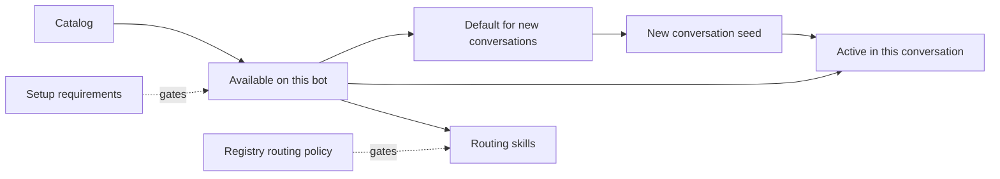

Skill package content:

| Field | Purpose |
| --- | --- |
| Metadata | Name, display name, description, source, owner, visibility. |
| Instructions | Prompt body used when composed for a run. |
| Requirements | Credentials/setup requirements. |
| Provider config | Provider-specific activation/config data. |
| Files | Supporting package files, subject to path and size policy. |
| Lifecycle | Draft, review, approval, publish, archive. |

Guidance is separate from skills. It is provider-scoped baseline policy for
Claude/Codex behavior. It is managed through provider guidance tracks/revisions,
not through conversation activation or routing.

Telegram and Registry UI should expose the same underlying skill/guidance
skills through SDK and management interfaces. The browser may provide a
richer editor; it must not be a separate source of truth.

## Registry UI

The registry UI is a vanilla JavaScript SPA served by the registry.

Key files:

| File | Responsibility |
| --- | --- |
| `octopus_registry/ui/index.html` | Shell, sidebar navigation, script loading, cache-busted assets. |
| `octopus_registry/ui/js/app.js` | App bootstrap, route registration, theme, sidebar, keyboard shortcuts, WebSocket connect. |
| `octopus_registry/ui/js/router.js` | Minimal history router, route cleanup, active nav state. |
| `octopus_registry/ui/js/api.js` | Fetch wrapper and browser API client. |
| `octopus_registry/ui/js/ws.js` | Browser WebSocket client and topic subscriptions. |
| `octopus_registry/ui/js/helpers/ui.js` | Shared UI utilities, rendering helpers, artifact actions, default hidden-record filtering. |
| `octopus_registry/ui/js/helpers/kit.js` | Shared Kit primitives for lists, summaries, protocol editor sections, runs, agents. |
| `octopus_registry/ui/js/components/*.js` | Route components for dashboard, agents, conversations, runs/protocols, skills, guidance, routing, usage, login. |
| `octopus_registry/ui/css/main.css` | Current styling system. |

Current primary navigation:

| Group | Entries |
| --- | --- |
| Work | Conversations, Runs, Agents |
| Build | Protocols, Skills, Guidance |
| Operations | Dashboard, Routing, Usage |

Linked but not primary routes:

| Route | Why it still exists |
| --- | --- |
| `/ui/tasks` | Routed work substrate; opened from conversations, runs, dashboard links. |
| `/ui/approvals` | Approval list; operational/linked surface. |
| `/ui/agents/:id` | Agent detail. |
| `/ui/agents/:id/conversations` | Agent-scoped conversation list. |
| `/ui/conversations/:id` | Conversation detail. |

Removed primary concepts:

- `/ui/templates` and `/ui/gallery` should not be primary protocol surfaces.
  Templates are a utility inside Protocols.
- Tasks are not a top-level product area when the user's goal is work lineage.
  They remain accessible as linked detail because delegation and protocol stages
  are implemented as routed tasks.

UI consistency rules:

- Expand detail inline under the selected row where the surface is list-based.
- Use the same tab grammar for dense detail sections.
- Use the same artifact action row everywhere artifacts are referenced.
- Avoid clickable-looking pills for non-actions.
- Browser actions that mutate state must call `/v1/*` APIs through `api.js`.
- Standard protocol authoring must not render operator/internal controls.
- Desktop and narrow modes must be tested together. Safari requires a hard
  refresh after deploys because asset URLs are cache-busted but browser cache can
  still preserve old JS/CSS during manual verification.

## Protocol Authoring UI

The Protocols surface is the authoring home for definitions, drafts, publishing,
template creation, and run launch. The authoring surface uses a progressive
inline stage editor.

Standard authoring rules:

- A standard author can create stages with no skill, a skill, an agent, or both
  when that is the product intent.
- Adding a stage inserts it directly below the current stage and must preserve
  entered draft data.
- The stage editor is inline under the stage, not a detached side editor.
- Artifacts belong in the stage editor as stage inputs/outputs, not as an
  unrelated global drawer.
- Raw internals such as `stage_key`, `max_rounds`, `timeout_seconds`, custom
  runtime selector, and operator-only selector kinds are not rendered in the
  standard path.
- Delete is a normal destructive stage action, not hidden under an "Advanced"
  section.

Operator authoring:

- Operator internals require protocol-internal edit access.
- Server-side enforcement lives in `protocol_store.py` via authoring surface and
  access checks. UI hiding alone is not sufficient.

## Telegram Surface

Telegram is a peer channel, not a second product model.

Important command groups in `app/runtime/telegram_ingress.py` and app workflow
modules:

| Area | Commands/examples |
| --- | --- |
| Conversation | `/start`, `/help`, `/new`, `/session`, `/compact`, `/raw`, `/cancel`. |
| Assignment/delegation | `@m2 ...`, `/discover`, `/delegate`, delegation callbacks. |
| Protocols | `/protocol list`, `/protocol start`, `/protocol watch`, `/protocol unwatch`, run notifications. |
| Artifacts/export | `/export`, directed artifact sending. |
| Skills | `/skills list/add/remove/create/edit/import/export/submit/approve/publish/archive/search/info/install/update`. |
| Guidance | `/guidance` lifecycle commands through shared guidance workflows. |
| Admin/access | `/admin`, `/doctor`, `/role`, `/model`, `/policy`, access allow/block/list. |
| Credentials/setup | `/clear_credentials`, setup callbacks, credential submission. |

Telegram should call the same SDK workflow and registry participant interfaces
that Registry UI-backed operations use. If a skill or guidance operation exists
only in browser code and cannot be reached through SDK/management interfaces,
that is an architecture gap.

Protocol Telegram buttons are presentation affordances only. Button callbacks
resolve runs and artifacts through `octopus_sdk.protocols.ProtocolService` and
the same registry-backed ports used by slash commands; they must not introduce a
Telegram-only protocol execution, artifact, or run-control path.

## Control Plane

The bot-side control plane under `app/control_plane/` provides typed command
submission, leasing, retry, completion, and adapters for agent directory,
conversation projection, health publication, registry inspection, and task
routing. It uses `bot_runtime.control_plane_commands`.

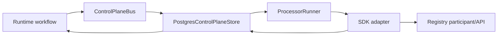

This gives long-running or retriable internal operations one lifecycle instead
of ad-hoc background tasks.

## Security And Safety

Security boundaries in the current runtime:

| Boundary | Mechanism |
| --- | --- |
| UI login | Session middleware, password/token validation, auth attempt limiting. |
| UI mutations | CSRF token from `/v1/auth/csrf`, `X-CSRF-Token` on mutating requests. |
| Agent API | Enrollment token for first enroll, issued agent token for runtime calls. |
| Registry UI shell | CSP, no framing, nosniff, referrer policy. |
| Protocol authoring internals | Skill/role checks in the registry store, not just hidden UI. |
| Artifact paths | Safe path validation and workspace-root checks. |
| Skill files | Safe relative paths, size limits, executable policy. |
| Provider credentials | Credential store and provider auth mounts, not prompt-visible secrets. |

Current role model is simple and should not be overclaimed. `ProtocolAccessContextRecord`
uses actor ref, org id, and roles such as admin, publisher, author, auditor,
operator. Multi-tenant/product role semantics are not yet a complete commercial
authorization model.

## Testing And Verification

Important test families:

| Test family | Proves |
| --- | --- |
| `tests/contracts/*` | Store contracts and cross-implementation persistence behavior. |
| `tests/test_registry_service.py` | Registry API behavior, including OpenAPI artifact contract. |
| `tests/test_registry_sdk_contract.py` | SDK client and registry contract alignment. |
| `tests/test_registry_ui_contract.py` | Static UI route/API/accessibility/product-invariant checks. |
| `tests/e2e/playwright/*.spec.js` | Browser workflow checks for registry work surfaces and protocol UI. |
| `tests/test_protocol_engine.py`, `tests/test_protocol_service.py`, `tests/test_protocol_*.py` | Protocol model, engine, rehearsal, Telegram, chaos, and properties. |
| `tests/test_telegram_*.py` | Telegram channel, presenters, runtime skills, progress, delegation. |
| `tests/test_zero_import_gates.py` | Import boundary and deleted module guardrails. |
| `tests/test_protocol_docs.py` | Documentation links and architecture coverage guardrails. |

Verification expectations for UI architecture work:

- Test static contracts first.
- Run focused route/API/unit tests for changed components.
- Run Playwright for the affected browser flows.
- Verify in real Safari at desktop and narrow widths before calling UI work done.
- When a live deployed UI looks wrong, hard-refresh Safari with macOS-specific
  refresh behavior before deciding whether code or cache is at fault.

## Extension Model

A new channel, such as Slack, should implement the SDK transport interface and
reuse the registry participant and workflow composition stack.

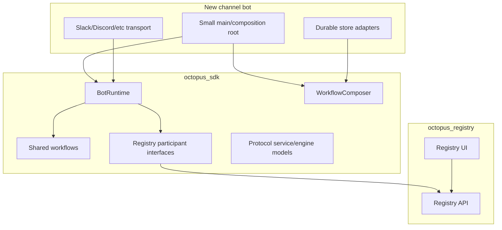

What a new channel should write:

- Transport ingress/egress and identity mapping.
- Process composition and deployment wrapper.
- Durable adapter implementations only if the existing Postgres stores are not
  reused.

What a new channel should not write:

- Delegation lifecycle.
- Protocol state machine.
- Event taxonomy.
- Skill/guidance lifecycle.
- Registry management protocol.
- Provider execution orchestration.

## Architecture Rules

1. `octopus_sdk/` is the shared contract layer and imports neither `app/` nor
   `octopus_registry/`.
2. `app/` imports `octopus_sdk/` only for shared behavior. It must not import
   `octopus_registry/`.
3. `octopus_registry/` imports `octopus_sdk/` only for shared behavior. It must
   not import `app/`.
4. One product behavior gets one implementation path. Do not add shims,
   duplicated flows, or parallel behavior under a different name.
5. Registry UI and Telegram are peer clients over SDK/registry interfaces.
6. Protocol state is registry-owned, lifecycle decisions are SDK-engine-owned,
   and provider execution is bot-owned.
7. Tasks are an execution substrate. User-facing surfaces should render linked
   work lineage.
8. Artifacts use one action contract everywhere they are displayed.
9. Skills and guidance keep their distinct product meanings.
10. Auth, API, and UI gates must align. Hiding controls in the UI is not enough.
11. Postgres schema and store contracts are the supported durable persistence
    path.
12. Runtime workflows use injected ports; production code does not reach into
    global test fakes or singleton helpers except at approved composition
    boundaries.
13. New routes or APIs must be reflected in docs, SDK clients where relevant,
    and contract tests.
14. UI work is not complete until desktop and narrow browser behavior are
    visually verified against the actual deployed assets.

## Known Architecture Pressure Points

These are not optional features; they are areas where current code is carrying
product pressure and should be improved without creating parallel paths.

| Area | Current pressure | Direction |
| --- | --- | --- |
| Registry UI size | Large vanilla JS components, especially protocol authoring/runs. | Consolidate into shared primitives and keep one interaction grammar. |
| Tasks vs runs | Tasks are real delegation objects, but protocol stages also use tasks. | Keep task substrate; render user-facing lineage consistently. |
| Artifact availability | Content can be referenced from tasks, runs, stages, conversations, and dashboards. | One artifact row/action component and one backend content contract. |
| Protocol authoring density | Stage editing can become cognitively heavy. | Progressive inline stage editor with section tabs and state preservation. |
| Skills naming | UI says skills, runtime says skills, routing says routing skills. | Keep nouns clear and avoid duplicate lists. |
| Operator-only controls | Internal protocol knobs are dangerous in normal authoring. | Enforce in API/store and omit from default DOM. |
| Multi-tenant roles | Current role/org model is partial. | Harden role/permission model before commercial multi-tenant deployment. |
| Browser verification | Cache and viewport differences have hidden regressions. | Real Safari desktop/narrow audit is part of release verification. |
