# Architecture

This document explains the current system shape: the main components, the
boundaries between them, the key data types, and the rules changes must
preserve. It is architecture, not a changelog. Current implementation status
lives in [status.md](status.md).

For setup and day-to-day use, start with [README.md](../README.md).

Current shipped baseline: **Phase 15 Slice 1** runs in **Local Runtime**.
The normal deployment is SQLite-backed with `BOT_DATABASE_URL` unset.
Postgres is a supported alternate backend for the same runtime contract when
`BOT_DATABASE_URL` is set. Shared Runtime is not part of the current product
surface.

If you only remember four things, remember these:

- normal chat requests are admitted durably and executed by the worker
- credential-setup replies stay inline and off-queue
- running work is cancelled through the worker-owned live registry
- queued fresh work can be cancelled through the durable queue before claim

Quick orientation:

- **Runtime matrix:** Local Runtime with SQLite is the default. Local Runtime
  with Postgres is supported. Shared Runtime is future work.
- **Backend seam:** `app/runtime_backend.py` chooses the backend.
  `storage.py` and `work_queue.py` stay backend-neutral.
- **Contract suites:** `tests/contracts/test_session_store_contract.py` and
  `tests/contracts/test_transport_store_contract.py` define backend-neutral
  behavior.
- **Primary E2E gate:** `test_compose_sqlite_local_runtime_primary` verifies
  the main Docker path.

---

## System context (high-level)

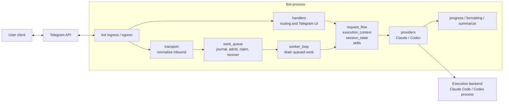

---

## What The Bot Owns

Telegram Agent Bot is a Telegram interface for a local coding agent.

It is responsible for more than passing text to a CLI. It also owns:

- approval and retry workflows
- skill and credential management
- per-chat session state
- per-chat project and file policy
- trust-tiered access (`trusted | public`) when open mode is enabled
- user-facing model profiles that resolve to provider-specific model IDs
- durable work-item queue with crash recovery
- transport delivery guarantees for burst traffic and duplicate delivery
- normalized progress events rendered once for Telegram
- Telegram-safe rendering and progressive disclosure for long responses
- operator visibility and health reporting

In plain terms:

1. Telegram is the user interface.
2. Claude Code or Codex is the execution backend.
3. The bot resolves one authoritative execution context before invoking the provider.
4. The bot stores the state needed to make approval, retry, recovery, and output behavior consistent.

---

## Main Boundaries

The runtime is easiest to reason about if you treat it as eight ownership
boundaries. Each one owns a distinct kind of decision. Code should not skip
across those ownership lines.

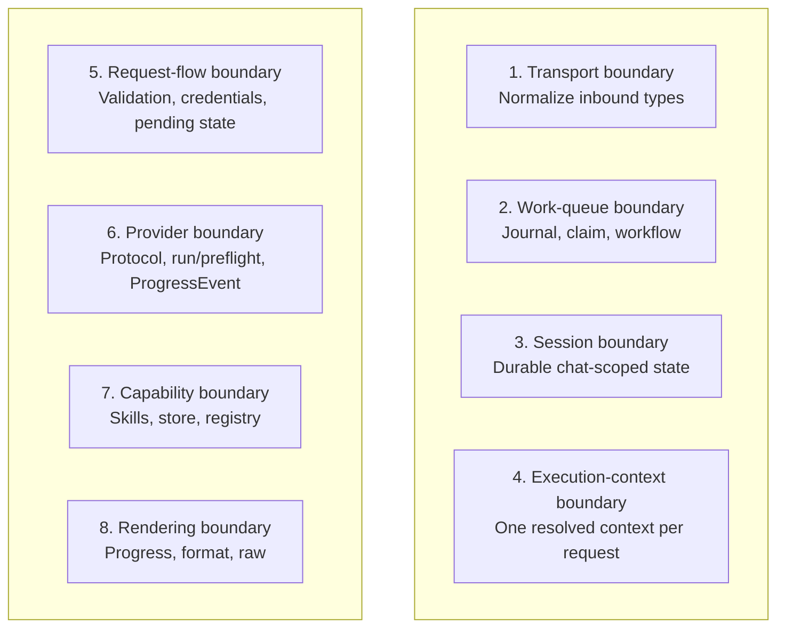

### 1. Transport boundary

This boundary turns Telegram-shaped input into project-owned inbound types
before business logic runs.

Primary module: `app/transport.py`

Inbound types:

- `InboundMessage` — text + attachments
- `InboundCommand` — slash command with parsed args
- `InboundCallback` — inline keyboard callback

This boundary guarantees:

- transport normalization extracts user, chat, command, callback, text,
  and attachments into frozen dataclasses
- business logic never depends on raw Telegram payload structure when a
  normalized type exists
- `serialize_inbound()` / `deserialize_inbound()` round-trip events to JSON
  for durable storage in the work queue
- serialized inbound payload shapes are part of the runtime cutover contract
  and must remain stable across the supported SQLite and Postgres backends;
  any optional import/export tooling added later will depend on the same
  shape stability

**Transport seams**

The current transport architecture has two project-owned seams:

- `app/transport.py` owns normalized inbound event types and
  `serialize_inbound()` / `deserialize_inbound()`
- `app/transports/` owns the incremental transport-port work:
  `InboundEnvelope`, `ConversationIO`, `EditableMessageHandle`,
  `TransportCapabilities`, the admission seam, and the Telegram outbound adapter

The current limitation is explicit: transport abstraction is only partially
adopted. Fresh plain-message admission uses `InboundEnvelope`; worker-owned
outbound output uses `ConversationIO`; handler-owned replies and callback
handling still use PTB-shaped objects directly.

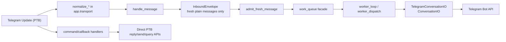

**Project-owned transport interfaces**

- `InboundEnvelope`
  - fields: `transport`, `update_id`, `conversation_id`, `actor_id`,
    `received_at`, `event`
  - `event` reuses `InboundMessage`, `InboundCommand`, or `InboundCallback`
  - current use: authoritative admission type for fresh plain-message ingress
- `ConversationIO`
  - methods: `send_text`, `send_photo`, `send_document`, `send_action`,
    `answer_action`
  - current use: worker-owned outbound send path
- `EditableMessageHandle`
  - methods: `edit_text`, `edit_reply_markup`
  - current use: worker-owned status/progress edits
- `TransportCapabilities`
  - capability flags for edit, answer, and media support
  - current use: adapter contract surface for future transport expansion

**Current handler vs worker split**

- Fresh plain-message ingress:
  - `handle_message()` normalizes via `app.transport`
  - credential/setup replies are handled inline and off-queue
  - ordinary fresh plain messages are wrapped in `InboundEnvelope`
  - `app/transports/admission.py` calls the durable queue through
    `record_and_admit_message()`
- Commands and callbacks:
  - still normalize and execute through Telegram/PTB-shaped handler entrypoints
  - command dedupe/enqueue remains handler-owned
  - callback answer/edit behavior remains handler-owned
  - some provider-starting follow-up paths still remain inline:
    approval approve, retry, and recovery replay do not yet use the worker-owned
    fresh-message lane
- Worker-owned outbound path:
  - `worker_dispatch()` uses `TelegramConversationIO`
  - progress, final replies, recovery notices, and worker-owned edits go
    through the project-owned outbound port
- Handler-owned outbound path:
  - welcome/help/command/callback replies still use direct PTB message/chat/query
    methods

**Current simulator architecture**

The simulator is a handler-level harness, not a transport-ingress adapter.

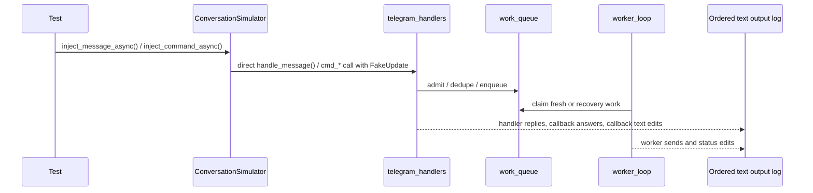

Current simulator contract (`tests/support/conversation_simulator.py`):

- runs the real worker loop
- injects via `handle_message()` / `cmd_*` directly
- exposes one ordered **text** output log covering:
  - `reply_text`
  - `edit_text`
  - `chat.send_message`
  - `reply_photo` / `reply_document` captions or placeholders
  - bot `send_message` / `send_photo` / `send_document`
  - bot message `edit_text`
  - callback `answer`
  - callback `edit_message_text`
- does **not** include markup-only edits (`edit_message_reply_markup`)
- does **not** yet drive ingress through `InboundEnvelope`
- does **not** yet provide callback injection as a first-class simulator API

Canonical simulator coverage in `tests/test_simulator_e2e.py` proves:

- message -> long-running worker-owned execution -> `/cancel`
- cancel before worker claim
- second-message busy / anti-fan-out
- credential reply stays off queue
- recovery notice path does not call the provider

### 2. Work-queue boundary

All inbound updates are journaled through a durable work queue before
provider-starting work is processed. Fresh plain-message execution is admitted
through the queue and executed from the worker-owned path; recovered stale work
is routed through explicit recovery handling. This is the main delivery and
admission authority for fresh provider work.

Primary modules:

- `app/work_queue.py` — journal, claiming, compare-and-update, recovery adapter
- `app/worker.py` — async loop that drains unclaimed items
- `app/workflows/transport_recovery.py` — workflow graph and transition legality (library)
- `app/workflows/results.py` — `TransitionResult`, `TransportDisposition`, domain exceptions

Current implementations:

- Local Runtime default: SQLite `transport.db`
- Local Runtime alternate backend: Postgres `bot_runtime.updates` and
  `bot_runtime.work_items`

`app/work_queue.py` is the backend-neutral contract owner across both.

Tables:

- `updates` — every received `update_id`, with payload and state
- `work_items` — processable units derived from updates, including durable
  `dispatch_mode` routing metadata (`fresh` or `recovery`)

**Transport workflow**

`TransportRecoveryMachine` owns transition legality. The repository owns SQL,
idempotency, compare-and-update, and the repository-level outcome
`already_handled` (row missing or no longer in source state after a failed
update). The machine stays pure: no SQL or I/O in validators or actions.
`run_transport_event(...)` executes the machine and maps validation outcomes to
`TransitionResult`.

Work-item state machine:

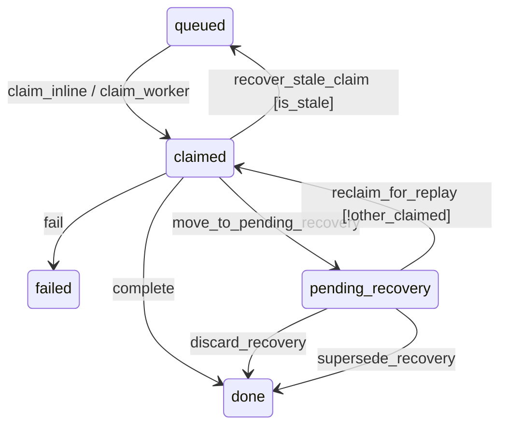

Events (machine methods): `claim_inline`, `claim_worker`, `complete`, `fail`,
`move_to_pending_recovery`, `recover_stale_claim`, `reclaim_for_replay`,
`discard_recovery`, `supersede_recovery`. Guards: per-chat single-claimed
(no claim/reclaim if another item for same chat is claimed); same-worker
re-claim is allowed (disposition `already_claimed_by_worker`); recover only
when repository sets `is_stale=True`.

Control-flow exceptions:

- `LeaveClaimed` — process shutting down; item stays claimed for recovery
  on next boot
- `PendingRecovery` — item needs user decision (replay/discard); worker
  skips completion
- `ReclaimBlocked` — replay attempted but another item for the same chat
  is already claimed

What this boundary guarantees:

- duplicate `update_id` delivery is `transport idempotency` (journaled, not
  reprocessed)
- fresh provider-starting message admission is durable and atomic:
  `record_and_admit_message()` returns `duplicate`, `busy`, or `admitted`
- at most one fresh runnable (`queued` or `claimed`) provider-starting work
  item may exist per chat at a time
- when a chat already has fresh runnable work, the next fresh message is
  recorded and rejected/coalesced as terminal `failed/chat_busy`, not queued
  behind the active work
- a queued fresh item may be cancelled before worker claim through the durable
  queue (`cancel_queued_fresh_for_chat()`), distinct from in-memory live-run
  cancellation
- per-chat execution is serialized durably through the queue and `_chat_lock`
  inside the worker-owned path
- worker loop is now the primary owner of fresh provider execution; inline
  handler-owned execution remains only for setup/special-case flows and some
  callback-driven follow-up actions
- `claim_next_any()` / backend equivalents provide atomic worker claiming
  across concurrent tasks/processes
- `content dedup` is not part of this boundary; if added later it sits above
  the durable queue as explicit user-visible policy
- the queue remains application-owned through the Postgres migration; generic
  broker adoption is intentionally out of scope for the core request path
- multiple polling processes for the same token are detected and warned
  about, not supported

**Transport invariants**

These are the runtime invariants. DB checks and the shared row validator enforce
them. Invalid state is surfaced as corruption, not normalized into a benign
outcome.

- `work_items.state` must be one of: `queued`, `claimed`, `pending_recovery`, `done`, `failed`.
- `work_items.dispatch_mode` must be one of: `fresh`, `recovery`.
- If `state == "claimed"`, then `worker_id` must be present.
- If `state == "claimed"`, then `claimed_at` must be present.
- At most one `claimed` row may exist per chat.
- At most one `fresh` runnable (`queued` or `claimed`) row may exist per chat.
- Corruption is surfaced (e.g. `TransportStateCorruption`), not normalized to `already_handled`.
- Replay/discard must never lie about ownership or terminal outcome.
- A recovered stale claim must be requeued as `dispatch_mode='recovery'`, not
  as plain fresh work.
- A queued fresh cancel must terminate the admitted work item as
  `failed/error='cancelled'`; it must not silently disappear.
- The machine owns legal transitions; the repository owns races, idempotency, and `already_handled`.
- `completed_at` is set only when a work item reaches a terminal state (`done` or `failed`); it is not set on `move_to_pending_recovery`.

**Transport schema and backend contract**

- SQLite `transport.db` has a versioned schema and local validation/migration
  for supported layouts
- Postgres uses `sql/postgres/` migrations for the same durable transport
  contract
- Both backends must satisfy the same transport-store contract suites
- Unsupported schema/layout fails fast with a neutral error

### 3. Session boundary

Session state is durable and chat-scoped.

Primary modules:

- `app/session_state.py` — typed models (`SessionState`, `PendingApproval`,
  `PendingRetry`, `AwaitingSkillSetup`)
- `app/storage.py` — current session-store adapter, session listing, upload
  paths

Current implementations:

- Local Runtime default: SQLite `sessions.db` (WAL mode, schema-versioned)
- Local Runtime alternate backend: Postgres `bot_runtime.sessions`

`app/storage.py` is the backend-neutral session-store owner across both.

This boundary guarantees:

- runtime orchestration operates on typed session objects
- handler and request logic should not mutate raw dict session state
- user-selected runtime controls (project binding, file policy, compact mode,
  model profile) belong here
- authorization policy does not belong here; trust tier is resolved per request

**Project and settings UX**

Project binding and session settings are part of the same durable chat-scoped
session contract. The current authoritative fields are:

- `SessionState.project_id`
- `SessionState.model_profile`
- `SessionState.file_policy`
- `SessionState.compact_mode`

`ProjectBinding` (in `app/session_state.py`) carries per-project inherited
defaults: `file_policy` and `model_profile`. These are parsed from
`BOT_PROJECTS` using `|`-separated optional fields:
`name:/path[|file_policy[|model_profile]]`.

Resolution order (applied in `resolve_execution_context`):

- **file_policy:** session explicit > project default > "" (edit)
- **model_profile:** session explicit > project default > config default > config.model

`/policy inherit` and `/model inherit` clear session-explicit overrides,
returning to project or global defaults. The same semantics are available via
`setting_policy:inherit` and `setting_model:inherit` callbacks.

Current mutating entry points live in `app/telegram_handlers.py`:

- command handlers:
  - `cmd_project`
  - `cmd_model` (including `inherit` subcommand)
  - `cmd_policy` (including `inherit` subcommand)
  - `cmd_compact`
- inline callback handler:
  - `handle_settings_callback` (handles `setting_model:inherit`, `setting_policy:inherit`)

Preferred inline-callback shape:

- Keep one settings callback namespace and one handler-owned mutation path.
- Extend the existing `setting_*` callback family for future discoverability
  work (for example project selection/clear) instead of introducing a second
  project-specific callback subsystem.

Rules for this boundary:

- `/settings` is a discoverability surface over these existing
  fields and mutations, not a second configuration system.
- Commands and inline callbacks must converge on the same mutation semantics:
  acquire `_chat_lock(...)`, load `SessionState`, mutate the existing fields,
  apply reset/invalidation rules, and `_save(...)`.
- Project and settings UI must not bypass the typed session boundary or create
  raw-dict mutation paths.
- No additional workflow state machine belongs here. This is synchronous
  session mutation, not a second workflow engine.

Reset and invalidation rules:

- Changing `project_id` resets provider session state and clears pending
  approval/retry state.
- Changing `file_policy` resets provider session state and clears pending
  approval/retry state.
- Changing `model_profile` relies on the existing `ResolvedExecutionContext`
  and `context_hash` invalidation contract; no second invalidation mechanism is
  allowed.
- Changing `compact_mode` is a rendering preference and does not reset
  provider session state.

Trust/public contract:

- Public-mode restrictions for project and policy changes stay at the existing
  handler gates (`_public_guard(...)`) and model-resolution layer
  (`resolve_effective_model(...)` public profile restrictions).
- Settings discoverability must not introduce a second public/trusted policy
  tree in callbacks or markup code.

### 4. Execution-context boundary

There is one authoritative resolved execution context per request.

Primary module: `app/execution_context.py`

This boundary guarantees:

- all context-sensitive behavior derives from the same resolved object
- context hash is computed in one place only
- approval validity, retry validity, provider thread invalidation, and
  `/session` must all agree on the same execution identity
- public/open execution-scope restrictions resolve here, not in handlers
- effective model selection resolves here, not inside providers
- downstream functions receive resolved fields — never raw `session.*` or
  `config.*` for working_dir, active_skills, file_policy, extra_dirs, or
  project_id

### 5. Request-flow boundary

Request orchestration is business logic, independent of Telegram transport
details.

Primary modules:

- `app/request_flow.py` — validation, credential satisfaction, pending
  validation, denial handling
- `app/approvals.py` — pure functions for preflight prompt building and
  denial formatting
- `app/workflows/pending_request.py` — pending approval/retry workflow graph
  and transition legality (library)

This boundary guarantees:

- `check_credential_satisfaction` receives the resolved active_skills list,
  not the raw session
- `classify_pending_validation()` is the authoritative classifier for pending
  freshness (`ok`, `expired`, `context_changed`)
- pending approval/retry transition legality is owned by
  `PendingRequestMachine`; handlers choose the event (`approve_execute`,
  `expire`, `invalidate_stale`, `reject`, `cancel`) and then persist or clear
  session state
- `validate_pending` remains the user-facing message layer built on the same
  classification rules, not a second source of truth
- pending validation reads trust_tier from the stored pending state so the
  context hash is recomputed with the same identity shape that created it
- handlers decide how to render outputs and buttons, not how business rules
  work

### 6. Provider boundary

Providers implement a shared protocol and receive only provider-facing
contexts.

Primary modules:

- `app/providers/base.py` — protocol, `RunResult`, `PreflightContext`,
  `RunContext`, `ProgressSink`
- `app/providers/claude.py`
- `app/providers/codex.py`

This boundary guarantees:

- providers do not resolve session or project state
- provider contexts are already resolved before invocation
- health checks are split into cheap local checks and runtime probes
- providers emit `ProgressEvent` instances (see rendering boundary);
  they never build display HTML directly

### 7. Capability boundary

Skills, credentials, provider config fragments, and the managed store are the
capability layer on top of raw provider execution.

Primary modules:

- `app/skills.py` — skill catalog, loading, resolution
- `app/store.py` — managed skill installation and GC
- `app/registry.py` — remote artifact download and digest verification
- `app/skill_commands.py` — Telegram commands for skill management

This boundary guarantees:

- skill resolution is deterministic: custom > managed > built-in
- managed skills are immutable content-addressed objects behind refs
- credentials are per-user and loaded only at execution time

### 8. Rendering boundary

The bot owns adaptation from model output to Telegram-safe output, including
both final responses and in-flight progress.

Primary modules:

- `app/formatting.py` — Markdown-to-Telegram HTML conversion, message
  splitting, table rendering
- `app/summarize.py` — compact-mode summarization, raw-response ring buffer,
  chat history export
- `app/progress.py` — normalized progress event family and shared HTML
  renderer

**Progress contract**

Both providers map raw CLI events to a shared `ProgressEvent` family:

```
Thinking          Model reasoning, no visible output yet
CommandStart      Shell command execution started
CommandFinish     Shell command completed (exit code, output preview)
ToolStart         Non-command tool invocation started
ToolFinish        Non-command tool invocation finished
ContentDelta      Visible reply text arriving (with recent tool activity)
DraftReply        Intermediate agent commentary
Denial            Tool call or action blocked by sandbox/permissions
Liveness          Provider heartbeat (long compaction, resume timeout)
```

The shared `render()` function owns all user-facing HTML wording. Providers
call `render_progress(event)` — they never construct display HTML directly.

- Codex maps raw events via `CodexProvider._map_event()` (classmethod)
- Claude maps events inline in `ClaudeProvider._consume_stream()`
- Internal events (thread IDs, session metadata) are suppressed at the
  mapping layer — `_map_event` returns `None` and the event is never rendered

**Response contract**

- compact/full response presentation is a rendering concern
- long responses use progressive disclosure: expandable blockquote (≤ 4000
  chars) or expand/collapse buttons (> 4000 chars)
- expand/collapse resolves a stable slot reference back to the raw-response
  ring buffer before re-rendering
- provider names, thread IDs, and internal details never leak into user-facing
  progress or response output

---

## Component Map

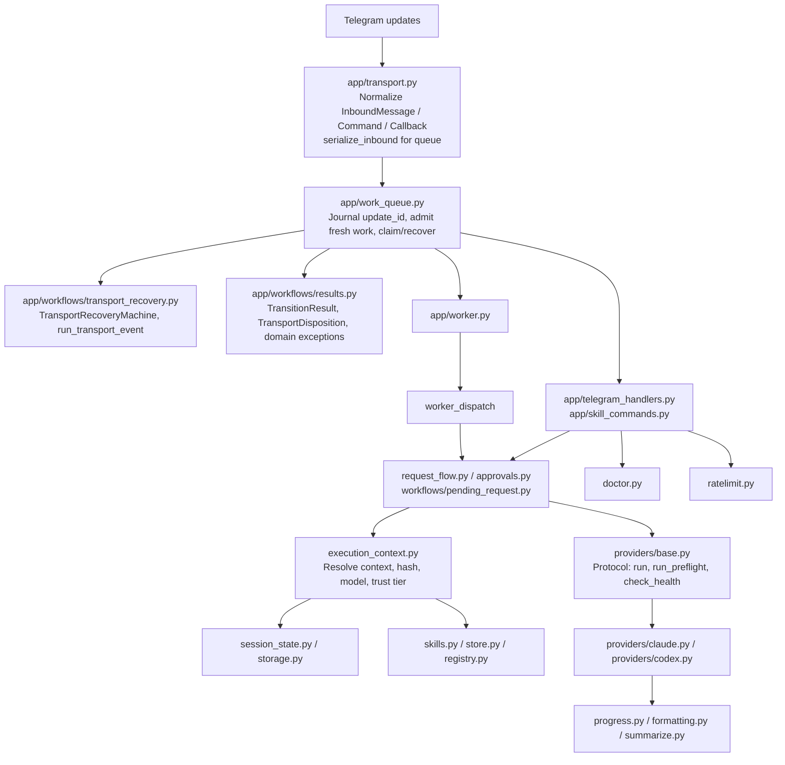

Ownership:

- transport normalizes inbound, serializes for durability
- work queue owns transport idempotency, fresh admission, claiming, queued
  cancel, and crash recovery routing
- worker drains fresh/recovered queued work and is the primary owner of fresh
  provider execution
- handlers own ingress routing, immediate Telegram I/O, setup flows, and
  callback/button rendering
- request flow owns business rules
- execution context owns resolved runtime identity
- storage owns session persistence
- providers own subprocess invocation, emit progress events
- progress owns all user-facing progress HTML wording
- formatting/summarize own response adaptation
- skills/store/registry own capabilities

---

## Sequence and Data Flow Diagrams

### End-to-end: normal message (worker-owned fresh execution)

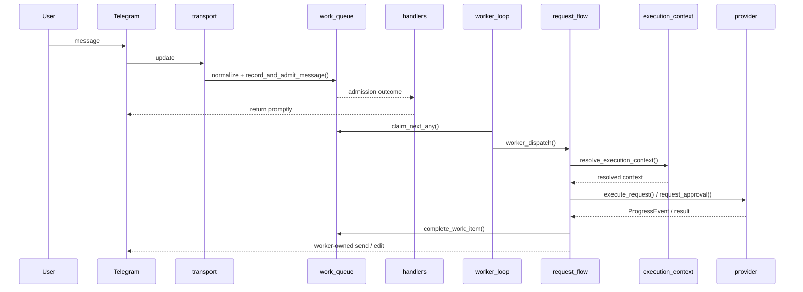

### Admission vs worker execution

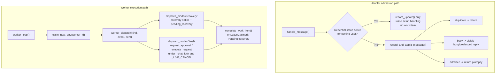

### Recovery: pending_recovery and replay/discard/supersede

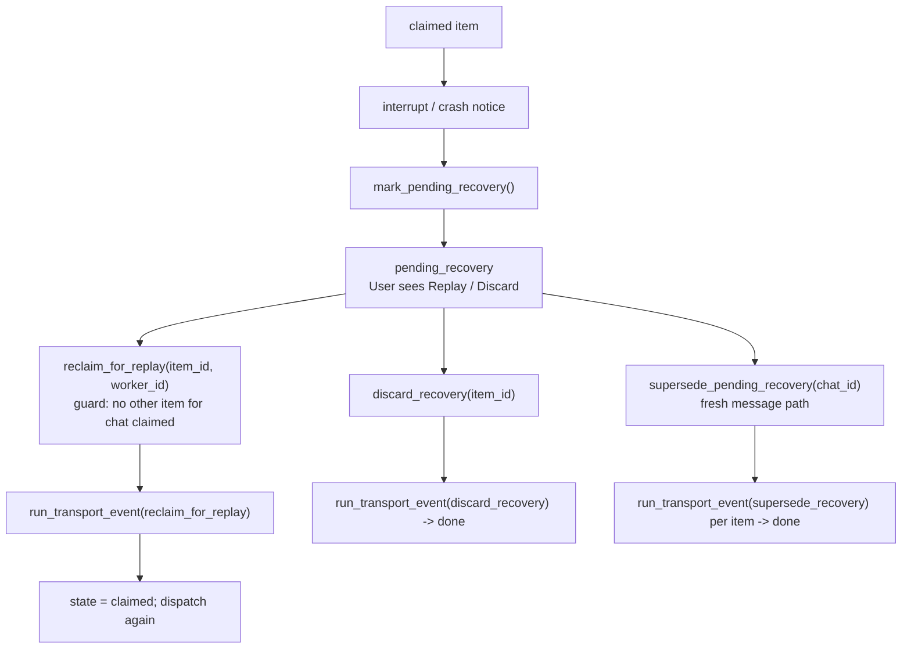

### Crash recovery: stale claims

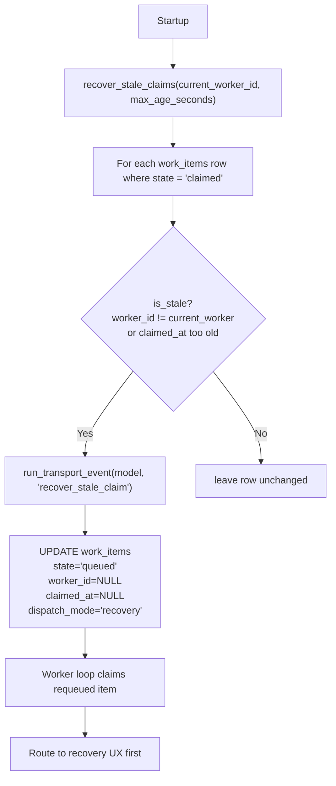

### Data flow: where data lives

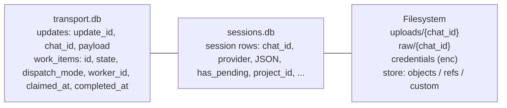

### Storage layout (shipped implementation)

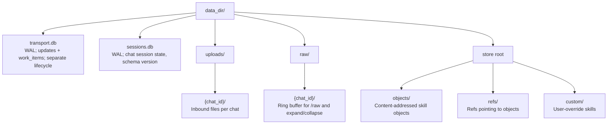

---

## Key Data Types

### SessionState

Runtime representation of a chat session. It is stored as typed session data in
the session store.

It owns:

- provider identity and provider-local state
- approval mode
- active skills and role
- project binding and file policy
- model-profile override and compact-mode override
- pending approval / retry state
- awaiting credential setup state

It does not own: user credentials, authorization policy, uploads, skill
contents, provider binaries.

### PendingApproval / PendingRetry

Pending state must carry:

- original requester identity
- original prompt and image list
- original context hash
- trust tier at creation time
- creation time

`PendingRetry` additionally carries denial records used to derive retry
permissions.

### ResolvedExecutionContext

Single authoritative execution identity. It carries:

Identity fields: role, active skills, skill digests, provider config digest,
execution config digest, base extra dirs, project id, effective working dir,
file policy, provider name.

Resolved execution controls: effective model profile, effective model ID,
trust tier, effective allowed roots / extra dirs, provider-facing working dir.

It is the source of: context hash, `/session` display, provider-facing
`working_dir`, approval/retry freshness, Codex thread invalidation.

Codex thread reuse is valid only when the resolved identity matches the stored
context hash AND the process boot ID matches the stored boot ID.

### Provider Contexts

Provider-facing contexts are intentionally narrower than session state.

`PreflightContext`: extra dirs, system prompt, capability summary, working dir,
file policy, effective model ID.

`RunContext` extends it with: provider config, credential env,
permission-bypass flag, effective model ID.

Providers do not need pending state, session timestamps, or credential setup
state.

### RunResult

Provider execution result carrying: text, returncode, timed_out,
resume_failed, cancelled, provider_state_updates, denials.

### ProgressEvent

Frozen dataclasses (one per event type) emitted by providers during execution.
Rendered to Telegram HTML by the shared `render()` function in `progress.py`.

### Transport workflow types

**TransportWorkflowModel** (mutable): built from a `work_items` row plus guard
inputs (`worker_id`, `requesting_worker_id`, `has_other_claimed_for_chat`,
`is_stale`). The machine reads and writes `state`; validators use the guard
fields; actions set `disposition`. No SQL or I/O lives here.

**TransitionResult**: `allowed`, `new_state`, `disposition`, `reason`. Returned
by `run_transport_event()`. The repository uses it to decide whether to commit
and what to return.

**TransportDisposition**: Outcome classification (ok, already_claimed_by_worker,
other_claimed_for_chat, blocked_replay, discarded, replayed, superseded,
stale_recovered, done, failed, invalid_transition, guard_failed, already_handled).
`already_handled` is repository-only (row missing or state changed by another
actor); the machine never returns it.

**Domain exceptions** (raised by machine validators, mapped by adapter to
TransitionResult): `OtherClaimedForChat`, `BlockedReplay`, `NotStaleClaim`.

### Pending-request workflow types

**PendingRequestWorkflowModel** (mutable): built from stored pending state and a
validation classification result (`ok`, `expired`, `context_changed`). The
machine reads and writes `state`; actions set the resulting disposition. No SQL
or I/O lives here.

**PendingRequestTransitionResult**: `allowed`, `new_state`, `disposition`,
`reason`. Returned by `run_pending_request_event()`. Handlers and request flow
use it to decide whether to execute, clear pending state, or surface a user
message.

**PendingRequestDisposition**: `ok`, `executed`, `rejected`, `expired`,
`invalidated`, `cancelled`, `invalid_transition`, `guard_failed`.

---

## State and Storage Model

### Durable storage

The runtime uses backend-neutral facades with two local-runtime backends.
By default, authority lives in SQLite-backed `sessions.db` and `transport.db`.
When `BOT_DATABASE_URL` is set, the same contracts are backed by Postgres.

**Current shipped `sessions.db`** — chat session state:

- session rows (chat_id PK, provider, JSON data, timestamps)
- indexed summaries (`has_pending`, `has_setup`, `project_id`, `file_policy`)

**Current shipped `transport.db`** — update journal and work items:

- `updates` table — every received `update_id` with serialized payload
- `work_items` table — processable units with state machine
  (queued/claimed/done/failed/pending_recovery)

**Filesystem** stores:

- uploads per chat (`{data_dir}/uploads/{chat_id}/`)
- encrypted credentials per user
- managed skill objects and refs (`objects/`, `refs/`, `custom/`)
- raw-response ring buffer (`{data_dir}/raw/{chat_id}/`)
- staged Codex helper scripts

### Why this split exists

- Session state needs atomic updates, indexed queries, and schema evolution.
- Files and artifacts benefit from filesystem semantics and direct provider access.
- Transport data has a different lifecycle from chat session state: it tracks
  update delivery and runnable work, not long-lived conversation state.

### Response history and progressive disclosure

The raw-response ring buffer (capacity 50 per chat) is the single source of
truth for `/raw` and expand/collapse flows.

- `save_raw()` stores prompt + raw text in a numbered slot
- `load_raw()` retrieves the latest; `load_raw_by_slot()` retrieves by slot
- slots rotate FIFO; rotated slots return `None` (expand callback shows
  "no longer available")
- rendered compact/full variants are derived views, not separate durable state

---

## Skill and Capability Architecture

### Resolution model

Skill resolution is strictly ordered:

1. custom skill override
2. managed installed skill
3. built-in catalog skill

Any feature that displays skill details must use the resolved tier.

### Managed store model

Managed skills are stored as immutable content-addressed objects with logical
refs.

- install/update are ref operations, not in-place mutation
- GC removes unreferenced objects conservatively
- schema guard protects incompatible managed-store versions

### Registry model

The registry is a source of managed artifacts:

- artifact downloaded to staging
- digest verified before object creation
- only verified content becomes a managed object/ref

---

## Main Request Flows

### Normal request


Steps in order:

1. normalize inbound message
2. authorize user, resolve trust tier
3. if this is a credential-setup reply for the owning user:
   record the update for dedupe only and handle setup inline, then stop
4. otherwise journal update and atomically admit or reject fresh provider work
5. if admitted, return promptly; worker later claims the fresh work item
6. load and normalize session in the worker-owned path
7. resolve execution context (with trust tier)
8. check credential satisfaction (using resolved active_skills)
9. build provider context (from resolved context)
10. invoke provider (progress events rendered via shared renderer)
11. persist updated session state
12. format and send response (compact mode, tables, progressive disclosure)
13. save raw response to ring buffer
14. deliver directed artifacts (using resolved allowed roots)

### Approval request

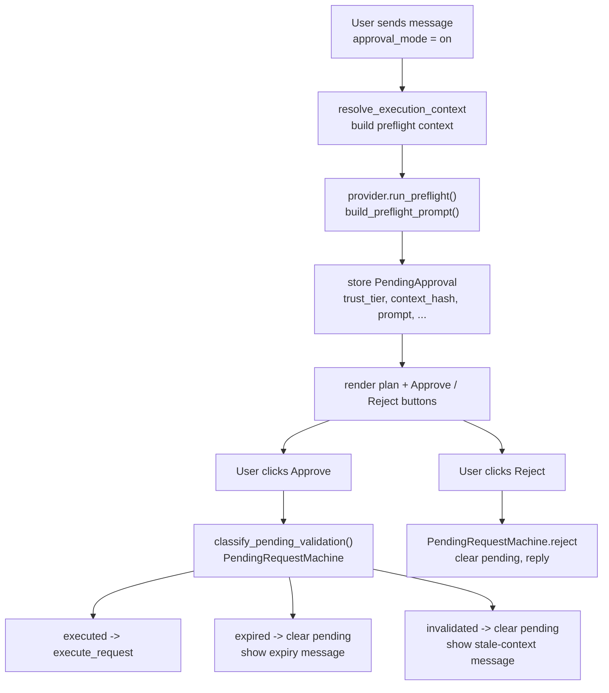

Approval succeeds only if: pending exists, not expired, context hash matches
(recomputed with stored trust_tier).

### Retry request

Same validation as approval, plus retry-specific permission scope from
denials.

### Credential setup

Credential setup is conversational state, not a hidden side effect.

- only the owning user may continue setup
- foreign setup blocks are visible and explain who is active
- one credential-setup flow per shared chat at a time
- abandoned foreign blocks auto-expire
- captured credentials are deleted from chat after processing
- execution loads credentials for the request user, not the clicker

### Transport delivery and recovery

- one active ingress owner per bot token
- duplicate `update_id` delivery is `transport idempotency` (journaled, not
  reprocessed)
- per-chat fresh provider admission is enforced durably at the queue boundary
- bursty same-chat traffic gets explicit busy/coalesced feedback; extra fresh
  provider runs are not admitted silently
- fresh queued work may be cancelled before worker claim through the queue
- live claimed work is cancelled cooperatively through the worker-owned live
  registry
- crash recovery: `recover_stale_claims()` requeues items left in `claimed`
  state by a dead worker as `dispatch_mode='recovery'`
- pending_recovery items require explicit user action (replay or discard)
- `content dedup` is not part of this contract; if added later it is optional
  behavior layered above durable delivery

Scaling path now has two explicit tiers:

- **Local Runtime**: single-machine authority, simpler
  deployment, SQLite by default, Postgres optional, and no shared
  queue-authority requirement.
- **Shared Runtime**: webhook ingress plus shared Postgres queue
  authority plus worker loop as primary processing path.

### Workflow ownership

Both workflow families already have explicit owners:

- `TransportRecoveryMachine` in `app/workflows/transport_recovery.py`
- `PendingRequestMachine` in `app/workflows/pending_request.py`

Ownership split:

- library-backed workflow modules own transition legality, guards, and
  disposition classification
- repository/session code owns persistence, compare-and-update, and
  repository-only outcomes such as `already_handled`
- handlers and request flow orchestrate user-visible outcomes but do not define
  transition legality

---

## Access and Safety Model

### User authorization

Only allowed users may interact. When open mode is enabled, users resolve to:

- `trusted`: users in the allowed-user set
- `public`: everyone else

### Admin authorization

A narrower set of users may manage store-backed skills and inspect broader
session state.

### Approval mode

Controls whether execution requires preflight plan review.

### File policy

Controls whether the session is inspect-only or may edit.

### Project binding

Controls which working directory is in scope.

### Allowed roots

Derive from the resolved execution context:

- `resolved.working_dir` (project root, public root, or default)
- `resolved.base_extra_dirs` (empty for public users)
- chat upload dir
- denial-derived retry dirs

Must be computed from `ResolvedExecutionContext`, not raw config.

### Public-trust enforcement

Two layers:

**Execution-scope (in `resolve_execution_context`):** forced inspect policy,
forced public working dir, stripped extra dirs, stripped skills, disabled
project binding. These flow automatically into provider context, context hash,
approval/retry freshness, credential satisfaction, file roots, and artifact
delivery.

**Command-availability (in handlers):** disabled skill management, disabled
project changes, constrained `/send`, restricted model profiles. Public users
see only profiles in `public_model_profiles`.

---

## Provider Responsibilities

Providers are responsible for:

- command construction and subprocess execution
- mapping raw CLI events to `ProgressEvent` instances
- provider-local state updates (thread_id, session state)
- health probes (local + runtime)
- respecting working_dir, extra_dirs, file_policy, effective model

They are not responsible for: session persistence, approval decisions,
credential prompting, skill discovery, progress HTML wording.

### Claude-specific

- session-oriented backend
- inspect mode is best-effort via prompt/context restriction
- maps stream-json events to progress events inline in `_consume_stream()`

### Codex-specific

- thread-oriented backend
- inspect mode hard-enforced through sandbox selection
- thread invalidation depends on authoritative context hash + boot ID
- maps NDJSON events via `_map_event()` classmethod

---

## Health and Admin Components

### doctor.py

Shared health-orchestration layer for Telegram `/doctor` and CLI entry point.

Owns: config validation, provider health, managed-store health, stale session
scanning, per-chat skill validation, public-mode diagnostics (rate limits,
public root, trust profiles), transport diagnostics (polling-conflict
detection).

### Admin views

Reporting surfaces over current durable state: `/admin sessions`, session
summaries, stale pending and setup visibility.

---

## Testing Architecture

The test suite is organized around contracts, not just features.

### Four-layer model

1. Pure or owner suites
   - workflow machines, execution context, request-flow rules, providers,
     progress, formatting, and other backend-neutral contracts
   - no Postgres required
   - no app container required
2. In-process integration
   - real handlers, real request flow, real repositories or stores, fake
     Telegram-shaped transport doubles, fake providers, and real local
     persistence
   - SQLite still appears here for fast owner and handler coverage that uses
     `fresh_data_dir`
   - worker-owned execution is exercised explicitly via worker-drain helpers
     and background worker-loop helpers; tests do not rely on hidden inline
     execution from `handle_message()`
   - Postgres-backed persistence and queue integration now has its own suites
3. Postgres bootstrap and repository integration
   - `test_db_postgres.py`, `test_storage_pg.py`, and `test_work_queue_pg.py`
   - real Postgres, real schema bootstrap/update/doctor, real connection pool
   - focused on runtime storage, bootstrap/update rules, and schema validation
4. E2E
   - Compose-based smoke layer in `tests/e2e/test_compose_flows.py`
   - bootstrap, doctor, and startup validation of the tooling/runtime contract
   - bot-container tests use the real provider-enabled image when built (and
     prove provider + execution path where possible), or the stub image for
     test/dev-only smoke

### Transport and simulator architecture

The current transport architecture deliberately separates three concerns:

1. **Inbound normalization**
   - `app/transport.py` owns Telegram-to-domain normalization into frozen
     inbound event types
2. **Durable admission and worker execution**
   - fresh plain-message admission is expressed through `InboundEnvelope`
     and the admission seam
   - worker-owned provider execution and worker-owned outbound output use the
     project-owned transport port
3. **Handler-owned Telegram UI**
   - command, callback, and immediate reply behavior still sits directly on the
     Telegram/PTB surface

That means the simulator is best understood as a **handler-level runtime
harness**:

- it exercises the real queue, worker loop, and provider path
- it does not simulate PTB dispatcher internals
- it does not yet simulate transport ingress by constructing and delivering
  `InboundEnvelope` objects end-to-end

The remaining architectural gap is narrow and explicit:

- unify handler-owned outbound messaging behind `ConversationIO`
- add first-class callback injection to the simulator
- optionally move from direct handler injection to a transport-level delivery
  harness without making PTB internals the primary contract

### Postgres test harness

The Postgres integration harness is intentionally separate from app runtime
configuration.

- Docker is required for Postgres integration suites.
- The harness starts a dedicated **test-only** Postgres container per
  pytest-xdist worker.
- Each worker gets its own database inside that container.
- Schema is applied once per worker DB.
- Runtime tables are truncated between tests.
- The harness never uses `BOT_DATABASE_URL`, dev, staging, or production
  databases for truncation or schema mutation.
- The current implementation uses one dedicated container per worker, not one
  shared Postgres service for all workers.

### Owner suites and cross-cutting tests

The suite structure aims for one owner suite per contract:

- one primary owner suite per contract
- `test_invariants.py` only for genuinely cross-cutting rules
- overflow and edge-case suites should be folded back into owner suites rather
  than kept as permanent parallel test taxonomies

Current owner families:

- request and approval contracts:
  `test_request_flow.py`, `test_pending_request_workflow_machine.py`,
  `test_handlers_approval.py`
- handler surfaces:
  `test_handlers.py`, `test_handlers_*`
- transport and recovery:
  `test_transport.py`, `test_work_queue.py`, `test_work_queue_pg.py`,
  `test_workitem_integration.py`, `test_transport_workflow_machine.py`
- storage and store:
  `test_storage.py`, `test_storage_pg.py`, `test_store.py`,
  `test_store_e2e.py`, `test_registry.py`
- provider and rendering contracts:
  `test_claude_provider.py`, `test_codex_provider.py`, `test_progress.py`,
  `test_formatting.py`, `test_summarize.py`
- configuration and setup:
  `test_config.py`, `tests/test_setup.sh`
- **operator shell scripts** (provider_login, provider_status, provider_logout,
  container_provider_login): `tests/test_docker_ops.sh` — fast shell contract
  tests with mocked `docker`, `python`, `claude`, and `codex`; pins argv, env
  propagation, and doctor failure output. Compose/E2E covers the heavier
  runtime and bootstrap path.

### Backend coverage and Local Runtime testing

- SQLite is the default shipped backend and remains the fast path for
  in-process integration coverage.
- Postgres-backed suites validate the supported alternate backend under the
  same storage and transport contracts.
- Compose E2E keeps the SQLite local-runtime path as the primary gate, with
  bounded Postgres startup/bootstrap coverage.
- App-container testing still belongs only in the small E2E layer, not in the
  normal integration loop.

---

## Deployment and dependencies

The bot’s Python dependencies live in **`requirements.txt`**. The normal
runtime path is Docker, and the same dependency set also supports host-side
debugging and tests.
- **Current runtime contract:** Local Runtime is the supported deployment mode.
  Leave `BOT_DATABASE_URL` unset for SQLite (default), or set it to a
  Postgres DSN to use Postgres as the backend for the same product/runtime
  contract. The app validates backend compatibility at startup.
- **Optional Postgres workflows:** explicit repo-owned DB commands
  (`scripts/db_bootstrap.sh`, `scripts/db_update.sh`, `scripts/db_doctor.sh`)
  prepare and verify Postgres before the bot starts when `BOT_DATABASE_URL` is
  set.
- **Environment identity:** Each running bot environment has its own database,
  config, Telegram token, and app instance identity. Side-by-side dev/staging
  environments use separate databases, regardless of whether the environment is
  running in Local Runtime or Shared Runtime mode.
- **Responsibilities are explicit:**
  1. infrastructure provides the runtime substrate for the selected mode
  2. repo-owned DB/runtime commands apply schema and validate compatibility
  3. the app validates and runs; it does not create the DB, role, or schema at startup
- **Primary operational model:** Dockerized bot is the main operator path.
  `./scripts/guided_start.sh` is the main zero-to-running path for SQLite Local
  Runtime. `./scripts/dev_up_postgres.sh` exists for the alternate Postgres
  backend.
- **Supported bot image:** The supported Docker path uses a **real provider-enabled
  image** (includes the chosen Claude or Codex CLI). Build it with
  `./scripts/build_bot_image.sh`; the script selects the image target from
  `BOT_PROVIDER` so operators don’t choose Docker targets manually. Built from
  `Dockerfile.bot` (shared base + provider-specific stage). A **stub-provider
  image** (`Dockerfile.runnable`) exists only for **test/dev smoke** (e.g. E2E
  when the real CLI is unavailable) and is not the supported runtime.
- **Provider authentication contract:** Docker-first operation keeps the real
  provider CLI inside the image, but **auth state is not baked into the image**:
  1. a guided repo-owned provider-login step runs **inside the same bot image**
  2. login state is persisted in a dedicated **bot-home Docker volume**
  3. the runtime bot service mounts that same volume
  4. startup and `/doctor` validate not only binary presence but provider
     runtime/auth health before the bot is treated as ready
  This keeps the product Docker-first while preserving the subscription-style
  CLI login model for Claude Code and Codex.
- **Provider-login ownership:** The supported onboarding flow is one
  uniform repo-owned command (for example `scripts/provider_login.sh`) that
  reads `BOT_PROVIDER`, launches the provider-specific login flow in-container,
  then verifies provider health using the same image + volume pair that the
  runtime bot will use. Operators should not need to know provider-specific
  credential file paths or Docker internals.
- **Bot-home volume and entrypoint:** The bot container uses a persistent
  `bot-home` volume mounted at `/home/bot`. The image runs an entrypoint that
  chowns `/home/bot` to the bot user (uid 1000) then execs as that user, so
  provider auth and data persist across runs regardless of volume creation
  order. Login/setup and runtime use the same image and volume.
- **Host-run bot:** Still supported as a secondary fallback/debug path with the
  same Local Runtime contract above the storage boundary.
- **Later environments:** staging and production may choose Local Runtime or a
  future Shared Runtime while keeping explicit bootstrap/update/doctor
  contracts for the selected mode.

See [README.md](../README.md) for Get Started and "After updating (git pull)".

---

## Interfaces That Must Stay Stable

The following are internal contracts that should only change deliberately:

- `SessionState`
- `PendingApproval` / `PendingRetry` (including `trust_tier` field)
- `ResolvedExecutionContext`
- `PreflightContext` / `RunContext`
- `Provider` protocol and `RunResult`
- `ProgressEvent` family and `render()` contract
- serialized inbound payload JSON shape used by the durable work queue
- `check_credential_satisfaction` signature (resolved active_skills)
- `validate_pending` signature (trust_tier from stored pending)
- work-item state machine (queued/claimed/done/failed/pending_recovery) and
  `TransportRecoveryMachine` events/guards; `run_transport_event()` adapter
- transport delivery semantics (`update_id` handling, claiming rules)
- managed store layout (`objects/`, `refs/`, `custom/`)
- registry index format versioning
- ring-buffer slot format (used by expand/collapse callback data)

Changing these should trigger both code review and invariant test updates.

---

## Execution Order Constraints

If you are reworking the runtime, preserve this order:

1. normalize transport (inbound types)
2. journal updates and enforce transport idempotency (durable work queue)
3. handle credential-setup replies inline and off-queue when setup state owns
   the next message
4. atomically admit or reject fresh provider-starting work
5. claim runnable work from the worker-owned execution lane
6. load typed session state
7. resolve trust tier and authoritative execution context
8. apply business rules using resolved context (`request_flow`)
   - credential checks use resolved active_skills
   - pending validation uses stored trust_tier
9. build provider-facing context from resolved context
10. invoke provider (progress events → shared renderer → Telegram/output port)
11. persist session and durable delivery state
12. render transport-safe output (formatting, compact mode, tables)
13. save raw response to ring buffer
14. deliver directed artifacts using resolved allowed roots

That order matters more than the exact module names.

The single most important architectural rule: once `resolve_execution_context`
produces a `ResolvedExecutionContext`, all downstream code reads execution-scope
fields from that object. Never from raw `session.*` or `config.*` for
working_dir, file_policy, active_skills, extra_dirs, or project_id.
