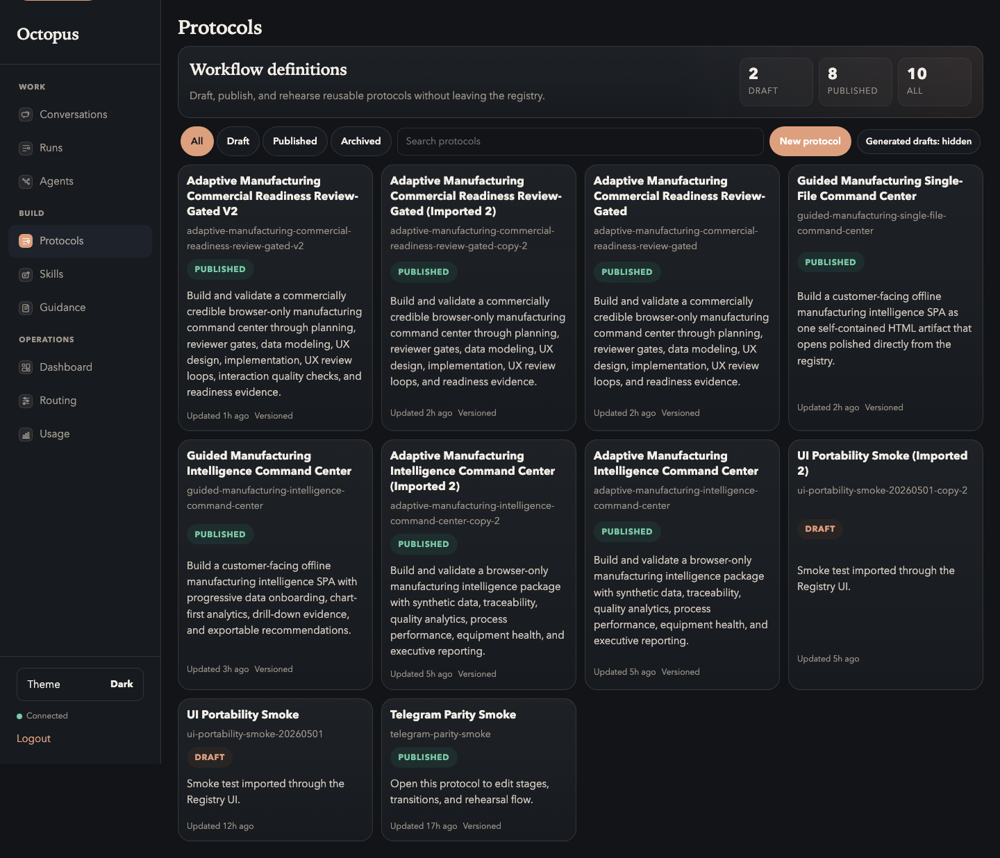

# 01. Preflight

Goal: confirm the product is ready before authoring anything.

## Do This

1. Start Octopus.
2. Open the Registry UI, normally `http://127.0.0.1:8787/ui`.
3. Open `Work -> Agents`.
4. Confirm at least two Codex-backed agents are connected and execution-healthy.
5. Open `Build -> Protocols`.

Expected protocol list:

## You Are Done When

- `Build -> Protocols` opens without an error.
- `Work -> Agents` shows at least two connected, execution-healthy agents.
- You have decided which agent will be the reviewer/planner and which agent will
  be the implementer/data modeler.

For the capture shown in this guide:

| Responsibility | Agent |
| --- | --- |
| Planner / Reviewer | M1 |
| Data Modeler | M2 |
| UX Architect / Reviewer | M1 |
| Implementer | M2 |

## If This Fails

If no agents appear, finish [Getting Started](../../GETTING_STARTED.md). In the
current product, local agents are created through Telegram-backed bot setup
before they appear in the Registry.

Next: [Create The Protocol](02-create-protocol.md).
