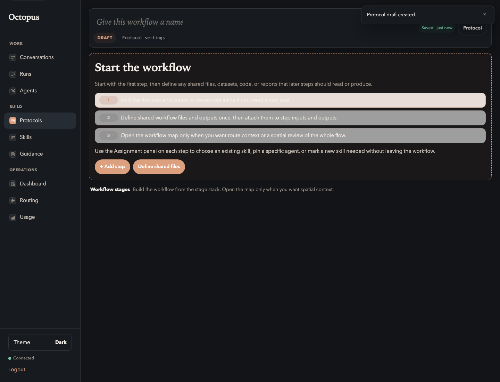
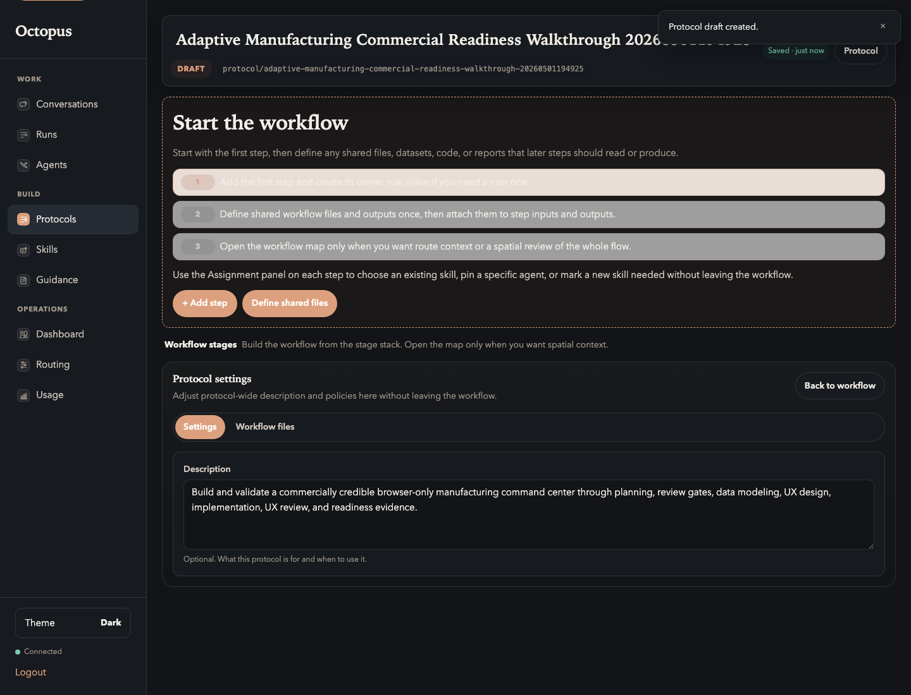

# 02. Create The Protocol

Goal: create a blank protocol and give it a clear product-readiness identity.

## Do This

1. Open `Build -> Protocols`.
2. Click `New protocol`.
3. Choose `Start blank`.
4. Set the protocol name.

Use this display name:

```text
Adaptive Manufacturing Commercial Readiness Walkthrough
```

Use this description:

```text
Build and validate a commercially credible browser-only manufacturing command center through planning, review gates, data modeling, UX design, implementation, UX review, and readiness evidence.
```

Start from the blank workflow:



After naming the protocol, the header should show a draft workflow with the
manufacturing readiness title:



## You Are Done When

- The protocol is still `DRAFT`.
- The title is specific to the walkthrough.
- The description frames this as a product-readiness dry run, not a one-off
  delivery project.

Previous: [Preflight](01-preflight.md)  
Next: [Declare Artifacts](03-declare-artifacts.md).
