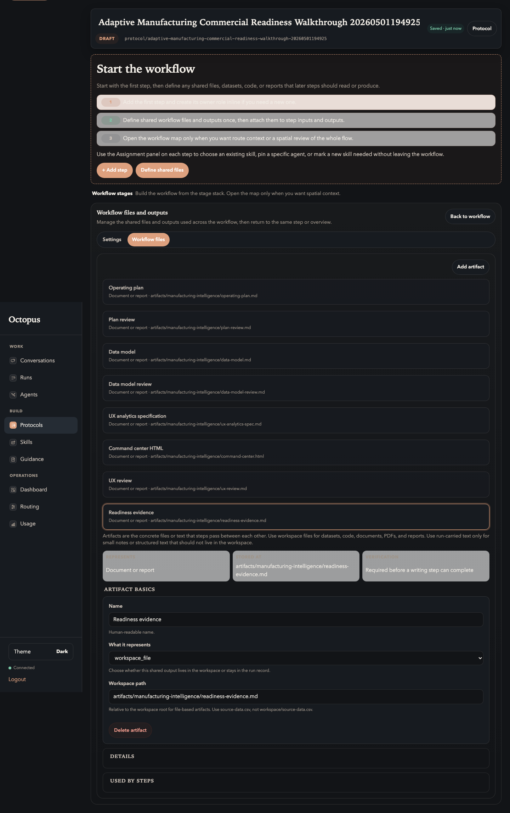

# 03. Declare Artifacts

Goal: declare the output contract before stages start producing files.

## Do This

1. Open `Protocol settings`.
2. Open the workflow files or outputs section.
3. Add each artifact below.
4. Keep `What it represents` as `workspace_file`.
5. Confirm each path is exact.

| Display name | Workspace path |
| --- | --- |
| Operating plan | `artifacts/manufacturing-intelligence/operating-plan.md` |
| Plan review | `artifacts/manufacturing-intelligence/plan-review.md` |
| Data model | `artifacts/manufacturing-intelligence/data-model.md` |
| Data model review | `artifacts/manufacturing-intelligence/data-model-review.md` |
| UX analytics specification | `artifacts/manufacturing-intelligence/ux-analytics-spec.md` |
| Command center HTML | `artifacts/manufacturing-intelligence/command-center.html` |
| UX review | `artifacts/manufacturing-intelligence/ux-review.md` |
| Readiness evidence | `artifacts/manufacturing-intelligence/readiness-evidence.md` |

Expected artifact list:

## You Are Done When

- Eight artifacts exist.
- Every path starts with `artifacts/manufacturing-intelligence/`.
- `command-center.html` is declared before the implementer stage exists.

## Why This Matters

The run dialog and run page use these declared artifacts as the verification
contract. Launch instructions can add context, but they should not redefine the
published artifact paths.

Previous: [Create The Protocol](02-create-protocol.md)  
Next: [Add Participants](04-add-participants.md).
