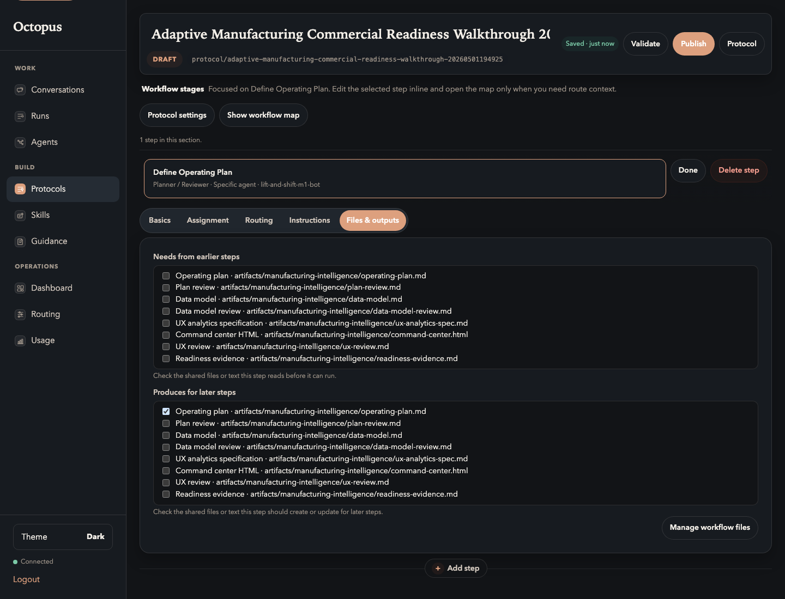

# 04. Add Participants

Goal: assign clear responsibilities without making the user understand runtime
internals.

## Do This

Create stages with these participant roles and agent assignments.

| Participant | Suggested agent | Responsibility |
| --- | --- | --- |
| Planner / Reviewer | M1 | Plan quality, review gates, acceptance decisions, readiness evidence. |
| Data Modeler | M2 | Fictional manufacturing data model and validation rules. |
| UX Architect / Reviewer | M1 | First-time-user journey, responsive UX, interaction review. |
| Implementer | M2 | Single-file browser artifact implementation. |

When creating the first step, use `Specific agent` assignment and choose the
agent responsible for that role:

When you need the same responsibility again, choose the existing owner role
instead of creating a duplicate role with the same name.

## You Are Done When

- Every stage has a human-readable role.
- Work and implementation stages point to an execution-healthy agent.
- Review stages point to the reviewer/planner agent.
- You did not assign all work to one generic role unless your environment only
  has one healthy agent.

Previous: [Declare Artifacts](03-declare-artifacts.md)  
Next: [Build Stage Flow](05-build-stage-flow.md).
