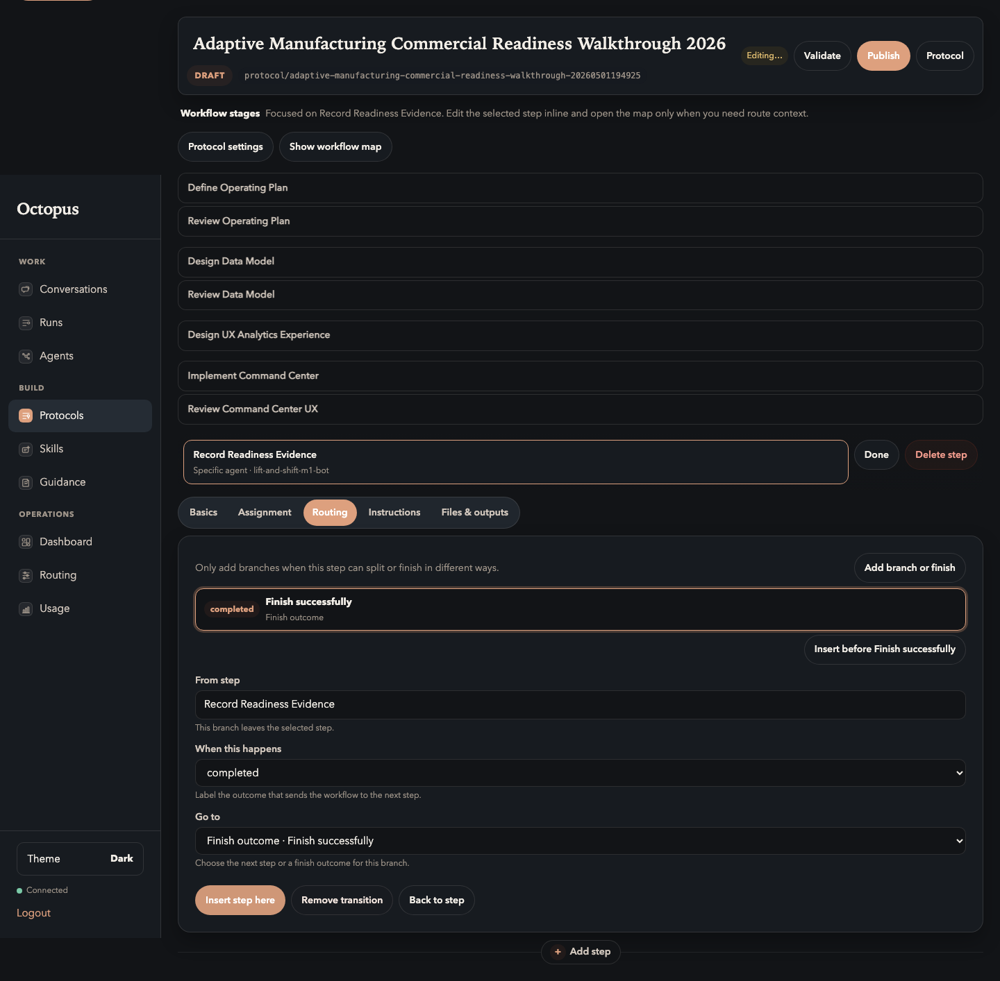

# 06. Configure Review Loops

Goal: make review decisions explicit so weak work can be sent back.

## Do This

Add these routes.

| From stage | Decision | Go to |
| --- | --- | --- |
| Define Operating Plan | completed | Review Operating Plan |
| Review Operating Plan | accept | Design Data Model |
| Review Operating Plan | revise | Define Operating Plan |
| Design Data Model | completed | Review Data Model |
| Review Data Model | accept | Design UX Analytics Experience |
| Review Data Model | revise | Design Data Model |
| Design UX Analytics Experience | completed | Implement Command Center |
| Implement Command Center | completed | Review Command Center UX |
| Review Command Center UX | accept | Record Readiness Evidence |
| Review Command Center UX | revise | Implement Command Center |
| Record Readiness Evidence | completed | Finish successfully |

Expected stage stack after routes are configured:

## You Are Done When

- Every authoring stage has a `completed` route.
- Every review stage has at least an `accept` and `revise` route.
- The final evidence stage finishes successfully.
- The user can tell where work goes next without opening raw data.

Previous: [Build Stage Flow](05-build-stage-flow.md)  
Next: [Validate And Publish](07-validate-and-publish.md).
