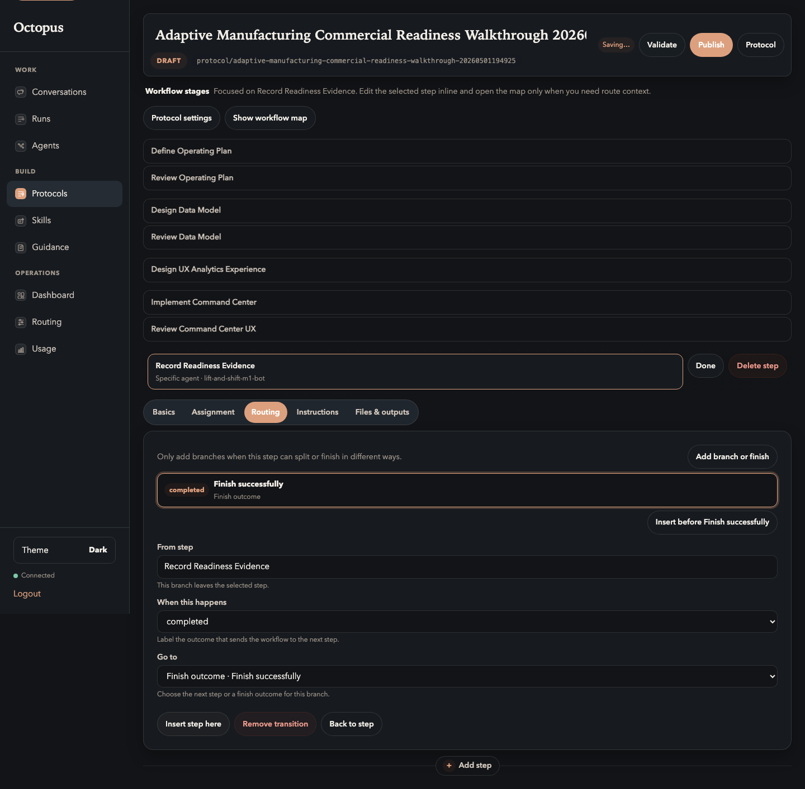
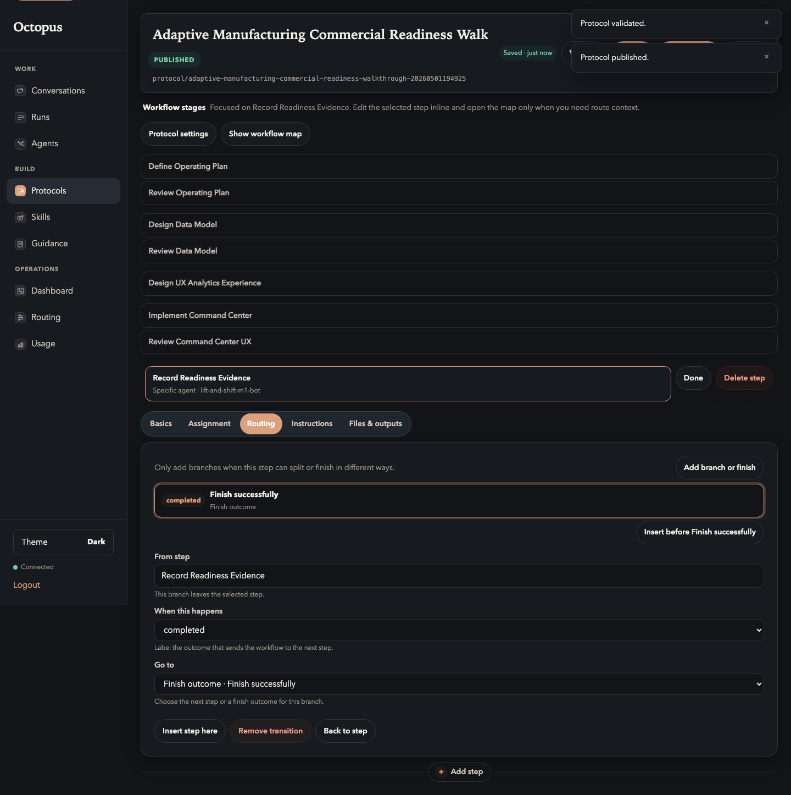

# 07. Validate And Publish

Goal: turn the draft into a runnable published protocol.

## Do This

1. Click `Validate`.
2. Fix any validation errors.
3. Confirm the protocol reports valid.
4. Click `Publish`.
5. Confirm the state changes to `PUBLISHED`.

Expected valid state before publishing:

Expected published state:

## You Are Done When

- The protocol is `PUBLISHED`.
- `Run protocol` is visible.
- The stage stack and artifact contract are still the same as the draft you
  reviewed.

Previous: [Configure Review Loops](06-configure-review-loops.md)  
Next: [Launch The Run](08-launch-run.md).
