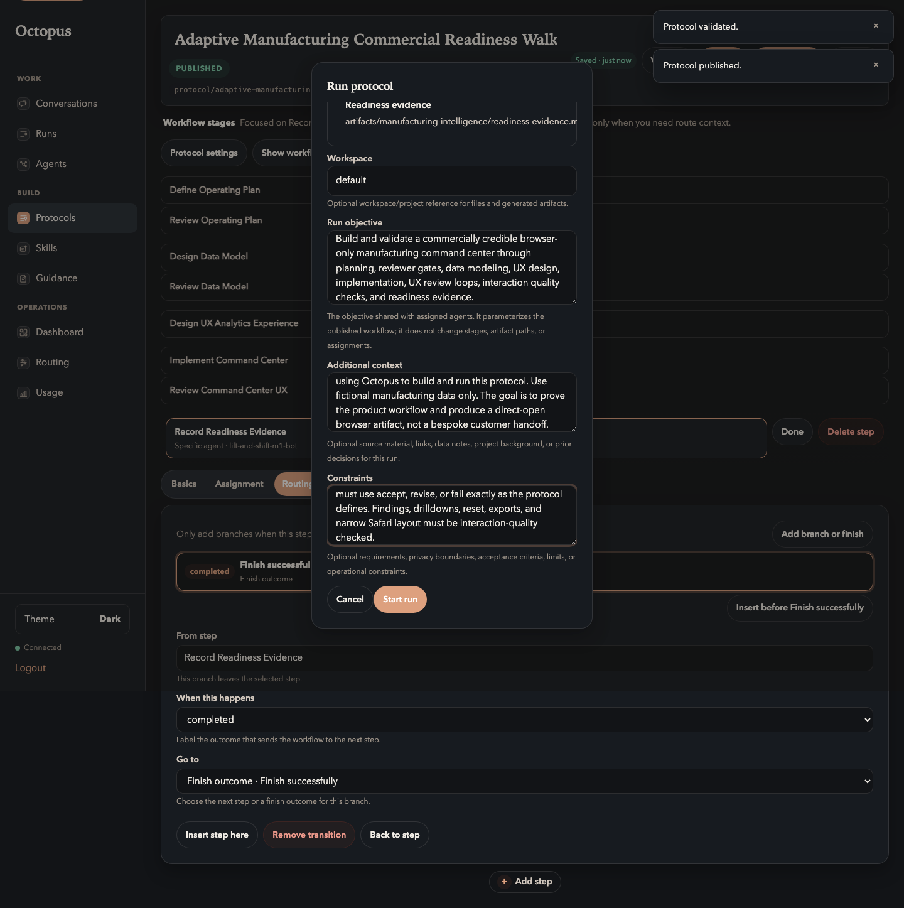
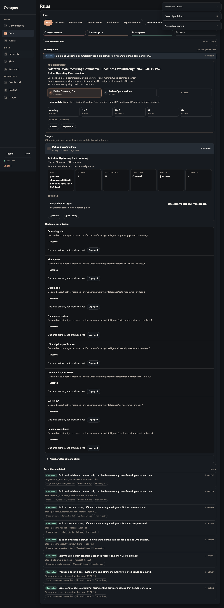

# 08. Launch The Run

Goal: start a real protocol run from the published protocol.

## Do This

1. Click `Run protocol`.
2. Choose an execution-healthy entry agent.
3. Set `Workspace` to `default` unless your operator gave you another value.
4. Paste the run objective, context, and constraints below.
5. Confirm the declared artifacts are listed in the dialog.
6. Click `Start run`.

Run objective:

```text
Build and validate a commercially credible browser-only manufacturing command center through planning, reviewer gates, data modeling, UX design, implementation, UX review loops, interaction quality checks, and readiness evidence.
```

Additional context:

```text
Product-readiness dry run for a customer operator using Octopus to build and run this protocol. Use fictional manufacturing data only. The goal is to prove the product workflow and produce a direct-open browser artifact, not a one-off delivery project.
```

Constraints:

```text
No real customer data. No one-off delivery framing. The final command-center HTML artifact must be one self-contained HTML file with inline CSS and JavaScript only: no external files, CDNs, fonts, images, fetch, sendBeacon, or backend APIs. Review stages must use accept, revise, or fail exactly as the protocol defines. Findings, drilldowns, reset, exports, and narrow Safari layout must be interaction-quality checked.
```

Expected launch dialog:



After starting, the Registry moves to the run page:



## You Are Done When

- The run page opens.
- The active stage is visible.
- The run page shows live agent progress instead of looking stuck.
- Declared artifacts are visible as missing until the producing stages complete.

Previous: [Validate And Publish](07-validate-and-publish.md)  
Next: [Watch The Run](09-watch-run.md).
