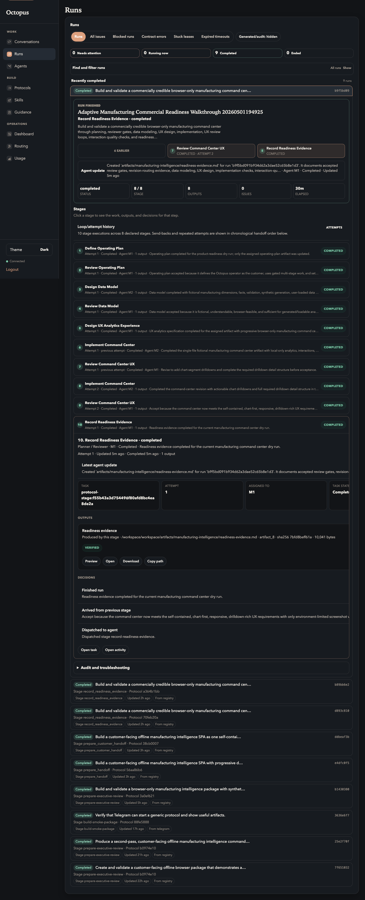
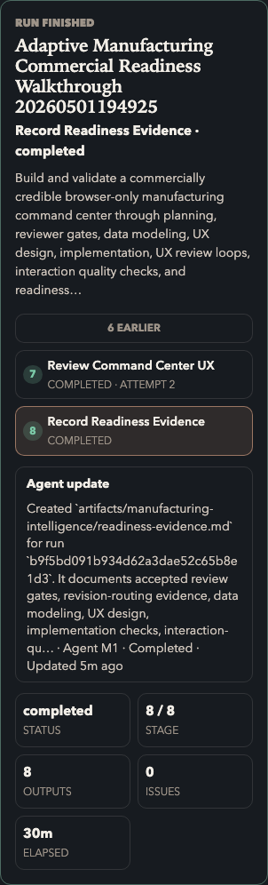

# 09. Watch The Run

Goal: monitor the run from the Registry, not from private bot logs.

## Do This

1. Stay on `Work -> Runs`.
2. Watch the run hero for current stage, status, stage count, outputs, and issues.
3. Expand the active stage when you need more detail.
4. Read the latest agent update before retrying or canceling.
5. Wait for all stages to complete.

Expected completed run:

Narrow run view should still be readable:

## You Are Done When

- Final status is `completed`.
- Outputs show `8 / 8`.
- Issues show `0`, or every issue is understood and acceptable for the dry run.
- The run history shows the review stages and any loop attempts.

## If The Run Needs Iteration

If a review stage sends work back, do not edit the artifact manually. Let the
protocol route back to the authoring stage, then inspect the next attempt in the
run page.

Previous: [Launch The Run](08-launch-run.md)  
Next: [Inspect Artifacts](10-inspect-artifacts.md).
