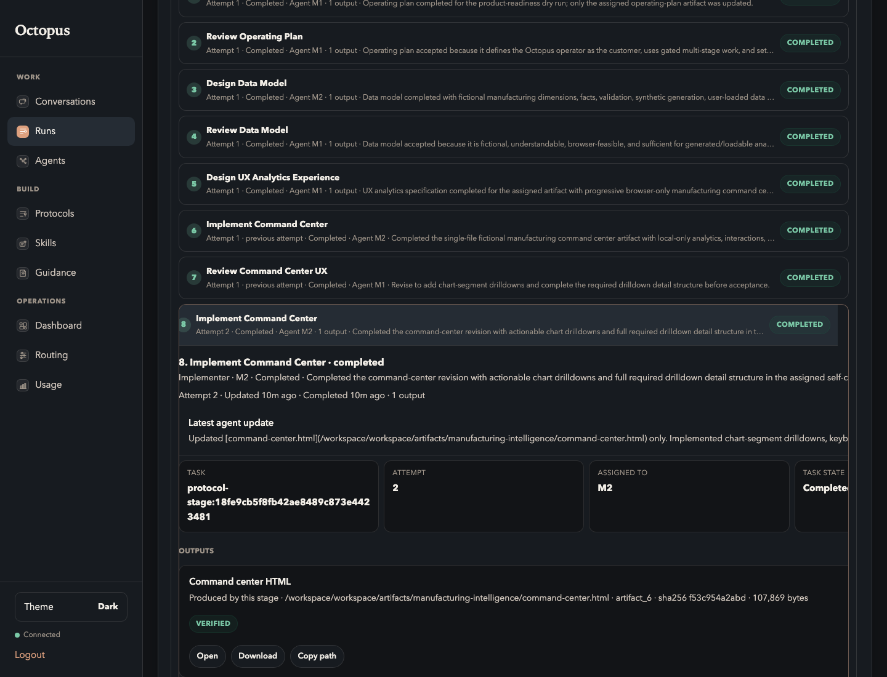

# 10. Inspect Artifacts

Goal: verify the declared outputs from the run page.

## Do This

1. Open the completed run.
2. Use the run evidence and expanded stages to inspect produced outputs.
3. Confirm every declared artifact is produced.
4. Expand `Implement Command Center`.
5. Open or preview `Command center HTML`.
6. Confirm the artifact opens from the Registry action, not from a private file
   path.

Expected output evidence:

## You Are Done When

- `operating-plan.md` is available.
- `plan-review.md` is available.
- `data-model.md` is available.
- `data-model-review.md` is available.
- `ux-analytics-spec.md` is available.
- `command-center.html` is available and has an open action.
- `ux-review.md` is available.
- `readiness-evidence.md` is available.

Previous: [Watch The Run](09-watch-run.md)  
Next: [Validate Wide Artifact](11-validate-wide-artifact.md).
