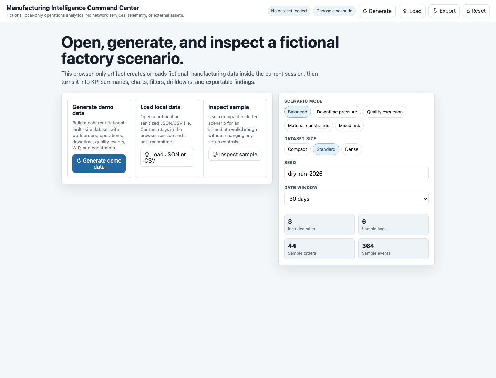

# 11. Validate Wide Artifact

Goal: inspect the generated command center as a human user on a wide screen.

## Do This

1. Open `command-center.html` from the Registry artifact action.
2. Confirm the page renders without a backend.
3. Confirm the first screen offers a clear start path.
4. Generate demo data or inspect included sample data.
5. Confirm useful KPIs, charts, filters, insights, and drilldowns appear without
   requiring raw schema knowledge.
6. Trigger at least one drilldown.
7. Pin the same finding twice and confirm it does not duplicate.
8. Export a summary or findings output if the artifact supports it.

Expected wide artifact:

## You Are Done When

- The artifact feels like a guided analytics app, not a raw table explorer.
- Charts and KPIs are visible after data generation.
- Drilldowns explain the evidence behind metrics.
- Actions are repeatable without stale or duplicate state.

Previous: [Inspect Artifacts](10-inspect-artifacts.md)  
Next: [Validate Narrow Artifact](12-validate-narrow-artifact.md).
