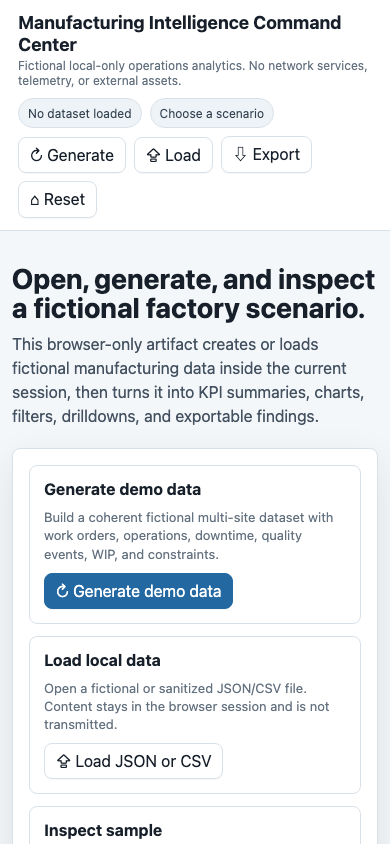
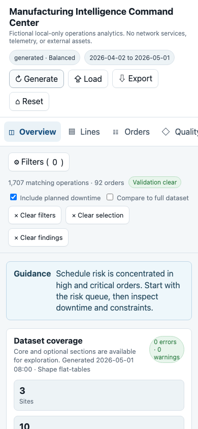

# 12. Validate Narrow Artifact

Goal: prove the command center is usable in narrow Safari.

## Do This

1. Resize the browser to a narrow layout.
2. Open the command center artifact.
3. Use the primary start path.
4. Open the navigation or menu if one appears.
5. Inspect KPI/chip/pill rows.
6. Trigger a drilldown or detail panel.
7. Close the panel.
8. Confirm no controls overlap, clip, or trap the user.

Expected narrow first view:

Expected narrow generated-data state:

## You Are Done When

- The menu does not overlap essential UI.
- Pills and chips wrap cleanly.
- Buttons remain readable.
- Drilldowns can be opened and closed.
- No stale drawer or finding remains after reset/regeneration.

Previous: [Validate Wide Artifact](11-validate-wide-artifact.md)  
Next: [Export And Import A Copy](13-export-import-copy.md).
