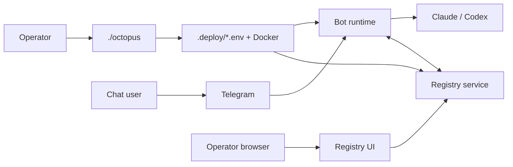

# Overview & terminology

Manual: [Home](README.md) · Next: [Setup](01-setup.md)

The platform runs **AI agents** (Claude or Codex) behind **Telegram bots**
that also participate in the **Registry** control plane for operator
visibility, coordination, and the browser UI.

## Mental model

## Terms

| Term | Meaning |
|------|---------|
| **Operator** | Runs `./octopus`, owns `.deploy/`, may use Registry UI with `REGISTRY_UI_TOKEN`. |
| **Agent / bot** | Telegram bot identity plus container runtime; may enroll against one or more registries. |
| **Registry scope** | Per connection: `full`, `channel`, or `coordination` — controls conversation UI vs coordination-only. |
| **Runtime profile** | The SDK can model standalone and registry-connected runtimes, but this repo's shipped Telegram product runs as a registry-connected participant. |
| **Product user** | Anyone messaging the bot in Telegram; may use `/settings`, `/skills`, etc. |

Continue to [Setup](01-setup.md).
