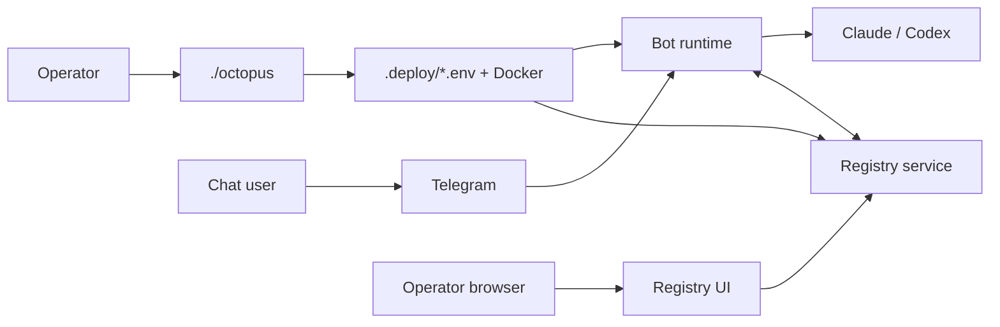

# Overview & terminology

Manual: [Home](README.md) · Next: [Setup](01-setup.md)

The platform runs **AI agents** (Claude or Codex) behind a **Telegram bot**, with an optional **Registry** for operator visibility, coordination, and a browser UI.

## Mental model

## Terms

| Term | Meaning |
|------|---------|
| **Operator** | Runs `./octopus`, owns `.deploy/`, may use Registry UI with `REGISTRY_UI_TOKEN`. |
| **Agent / bot** | Telegram bot identity plus container runtime; may enroll against one or more registries. |
| **Registry scope** | Per connection: `full`, `channel`, or `coordination` — controls conversation UI vs coordination-only. |
| **Standalone vs registry** | `BOT_AGENT_MODE=standalone` has no registry; `registry` publishes events and uses `/v1/`. |
| **Product user** | Anyone messaging the bot in Telegram; may use `/settings`, `/skills`, etc. |

Continue to [Setup](01-setup.md).
