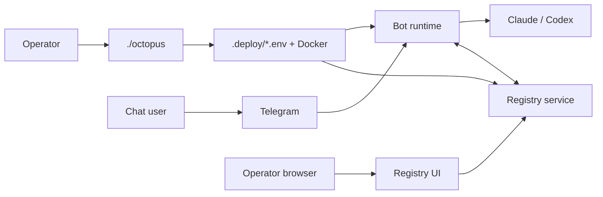

# Overview & terminology

[← Manual home](README.md) · [Next: Setup →](01-setup.md)

This platform runs **AI agents** (Claude or Codex) behind a **Telegram bot**, with an optional **Registry** for operator visibility, multi-agent coordination, and a browser UI.

## Mental model

## Terms

| Term | Meaning |
|------|---------|
| **Operator** | Person who runs `./octopus`, owns `.deploy/`, may use Registry UI with `REGISTRY_UI_TOKEN`. |
| **Agent / bot** | The Telegram bot identity plus container runtime; may enroll against one or more registries. |
| **Registry scope** | Per connection: `full`, `channel`, or `coordination` — controls conversation UI vs coordination-only. |
| **Standalone vs registry** | `BOT_AGENT_MODE=standalone` has no registry; `registry` publishes events and uses `/v1/`. |
| **Product user** | Anyone messaging the bot in Telegram; may use `/settings`, `/skills`, etc. |

## Where scenarios are illustrated

| Topic | Screenshots |
|-------|-------------|
| First-time Telegram + provider | [Setup](01-setup.md) |
| `./octopus` menus & commands | [Octopus](02-operator-octopus.md) |
| Registry browser | [Registry UI](03-operator-registry.md) |
| Chat UX | [Telegram](04-product-telegram.md) |
| HTTP API map | [Integration](05-integration-api.md) |
