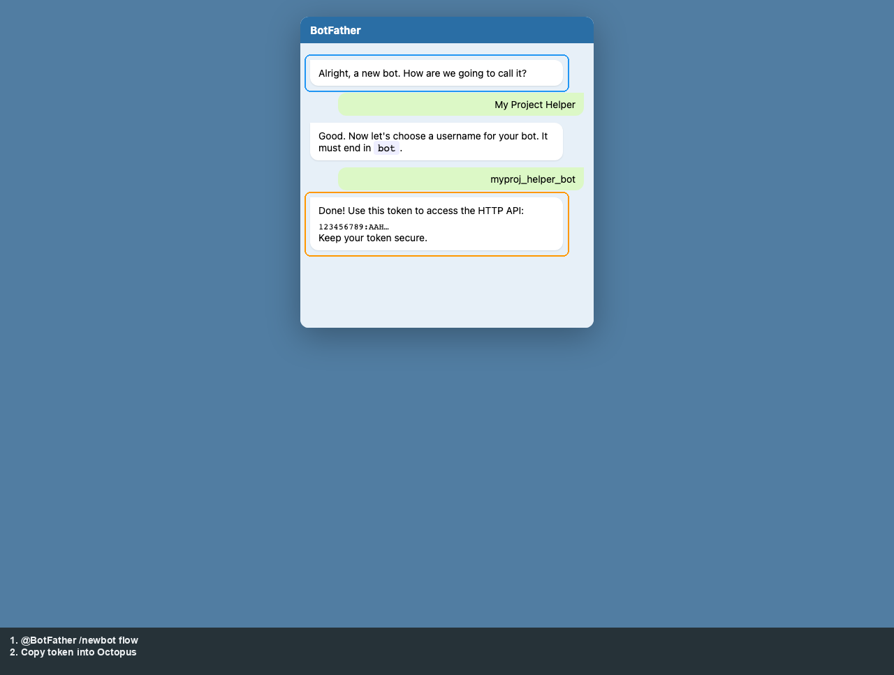
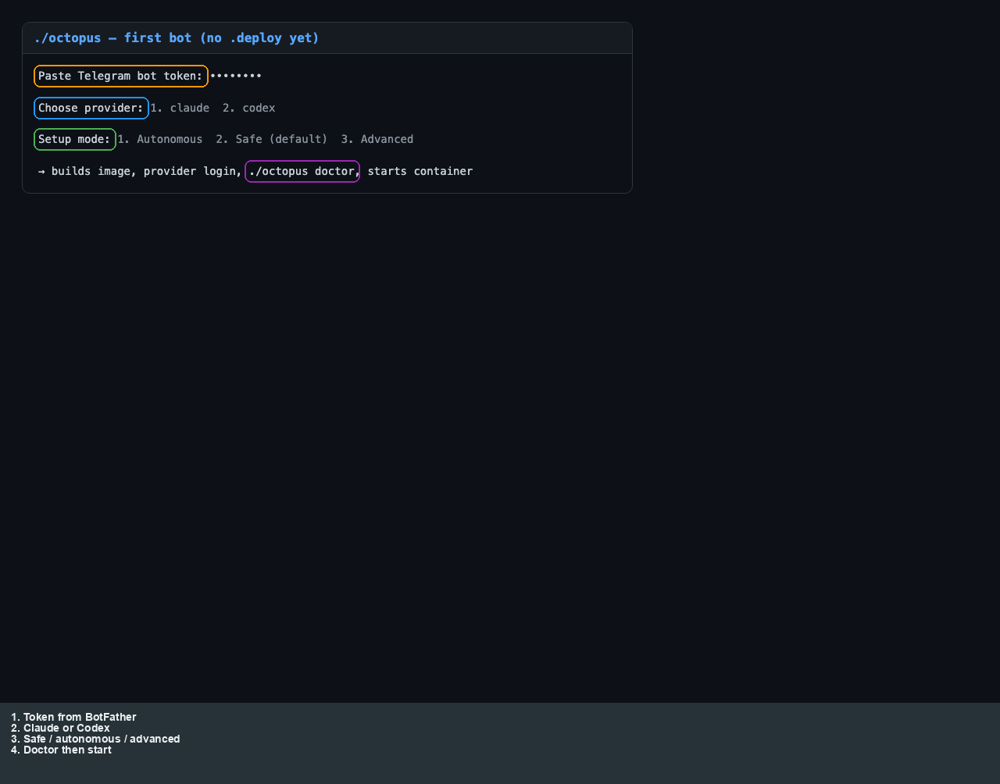

# Setup

[← Manual home](README.md) · [Prev: Overview](00-overview.md) · [Next: Octopus →](02-operator-octopus.md)

Get a **bot token** from **@BotFather** (`/newbot`), clone the repo, and run **`./octopus`** with no prior `.deploy/` to start the **first-bot wizard** (token, Claude or Codex, safe vs autonomous vs advanced). The CLI then builds the image, runs **provider login** when needed, and starts the container.

The token handoff and provider sign-in are separate steps in real usage; the captures above are **doc fixtures** with outlines and a **bottom legend** so labels do not cover the mock UI. A condensed view of the wizard prompts:

Older **SVG** quickstart diagrams (same narrative): [01-first-bot-setup.svg](../assets/quickstart/01-first-bot-setup.svg), [02-bot-running.svg](../assets/quickstart/02-bot-running.svg), [03-octopus-status.svg](../assets/quickstart/03-octopus-status.svg).

Confirm **provider auth** with **`./octopus status`** (see [Operator: Octopus](02-operator-octopus.md)). Optional **registry** after that: [Registry UI](03-operator-registry.md) and [`./octopus` storyboards](02-operator-octopus.md).

**Security:** keep `TELEGRAM_BOT_TOKEN` and `REGISTRY_UI_TOKEN` secret; see root [README.md](../../README.md).
