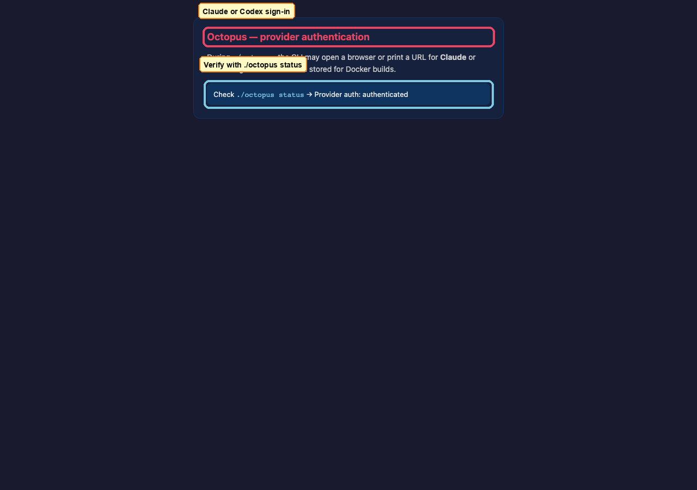

# Setup

[← Manual home](README.md) · [Prev: Overview](00-overview.md) · [Next: Octopus →](02-operator-octopus.md)

## 1. Create a Telegram bot (BotFather)

Open Telegram, find **@BotFather**, send `/newbot`, and follow prompts. You need a **bot token** before running Octopus.


## 2. Clone the repository

```bash
git clone https://github.com/privacynow/octopus.git
cd octopus
```

*(No separate screenshot — file layout is standard Git.)*

## 3. Provider authentication (Claude or Codex)

When you run `./octopus`, the CLI walks through **provider login** (browser or device flow depending on provider). You must complete this so Docker images can run the provider SDK.



Confirm later with `./octopus status` under **Provider auth**.

## 4. First bot run

Run `./octopus` with **no** configured bots to enter the **first-bot wizard** (token, provider, safe vs autonomous vs advanced). When finished, the bot container starts and you can chat in Telegram.


Supplementary **SVG** diagrams (same story, no live capture): [01-first-bot-setup.svg](../assets/quickstart/01-first-bot-setup.svg), [02-bot-running.svg](../assets/quickstart/02-bot-running.svg), [03-octopus-status.svg](../assets/quickstart/03-octopus-status.svg).

After setup, use **`./octopus status`** — see [Octopus: status](02-operator-octopus.md#status-and-logs).

## 5. Optional: Registry

If you enable registry mode during setup or later via **Manage bots → Connect to registry**, follow [Operator: Registry UI](03-operator-registry.md) and the CLI storyboards linked from [Octopus](02-operator-octopus.md).

---

**Security:** keep `TELEGRAM_BOT_TOKEN` and `REGISTRY_UI_TOKEN` secret; see root [README.md](../../README.md) for encryption and webhook notes.
