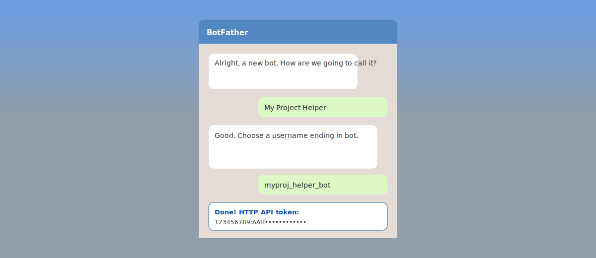
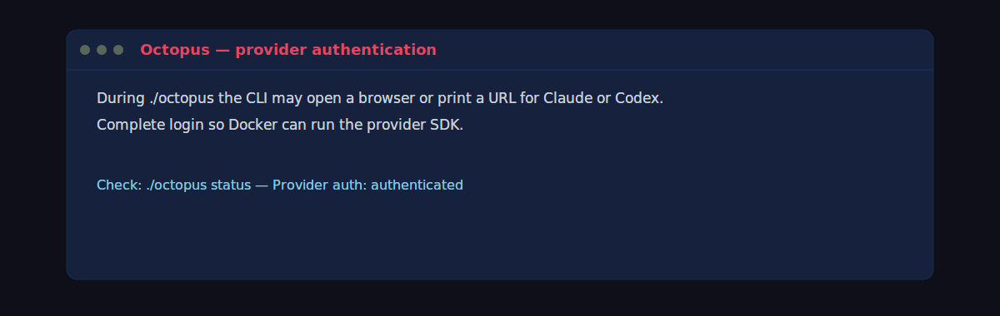
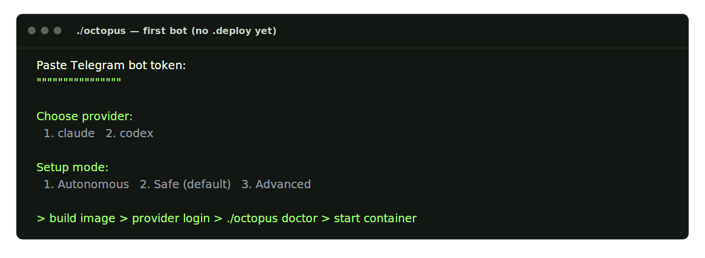

# Setup

[← Manual home](README.md) · [Prev: Overview](00-overview.md) · [Next: Octopus →](02-operator-octopus.md)

Get a **bot token** from **@BotFather** (`/newbot`), clone the repo, and run **`./octopus`** with no prior `.deploy/` to start the **first-bot wizard** (token, Claude or Codex, safe vs autonomous vs advanced). The CLI builds the image, runs **provider login** when needed, performs a runtime health check, and starts the container.

### BotFather

### Provider authentication

### First-bot wizard (terminal)

Confirm **provider auth** with **`./octopus status`** ([Octopus CLI](02-operator-octopus.md)). For **registry** usage, see [Registry web UI](03-operator-registry.md) and the registry connection storyboards linked from [Octopus CLI](02-operator-octopus.md).

**Security:** keep `TELEGRAM_BOT_TOKEN` and `REGISTRY_UI_TOKEN` secret; see root [README.md](../../README.md).
