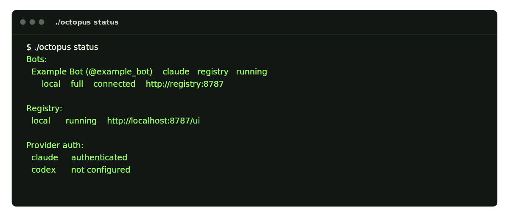

# Operator: Octopus CLI

[← Manual home](README.md) · [Prev: Setup](01-setup.md) · [Next: Registry UI →](03-operator-registry.md)

Running **`./octopus`** with no arguments opens the new state-driven operator menu: **Recommended Actions**, **Lifecycle**, **Bots**, **Registry**, **Workspaces**, **Diagnose**, and **Status**. Non-interactive commands are verb-first (`status`, `start`, `stop`, `restart`, `redeploy`, `connect`, `disconnect`, `logs`, `shell`, `doctor`, `clean`, `help`) and are listed in **`./octopus help`**:


The no-arg menu now centers the next useful action instead of the older static five-option menu. Add-bot, lifecycle, registry, and workspace operations all live behind that same menu:


**Lifecycle** handles bulk or targeted `start`, `stop`, `restart`, and `redeploy`. `restart` preserves volumes and reuses current images; `redeploy` rebuilds/recreates managed targets while still preserving bot and registry state by default. Every mutating action previews the exact candidates once unless `--yes` is supplied.


**`./octopus status`** shows each bot’s mode, registry lines, provider auth, and managed-image freshness:



**Workspaces** bind a host directory to one or more bots from the `Workspaces` section of the menu:


**Diagnose** groups logs, shell access, doctor, and provider-auth recovery in one place:


**`./octopus clean`** is destructive (drops `.deploy`, volumes, and provider login). Confirm by typing `yes`:


## Backup and clean refresh helpers

For a persistent live checkout such as `~/octopus`, use the repo’s ops helpers
when you need to preserve `.deploy` across a destructive refresh.

### Back up `.deploy`

```bash
bash scripts/ops/backup_octopus_deploy.sh --help

bash scripts/ops/backup_octopus_deploy.sh \
  --source /Users/tinker/octopus \
  --target /tmp/octopus-backup
```

### Pull, clean, restore, and relaunch

```bash
bash scripts/ops/refresh_octopus_with_backup.sh --help

bash scripts/ops/refresh_octopus_with_backup.sh \
  /Users/tinker/octopus \
  /Users/tinker/output/bots/telegram-agent-bot/.tmp/octopus-refresh-backups
```

That helper does the full live-refresh sequence:

1. backup `~/octopus/.deploy`
2. pull the latest code
3. run `./octopus clean`
4. restore the saved `.deploy`
5. start the registry and bots again
6. reconnect saved bots
7. verify registry health and image freshness
