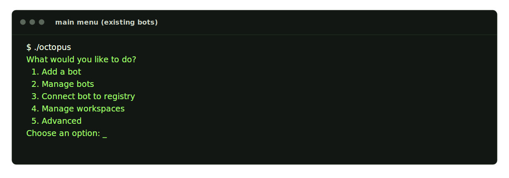
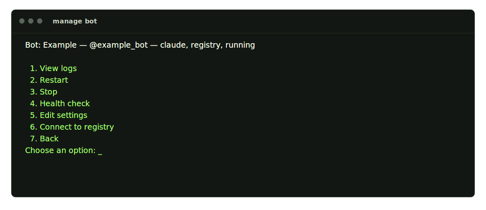
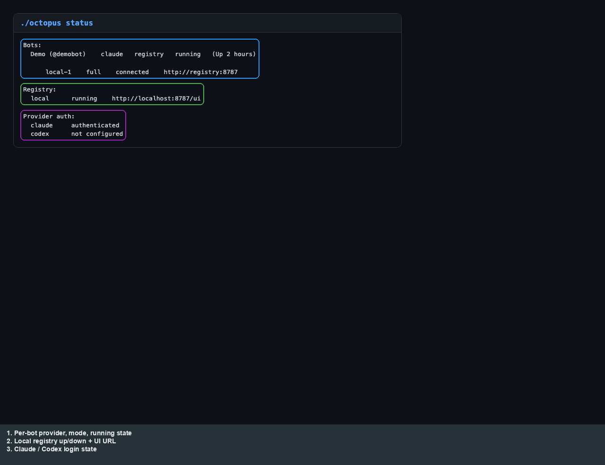
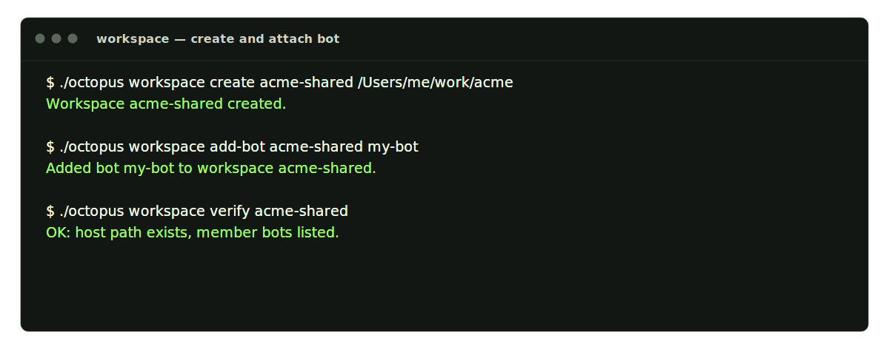
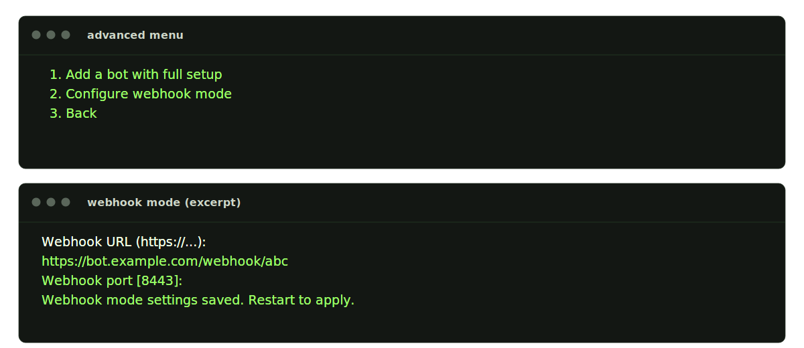

# Operator: Octopus CLI

[← Manual home](README.md) · [Prev: Setup](01-setup.md) · [Next: Registry UI →](03-operator-registry.md)

Running **`./octopus`** with no arguments opens either the **first-bot wizard** (no `.deploy` yet) or the **main menu** when bots already exist. Non-interactive commands (`status`, `start`, `logs`, `doctor`, `registry`, `workspace`, `clean`, `help`) are listed in **`./octopus help`** — the SVG matches the current help text:

The **main menu** has five entries: add bot, manage bots, connect bot to registry, manage workspaces, and advanced options. The terminal storyboard below uses the same CRT styling as the registry flow diagrams:

**Manage bots** opens a per-bot menu (logs, restart, stop, doctor, edit settings, connect to registry, back). Registry connection flows (local vs remote, multiple connections, switch, disconnect) are illustrated under [`docs/assets/registry/`](../assets/registry/) — start with [04-connect-local.svg](../assets/registry/04-connect-local.svg) and [06-connect-remote.svg](../assets/registry/06-connect-remote.svg).

**`./octopus status`** is the quickest way to see each bot’s mode, registry connection lines, whether the local registry is up, and provider auth. The capture below uses the doc fixture (layout matches the real CLI):

**Workspaces** bind a host directory to one or more bots (`workspace create`, `add-bot`, `verify`). Storyboard:

**Advanced → Configure webhook mode** sets `BOT_WEBHOOK_URL` and listen port for shared-runtime webhook deployments:

**`./octopus clean`** is destructive (drops `.deploy`, volumes, and provider login). Confirm by typing `yes`:

---

Illustrative **PNG mocks** (annotated with outlines + a **legend strip** under the image so text does not cover the UI) live under `docs/assets/manual/oct-*` if you need the same flows in raster form.
