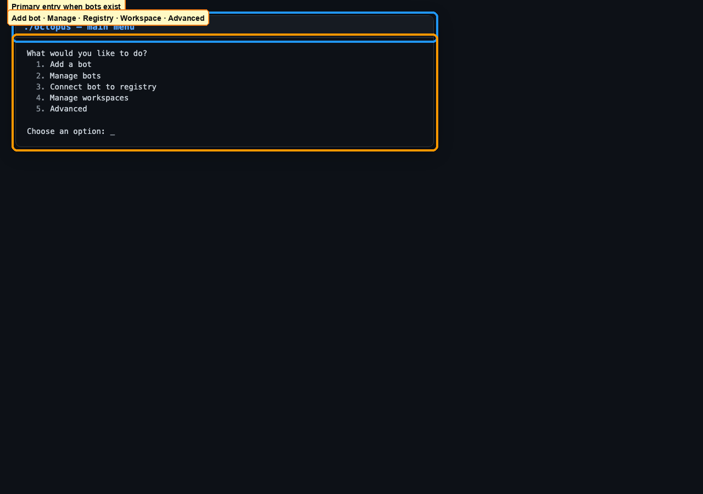
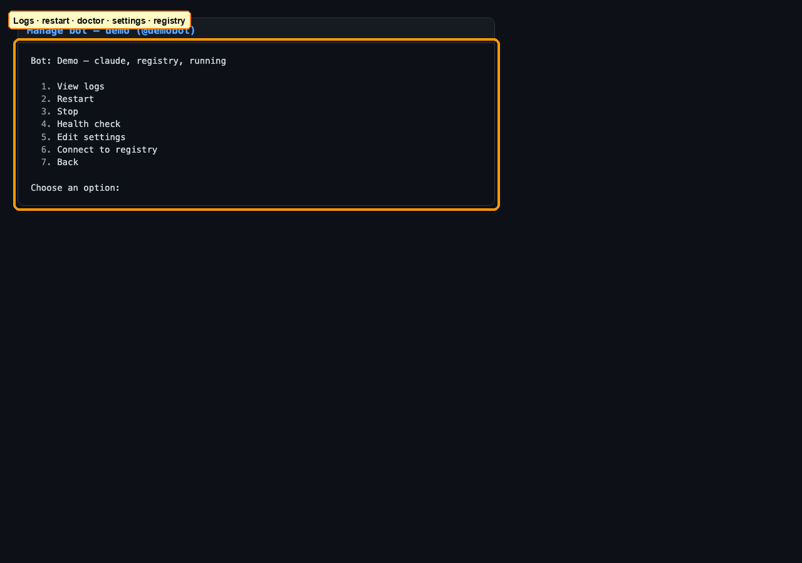
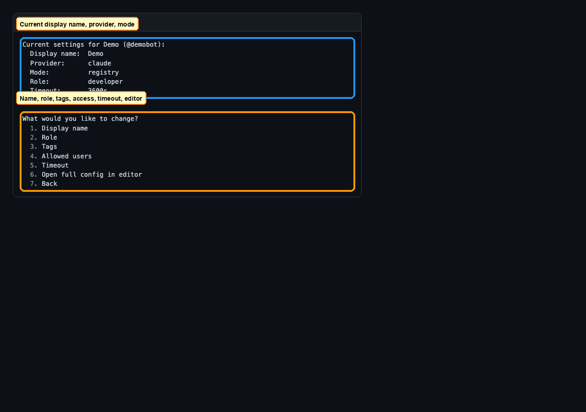
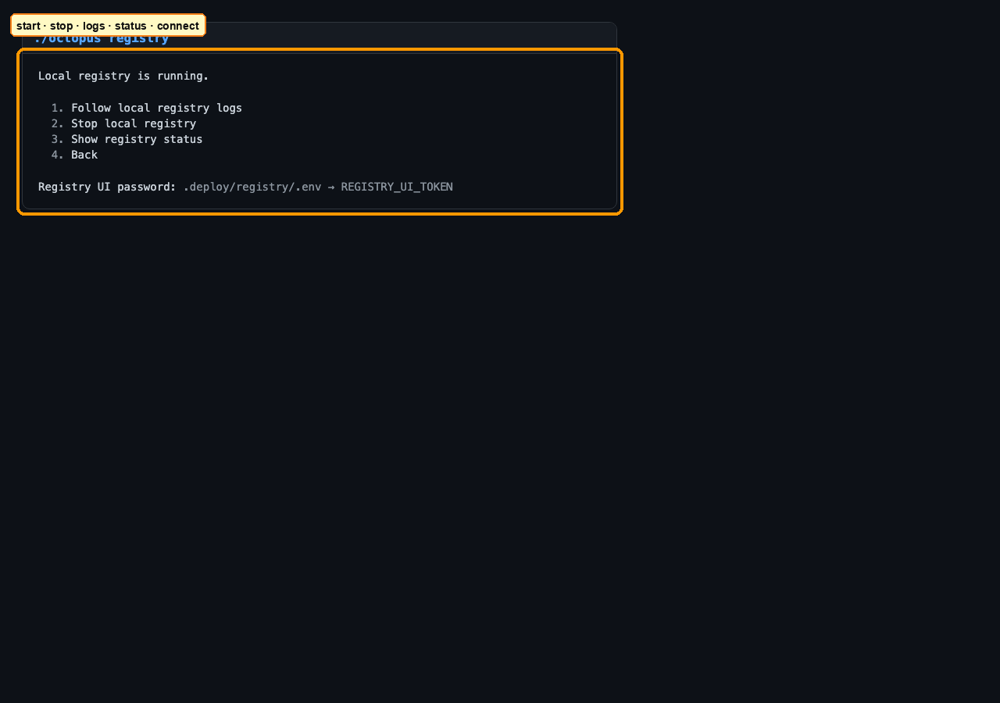
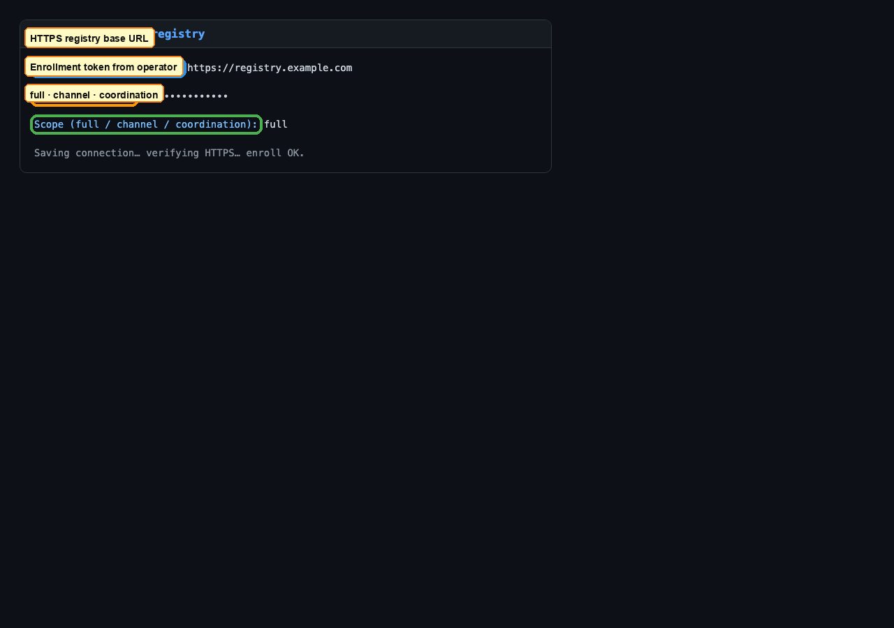
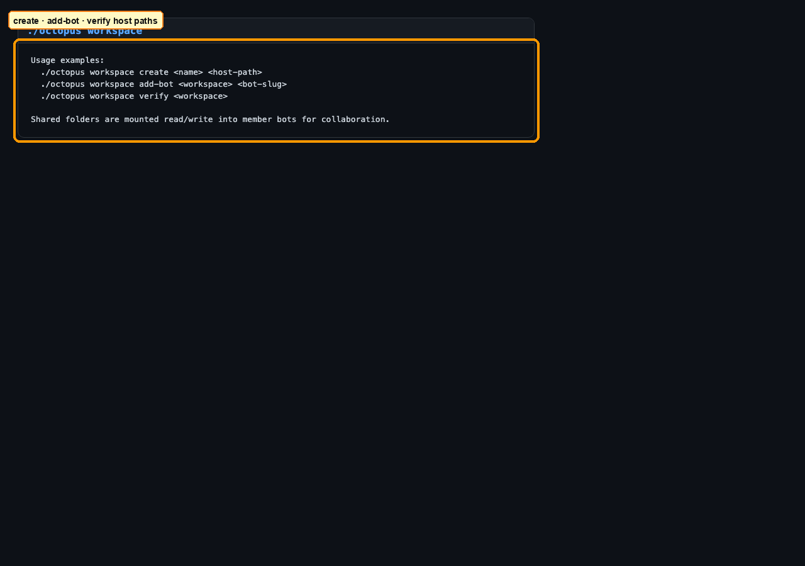
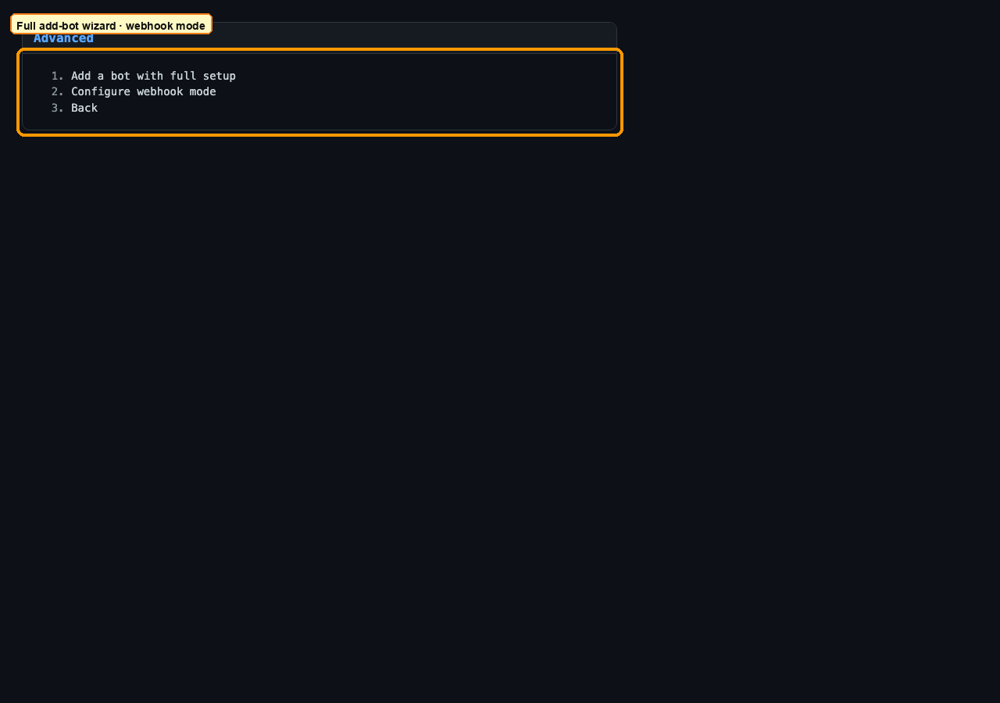
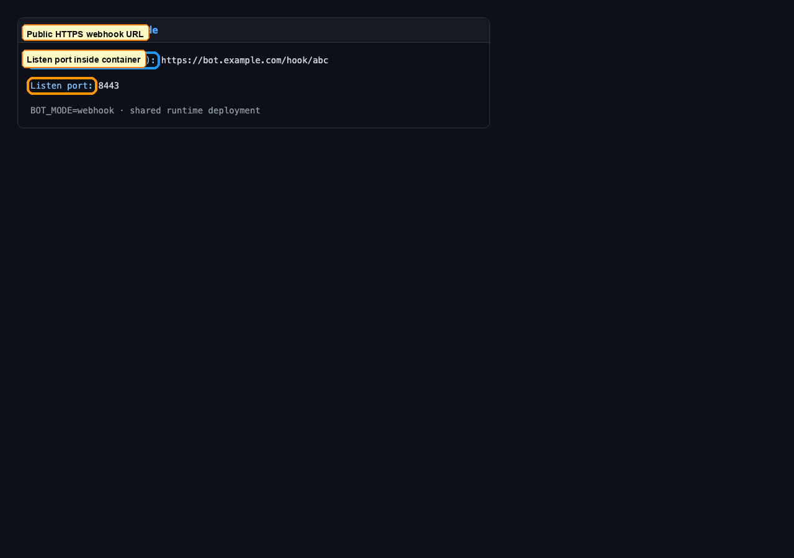
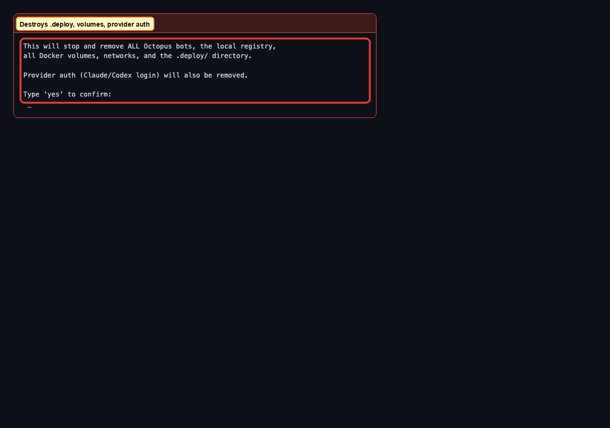

# Operator: Octopus CLI

[← Manual home](README.md) · [Prev: Setup](01-setup.md) · [Next: Registry UI →](03-operator-registry.md)

Illustrations below use **annotated PNG mocks** (Playwright capture of HTML fixtures). **Vector storyboards** in [`docs/assets/octopus/`](../assets/octopus/) mirror the same menus in the CRT style used across the repo — keep them in sync when [`octopus`](../../octopus) menus change.

**`./octopus help`** (full text): [04-octopus-help.svg](../assets/quickstart/04-octopus-help.svg).

## Main menu (multiple bots)

When at least one bot exists and the default bot is already running, **`./octopus`** opens the main menu.

| # | Flow |
|---|------|
| 1 | Add a bot |
| 2 | [Manage bot](#manage-bot) |
| 3 | Connect bot to registry |
| 4 | [Workspace](#workspaces) |
| 5 | [Advanced](#advanced-and-webhook) |

## Manage bot

| # | Action |
|---|--------|
| 1 | View logs (`./octopus logs`) |
| 2 | Restart |
| 3 | Stop |
| 4 | Health check (`./octopus doctor`) |
| 5 | [Edit settings](#edit-settings) |
| 6 | Registry connection wizard |
| 7 | Back |

### Edit settings

## Status and logs

`./octopus status` shows bots, **per-registry connection rows** when in registry mode, local registry state, and provider authentication.

## Registry subcommands

`./octopus registry` opens an interactive menu when the local registry exists (start/stop/logs/status). When the registry is running, the CLI prints the **Registry UI** URL; the password is `REGISTRY_UI_TOKEN` in `.deploy/registry/.env`.

### Remote registry (HTTPS)

When adding a **remote** connection, Octopus prompts for URL, enrollment token, and **scope** (`full` / `channel` / `coordination`).

**Storyboard SVGs** (connect/switch/disconnect): see [docs/assets/registry/](../assets/registry/) — e.g. [06-connect-remote.svg](../assets/registry/06-connect-remote.svg), [10-manage-registry-connections.svg](../assets/registry/10-manage-registry-connections.svg).

## Workspaces

Shared host folders mounted into selected bots:

## Advanced and webhook

**Webhook mode** (shared runtime deployment):

## Nuclear reset: `./octopus clean`

---

**Commands without menus:** `./octopus start|stop|logs|doctor|registry …|workspace …|clean|help` — see `./octopus help`.
