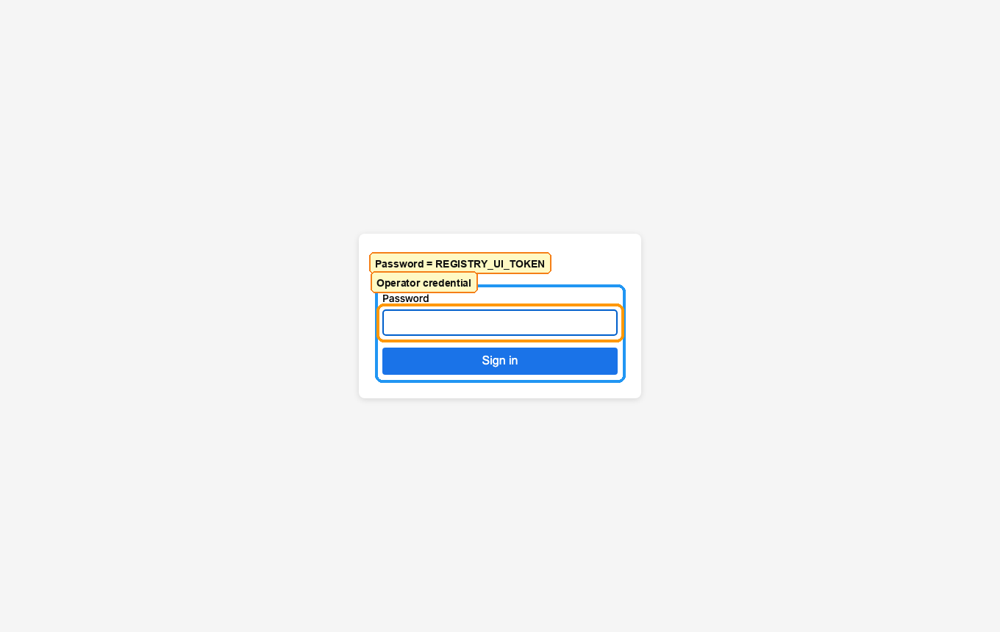
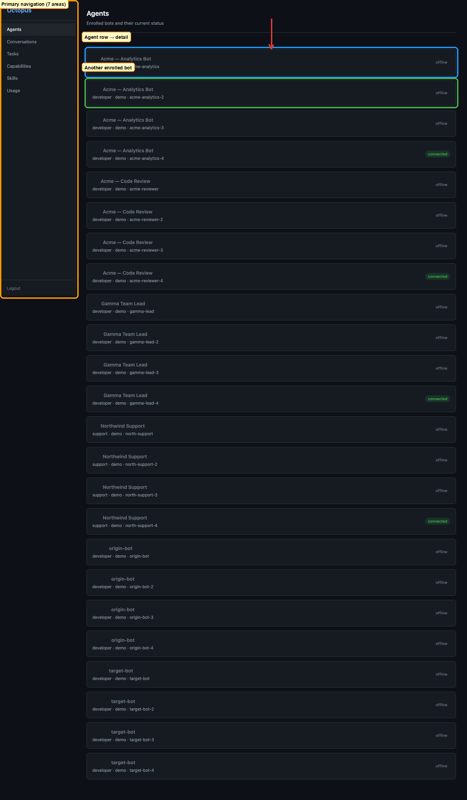
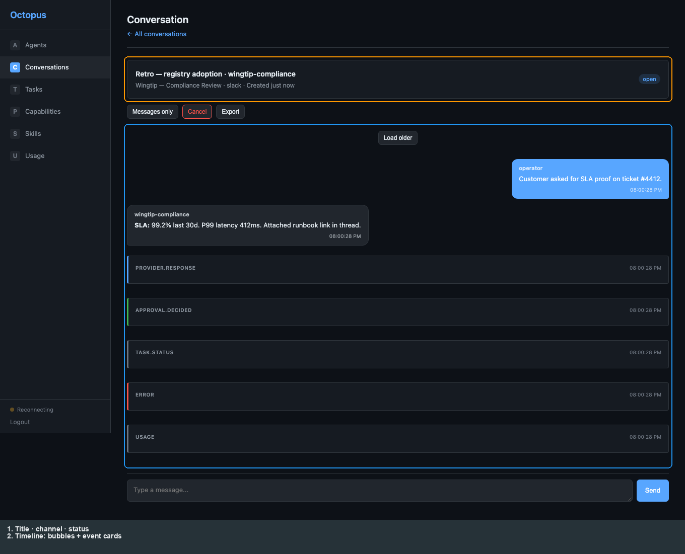

# Operator: Registry web UI

[← Manual home](README.md) · [Prev: Octopus](02-operator-octopus.md) · [Next: Telegram →](04-product-telegram.md)

Sign in at **`/ui/login`** with **`REGISTRY_UI_TOKEN`** from `.deploy/registry/.env` (password only). After POST, the SPA loads the shell with the **sidebar** (Agents, Conversations, Tasks, Capabilities, Skills, Usage, Logout) on every view.

**Agents** lists enrolled bots (cards → detail). **Conversations** can be scoped from an agent or listed globally; type **three or more** characters in search to filter. Opening a row shows the **timeline** (chat bubbles for user/bot messages, cards for other event kinds). **Tasks** lists routed work (row → parent conversation). **Capabilities** / **Skills** / **Usage** use the same shell.

Example **conversation detail** (read-only timeline):

**Deep links:** **`/ui/agents/{agent_id}`** and **`/ui/conversations/{conversation_id}`** match list navigation.

**Limits:** no compose/export from the timeline in the current UI — use the HTTP API. Details: [registry-guide § limits](../registry-guide.md#what-the-ui-does-not-do-yet).

More screens and routes: [registry-guide.md](../registry-guide.md).
