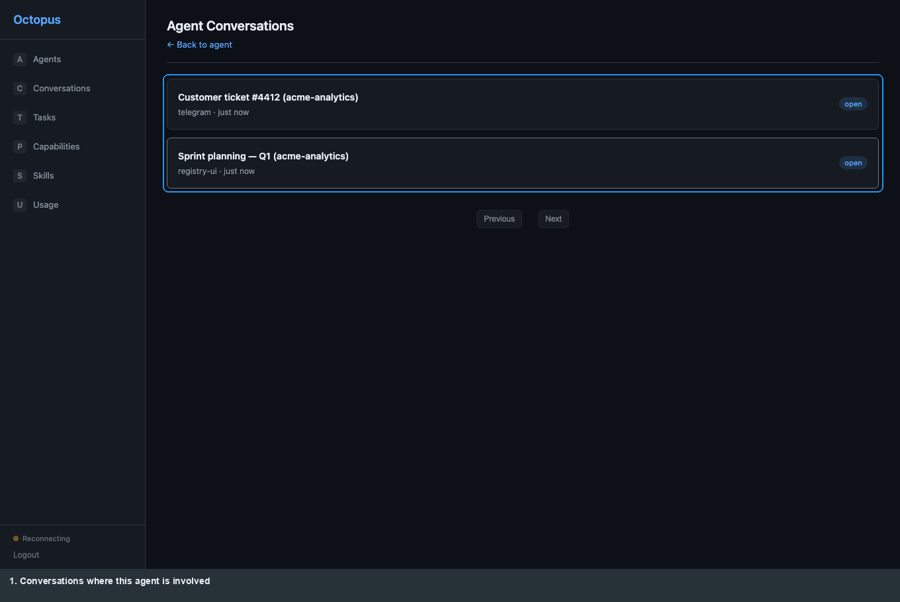
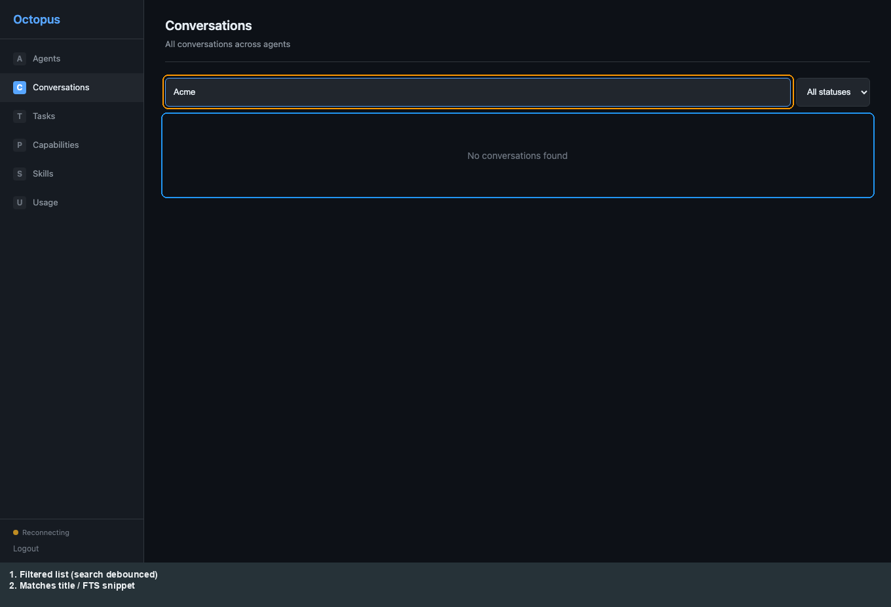
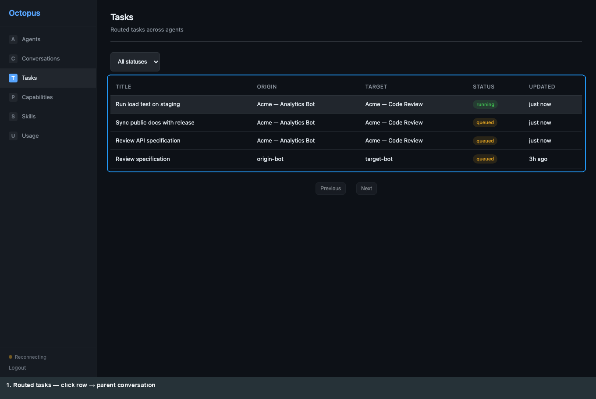
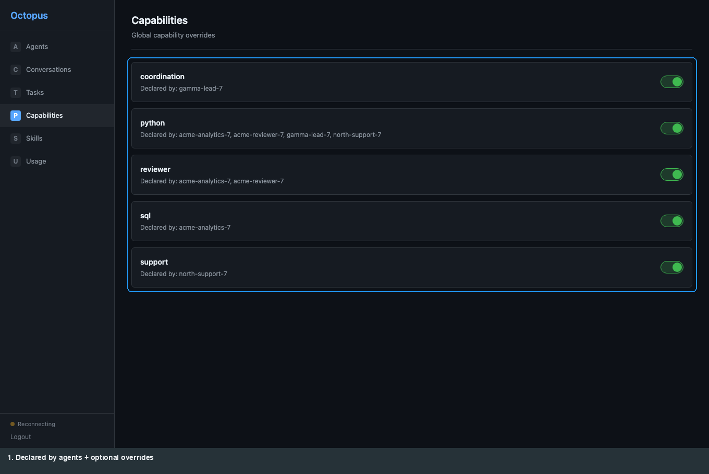
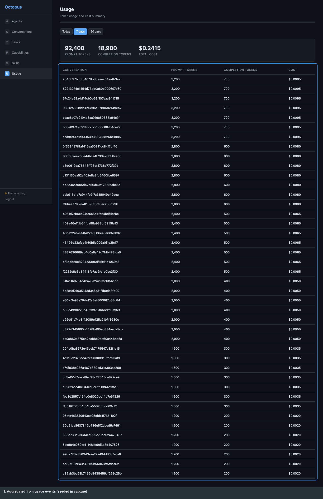

# Operator: Registry web UI

[← Manual home](README.md) · [Prev: Octopus](02-operator-octopus.md) · [Next: Telegram →](04-product-telegram.md)

Sign in at **`/ui/login`** with **`REGISTRY_UI_TOKEN`** from `.deploy/registry/.env` (password only). The shell is a **vanilla** SPA under `ui/`: sidebar routes, paginated lists, filters, and (when the server supports WebSocket upgrade) live updates plus a **connection status** line in the sidebar footer.

**Screenshots** below are the **same numbered set** as [registry-guide.md](../registry-guide.md): Playwright capture writes raw `*.png` + `*.meta.json` under `docs/assets/registry/ui/`, then `annotate.py` produces **`*-annotated.png`**. After UI changes, re-run capture so these paths stay current.

## Navigation (sidebar)

| Area | Route | Role |
|------|-------|------|
| **Agents** | `/ui` | Paginated cards → agent detail |
| **Conversations** | `/ui/conversations` | Paginated; search (≥3 chars, server `q`); status filter |
| **Tasks** | `/ui/tasks` | Paginated routed tasks; status filter; row → parent conversation |
| **Capabilities** | `/ui/capabilities` | Global toggles (confirm); CSRF on POST |
| **Skills** | `/ui/skills` | Catalog; client-side search |
| **Usage** | `/ui/usage` | **Today / 7d / 30d** → `since` / `until` on `GET /v1/usage` |

**Deep links:** `/ui/agents/{agent_id}`, `/ui/agents/{agent_id}/conversations`, `/ui/conversations/{conversation_id}`.

On small screens the sidebar is a **drawer**; at tablet width it **collapses** to icons; desktop shows full labels.

## Screen-by-screen (aligned with capture `00`–`11`)

### Agents (home)

Paginated list of enrolled agents; connectivity badge per card. **Click** a card for detail.

### Agent detail

Identity, scope, capabilities/tags, heartbeat, optional **worker** table, and an **inline** paginated conversation list for this agent.

### Agent-scoped conversations (full page)

Route **`/ui/agents/{id}/conversations`** — same scoped list as the inline block on agent detail, useful for sharing or bookmarking.

### All conversations

Pagination (**Previous / Next**), **status** dropdown, and search (debounced, **three or more** characters before `q` is sent). Row → conversation detail.

### Search on the conversations route

Example filter (**`Acme`**) against synthetic titles in the capture seed — illustrates FTS-backed search.

### Conversation detail

**Compose** (operator message, session + CSRF), **Cancel** / **Export**, **messages-only** vs all events, **Load older** for event pagination. Timeline: user/bot **bubbles**; other kinds as collapsible cards. **WebSocket** appends events when `/v1/ws` upgrades (otherwise history is still loaded via REST).

### Tasks

Routed tasks table with pagination and status filter; **click row** → parent conversation.

### Capabilities

Operator global capability toggles.

### Skills

Runtime **catalog** from the registry store (not the full draft/approve/publish lifecycle — that remains API-first).

### Usage

Summary stats and per-conversation rollups when usage rows exist (capture seeds `usage` via SQLite helper).

### Deep link: agent by URL

**`/ui/agents/{agent_id}`** — same view as choosing the agent from the home list.

### Deep link: conversation by URL

**`/ui/conversations/{conversation_id}`** — same detail as opening from a list or task row.

## Limits (still API-first)

Skill **lifecycle**, **provider guidance** editing, and some approval paths are not full first-class UI flows — see [registry-guide.md](../registry-guide.md) § *What the UI does not do yet*.

## CLI registry flows & regenerating PNGs

Octopus terminal flows use **SVG** under [`docs/assets/registry/`](../assets/registry/) (connect, switch, disconnect, etc.). **Browser** PNGs: [registry-guide.md](../registry-guide.md) § *Regenerating UI screenshots* (`docs/registry-ui-screenshots/`: `npm run capture`, `npm run annotate`).
