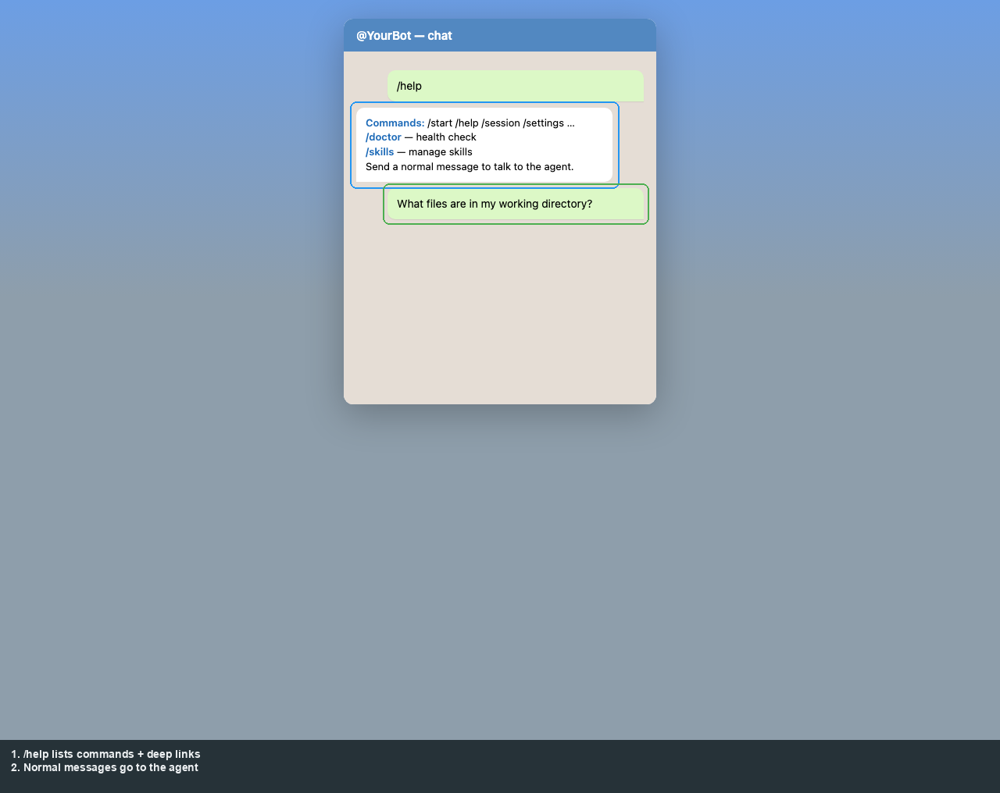

# Product: Telegram

[← Manual home](README.md) · [Prev: Registry UI](03-operator-registry.md) · [Next: Integration →](05-integration-api.md)

Chat handling lives under [`app/channels/telegram/`](../../app/channels/telegram/). **`/help`** and **`/start`** list commands; **plain text** (not starting with `/`) is the main conversation with the agent. **`/settings`** uses inline buttons (`setting_*` callbacks). **`/skills`** lists and activates skills; **`/approval`**, **`/approve`**, **`/reject`**, **`/cancel`** apply when approval gates are on.

The capture below is an **illustrative mock** (not a live Telegram client): **`/help`** output plus a normal user message. Outlines reference the bottom legend strip so bubbles stay readable.

**Callbacks** (inline buttons): `retry_*`, `approval_*`, `delegation_*`, `recovery_*`, `setting_*`, `skill_add_*`, `skill_update_*`, `clear_cred_*`, expand/collapse — indexed in [flows-catalog.md §4](../flows-catalog.md#4-product-telegram-chat-end-user--admin).

**`runtime_mode`** (standalone vs shared) changes which commands are registered directly — see [`bootstrap.py`](../../app/channels/telegram/bootstrap.py).

Practical command subset for end users: root [README.md](../../README.md).
