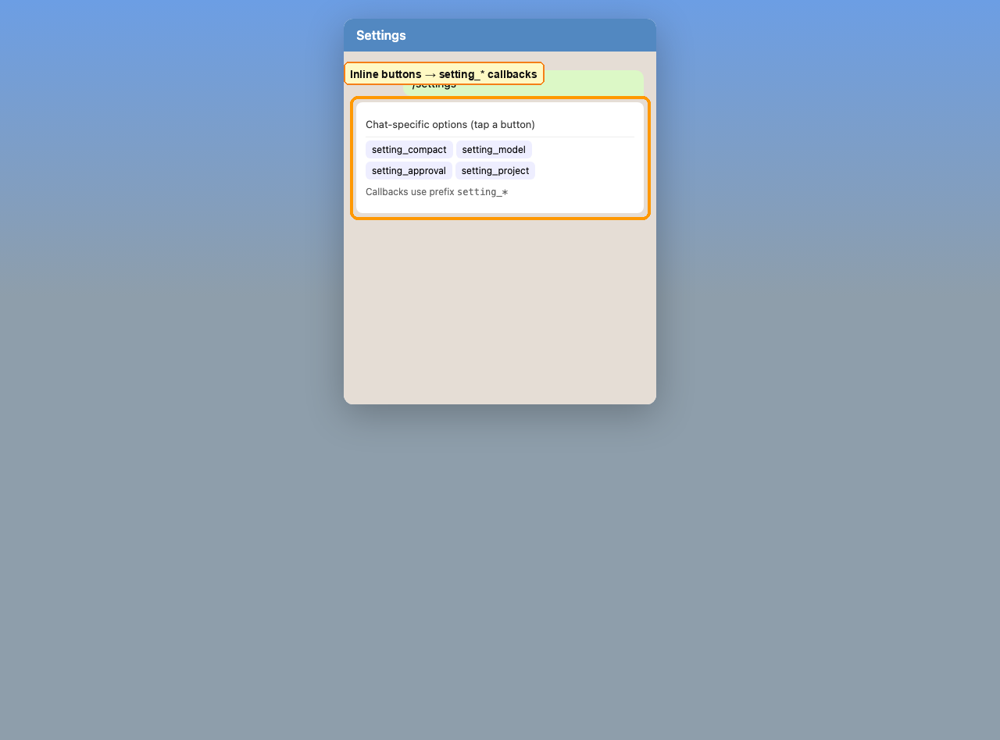
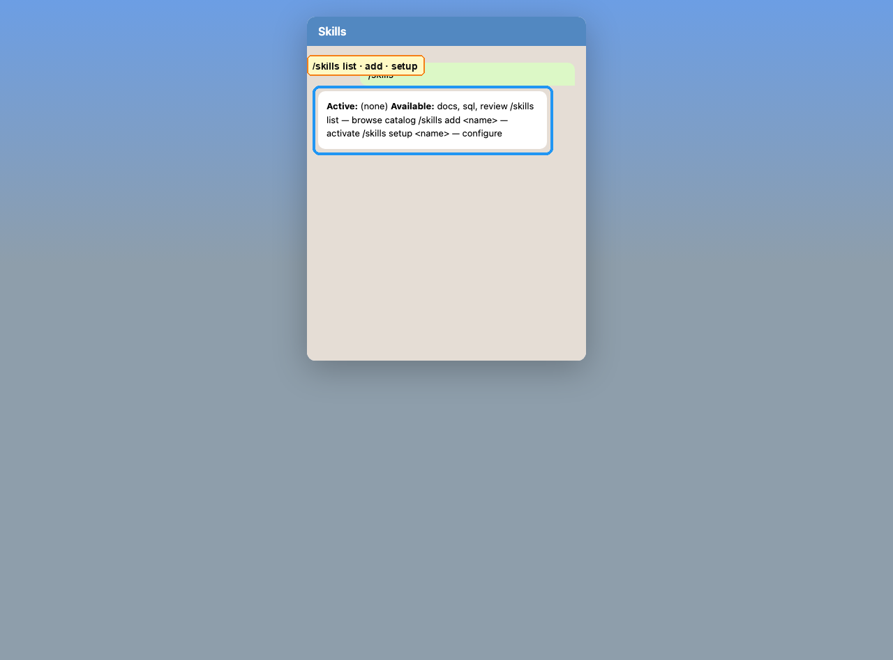
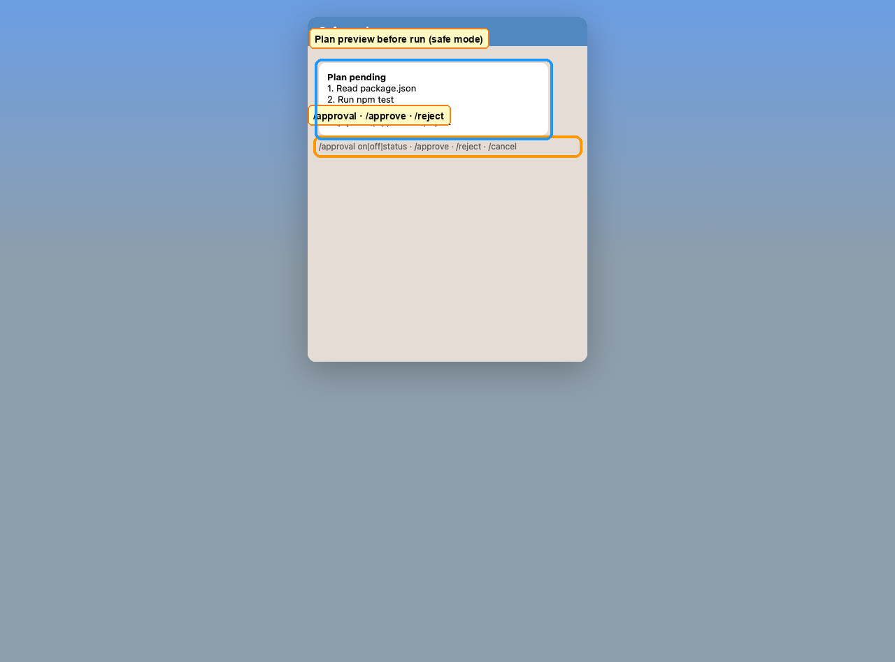
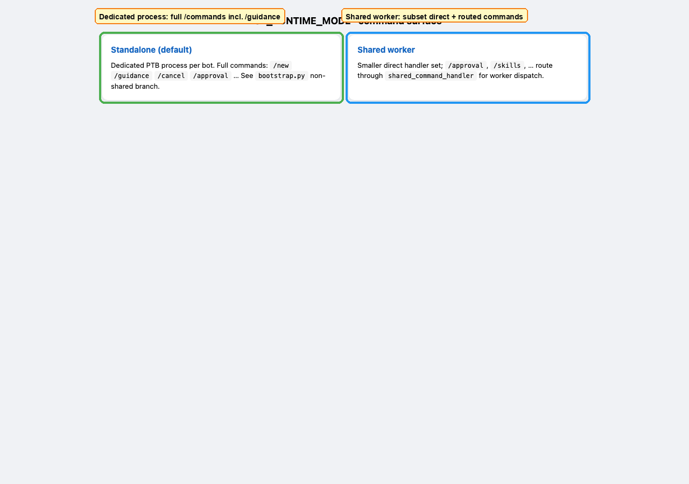

# Product: Telegram

[← Manual home](README.md) · [Prev: Registry UI](03-operator-registry.md) · [Next: Integration →](05-integration-api.md)

Chat UX is implemented in [`app/channels/telegram/`](../../app/channels/telegram/). Screenshots below are **illustrative mocks** (not a live Telegram client) with the same structure as real chats.

## Help and normal messages

`/help` lists commands; **plain text** (not starting with `/`) is sent to the agent as the main conversation.

## Settings

`/settings` shows chat-specific options; inline buttons use callback prefixes like `setting_*`.

## Skills

`/skills` lists active skills and catalog entries; `/skills add`, `/skills setup` configure credentials when prompted.

## Approvals (safe mode)

When approval gates are on, the bot may present a **plan** before executing. Operators use `/approval`, `/approve`, `/reject`, `/cancel` as documented in the in-chat help.

## Runtime modes (standalone vs shared worker)

Command registration differs between **`runtime_mode`** values — some commands are only registered on the **standalone** PTB process; **shared** mode routes several commands through the worker dispatcher.

**Source of truth:** [`bootstrap.py`](../../app/channels/telegram/bootstrap.py).

## Commands (quick reference)

Always refer to `/help` on your deployment. Root [README.md](../../README.md) lists a practical subset for end users.

---

**Callbacks** (inline buttons): `retry_*`, `approval_*`, `delegation_*`, `recovery_*`, `setting_*`, `skill_add_*`, `skill_update_*`, `clear_cred_*`, expand/collapse — see [flows-catalog.md §4](../flows-catalog.md#4-product-telegram-chat-end-user--admin).
