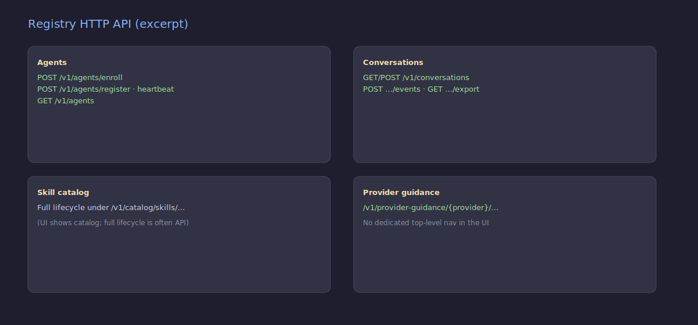

# Integration: Registry HTTP API

[← Manual home](README.md) · [Prev: Telegram](04-product-telegram.md) · [Next: Troubleshooting →](06-troubleshooting.md)

Bots and automation call **`/v1/...`** on the registry with **agent tokens**; operators use **cookie sessions + CSRF** from the browser or tools that mimic them.

## Surface map

## Implementation

- **Routes:** [`app/channels/registry/http.py`](../../app/channels/registry/http.py)
- **UI coverage:** the Registry SPA covers the dashboard summary, agents, paginated conversations/tasks,
  operator **compose / cancel / export** on conversations, capabilities, skills
  catalog, usage ranges, and the **provider guidance** editor. **Not** covered as
  first-class UI flows: full skill **lifecycle** beyond install / uninstall, and
  conversation-bound skill activation.

## Skill catalog lifecycle (API)

Draft → submit → approve → publish → install/update/uninstall — all under `/v1/catalog/skills/...`. See code for exact verbs.

## Provider guidance (API)

`/v1/provider-guidance/{provider}/...` — draft and publish flows for operator-tuned prompts; the Registry UI now exposes this surface at **`/ui/guidance`**.

## CSRF and sessions

State-changing **POST** requests from the browser use `/v1/auth/csrf` (see UI network traffic when toggling capabilities).
