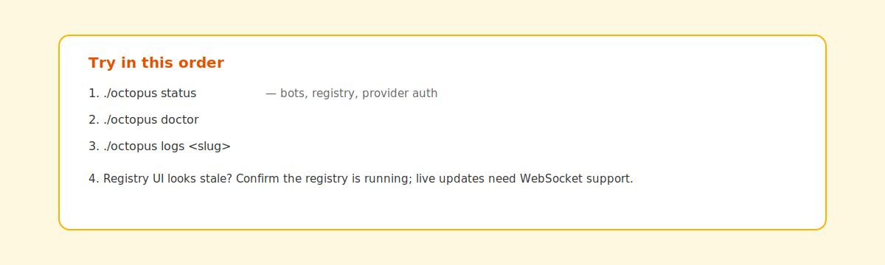

# Troubleshooting

[← Manual home](README.md) · [Prev: Integration](05-integration-api.md)

## Escalation order



1. **`./octopus status`** — bots running? Registry URL? Provider auth?
2. **`./octopus doctor <bot>`** — Telegram token, provider reachability, data dirs.
3. **`./octopus logs <slug>`** — stack traces from the bot container.
4. **Registry UI not live-updating** — WebSocket-capable ASGI (`uvicorn[standard]`); without it, history still loads via REST.

## Symptom → doc

| Symptom | See |
|---------|-----|
| Remote registry config fails | [Octopus CLI](02-operator-octopus.md), [registry-guide](../registry-guide.md) |
| “No agents” in UI | Bot not enrolled / heartbeat — `./octopus doctor <bot>`, reconnect |
| Telegram `/command` unknown | [Product: Telegram](04-product-telegram.md#runtime-modes) |
| Postgres / migration | [ARCHITECTURE.md](../../ARCHITECTURE.md), `python -m app.db.cli` |

## Nuclear reset

**`./octopus clean`** — local dev only; destroys `.deploy/` and volumes. Described in [Octopus CLI](02-operator-octopus.md) (clean flow).

If you need the same clean reset against a persistent live checkout but want to
preserve the configured deploy state, use the ops helpers instead of running
`clean` by hand:

```bash
bash scripts/ops/backup_octopus_deploy.sh \
  --source /Users/tinker/octopus \
  --target /tmp/octopus-backup

bash scripts/ops/refresh_octopus_with_backup.sh /Users/tinker/octopus
```

The refresh helper restores the saved `.deploy`, rebuilds fresh images, and
verifies that the registry plus saved bots come back connected.
