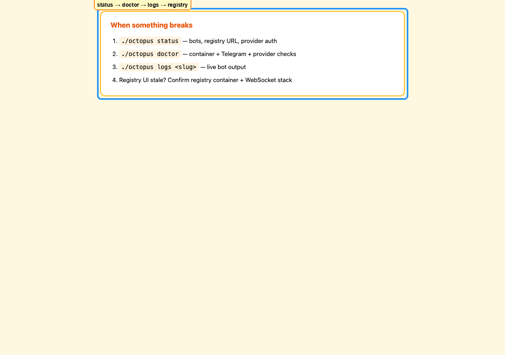

# Troubleshooting

[← Manual home](README.md) · [Prev: Integration](05-integration-api.md)

## Escalation order

1. **`./octopus status`** — bots running? Registry URL? Provider auth?
2. **`./octopus doctor`** — Telegram token, provider reachability, data dirs.
3. **`./octopus logs <slug>`** — stack traces from the bot container.
4. **Registry UI not live-updating** — WebSocket-capable ASGI (`uvicorn[standard]`); without it, history still loads via REST.

## Symptom → doc

| Symptom | See |
|---------|-----|
| Remote registry connect fails | [Octopus § remote](02-operator-octopus.md#remote-registry-https), [registry-guide](../registry-guide.md) |
| “No agents” in UI | Bot not enrolled / heartbeat — `./octopus doctor`, reconnect |
| Telegram /command unknown | [Runtime modes](04-product-telegram.md#runtime-modes-standalone-vs-shared-worker) |
| Postgres / migration | [ARCHITECTURE.md](../../ARCHITECTURE.md), `python -m app.db.cli` |

## Nuclear reset

[`./octopus clean`](02-operator-octopus.md#nuclear-reset-octopus-clean) — local dev only; destroys `.deploy/` and volumes.
