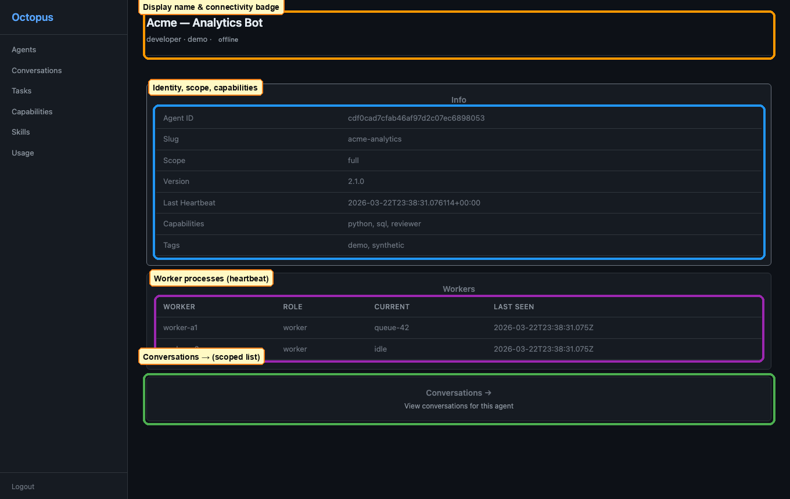

# Registry UI: Agent detail

[← Manual home](../README.md) · [Prev: Agents list](agents-list.md) · [Next: Agent-scoped conversations →](agent-conversations.md)

**Route:** `/ui/agents/{agent_id}` — opened from the list or a **deep link**.

You see **identity** (agent id, slug, registry **scope**, version, last heartbeat), **capabilities** and **tags** as badges, and optionally a **workers** table when the runtime reports worker rows. Below that, an **inline** paginated list of **conversations for this agent** (same data as the dedicated scoped route).

