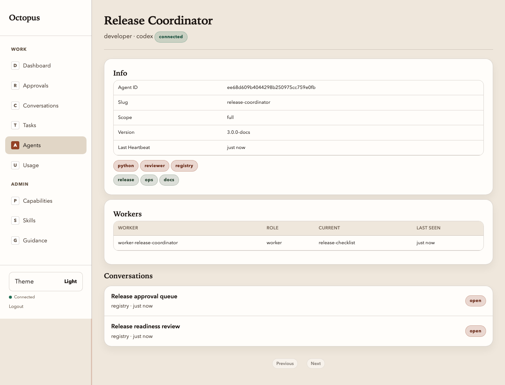

# Registry UI: Agent detail

Manual: [Home](../README.md) · Registry UI: [Overview](../03-operator-registry.md) · Previous: [Agents list](agents-list.md) · Next: [Agent conversation deep link](agent-conversations.md)

**Route:** `/ui/agents/{agent_id}`

Agent detail is a compact workspace for one enrolled agent. It includes:

- a direct **Open conversation** action
- **Overview** facts such as agent id, scope, version, and last heartbeat
- routing-skill chips
- optional **Workers** table when the runtime publishes worker snapshots
- inline **Conversations** for that agent, with the same rows you see elsewhere

This is the best route when you need to answer “is this agent healthy?” and
then jump straight into the right thread.

