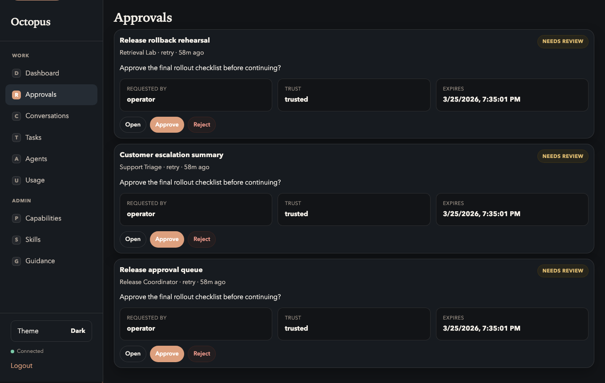

# Registry UI: Approvals

Manual: [Home](../README.md) · Registry UI: [Overview](../03-operator-registry.md) · Previous: [Dashboard](dashboard.md) · Next: [Agents list](agents-list.md)

**Route:** `/ui/approvals` — the operator queue for **pending approval requests**.

Use this screen when work is blocked and you need to make a decision quickly. Each card shows:

- the conversation title
- the target agent and request type
- the request text
- the requester / trust tier / expiry
- direct **Approve**, **Reject**, and **Open conversation** actions

This is the fastest way to clear blocked work without hunting through conversation timelines.

