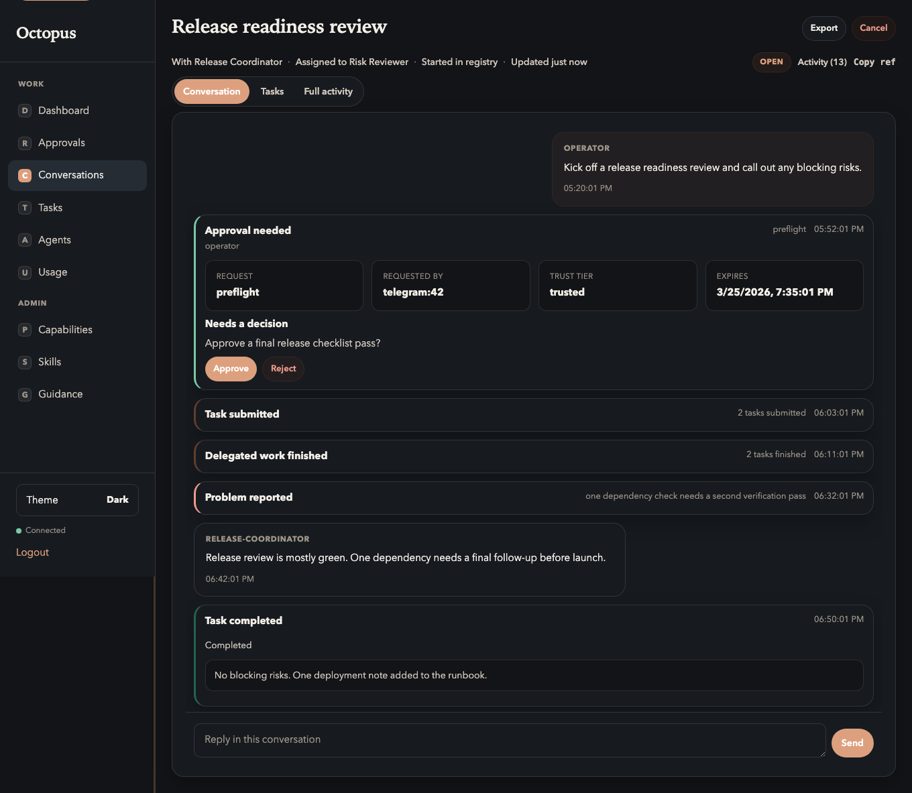

# Registry UI: Conversation detail

Manual: [Home](../README.md) · Registry UI: [Overview](../03-operator-registry.md) · Previous: [Conversation search](conversations-search.md) · Next: [Tasks](tasks.md)

**Route:** `/ui/conversations/{conversation_id}`

Conversation detail is the main operator workspace. The same page handles human
conversation, routed work, and raw event inspection.

## Header

The compact header shows:

- the conversation title
- operator-facing metadata about:
  - who the conversation is with
  - where it started
  - who current routed work is assigned to
- current status
- last update time
- `Activity (n)` and `Copy ref` actions

Current metadata meanings:

| Field | Meaning |
|---|---|
| **With** | the primary conversation target |
| **Assigned to** | the current routed-work target when delegation exists |
| **Started in** | the origin channel, usually `registry` for operator-started threads |
| **Updated** | most recent activity timestamp |
| **Activity (n)** | shortcut into the `Full activity` tab |
| **Copy ref** | copy the external conversation reference / correlation id |

## Tabs

| Tab | Purpose |
|---|---|
| **Conversation** | operator and bot messages, approval requests, delegation milestones, errors, and task status milestones rendered in human-facing language |
| **Tasks** | conversation-scoped routed tasks with retry/cancel actions |
| **Full activity** | the full stored event stream, including provider and tool events |

## Composer

The same composer handles both normal replies and structured routing:

- plain text sends a normal operator message
- a leading selector such as `@m2`, `@cap:review`, or `@role:reviewer`
  submits a structured `direct_assign` action from the same input

Older history loads automatically when you scroll to the top sentinel. With a
working websocket upgrade on `/v1/ws`, new conversation events and task updates
append live.

