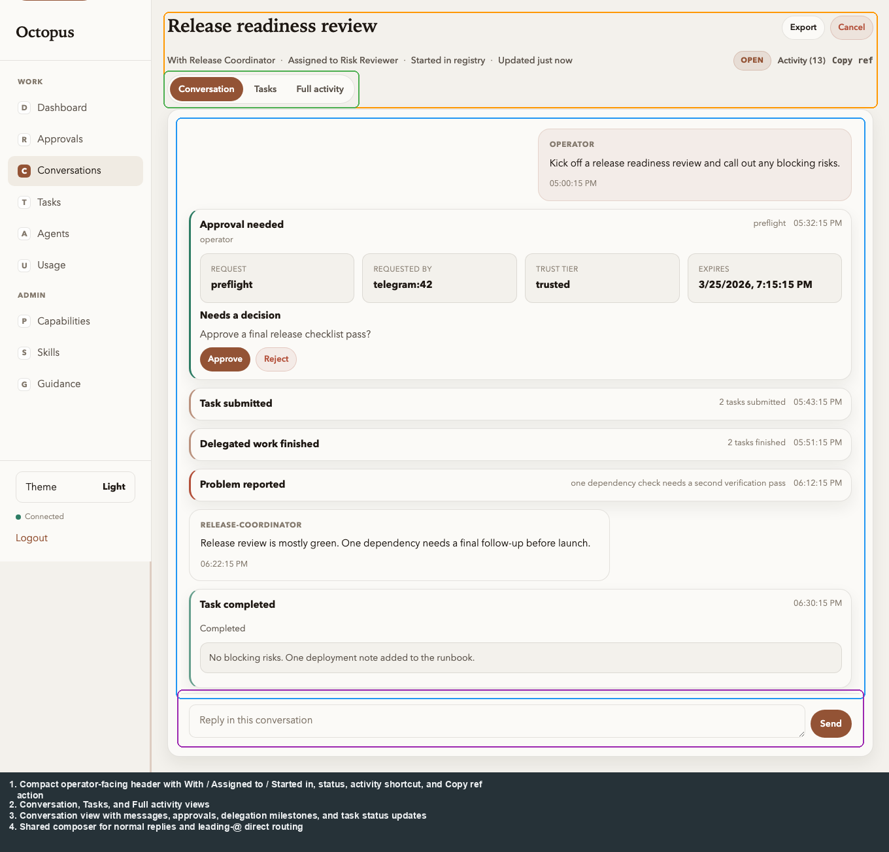

# Registry UI: Conversation detail

[← Manual home](../README.md) · [Prev: Conversation search](conversations-search.md) · [Next: Routed tasks →](tasks.md)

**Route:** `/ui/conversations/{conversation_id}` — also reached from lists or task rows.

**Operator actions**

| Action | Notes |
|--------|--------|
| **Compose** | Operator message or direct assignment from the same composer; start with `@agent`, `@cap:`, or `@role:` to route work directly. |
| **Cancel** | Conversation cancel via actions API. |
| **Export** | Markdown export download. |
| **Conversation** | Default view: replies, approval requests, and problems. |
| **Tasks** | Conversation-scoped routed task board plus task log with retry/cancel actions. |
| **Full activity** | Shows every stored event, including provider and tool activity. |
| **Scroll up for older history** | Older activity loads automatically when the top sentinel enters view. |

**Timeline:** user/bot lines render as **bubbles**. The default view is human-first: replies, approval requests, and problems stay visible, while routed work moves into the dedicated **Tasks** tab and lower-level provider/tool activity moves behind **Full activity**. With **WebSocket** upgrade on `/v1/ws`, new events append live; older history comes from sequence-based `/events` pagination.

