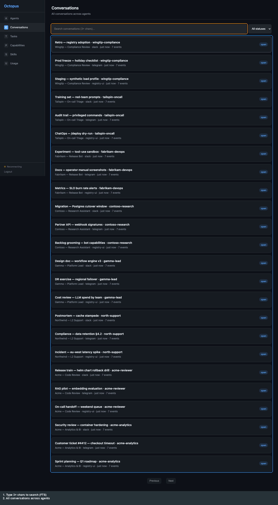

# Registry UI: All conversations (list)

[← Manual home](../README.md) · [Prev: Agent-scoped conversations](agent-conversations.md) · [Next: Conversation search →](conversations-search.md)

**Route:** `/ui/conversations` — every conversation across agents, with **pagination** (**Previous / Next**) and a **status** dropdown. **Click** a row → **conversation detail**.

Search is covered on the [next page](conversations-search.md).

